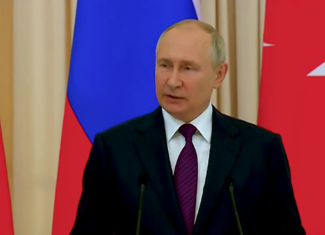
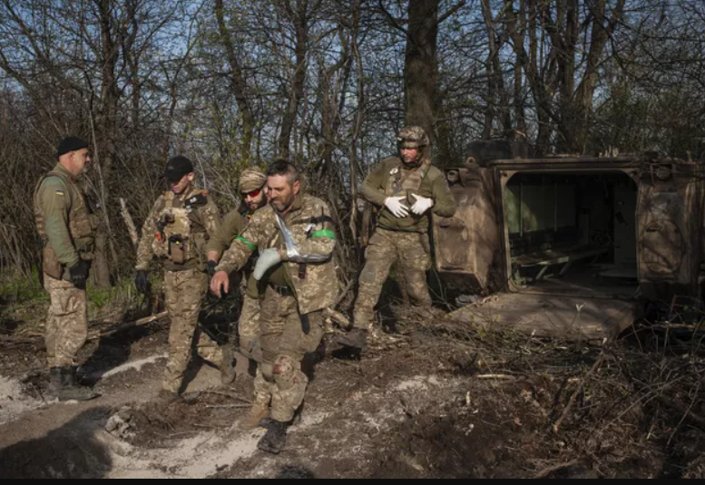
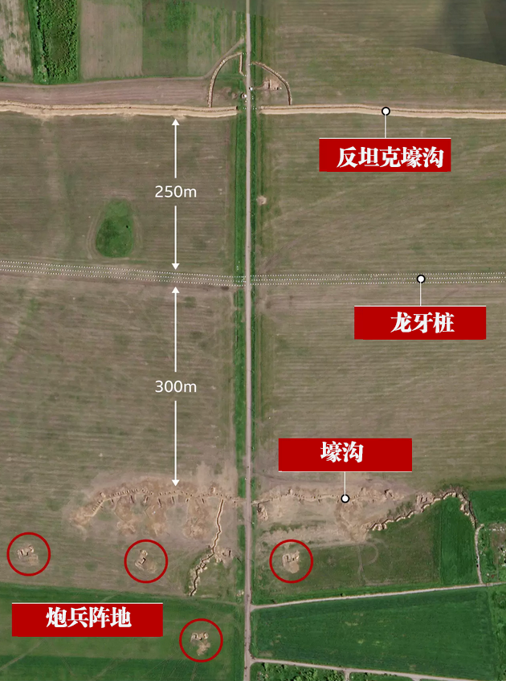

# 普京：乌克兰的反攻“不是停滞，而是已经失败”

【文/观察者网 李泽西】

对于近来受到外界关注的乌克兰反攻一事，俄罗斯总统普京4日表示，“关于乌军反攻陷入停滞，这不是停滞，这是失败”。

据俄新社报道，9月4日，在结束与来访的土耳其总统埃尔多安的会谈后，普京表示：“关于（乌克兰的）反攻陷入停滞，这不是停滞，这是失败。至少在今天看来是这样。让我们看看接下来会怎样，我想，接下里也是失败。”

他同时称，俄罗斯从未拒绝就乌克兰问题进行谈判，现在也不会拒绝，包括外界斡旋。埃尔多安则表示，土耳其愿意充当和谈中间人，“我们像以前一样，准备采取一切必要措施并充当调解人。”

_4日，普京出席记者会（图源：CNN）_

俄罗斯国防部长绍伊古随后表示赞同普京的言论。他表示，在过去十天内，乌军“满怀希望地”发动了多轮猛烈攻势，但均以失败告终。他表示，俄军在罗博季涅村（Robotyne）方向摧毁了6辆乌军坦克，在其他方向又摧毁了6辆装甲车，过去5天内俄军还摧毁了7艘乌克兰无人艇。

乌克兰在扎波罗热、南顿涅茨克和阿尔乔莫夫斯克方向的反攻始于6月4日。基辅在战场上投入了由北约训练并装备有西方装备的旅级单位，包括广为人知的“豹2”坦克等西方先进武器装备投入战场。但反攻进展比乌克兰及其西方盟友所希望的速度要慢，逐渐消磨着美西方集体的耐心。

_受伤的乌克兰士兵 图自俄新社_

乌克兰此前也承认反攻进展缓慢。7月，乌克兰时任国防部长奥列克西·列兹尼科夫（Oleksii
Reznikov）曾称乌克兰反攻比原计划要慢，但是“仍然在按计划进行”。乌总统泽连斯基则在6月底承认，乌军反攻速度“比期望的要慢”。

然而，在9月2日，泽连斯基一改自己此前的说法，称“任凭重重（不利因素），也不管任何人的风凉话，我们正在前进”。

8月31日，乌克兰外交部长库列巴更是称“批评反攻行动节奏缓慢的说法，等于是在对着乌克兰战士的脸吐口水，他们每天牺牲生命、向前推进‘解放’一公里又一公里的乌克兰国土”，“建议所有批评者闭嘴，到乌克兰来，亲自‘解放’哪怕是一平方厘米的土地”。

乌克兰国防部9月1日发推称“看来现在人人都成了战争专家”，但“没有人比乌克兰人更了解如何打这一仗”，“我们需要的是弹药，而不是建议”。

_乌国防部视频截图_

给乌克兰“底气”的，或许是近日在罗博季涅村取得的突破。

乌方官员8月31日称，乌军已突破罗博季涅村方向的俄罗斯第一道防线。白宫国家安全委员会战略沟通协调员约翰·柯比（John
Kirby）称，乌军近日在罗博季涅村周围取得了“显著进展”。

据NBC新闻4日报道，乌克兰国防部长顾问尤里·萨克（Yuriy
Sak）称，据乌克兰所了解的情况，“俄罗斯大部分防御资源都用在第一道防线”，因此认为这是最难突破的防线，希望未来攻势能更顺畅，但是“也不会是小菜一碟”。

不过，《华尔街日报》8月31日报道坦承，要把目前这种渗透转变为全面突破仍面临严峻障碍。乌方军官也承认说，军事推进面临着激烈抵抗，俄军的工事挖得很深。此外，俄军正大量以无人机引导炮兵压制乌军，俄军战线也没出现崩溃迹象，且正派遣包含伞兵等部队增援。

西方高级情报官员称，鉴于乌方近日的进展情况，西方情报部门对于乌克兰能否夺回东南线上的关键小城托克马克持谨慎乐观看法。非西方的军事观察家比对实际地图后则认为，乌军只能算突破俄军的前沿阵地，尚未真正进入由反坦克障碍“龙牙”、地雷阵、战壕与俄军更多炮兵火力所组成的真正防线。

 _Planet Lab卫星图，显示俄罗斯防线阵地（图源：BBC）_

对于缓慢的反攻，泽连斯基曾多次试图“甩锅”西方。他称乌克兰本已准备好在春季就发动反攻，但是由于西方负责的“弹药和装备供应没有到位”以及“部队使用相应武器训练未完成”，因此给俄罗斯留下了更久的布阵时间，增加了反攻难度。

据《华盛顿邮报》9月4日报道，退役美军准将马克·阿诺德（Mark
Arnold）也发表了类似看法，并称如果美国想要战局快速结束，应向乌克兰提供更先进的武器，使乌军装备与美军装备毫无差异。不过，这篇报道中也写道，美国更多的军官实际上认为问题在于乌克兰军队的作战能力和策略，但是他们不敢公开表达这一看法，只能提供匿名评价。

按照计划，乌军反攻的主要目标是抵达东南部关键城市梅利托波尔，切断俄罗斯与克里米亚半岛之间的陆桥，进而破坏俄军在乌南部的补给线。但据美媒纷纷引述美西方官员的话称，乌克兰指挥官并没有重点关注这些，反而在东线巴赫穆特等“错误地点”投入过多资源，甚至将一些最优秀的作战部队部署在那，这也是反攻不顺的一个重要因素。

实际上，在西方军事层面，任何就俄乌冲突提出不一样想法的声音，都可能遭到“群殴”，北约秘书长办公厅主任斯蒂安·延森（Stian
Jenssen）就曾“以身试法”。8月15日，他提议“乌克兰放弃部分领土给俄罗斯，以换取北约成员国的资格”。这一说法立刻被乌克兰批为“荒谬”，北约秘书长斯托尔滕贝格称“只有乌克兰人有权决定何时以及如何谈判”，美国也表示反对。

次日，延森表示自己的表述方式“有问题”，自己本意是想表达“如果我们达到了可以谈判的地步，那么当地的军事局势、领土、谁控制什么，将是绝对的核心，并且必然对可能的结果产生决定性影响”。他还试图顺便向乌克兰“示好”，称虽然有很多人称乌克兰反攻进展缓慢，但是相较冲突爆发初期的“乌克兰几天就陷落”担忧，当前局势已经不错了。

《纽约时报》9月1日报道称，延森的遭遇，表明在西方舆论中，除了“乌克兰的彻底胜利”以外，提出其他任何战争结束的方式都已成为“禁忌话题”。这篇文章同样遭到《纽约时报》读者在评论区内的猛烈抨击。

除了西方，连乌克兰国内也开始出现质疑政府作战的声音了。据《经济学人》8月20日报道，乌克兰公众情绪低落，对泽连斯基的批评愈演愈烈，而且不愿意参与征兵或付出金钱。而由于有战斗欲望的人去年就参军了，现在乌克兰政府只能在不愿意当兵的人中征兵。当下，尽管乌克兰当局决心继续战斗，但一些前线士兵希望停火。

《经济学人》报道指出，在乌克兰没有取得军事突破的情况下，与俄罗斯举行和谈将更没有说服力。

