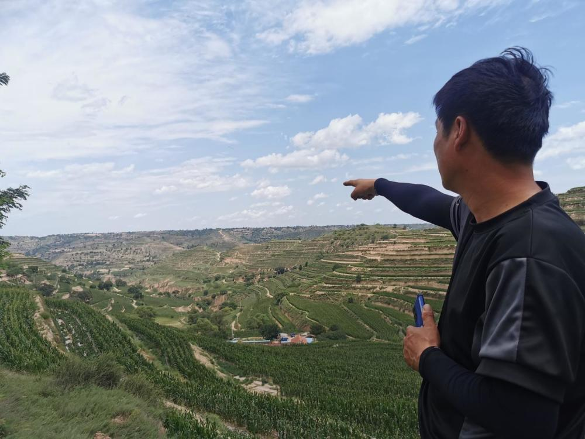
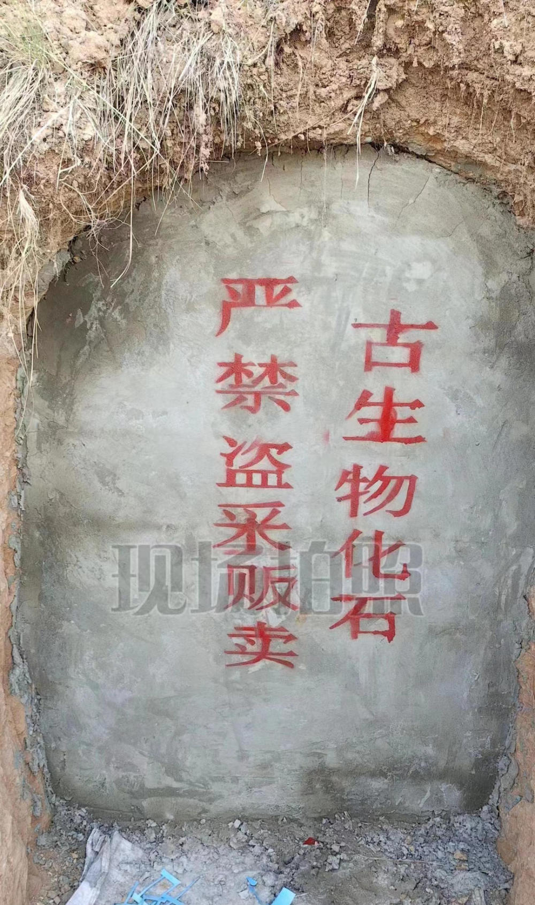
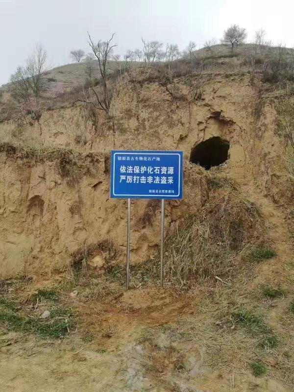

# 甘肃镇原“龙骨”盗采现象调查：多个村庄遭盗采，最深盗洞超500米！多流向药材加工地

“没收非法盗采古生物化石（龙骨）1000余公斤。在盗采毁坏严重区域，劝返非法采挖群众200多人次……”这是镇原县自然资源局今年7月发给镇原县人民法院的一份复函记录的真实信息。

甘肃庆阳市镇原县，厚重的黄土大塬上，沟壑纵横，被称为“龙骨”的古生物化石星罗棋布。自2022年以来，在镇原县新集镇王寨村、开边镇白马寺村、方山乡关山村等多个村庄境内，不同程度存在非法盗掘、出售“龙骨”的现象。今年以来，镇原县人民法院先后判决3起盗掘古脊椎动物化石刑事案件，另有3起案件正在审理中。

镇原“龙骨”盗采现象到底有多猖獗？背后有着怎样的黑色利益链条？当地“龙骨”保护现状如何？今年8月下旬，红星新闻记者深入甘肃镇原县多个乡镇，实地探访“龙骨”被盗采现场，并走访相关部门，发现盗采现场均有多个洞口，最深盗洞超过500米，洞内四通八达。作案者均为外来团伙，遭盗采的“龙骨”被他们按斤售卖，价格从每斤几十元至几百元不等。有嫌疑人交代，祖孙三代都在从事盗采“龙骨”的违法犯罪活动。

甘肃省古生物化石专家委员会一名专家介绍，当地“龙骨”多为早更新纪、新生代时期牛、马等古脊椎哺乳动物化石，不仅是珍贵的自然资源遗产，也是地球演化、地质演化、古生物演化的一个重要载体，具有极高的科研价值，属于国家重点保护古生物化石。因遭非系统发掘，导致珍贵的古生物化石标本被损坏，造成不可逆的损坏和流失。同时，自然生态也遭到严重破坏。专家表示，盗采“龙骨”产业链很深，最终还需公安机关侦查。目前初步认为大部分“龙骨”流入药材加工地，还有少部分被收藏为化石标本。

镇原县相关部门回应红星新闻记者，为保护古生物化石，当地通过封堵盗洞、群策群防等措施加大打击力度，“龙骨”盗采猖獗的现象已得到遏制。

实地探访：

盗采“龙骨”现场需爬行进洞

最深盗洞超500米洞内四通八达

新集镇王寨村，距离镇原县城60余公里。这里是当地古生物化石一个重要分布点，一年前曾发生盗采“龙骨”案件。

8月22日上午，红星新闻记者驱车来到王寨村。村民介绍，盗采“龙骨”的地方名叫梁梁峁山，位于山沟处，前往此处需经过一段河滩。由于连日下雨，河滩已被水淹没无法通行，而通往河滩的道路也泥泞不堪。“只有那一条路过去，现在人员、车辆都无法通行。”王寨村村委会工作人员孙先生说。

8月22日、23日，红星新闻记者前往镇原县方山乡关山村、十八岘村，开边镇白马寺村、新集镇王寨村等多个村庄实地探访发现，当地“龙骨”分布地都位于山沟，车辆无法直接到达。如果没有当地人指引，很难找到具体位置。

8月23日，开边镇白马寺村村民惠先生带着红星新闻记者前往一处盗采“龙骨”地。车辆在村道上行驶两公里后，惠先生示意停车，然后站在路边指着一处山沟说，“就在那下面，车辆进不去。如果步行，单边至少2个小时。”

 _村民称盗洞在远处山包下_

那么，“龙骨”盗采者是如何前往并实施盗采的？

孙先生向红星新闻记者介绍，盗采者携带电锤、铁锹、头灯等工具，进入洞穴进行盗采，“洞穴入口只有1.2米左右，只能爬行进去。洞内也不高，真不知道他们是如何在里面挖掘的。”

“他们（盗采者）一般都开着三轮车，将工具运到距离（盗采地）最近的地方，然后徒步前往，盗采‘龙骨’后又用三轮车拉出来。”惠先生说。

镇原县自然资源局副局长张志宏告诉红星新闻记者，盗采者在洞穴内是跪着或者坐着操作。他们会往不同方向挖土，洞穴内四通八达，最深的洞穴达500米以上。

_盗采人员挖的盗洞_

当地多位村民介绍，“龙骨”被盗的地方几乎都有多个洞口，洞口之间相距不远。目前，这些盗洞已被当地政府采取措施封堵了。

_当地政府将盗洞封堵_

镇原县方山乡关山村、十八岘村，也曾多次遭遇“龙骨”被盗采，堪称“‘龙骨’盗采重灾区”。有团伙一年内在十八岘村多次盗采，获利60余万元。

8月22日下午，红星新闻记者驱车来到关山村，村支书告诉记者，该村“龙骨”盗采案发生在去年。两个盗采团伙内讧，其中一个团伙盗采未果，举报了另一个团伙，警方抓获数名嫌疑人，目前已判刑。

“我不会带你去，万一你是冒充身份来打探消息，然后去盗采‘龙骨’呢？”当红星新闻记者询问盗采地点时，该村支书立即警惕起来，并要求其他村民不准带记者去现场。

随后，红星新闻记者驱车前往10余公里外的十八岘村。在记者表明来意后，该村村支书表示“我刚刚接到其他村干部通知，有人可能冒充身份寻找‘龙骨’化石点”，婉拒带记者走访。

在连日的走访中，红星新闻记者在当地多个村庄都曾遭遇此类情况，不仅村干部严防进村的陌生人，村民们也充满了警惕。

张志宏向红星新闻记者透露，早些年盗采“龙骨”猖獗时，有盗采者租住村民房屋，村民也为其提供相关便利，比如用水、用电等，给村民带来了一定的利益，因此打击难度较大。

红星新闻记者发现，2019年4月镇原县人民政府发布《关于严厉打击非法盗采古生物化石行为的通告》提到：“全县广大群众要积极同违法行为作斗争，严禁向非法盗采的外来人员提供信息、住宿、用电、用水等方便。对明知是非法盗采的外来人员仍向其提供便利者，一律视为参与盗采，依法予以处理。涉及党员干部参与或为非法盗采提供保护的，坚决移交纪委监委依纪依规处理。鼓励广大群众积极举报非法盗采古生物化石的行为。”

盗采频发：

多个村庄发生“龙骨”盗采案

村民曾将9人堵洞内有人祖孙三代盗采

镇原县新集镇王寨村“龙骨”盗采案，发生在2022年8月11日凌晨2时许。

近日，当地一位村民向红星新闻记者回忆，夜深人静时，村里很少有车经过，更不要说有多人深夜进村。案发时，梁梁峁山附近有村民听到狗叫声，然后发现多名陌生人，疑似在盗采“龙骨”，赶紧通知其他村民一起赶到盗采现场，将盗采者堵在了洞里。“洞口很小，我们堵在洞口，他们就爬不出来。后来我们报了警，警方现场抓了9人，还有一名放风的人跑了，后来也被抓了。”该村民说。

镇原县检察院一份起诉书显示，经现场勘查、称量、辨认，被告人赵某甲、张某甲等10人当晚盗挖“龙骨”共计71.8公斤。2022年11月3日，经甘肃省自然资源厅古生物化石专家委员会鉴定，被告人盗掘的涉案古生物化石为新生代古脊椎动物实体化石，属于重点保护古生物化石。

当地另一村庄开边镇白马寺村“龙骨”盗采案，则发生在今年1月初。

据该村一位村民介绍，当晚10点多，群众发现有陌生人进村，于是报警。次日凌晨3时许，3名盗采者盗掘结束准备离开时，被蹲守的派出所民警当场抓获。

警方蹲守抓获“龙骨”盗采者，并非这一例。“我知道有一起盗采‘龙骨’案，据说警察在洞外蹲守了一天，嫌疑人出洞口时被当场抓获。”张志宏告诉红星新闻记者。

据镇原县人民法院的消息，2023年以来，镇原县人民法院先后判决3起盗掘古脊椎动物化石刑事案件，另有3起案件正在审理中。

同时，红星新闻记者梳理发现，从2022年至今，镇原县公安局公布破获多起“龙骨”盗采案：2022年4月26日，镇原县公安局刑侦大队刑侦二中队在宁夏成功抓获犯罪嫌疑人周某林和马某俊，破获盗掘古脊椎动物化石案件1起，追缴“龙骨”112公斤，查扣作案车辆1辆，发电机两台；2023年1月29日晚，常某某等4人利用夜色掩护，潜入镇原县方山乡一沟底山洞进行盗掘“龙骨”犯罪活动时被当场抓获。初审查明，常某某等4人先后盗掘“龙骨”3次，共计盗掘“龙骨”35.5公斤，非法获利2780元；2023年3月21日，镇原县公安局方山派出所侦破一起盗窃古脊椎动物化石案件，抓获嫌疑人10人，缴获古脊椎动物化石20.3公斤。

 _警方抓获嫌疑人并缴获“龙骨”_

张志宏向红星新闻记者介绍，一名被抓获的盗采“龙骨”嫌疑人曾交代，虽然“龙骨”分布点沟壑纵横，但他明确知道哪里有“龙骨”，因为从他爷爷开始，就在多地盗采过“龙骨”，祖孙三代都从事盗采“龙骨”的违法犯罪活动。

今年7月，镇原县自然资源局发给镇原县人民法院的一份复函，对当地“龙骨”盗采情况等予以了说明：“没收非法盗采古生物化石（龙骨）1000余公斤。在盗采毁坏严重区域，劝返非法采挖群众200多人次……”

背后链条：

“龙骨”价格数十元至数百元一斤

大部分流入药材加工地

_警方缴获的“龙骨”_

红星新闻记者获得的多份对镇原县相关部门缴获的古生物化石鉴定结果显示：这批古生物化石为新生代古脊椎动物实体化石，属于重点保护古生物化石。这些化石因不是系统发掘而得，已被严重损毁，无法进行详细鉴定，初步观察有哺乳动物肢骨、牙齿等，应分属多个个体。根据样品中少量牙齿化石确认，该批化石中包含牛、马、羚羊等哺乳动物化石，在动物演化、动物分类、古地理、古环境方面具有重要的科学研究价值。由此判断，该化石点保存的化石数量丰富、完整程度较高，具有极高的保护和科研价值。

刘先生是镇原本地人。在他印象中，小时候家中老人有时会捡回一两块“龙骨”。家人如果不小心受伤流血，老人会将“龙骨”磨成粉末，然后用来止血。

那么，“龙骨”到底有什么功用？被盗采的“龙骨”流向了何处？盗采案频发背后有何非法利益链？

镇原县新集镇人民政府分管自然资源的一名负责人告诉红星新闻记者，据他了解，“龙骨”主要功效是止血，价格有的高达数百元一斤。

张志宏介绍，“龙骨”主要作为药用，价格不等，有的一二十元一斤，有的数百元一斤。至于被盗采的“龙骨”卖到了何处，公安机关在进行侦查。

据镇原县公安局的消息，2023年3月21日，有人在方山乡十八岘村盗掘古生物化石。方山派出所接到群众举报后，在犯罪嫌疑人王某家中缴获古脊椎动物化石20.3公斤。与王某结伙参与盗掘的其余9名犯罪嫌疑人，于次日相继到方山派出所投案自首。

侦查查明，2022年2月至2023年3月，王某等10名犯罪嫌疑人携带电锤、铁锹等作案工具，在镇原县方山乡十八岘村境内，连续多次盗掘古脊椎动物化石，期间非法获利65万余元。后经甘肃省博物馆抽样鉴定，被盗掘的化石均为受国家保护的古脊椎动物化石，对古脊椎动物演化、古地理、古环境等具有较高的科学研究价值。

8月23日，红星新闻记者来到镇原县公安局，希望了解已侦破盗掘古生物化石案件的相关情况。工作人员告知需提前联系，向领导汇报同意后才能接受采访。但截至发稿，记者暂未收到该局的回复

8月30日，甘肃省古生物化石专家委员会一名专家向红星新闻记者表示，“龙骨”的药用价值现在没有完全的定论，只有一个土方说“龙骨”有止血的功效。根据这一功效，他们认为“龙骨”里面有吸水性较强的黏土矿物。“‘龙骨’被盗采后贩卖到什么地方，这是一个新的领域，我们也很关注。这个产业链很深，最终要靠公安机关侦查。目前，我们初步认为‘龙骨’大部分流到了加工药材的地方，还有少部分有人收藏作为化石标本。”

当地回应：

封堵盗洞、群防群治加强打击

盗采猖獗趋势得到遏制

针对当地“龙骨”被频繁盗采的现象，镇原县多个部门表示，当地加大了打击力度，盗采古生物化石现象扩散蔓延的趋势得到有效遏制。已研究出一系列保护方案，力争打断古生物化石盗采贩卖的利益链条。

甘肃省古生物化石专家委员会一位专家向红星新闻记者介绍，当地“龙骨”多为早更新纪、新生代时期牛、马等古脊椎哺乳动物化石，是珍贵的自然资源遗产，是地球演化、地质演化、古生物演化的一个重要载体，具有极高的科研价值，属国家重点保护古生物化石。甘肃的“龙骨”主要分布在临夏河镇地区、平凉、庆阳这3个地方，天水、定西、白银也有少量分布。上世纪60年代就开始有人盗采“龙骨”，从2019年左右开始比较猖獗。政府通过各种保护措施，特别是在偏远地区、交通不便的化石点安装无线太阳能监控，以及群众意识提高，盗采“龙骨”虽还没有完全杜绝，但猖獗的情况已得到遏制。

针对当地“龙骨”被盗采现象，镇原县人民法院向镇原县人民政府提出强化宣传、修复植被、封堵洞穴等一揽子司法建议，并附上了3份盗掘古脊椎动物化石案判决书。

8月24日，镇原县自然资源局向红星新闻记者提供了一份给镇原县人民法院的《关于加强古生物化石监督管理的复函》。函件中介绍了镇原县古生物化石资源的基本情况，通报了打击盗采行为、保护化石资源等工作的开展情况，并就今后古生物化石的保护和监管工作提出了一系列举措。

红星新闻记者看到，函件中提到，上世纪60年代以来，个别群众在经济利益驱动下，勾结外来青壮年（主要是宁夏固原市、吴忠市、同心镇、红寺堡镇的农民）在茹河、蒲河沿岸荒沟内，大肆非法盗采古生物化石（龙骨）资源，将古生物化石作为“龙骨”药材进行采掘出售的现象时有发生，致使珍贵化石标本流失损毁，自然生态遭到严重破坏。

对于具体的“龙骨”保护措施，张志宏向红星新闻记者表示，为了保护古生物化石，当地政府部门加大了宣传力度，在村组内设立了警示牌，用水泥、石砖等封堵盗洞，发布了《关于严厉打击非法盗采古生物化石行为的通告》《关于加强属地管理严厉打击非法采盗古生物化石（龙骨）行为的通知》，落实属地管理责任，强化群策群防，加大了打击力度。

8月22日，镇原县新集镇公共事务服务中心主任兰育森介绍，该镇王寨村发生“龙骨”盗采案后，当地政府部门对盗洞进行了封堵，并种植了树木对植被进行修复。同时，在各村组设置警示牌和警示标语，进行大力宣传，还利用赶集日人口集中的时候，发放宣传资料。今年6月，新集镇召开了非法盗挖古生物化石专项整治工作会议。

_当地政府部门立的警示牌_

同时，红星新闻记者发现，镇原县自然资源局给镇原县人民法院的《关于加强古生物化石监督管理的复函》中还提到，在该县人民法院、检察院、公安局、自然资源局和各乡镇人民政府共同努力下，盗采化石现象扩散蔓延的趋势得到有效遏制。但由于化石点分布广，相对分散、位置偏僻、交通不便，夜间盗采、村民参与等，中长期保护和监管难度大，不过也已研究出一系列保护方案，其中包括与乡镇人民政府、公安、文广旅游、市场监管、生态环境等部门加强合作，进一步建立健全古生物化石保护的执法体系，对（古生物）化石盗采贩卖等违法现象及时发现，依法查处，力争打断化石盗采贩卖的利益链条。

红星新闻记者 汤小均

编辑 彭疆 责编 冯玲玲

