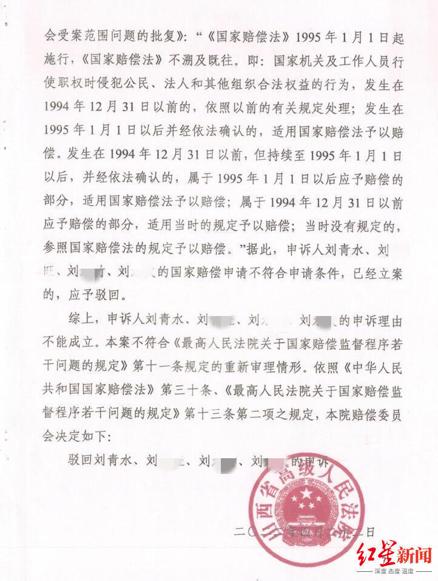

# 男子因投毒罪1960年被执行死刑，27年后宣告无罪，子女申请国家赔偿被驳回

日前，山西省临猗县男子刘青水向红星新闻记者反映，他的父亲刘忠武1960年7月10日因投毒罪被山西省万荣县人民法院判处死刑，同年8月29日执行。之后，其所居住地由万荣县划入临猗县，1981年临猗县人民法院做出对该案的《复查改判报告》，1987年临猗县人民法院做出判决称原判认定的事实不清，证据不力，故判决不当，改判刘忠武无罪。

刘青水认为，法院错误判决其父亲死刑，为其家庭带来了巨大灾难，他的个人命运也因此改变。在此之后，刘青水多次向临猗县人民法院和万荣县人民法院申请赔偿。

2021年，刘青水向万荣县人民法院申请的国家赔偿获得了万荣县人民法院的回应。万荣县人民法院做出《决定书》称，该案侵权行为发生在1994年12月31日以前（《中华人民共和国国家赔偿法》1995年1月1日起施行），《国家赔偿法》不溯及既往，故本案不适用国家赔偿法的规定。驳回了刘青水的申请。随后，运城市中级人民法院、山西省高级人民法院皆因相同的原因驳回了赔偿申请。

刘青水告诉红星新闻记者，目前，他正在继续向山西省高级人民法院和最高人民法院反映相关情况。

《国家赔偿法》施行前错误案件是否该赔偿？北京市京师律师事务所律师曾鸣表示，《国家赔偿法》颁布之前，我国虽然没有专门的国家赔偿法，但一直存在国家赔偿制度。国家赔偿制度与《国家赔偿法》不能直接划等号。国家赔偿这一基本制度无论是1954年宪法还是1982年宪法均有明确的规定。

**男子因投毒被执行死刑**

**27年后复查改判无罪**

刘青水告诉记者，他的父亲刘忠武出生于1929年3月17日，当时他所在的蔡高村属于山西省万荣县。1960年7月10日，31岁的刘忠武被万荣县人民法院以投毒罪判处死刑。1960年8月29日被处决。

一份《万荣县人民法院刑事判决》显示，1960年3月17日晚，刘忠武因不满被撤销公共食堂司务长之职，携带农药赛离散，投入该队食堂水缸，造成5名社员饮水中毒，经急救才脱险。

刘青水说，父亲被判处死刑时自己只有4岁，家里还有1岁多的弟弟、10岁的大姐和7岁的二姐4个孩子。父亲被执行死刑12天后，爷爷悲痛而亡，母亲和奶奶带着4个孩子背井离乡。当时，村里就有人说父亲是被冤枉的，没有人中毒。

因为父亲被判有罪，刘青水虽然成绩优异但不能继续读高中。1972年他所在的蔡高村被划入临猗县。1978年，刘青水的弟弟考中专，也因为父亲受牵连，迟迟不能录取。临猗县教育局工作人员到村里审查相关情况，并派人到万荣县人民法院抄写了一份判决书，他才得知这份判决书所述的内容。

“父亲被判死刑是因为投毒。但经过了解，当时村里没有人中毒。”22岁的刘青水开始向有关部门申诉该案。

1981年临猗县人民法院做出了《复查改判报告》，这份报告从作案动机、毒药来源、食堂投毒等6方面情况进行了复查。结果显示，“这次复查过程中，一些情节虽因时过境迁，失去了重新查证的可能与条件，不能一一核实准确、清楚，但从原卷提供的材料和这次复查了解的情况来看，对原判所谓的‘犯罪事实’的认定是很不得力的，有些甚至根本没有证据”。因此，经该院审判委员会研究，拟撤销原判，对刘忠武宣告无罪。

1987年临猗县人民法院作出《刑事判决书》称，经复查认为，原判认定的犯罪事实不清，证据不力，故判处不当。特依法改判，撤销万荣县人民法院原审判决，宣告原审被告人刘忠武无罪。

_▲运城市中级人民法院决定书_

**子女申请国家赔偿**

**法院：《国家赔偿法》不溯及既往**

刘青水说，父亲被宣告无罪以后，他与母亲以及姐弟4人就开始申请相关赔偿。但法院没有找到相关案件材料。在当年复查该案的法官帮助下，2021年，案件的相关卷宗在临猗县人民法院档案室找到。随后，刘青水向万荣县人民法院申请国家赔偿。

一份落款为2021年10月15日的《山西省万荣县人民法院决定书》显示，经审查，本院认为，《中华人民共和国赔偿法》于1995年1月1日起施行，《最高人民法院关于

随后，刘青水姐弟4人又向运城市中级人民法院提出申请。运城市中级人民法院以同样的理由予以驳回。

接着，刘青水姐弟4人又向山西省高级人民法院提出申诉。山西省高级人民2022年4月22日作出《山西省高级人民法院赔偿委员会决定书》以同样理由驳回了申诉。

刘青水告诉红星新闻记者，目前，他正在继续向山西省高级人民法院和最高人民法院反映相关情况。

**法院驳回均因溯及力问题**

**曾有案件发生在《国家赔偿法》施行前获赔**

上述三级法院驳回刘青水国家赔偿申请和申诉均是因为《国家赔偿法》溯及力问题。

2016年1月7日，最高人民法院网发布的《人民法院人民检察院刑事赔偿典型案例》（以下简称《典型案例》）中曾出现了案件发生在《国家赔偿法》施行前获得赔偿的案例。

该《典型案例》中提到，1992年7、8月间，王某成（已故，系共同赔偿请求人杨某琴的丈夫、王某申的父亲）与辽中县肖寨门供销社口头达成承包经营该社废旧物收购站的协议，双方约定了经营范围、方式、纳税及利润分配等问题，明确由辽宁省辽中县肖寨门供销社提供经营执照及银行账户，其后王某成按约定交纳了销售额的3%。1993年4月3日，辽宁省辽中县人民检察院（以下简称辽中县检察院）以王某成涉嫌偷税为由对其刑事拘留，同月17日决定对其取保候审并予以释放。王某成被限制人身自由15天。经辽中县检察院委托沈阳市税务咨询事务所鉴定，认定王某成属无证经营，其行为构成偷税。

1994年3月3日，辽中县人民检察院向辽中县人民法院提起公诉。同年6月6日，辽中县人民法院以事实不清、证据不足为由，退回辽中县人民检察院补充侦查。1998年10月7日，辽中县检察院认为王某成不构成偷税犯罪，决定撤销此案。王守成于2007年7月13日病故。

2012年，杨素琴提出国家赔偿申请，并最终于两年后获得人身自由赔偿金2439.75元，精神损害抚慰金1000元。

根据判决书显示，最高人民法院赔偿委员会认为，杨素琴申请国家赔偿是2012年，应当适用2010年修正的国家赔偿法。

_▲山西省高级人民法院赔偿委员会决定书_

**施行前案件纠错是否该赔偿？**

**律师：多部法律法规也明确了国家赔偿责任**

对于此案申请国家赔偿的溯及力问题，北京市京师律师事务所律师曾鸣表示，《国家赔偿法》颁布之前，我国虽然没有专门的国家赔偿法，但一直存在国家赔偿制度。国家赔偿制度与《国家赔偿法》不能直接划等号。国家赔偿这一基本制度无论是1954年宪法还是1982年宪法均有明确的规定。

北京市京师律师事务所律师范辰则介绍，1954年《宪法》第97条以及1982年《宪法》第41条均明确规定：“由于国家机关和国家工作人员侵犯公民权利而受到损失的人，有依照法律规定取得赔偿的权利”。同时，司法部1956年8月4日颁布《关于冤狱补助费开支问题的答复》：“各级人民法院因错判致使当事人家属生活困难时，可由民政部门予以救济；如果因错判致使当事人遭受大的损失的，根据宪法第97条规定的精神，需要赔偿损失时仍应由司法业务费开支。”除了宪法的原则性规定，民法通则及司法解释也明确了国家赔偿责任。1987年1月1日起施行的
《民法通则》第121条：国家机关或者国家机关工作人员在执行职务中，侵犯公民、法人的合法权益造成损害的，应当承担民事责任。

范辰还提到，1988年1月26日最高人民法院在《关于贯彻执行（中华人民共和国民法通则）若干问题的意见》第152条明确规定：“国家机关工作人员在执行职务中，给公民、法人的合法权益造成损害的，国家机关应当承担民事责任。”另外，原劳动部1963年颁布的《劳动部关于被甄别平反人员的补发工资问题》等均带有国家赔偿责任的性质。

对于刘青水申请国家赔偿被驳回，曾鸣表示，法院不能简单以1995年之前没有施行《国家赔偿法》的理由驳回他的赔偿请求，因为他的主要诉求是要求国家赔偿，只是建议法院参照《国家赔偿法》进行赔偿，并不是直接适用。法院不能混淆国家赔偿和《国家赔偿法》的关系。1995年以前，虽然没有《国家赔偿法》，但不能免除赔偿义务。法院如果认为《国家赔偿法》没有明确的规定，也应当按照《国家赔偿法》溯及力的解释，依照当时的有关规定来处理。当时的规定就是宪法和《民法通则》的有关规定。

曾鸣还表示，本着保护人权，维护被错判的冤案当事人合法权益的角度，也可以参照个人身损害的司法解释。以及之后颁布《国家赔偿法》规定，对刘忠武的死亡赔偿金、丧葬费以及家属的精神损害进行赔偿。

红星新闻首席记者 吴阳 北京报道

编辑 潘莉 责任编辑 魏孔明

