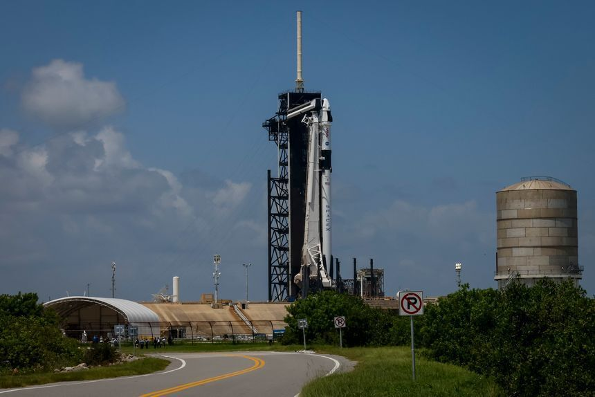
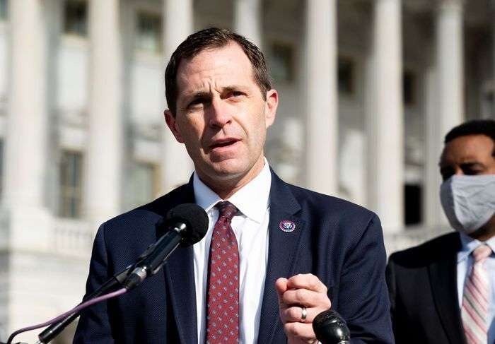
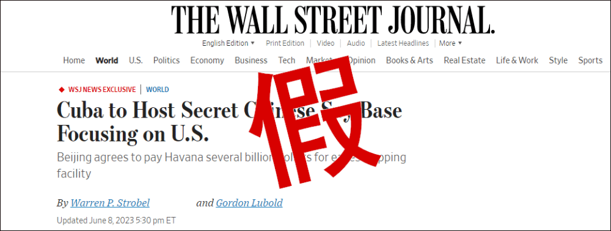

# 美媒炒作“中国公民擅闯美军基地”，我驻美使馆驳斥

（观察者网讯）今年以来，美国《华尔街日报》在炮制所谓“中国间谍事件”中跳得很高，不仅频繁炒作“气球闹剧”，还率先挑起“中国在古巴建间谍设施”的莫须有话题。

当地时间9月4日，《华尔街日报》再次发布所谓独家报道，援引不具名美国官员的消息声称，近年来，中国公民“有时冒充游客擅闯”美国军事基地和其它敏感地点多达100次。尽管在美国每天“擅闯”军事基地的不下万人，但这些美国官员在没有任何证据的情况下，仍将此类事件夸张为“潜在的间谍威胁”。

 _位于佛罗里达州的美军火箭发射场，图自美媒_

报道称，去年，美国国防部、美国联邦调查局（FBI）和其它一些机构进行了一次评估，试图限制一系列涉及“擅闯者”的事件。他们声称，这些“擅闯者”“有意或无意地”试图在没有获得适当授权的情况下进入美国军事基地和其它设施。

随后，《华尔街日报》举例说，此前，有中国公民被发现进入位于新墨西哥州的一个美国导弹发射场，还有人在位于佛罗里达州一个美国政府火箭发射场附近的水域游泳。

美国官员以发生地点远离商业机场为由，将这些事件描述为一种“间谍活动”，并认为这似乎旨在测试美国军事设施和其他联邦场所的安全实践。但他们没有提供任何证据和法律依据。

《华尔街日报》报道后，这一消息也得到路透社、福克斯新闻等多家外媒的跟风转引。同时，美国政客和议员也趁机渲染“中国威胁”。其中，美国民主党籍国会众议员克劳（Jason
Crow）称相关事件令人担忧，国会可能会考虑就此问题立法。

美国智库战略与国际问题研究中心高级研究员、美国参议院情报特别委员会前副参谋长哈丁（Emily
Harding）则揣测称，中国公民“擅闯”美军基地，或许是采取“靠人多收集情报”的手段。但她也承认，按照美国法律，此类事件只能以擅自闯入追究。

_美国民主党籍国会众议员克劳，图自美媒_

值得一提的是，在炒作中国公民“擅闯”之余，《华尔街日报》提到了一个基本事实：
**在美国，每天来到军事基地大门前并遭“强制折返”的不下万人。五角大楼发言人表示：“这些一般都是低级别事件，到目前为止尚无一起表明是间谍活动。”**

中国驻美使馆发言人刘鹏宇驳斥有关说法纯属恶意编造。他回应称，中方敦促美国有关官员放弃冷战思维，停止毫无根据的指控，多做有利于增强美中互信和两国人民友谊的事。

今年以来，美国政客和媒体不断炮制所谓“中国间谍事件”。《华尔街日报》在今年2月的所谓“中国间谍气球”发生后，不断疯狂炒作，并在6月份率先挑起“中国在古巴建间谍设施”的话题，面对澄清驳斥，也只是不断改变说辞继续渲染。

_《华尔街日报》6月率先挑起所谓“中国在古巴建间谍设施”话题_

就在美国不断“泼脏水”的同时，中方接连曝光美中情局（CIA）间谍案。

8月11日，中国国家安全部发布的一则通报引发高度关注，媒体纷纷详细转引这一有关我某军工集团工作人员曾某某向中情局人员提供大量核心情报的案件情况。8月21日，我国家安全部发布消息称，中方正在调查39岁的某国家部委干部郝某，此人在日本留学期间被CIA招募。

至于美方近来频繁炒作的“中国间谍威胁”，中方已多次驳斥。我外交部发言人毛宁7月在回应相关话题时指出，美方一边反复散布所谓中国间谍、网络攻击的虚假信息，一边毫不掩饰地宣称要针对中国开展大规模情报活动。这本身就很说明问题。中方将采取一切必要措施，坚决维护国家安全。

**本文系观察者网独家稿件，未经授权，不得转载。**

