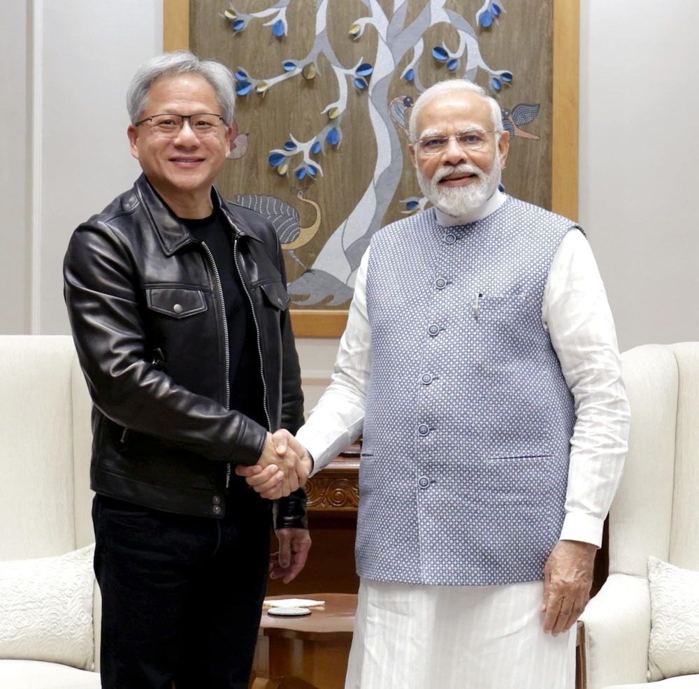
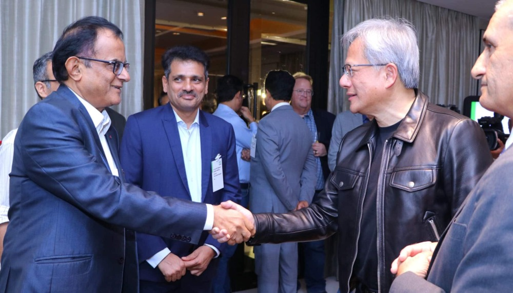

# 英伟达CEO黄仁勋访问印度：面见莫迪与科研人员，讨论AI和天体物理

_当地时间9月4日，印度总理莫迪在总理官邸会见了英伟达创始人兼首席执行官黄仁勋。_

当地时间9月4日，印度总理纳伦德拉·莫迪在印度首都新德里会见了英伟达创始人兼首席执行官黄仁勋。

这次会议在新德里总理官邸举行，正值印度准备于本周晚些时候主办G20领导人峰会。莫迪在社交媒体帖子中表示：“与英伟达首席执行官黄仁勋先生进行了一次非常愉快的会面。”“我们详细讨论了印度在人工智能领域提供的丰富潜力。”

英伟达在一篇新闻稿中表示：“这次活动标志着莫迪和黄的第二次会面，凸显了英伟达在印度快速发展的科技产业中的作用。”

黄仁勋还会见了来自印度科学院、印度理工学院等的数十名研究人员，并共进非正式晚宴。与会者包括大型语言模型、天体物理学、医学、量子计算和自然语言处理等领域的一些顶尖人才。当晚的讨论涉及多个主题，包括利用技术解决语言障碍、提高农业产量、缩小医疗保健服务差距和转变数字经济，以及解决当下的一些重大科学挑战。

印度近期在太空探索领域取得进展。8月23日，印度第三次探月任务“月船3号”成功着陆月球南极，使印度成为继美国、苏联和中国之后第四个在月球表面软着陆的国家，“月船3号”也是全球第一个登陆月球南极的探测器。9月2日，印度首个太阳探测器“太阳神-L1号”发射升空，这是印度首次涉足这一领域。

_在与莫迪会面后的招待会上，印度政府首席科学顾问Ajay Kumar Sood（左一）、印度理工学院班加罗尔校区计算与数据科学系主任Sashikumaar
Ganesan（左二）和黄仁勋会面。_

英伟达称，该公司于2004年在印度开始开展业务，目前在印度拥有4个工程开发中心，分别位于古尔冈、海得拉巴、浦那和班加罗尔，超过3800名员工。此外，英伟达的开发者计划中有超过32万名印度开发者，包括6万名经验丰富的CUDA（英伟达推出的通用并行计算架构）开发人员。

