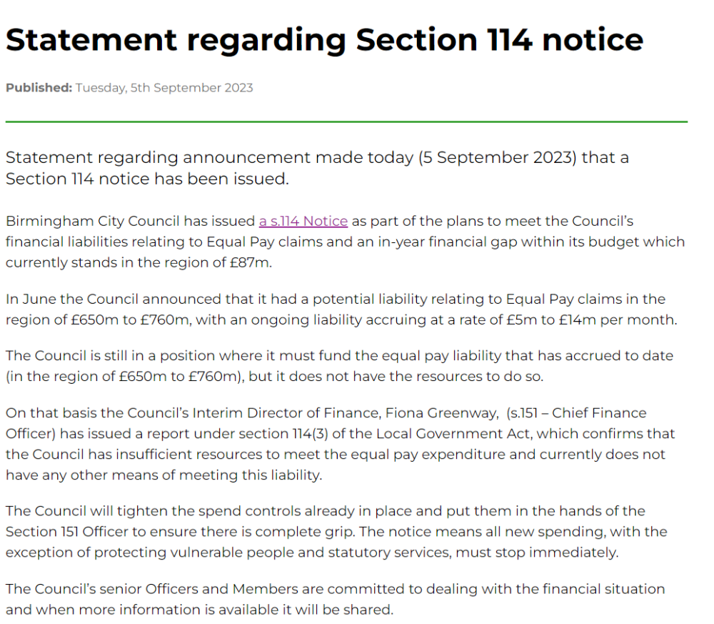

# 英国第二大城市伯明翰宣布破产

**财联社9月5日讯（编辑 史正丞）** 当地时间周二，英国第二大城市、同样也是欧洲最大地方政府的伯明翰市政委员会/市议会在官网发出“114条款通知”，
**这种情况通常会被描述为地方政府实质性宣布破产** 。

_（来源：伯明翰市政委员会）_

根据英国的《地方政府法案》，当英格兰和威尔士的地方政府财务主管预见到政府可能无法维持预算平衡时，有责任发出这样的通知。虽然英国的地方政府无法像美国那样，通过法律程序宣布破产并重组债务，但
**发出“114条款通知”标志着地方当局判断自己陷入财务困境，无法再平衡预算，将触发一系列紧急财务措施。**

**缘何宣布破产？**

在伯明翰市政委员会的官网声明中，明确点出 **这件事情与当地的“平等薪酬索赔”有关** 。今年6月，当地政府曾表示潜在的索赔责任约为
**6.5亿至7.6亿英镑** ，而且这部分赔偿责任正在以 **每月500万至1400万英镑的速度累积** 。

这件事情最早要追溯到2012年， **英国高院裁定支持伯明翰市政委员会雇员（主要是女性）的平等薪酬索赔诉讼** 。自高院裁定后，
**伯明翰市政委员会至今已经支付了11亿英镑的赔偿金** ，但正如前文所述，潜在的账单金额仍在以每月千万英镑的级别增长。

今年7月， **伯明翰市政委员会曾宣布暂停所有的非必要支出** ，来应对平等薪酬索赔，但最终还是发出了“114条款通知”。

除了索赔的压力外，伯明翰市政委员会的一、二把手John Cotton和Sharon Thompson也在声明中表示，
**当地采购甲骨文的IT系统也给财政造成了严重的影响** 。这个系统原本旨在简化付款和人力资源系统，预计成本为 **1900万英镑**
，但经过三年的延误，今年5月披露的数据显示，其成本可能高达 **1亿英镑** 。

**后续会有哪些影响？**

在7月伯明翰市政委员会宣布暂停非必要支出后，英国首相里希·苏纳克曾表示：“ **（中央）政府的职责不是救助财务管理不善的地方市政委员会** 。”

根据英国的《地方政府财务法案》，发出“114条款通知”后，意味着地方政府不能做出新的支出承诺，并且必须在21天内开会讨论下一步行动。不过在这种情况下，现有的承诺和合同将继续得到兑现，资助包括保护弱势群体在内的法定服务也将继续。

通常而言，处于这种状况的大多数地方政府最终会通过一个修订后的预算，减少对公共服务的支出。

对于这一事件，伦敦政治经济学院的地方政府专家Tony Travers教授解读称，由于平等薪酬等一系列挑战，伯明翰已经“断断续续”面临财务困难超过十年。
**这件事情的风险在于，市政服务将会被进一步削减，这不仅会影响城市的外观和居住感受，还会对城市的声誉造成打击。**

Travers教授进一步表示，城市周围的人们 **不需要担心他们的垃圾桶不会被清空，或者社会福利能不能继续**
。但这也意味着不能承诺任何新的支出，所以从现在开始不会有任何额外的东西。同时明年的财政预算将会非常困难，这个问题并不会消失。

（财联社 史正丞 ）

