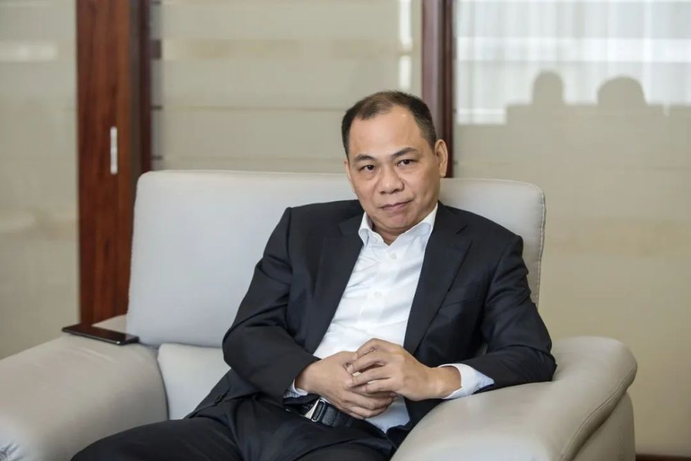
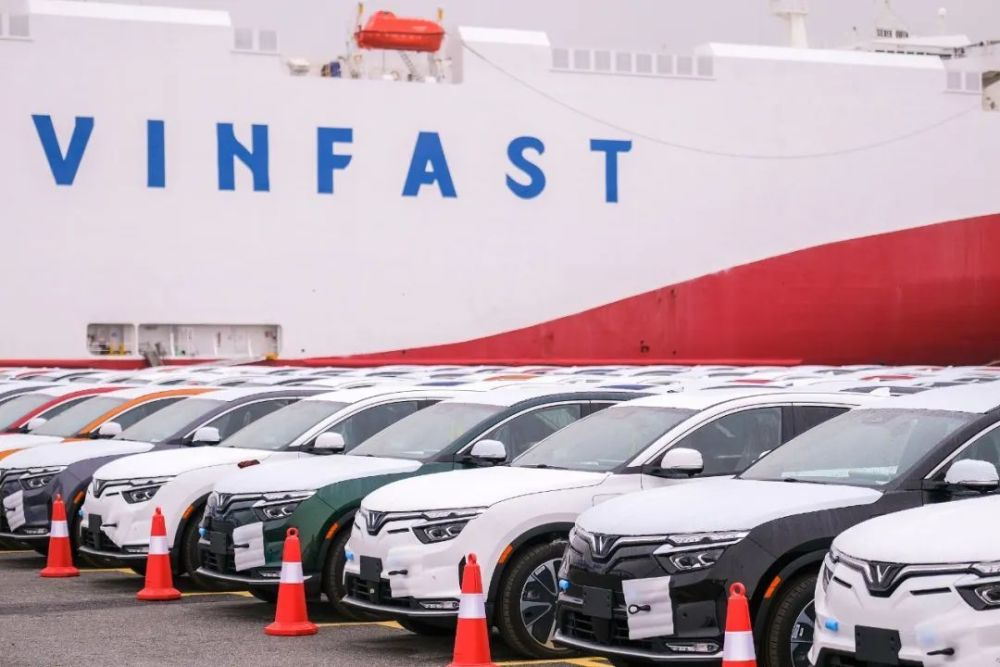
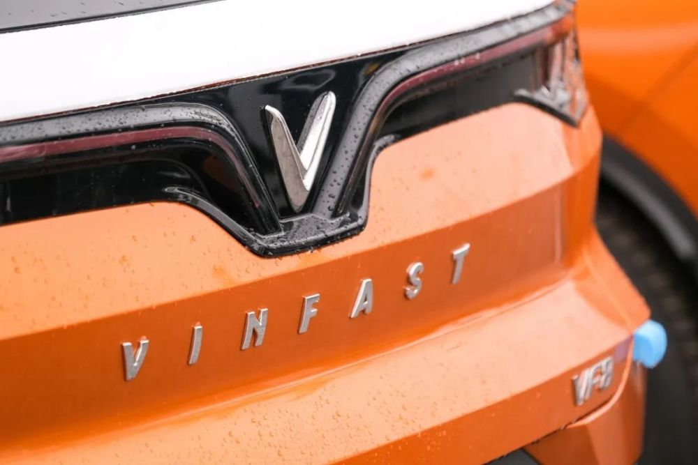

# 越南首富造车 走上许家印的老路

新造车你争我抢的战场，早已成为枯骨成堆的坟场。

**文｜《中国企业家》记者 梁宵**

**编辑｜米娜**

**头图来源** ｜ **视觉中国**

上市仅一周，越南汽车制造商VinFast的市值就超过了比亚迪，跳到同行业第三的位置，再一周后市值蹿升到后者的两倍；如今（9月1日美股盘后）又掉落到了比亚迪市值的一半，但依然远高于中国造车新势力“三强”。

即便对于见惯了大风大浪的华尔街来说，这家名不见经传的越南车企在资本市场闹出来的动静也足以令人瞠目——现有的技术能力和现实的市场交付都不足以解释这一切，助推其股价一路狂飙的：
**一方面透支于对越南这一后发汽车市场的未来想象；另一方面则源于它的“豪门”背景**
——尽管成立只有6年，但它背后是越南第一大私人企业Vingroup（温纳集团），创始人是越南首富潘日旺（Pham Nhat Vuong，又译范日旺）。

_来源：视觉中国_

潘日旺素来低调，尤其是在越南之外，他声名不显。对于一个外国人来说，
**潘日旺在越南商业世界的影响力藏在那些“别称”里：越南王健林、越南唐纳德·特朗普或者越南李嘉诚**
——视乎到底以哪个市场为参照；而自从他在2017年开始造车，外界又给了一个新的对标者：越南的许家印。如果问潘日旺自己，他最想拥有的名号，或许是越南的马斯克。

但目前来看，他更像前者：同样从地产跨界造车，同样奉行买买买、快快快的造车策略，同样大手笔输血，甚至现在也同样走到了变卖资产的一步——这并不是一个好迹象。

恒大已是前车之鉴：公司巨债缠身，昔日首富风光不再。而这也不过是造车战场残酷厮杀的冰山一角。有数据显示，中国电动车制造商已从2018年的近500家到了现在的40多家——真正的是九十九死一生；美国市场也是同样，破产的新能源车企一个接着一个。新造车这个你争我抢的战场，早已成为枯骨成堆的坟场。

VinFast股价的骤升骤落正是这一残酷现实的又一写照，而被称为越南许家印的潘日旺，能否摆脱与前者同样的命运，最终带着VinFast穿越死亡幽谷？

低调首富

两人之间，隔了一个十年。

**尽管小许家印十岁，但潘日旺“下海”创业更早，首富的养成之路也走得更快。**
2013年，他以15亿美元的身家挤到福布斯全球亿万富豪榜的974名，成为首位上榜的越南人——比许家印登顶中国首富早了4年；到了2022年，潘继续以62亿美元的身家霸榜，在越南首富这个位置蝉联了9年。

不过相比于显赫的财富，他的公开消息并不多。他很少接受媒体采访，也很节俭。传闻说，他有一条皮带用了29年，不过后来他在一次采访中纠正说，“不可能那么长时间，也就10年左右。”

一般情况下，他很少理会外界传闻——那也是一位名人保持低调神秘不可避免的伴生物。一些传闻随着时间淡去了，比如他刚回越南的时候，带着“来历不明”的财富，有人猜他是国外的黑手党，或者是个大毒枭；另一些传闻则周期性反复，“每年都会有几次传出我的死讯，”他说。但他并不在乎，“俗话说，‘群狗乱吠，车马照行’，我只需要关注自己做的事情就行了。”

在一个多少经过他证实的故事版本里，年纪轻轻的他早就是一名连续创业者。他早年离家求学，在莫斯科地质勘探学院读书，大学三年级时开始做生意，先是租了个房子卖货，然后开了餐馆，之后又开始从越南进口夹克衫，这些生意有赚有赔，算是小打小闹。

真正意义上的第一桶金要追溯到1993年，潘日旺落脚在乌克兰的港口城市哈尔科夫（Kharkov），
创立了方便面品牌Mivina（米维娜）——这个业务后来以超过1亿美元的价格被雀巢收购。

**不断流转的商业战场和商业实操，让潘日旺对机会有了更为敏锐的触觉以及更为广泛的涉猎——与他的阅读习惯异曲同工。**
他曾透露，他会读很多书，但通常情况下，他一般都会先翻目录，找到有意思的章节，只读相关内容；但有些内容他会一读再读，直到自己读懂为止；这套方法论套用到他的商业逻辑上，就变成了
**“四处出击，一击即中，对于难啃的骨头，也不会轻言放弃”** 。

借此，温纳集团不断膨胀。最初的起点，是被称为“越南迪士尼”的芽庄Vinpearl度假村——这是潘日旺2001年回国拿下的首个大项目；此后，温纳集团就像不断伸展的藤蔓一样，将商业的触角渗透到地产、工业、农业、零售、医疗、教育、手机、汽车……最终就像他们的一位高管描述的，实现了“从摇篮到坟墓的全商业图景”。2022年，温纳集团的营收占到越南全国GDP的2.2%——距离潘日旺在越南的起家，仅仅过去22年的时间。

实际上， **除了独特的商业嗅觉和商业判断，潘日旺在商业上的左突右进还需要更多样化的“智慧”**
，尤其是在越南的政治和商业生态下。一位与越南市场有生意往来的人士就对《中国企业家》表示，越南很讲“规则”，一定要了解当地的规则，善用规则，才能打通关节，把生意做起来。

显然，潘日旺对规则了如指掌。“Vingroup自成一派。”一位跨国商业房地产服务公司的越南分公司负责人对此颇有感触，“大多数人会在这个市场上裹足不前，但Vingroup不会。他们打造该国最大的房地产项目，在非常困难的局面下始终追求创意和人才。”

比如，越南第一高楼“地标塔81”就是出自温纳集团之手。但尽管创造了如此备受瞩目的商业项目，
**潘日旺却无意成为一个商业明星，或许成功的秘笈无法对外人道，又或许“低调做人，高调做事”本就是他成功的秘诀之一。**

曾有一次，一家当地媒体问潘日旺，“马云在越南的演讲受到很多年轻人追捧，他们都很崇拜他，但为什么他们对你没有这样的崇拜？”潘日旺的回答是，“我只是一个普通人……我也不是一个健谈的人，本来话就不多，不喜欢在公开场合露面。我做出事情，人们自然会看到。”

高调造车

在造车这件事上，潘日旺一如既往行事高调，甚至更胜从前。

“我的目标是建立一个全球瞩目的工业品牌，现代和丰田都做到了，为什么越南的公司不行？即便我们不能做到世界最好，至少也要有一个世界排名前五或前十的公司。”有此想法的潘日旺在2017年成立了VinFast——实际上，在造车这件事上，他比许家印更早躬身入局。

_来源：视觉中国_

但与潘日旺宏伟的愿景相对的，是越南贫瘠的工业制造生态。据《越南快报》公布的数据，越南95%的汽车零部件由外国品牌生产，本土几乎没有拿得出手的零部件供应商。从这个层面来看，跨界造车的潘日旺，起跑线甚至不如许家印——后者至少还有中国成熟的供应链作为支撑。

但在这个问题的应对上，潘日旺却与许家印不谋而合。后者在谈到跨界造车的时候，概括出5句话、15字的“许式真经”：买买买、合合合、圈圈圈、大大大、好好好。
**潘日旺的做法如出一辙：合纵连横把架子拉起来，招兵买马把队伍建起来，不惜重金把声势打出去。**

带着“首富”光环以及造车新势力的旗帜，VinFast很快就牵起了一众链友，有宝马、博世、西门子、麦格纳等国际汽车品牌和制造商，有跨界进军电动汽车的英特尔，还有中国市场的零部件供应伙伴——国轩高科的电池，行易道的毫米波雷达，华阳电子的显示系统……去年10月，宁德时代也加入了VinFast朋友圈，为后者提供一体化智能底盘。

集结产业合作伙伴之外，潘日旺从通用、博世、霍顿，甚至特斯拉挖来了专家、技术人员、高管，组成了VinFast的“专业精英”团队，希望以此进一步打消外界对于这家造车新手的质疑。潘日旺对此策略颇为得意，“按照国际常规标准，造一辆汽车需要27~54个月，我们只需要18个月。不是因为删减了细节或流程，而是我们大量招募专家，与数十家科技公司合作。”

**质量如何暂且不提，但速度确实有了。**
2018年，VinFast成立的第二年，就在巴黎车展上发布了新车。这次亮相所花不菲，据说展位价格就高达500万到1000万美元，不仅如此，VinFast还重金请了贝克汉姆站台。

但对于造车来说，这样的投入只是九牛一毛，何况这次奢侈的亮相让VinFast成功吸引了海外目光，为潘日旺的全球化战略奏响了序曲。

与中国造车新势力立足本土市场不同，VinFast从一开始就把欧美市场作为主攻方向。根据温纳集团2023年半年报显示，VinFast已在全球建立了122家汽车展销店，美国、加拿大、德国都有布点，而
**随着其国际市场版图的铺开，潘日旺长袖善舞的本领也得以在更大的舞台施展。**

2022年3月，VinFast宣布在美国北卡罗来纳州建厂，预计投资40亿美元，提供7000多个就业机会——适时呼应了美国总统拜登重振美国制造业的经济战略，无怪乎后者会在其推特账号上发文赞许，为之站台；此后，在两次向纳斯达克递交招股书又两次落败之后，潘日旺通过一家名为黑桃资本（Black
Spade Acquisition）的公司借壳上市，这家公司与被称为赌王家族“最上进”二代的何猷龙密切相关。

这一切都在短短六年间各就各位，VinFast成功走上了潘日旺苦心铺就的上市之路；但这也是一条烧钱之路，也是在这六年间，温纳集团在VinFast上的总投入超过了66亿美元。

但潘日旺则将此视为一个最明智和最重要的投资，“当我们看到电动汽车领域的机会时，我们全心全意投入其中。”在温纳集团年度股东大会上，面对现场几乎全都是有关VinFast的提问，潘日旺回应说，“这是一个非常有潜力的项目，也可能成为Vingroup最好的项目。”

坦途Or迷途？

巨额资金助燃，VinFast这几年跑得确实不慢。

2018年推出首款燃油车之后，VinFast在2019年一口气又推出三款新车型，并借此在2020年站上了越南汽车销量榜第五的位置；2021年，VinFast正式推出三款新能源车型，其中VF8、VF9都主攻国际市场，并在2022年接受预订。数据显示，截至2023年6月，VinFast共交付10.5万辆汽车。

相比于恒大汽车止步于千辆的交付成绩来说，VinFast算是佼佼者，但如果站到其他造车“前辈”面前，就相形见绌了。

一方面，10.5万辆中大部分是燃油车，电动车不到2万辆——甚至比不上蔚来、理想的单月销量，更不用说一个月就卖出26万辆车的比亚迪了；另一方面，当前销售贡献主要来自越南市场，而潘日旺心心念念的目标市场——美国、加拿大、法国等，VinFast则订单有限，交付问题频出，口碑也惨不忍睹。

比如在美国销售的第一款电动汽车VF8，1月到5月仅登记了128辆新车；而在延迟交货、价格下调之后，3月份在美国加州开始销售，5月就开始召回。一位美国车评人评价驾驶体验就像“一辆距离推出还有一年的原型车，它需要大量的改进工作。最令我震惊的是，这是一辆已经开始上市销售的、车主们得自己掏钱去买的汽车”。

**市场的冷遇让VinFast的前景更加暗淡。**
造车本就烧钱，在这方面VinFast毫不含糊，仅2021年以来的两年多时间，VinFast净亏损就超过40亿美元。为了自救，在造车之外，VinFast不断拓展摩托车、自行车等产品线，并向售后服务、B2B服务延伸，但
**这些小补丁，难填造车的大窟窿。**

_来源：视觉中国_

**造血端不易，输血端的日子也不好过。**
数据显示，温纳集团2022年的净利为8.5亿美元。为了造车，这家综合性集团陆续退出几个业务板块，多数都曾是创收大户。

比如2019年底，温纳集团出售了当时越南最大规模的零售业务，值得注意的是，2018年接受采访时，刚刚雄心勃勃进军造车的潘日旺还曾表示，“零售和服务板块是主要的营收业务，这些收入可以用来补充新项目的亏损，比如汽车和手机等，所以不会退出。”

不只零售，2021年5月，温纳集团又退出了智能手机和电视领域；而据路透社今年3月的消息，温纳集团正在讨论出售其购物中心业务的股份，寻求引入战略投资者。

所以面对投资者的疑虑，潘日旺不得不在股东大会上给出一个“小目标”：如果运营“平稳”并在2024年底实现收支平衡，VinFast可能会在2025年后实现盈利。

但 **造车从来就不乏豪言壮志，事后看来都是画饼充饥**
。如今已严重资不抵债的恒大汽车，就曾经放言将在2025年实现年产销超100万辆，2035年实现年产销超500万辆；公司市值也曾创下7856亿港元的最高纪录，但几乎是顷刻之间，恒大地产业务暴雷，恒大汽车也一蹶不振。

压死骆驼的那根稻草可能随时降临。恒大如此，VinFast又会如何？

危机已经浮现。今年以来，越南地产遇冷、项目烂尾的消息日渐增多。根据彭博今年6月的报道，资金问题持续困扰越南房地产行业，目前该国各大建筑商已暂停超1200个房地产项目，总投资额近340亿美元。

对于温纳集团来说，就像坐在一个随时会爆的气压罐上。在卖卖卖之后，这家公司的支撑性业务变得更加单一，完全依赖于房地产销售；占比第二的就是包括VinFast在内的新业务板块——但收入只是前者的大概1/10（2023年半年报），这也就意味着，如果地产业务出现动荡，不仅造车难以维系，整个集团都岌岌可危——似曾相识的一幕。

一次采访中，潘日旺曾谈到早期创业时的一次惨败，那还是学生时期，夹克衫进口的生意最初让他赚了很多钱，但越到后来损失越多，以至于最终让他背上了4万美元的“巨额”债务。这次失败留给他一个教训，就是一定要对市场变化做出快速反应；也让他不再担心失败，“我经历了很多打击，每一次都让我变得更聪明。”

打击确实算不上什么，尤其在造车这条崎岖颠簸的路上更是如此；曾经的“中国首富”许家印折戟于此，几度登顶世界首富的马斯克也无法幸免——特斯拉不止一次站在破产的边缘。不过，潘日旺或许要想明白的是，
**沿着许家印的脚印，能否到达马斯克的终点？有的打击，可以成为最终成功的垫脚石；有的打击，则敲响了最终失败的丧钟。**

参考资料：

Conversations with Vietnamese billionaire Pham Nhat Vuong，Tuoi Tre News

《越南首位亿万富豪与资本主义之梦》，福布斯

Vietnam’s Vingroup takes trip into unknown with first ‘national car’，Financial
Times

《越南“首富”造车记》，南方人物周刊

《造车没有童话，越南“新势力”折戟美国》，汽车公社

Vingroup官网

新闻热线&投稿邮箱：tougao@iceo.com.cn

