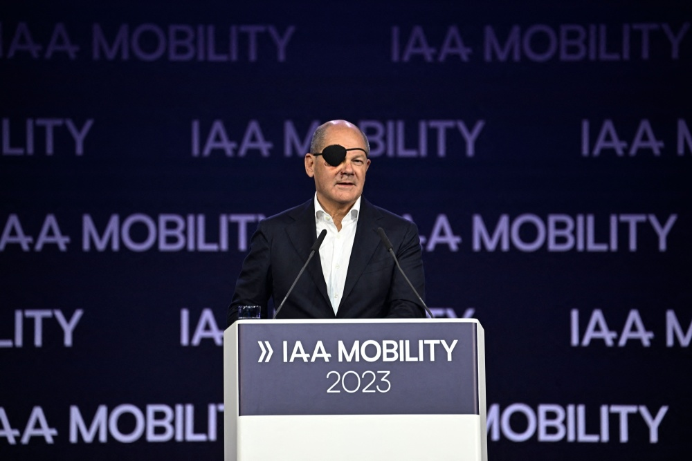
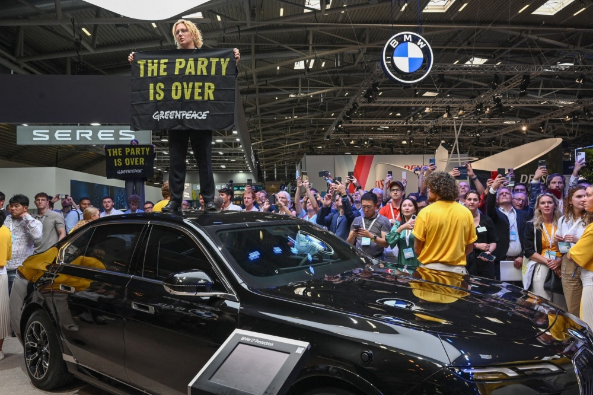
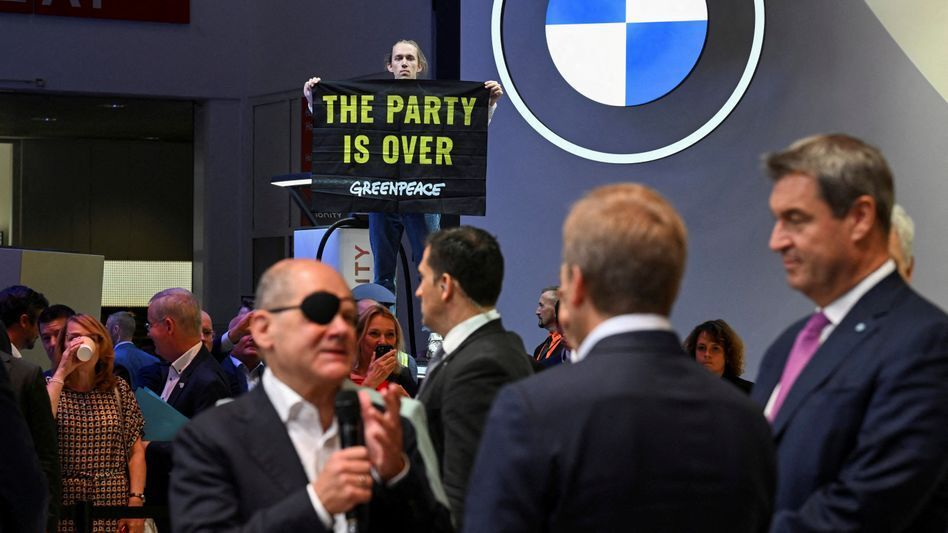

# “不要被中国吓到”，德国总理宣布将投资1100亿欧元激励车企

（观察者网讯）当地时间9月5日，德国总理朔尔茨出席在慕尼黑举行的2023年德国国际车展（IAA），为“焦虑不安”的德国车企加油鼓劲。朔尔茨表示，面对来自中国电动汽车的竞争，德企“应该被激励，而不是被吓到”。他同时宣布了一项价值1100亿欧元的激励计划，为德国电动汽车行业发展提供支持。

 _戴着黑色眼罩的朔尔茨出席慕尼黑车展开幕式，图自美媒_

据德国联邦总理网站和《时代周报》等德媒消息，戴着黑色眼罩的朔尔茨5日出现在慕尼黑车展开幕式，他此前在慢跑时摔倒受伤。发表讲话时，他提到了德国在汽车工业领域的“光辉历史”，并大力赞扬了德国汽车制造商和供应商的创新能力。

“电动汽车在德国有着深厚的根基，即德国长达135年的汽车制造经验，”朔尔茨还称，拥有超过75万名员工的德国汽车工业是迈向可持续未来的“核心驱动力”。

谈及来自中国等新兴市场在电动汽车生产方面的竞争时，朔尔茨说，公平竞争激发商业活力。

“竞争应该激励我们，而不是吓到我们。”他指出，过去几十年间，德国汽车工业分别受到来自日本和韩国的竞争；如今，来自中国的电动汽车也将为德国车企提供“创新驱动力”。他再次强调，德国作为汽车大国的国际竞争力“毋庸置疑”。

车展上，朔尔茨向参展车企宣布了一项旨在推动“德国制造”可持续创新的激励计划。他表示，联邦政府将投资超过1100亿欧元，以推进德国工业现代化和气候保护，包括加速充电基础设施、可再生能源、电池等战略重要领域的投资建设。

在5日发布的推文中，朔尔茨表示，“德国制造推动可持续创新”，德国联邦政府正与汽车行业共同应对这场“汽车革命”，将提供1100亿欧元的资金，以确保“我们的技术保持领先地位”。

_朔尔茨推文截图_

朔尔茨援引数据称，德国公共充电点达到9万多个，同时已有70万个私人充电站投入运营。

他指出，这远远不够，德国目标是2030年电动汽车从120万辆增至1500万辆，为此，德国将在未来几周成为“欧洲首个引入法律的国家，要求80%的服务站运营商为电动汽车提供至少150千瓦的快速充电选项”。

德媒提到，在朔尔茨参观期间，十几名“绿色和平”活动人士大闹会场，其中三人举着“派对结束”横幅的人爬上了宝马展台的车辆。朔尔茨批评抗议人士此举“不合时宜”、“有点烦人”。

_朔尔茨参观期间，抗议人士大闹会场。图自德媒_

在朔尔茨发表上述讲话之际，德国乃至整个欧洲的车企正“焦虑不安”。德媒此前介绍称，此次前来慕尼黑参展的厂家中，有41%来自中国。现场图片显示，在4日媒体开放日上，比亚迪、小鹏汽车、零跑汽车等中国汽车展台周围围满了参观者。

综合英国路透社、美国《纽约时报》和德媒报道，相较于雄心勃勃、“抢尽风头”的中国车企，德国等欧洲车企意识到危机感：在他们致力于在中国市场“收复失地”时，中国车企已发起对欧洲市场的攻势。法国《世界报》则刊文称，“只需几年时间，中国车企就能成为全球汽车业的领头羊”。

如何形容2023年德国国际车展？德国知名汽车专家、杜伊斯堡汽车研究中心主任杜登赫费尔使用了“转折点”（Zeitenwende）一词。他说，对于中国电动汽车厂商来说，欧洲成为“一个具有吸引力的市场”；但对于德国厂商来说，“竞争将会更加激烈”。

路透社援引数据称，目前，比亚迪、蔚来汽车和小鹏汽车等中国电动汽车制造商都瞄准了欧洲电动汽车市场，今年前7个月销量飙升近55%至约82万辆，约占所有汽车销量的13%。汽车咨询公司Inovev数据显示，今年迄今为止在欧洲销售的新电动汽车中，有8%由中国品牌制造，高于去年的6%和2021年的
4%。

此外，汽车数据研究机构Jato
Dynamics提到，2022年上半年，中国电动汽车的平均价格不到3.2万欧元（约合25.1万元人民币），而欧洲的平均价格约为5.6万欧元（约合44.0万元人民币）。

车展期间，大众、雷诺、宝马等车企负责人纷纷直言，在电动汽车领域，“中国已经领先我们一代人”，欧洲必须在制造成本、生态系统等各个方面努力追赶，并与之合作。

据路透社9月5日报道，在欧洲车企为竞争发愁时，博世、采埃孚、大陆集团等德国主要汽车供应商则渴望扩大在中国合作伙伴关系，并为中国汽车制造商提供欧洲制造的零部件。

博世首席执行官阿通（Stefan
Hartung）在慕尼黑车展上表示，“中国汽车制造商将通过用户体验和客户导向逐步使车辆适应欧洲市场，这是一个很好的方法”，而该公司早就与这些制造商合作过。路透社提到，博世在中国的合作伙伴包括比亚迪、华人运通和蔚来汽车。

采埃孚首席执行官克莱因（Holger
Klein）称：“当我们与中国客户交谈时，他们有非常具体的在欧洲建厂的计划，我们正就此进行讨论。”大陆集团首席执行官泽策（Nikolai
Setzer）也说，“中国人将走向全球并在欧洲建厂”，而大陆集团是可以为之提供支持的合作伙伴。

**本文系观察者网独家稿件，未经授权，不得转载。**

