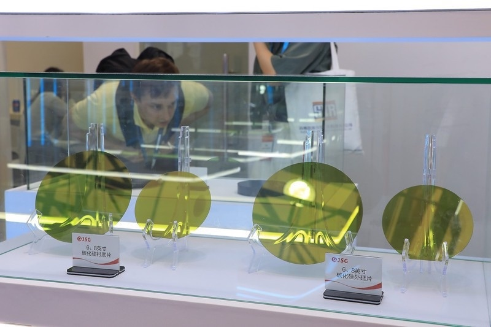

# 上千名美国科学家呼吁美中续签科技合作协定：许多实验获益于中方成果

【文/观察者网 刘程辉】“美国许多科学实验都获益于中方的研究成果，而且还是免费获得的。”美国斯坦福大学物理学家基维尔森说。

在部分美国政客出于政治动机的阻碍下，有着40多年历史的《中美科技合作协定》前途未卜，已然令美国科学家们忧心忡忡。就在这项协定到期前三天，两名斯坦福大学物理学家8月24日向美国总统拜登发去了一份全美1000名科学家和学者的联名信，呼吁白宫与中方续签合作协定。信函在驳斥所谓“中国窃取美国科学成果”说辞的同时，还一针见血地指出美国的许多实验确实受益于中国的科研成果，中断合作将对美国自身的研究和教育造成负面影响。

作为两国科技合作的重要象征，中美在1979年建交时签署了《中美科技合作协定》，确定双方在太空、能源和环境问题等广泛领域开展合作，该协定每5年续签一次，40余年从未间断。今年到期时间（8月27日）已过，两国仍未传出续签的消息。尽管美国务院此前称将在与中方谈判的同时将协定延长6个月，但考虑到美国政界强烈的反华情绪，美方科学家们对续签协定的前景并不乐观。

_斯坦福大学物理学家史蒂文·基维尔森/《南华早报》配图_

据《南华早报》9月6日报道，斯坦福大学物理学教授彼得·迈克尔森（Peter Michelson）和史蒂文·基维尔森（Steven
Kivelson）收集了美国大学1000名科学家和学者的签名，并致信白宫呼吁政府同中国续签有着44年历史之久的《中美科技合作协定》。

“我认为科学界需要大声疾呼，因为他们的声音并不总能被听到。”迈克尔森表示，科学家们把大多数时间花在了办公室和实验室里，往往“忙于科学而非考虑政治”。

在8月24日也就是协定到期前三天，迈克尔森和基维尔森已将联名信发给了白宫。俩人在信中告诉拜登：
**“切断与中国的联系将直接对我们自己的研究、同事的工作以及我们大学的教育使命产生负面影响。”**

基维尔森在接受采访时指出，学术研究和工业研究之间存在“很大的区别”。

“确实，半导体技术已经产生了巨大的影响，”他说，“但基础科学的投入早于对技术产生影响之前，而且所有基础科学都已公开并获得广泛传播。”

他补充道：“在这么长的时间里，没有任何实际的方法来保守基础物理和科学的秘密。”他强调，大学进行的这类研究的目标并非生产“有用的产品或东西，而是生产知识”。

“当然了，知识最终会让每一个人受益。”基维尔森说。

_2023年7月1日，中国国际半导体设备、材料、制造展览会。晶盛机电展台，碳化硅衬底片，碳化硅外延片/IC Photo_

至于所谓“中国正在从美国那里窃取伟大的科学”的说辞，基维尔森直言不讳予以了反驳。

**“事实上，就我研究的量子材料领域而言，中国的投资比美国还多。”他指出，很多同僚所做的许多实验确实受益于中国的研究成果，而且都是免费获得的。**

“当沟通渠道畅通时，我们会直接受益。”基维尔森说。

据路透社此前报道，对于协定是否续签所引发的猜测，美国国务院8月23日表示，美国正在寻求授权与中方进行谈判，以修改和加强协定条款，期间将在6个月内使协议保持继续生效。

针对美方的盘算，欧洲“科学商业”（Science/Business）网站引述维拉诺瓦大学政治学家黛博拉·塞利格松（Deborah
Seligsohn）的分析称，谈判将有助于解决双方学者访问对方学术网站遇到的阻碍。她还认为，补充的条款可能会规定合作研究是为了和平的目的，以此安抚那些担心科技交流会让中国军事研究获益的批评人士。

曾担任美国前总统奥巴马科学顾问的约翰·霍尔德伦（John
Holdren）表示，美国政府还可能借机投入更多资源，较以往更加密切地追踪中美政府间研究项目的“进展、问题和敏感性”。

“说实话，我有点悲观，”迈克尔森说，“我认为（美国）两党不会达成共识。”

迈克尔森认为，中美两国的沟通对话很重要，“至少不要在所有事情周围都设置障碍”。他说，6个月的延期表明双方愿意就某些令人担忧的领域进行谈判，在作出最终决定之前，必须利用专业知识对利益得失进行深刻地权衡。

_2022年7月24日，搭载问天实验舱的长征五号B遥三运载火箭，在文昌航天发射场升空/澎湃影像_

40多年来，中美两国在《中美科技合作协定》框架下相继签订了30多个议定书/协议，涉及20多个子领域，覆盖了卫生健康、气候变化、生态保护和核安全等领域，为两国建立互信、扩大合作奠定了坚实基础。

“科学商业”提到，《中美科技合作协定》本身是份简短的文件，但不意味着它不重要。亚利桑那大学高等教育学教授珍妮·李（Jenny
Lee）表示。“这份文件在很大程度上展现了两国的善意姿态，旨在以造福彼此的方式共同推动科学进步。”

然而，在中美关系紧张的当下，这项互利互惠的协定也成了一些美国政客攻击的“眼中钉”，美国政界近来屡屡传出无端指责中国借协议在安全和军事上获得优势地位的聒噪之声。

今年6月，一直对华充满敌意的美国国会众议院“中国问题特别委员会”主席迈克·加拉格尔（Mike
Gallagher），牵头带领数十名共和党议员致函美国务卿布林肯，“强烈建议”美政府不要续签《中美科技合作协定》。这些政客不厌其烦地炒作所谓“中国威胁论”，声称中国会因此在关键技术上取得优势，有助于中国实现军事现代化，宣称“美国必须停止助攻自己的毁灭”。

另一方面，支持续签者发出警告称，如果《中美科技合作协定》失效，不仅会危及气候变化和公共卫生等关键领域的政府间合作，还会阻碍世界两大经济体之间的学术合作，美国将失去对中国技术进步的宝贵了解。近来不少美媒指出，美国主流观点仍倾向于续签《中美科技合作协定》，这些对华鹰派政客的无事生非才是伤害美国的真凶。协定的存续具有风向标意义，若得以续签，将释放两国可以搁置争议，携手合作的强有力信号。

彭博社22日亦发表评论文章称“和中国一起搞科学让美国更强大”（Doing Science With China Makes the US
Stronger），喊话拜登不该被一些不和谐的声音“吓倒”，敦促其效仿前任“毫不犹豫”地续签协定。

当地时间7月19日，中国驻美国大使谢锋参加阿斯彭安全论坛时表示，希望美方与中方相向而行，争取中美关系稳下来、好起来。美方应拉长正面清单，用诚意加强对话、拓展合作，从一点一滴做起，为中美关系发展增添正能量。包括增加客运航班，调整赴华旅行提醒，续签《中美科技合作协定》，恢复“相互教育和文化交流法”项下国会议员和助手访华项目，举办中美旅游高层对话会，在入境、签证等方面为对方国家学生、学者、游客、企业家等各界人士互访提供便利。

**本文系观察者网独家稿件，未经授权，不得转载。**

