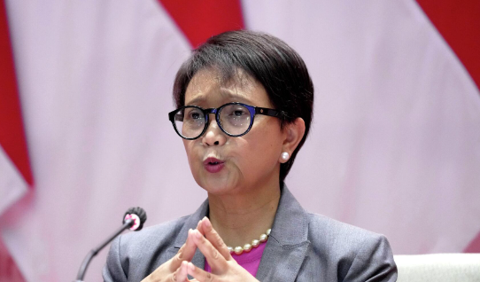

# 东盟峰会开幕，印尼总统佐科：不允许东南亚成为任何一方的代理人

（观察者网讯）9月5日，第43届东盟峰会在印度尼西亚首都雅加达开幕。印尼总统佐科在开幕式讲话中呼吁东盟国家面对当前世界局势应保持团结，东盟有能力打造经济增长中心。他同时强调，东盟不会允许东南亚地区成为任何一方争夺权力和影响力的代理人，东盟不能成为“破坏性竞争的竞技场”。印尼外交部长雷特诺同样指出，印太地区不应成为大国竞争的舞台，或沦为其他各方发生冲突的战场。

_印尼总统佐科在43届东盟峰会上发表讲话/路透社 图_

据马来西亚《新海峡时报》（New Straits
Times）报道，佐科在开幕式致辞时表示，面对当今世界局势，东盟的目标显然是成为增长中心。他说，东盟拥有实现这一目标的巨大资产，但东盟必须变得更加努力，变得更加坚实、大胆和灵活。

佐科将东盟比作一艘“巨轮”。

“东盟是一艘巨轮，对船上共同航行的数亿民众负有重大责任。尽管我们必须在风暴中航行，但作为东盟国家的领导人，我们必须确保这艘船能够继续航行。”佐科说，“我们应把东盟这艘船视作促进合作的场所，以期实现繁荣、稳定与和平，不仅是为了该地区，也是为了整个世界。”

他还表达了东盟扩大对外合作的愿望。

“世界海洋是如此广阔，我们无法独自航行。在旅程中，我们将遇到东盟伙伴的船。让我们携手合作，实现平等互利的合作，共同驶向增长的中心。”

**佐科强调，东盟国家领导人已同意“不允许任何一方把东南亚当做他们争夺权力和影响力的代理人”，不要把东盟这艘船变成“破坏性竞争的竞技场”。**

印尼外长蕾特诺表达了相同的观点。据《菲律宾星报》9月6日报道，蕾特诺在一份声明中表示，东盟和其他印太地区的国家需要共同努力，维护该地区的和平、稳定与繁荣。雷特诺说，印太地区“不应成为大国竞争的舞台，或沦为其他各方冲突的战场”。

_印尼外长蕾特诺/美联社 图_

“只有当我们坚持共同的价值观和原则——即合作而非对抗，双赢而非零和，参与而非排斥时，这才有可能实现。”

蕾特诺补充道：“印度洋和太平洋国家是印太地区不可分割的一部分。我们共享同一个地区，该地区发生的事情可能会影响我们所有人。”

今年以来，佐科已多次做过类似表态。佐科在2月3日会见东盟各国外长和东盟秘书长时表示，东盟应致力地区和平与稳定，绝不能成为任何方面的代理人。7月14日，他在出席东盟外长会以及东亚合作系列外长会时再度表示，东盟不能成为斗争的舞台，不能成为任何国家的代理人，东盟将与伙伴国进行真正的合作，相互支持，致力于加强团结，维护地区和平与稳定。

东盟成立于1967年，成员国包括印尼、泰国、新加坡、菲律宾、文莱、马来西亚、越南、老挝、柬埔寨和缅甸10国。据印尼外交部此前介绍，此次东盟峰会共有来自包括东盟国家及东盟对话伙伴国在内的22个国家领导人以及联合国、世界银行等9个国际组织的代表团参与。

峰会正式开幕后，东盟国家间将举行多场会议，此外东盟同中国、美国等对话伙伴国之间还将举行多场双边及多边会议。

值得注意的是，美国总统拜登缺席东盟峰会及系列会议，但计划在7日至10日先飞抵印度参加二十国集团（G20）峰会，紧接着再访问越南。

路透社此前引述东盟外交官的话说，鉴于美国政府公开强调与东南亚地区关系的重要性，拜登缺席雅加达令人非常失望。一名高级外交官提到，印尼把通常在11月举行的东盟峰会安排在9月，就是为了方便拜登出席东盟峰会后再前往印度参加G20峰会。

美联社（AP）9月5日引述印尼前外交部长马蒂·纳塔莱加瓦（Marty
Natalegawa）的话说，美国总统的缺席是“令人失望”且具有“象征意义”的，但更引发担忧的是，这可能意味着东盟地位越来越不突出。

不过白宫国家安全委员会战略沟通协调员柯比否认了这种说法。他称，拜登政府去年邀请过东盟领导人前往华盛顿参加峰会，从本届政府的记录来看，美国“不可能以某种方式放弃（东盟）”。

**本文系观察者网独家稿件，未经授权，不得转载。**

