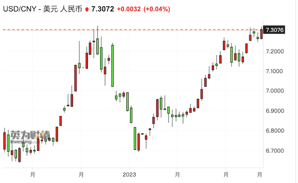

# 人民币盘中跌破7.32逼近一年新低，地产复苏情况仍是关键

经历了连续两周收涨后，人民币再度跌破7.3关口，盘中最低触及7.3217，逼近去年10月的最弱水平（7.3285）。截至北京时间9月6日16：30，美元/人民币收盘报7.3084，较上一交易日涨4点；美元/离岸人民币截至18:15报7.3066。

尽管近期维稳信号频现，但在高企的美债收益率和强美元下，人民币汇率仍面临压力。
**交易员表示，9月6日的预测中间价为7.317，但实际中间价7.1969，逆周期因子幅度已经高达近1200点。**
过去一段时间，近1000点的干预幅度并不少见，亦有国有大行进场买卖迹象。多数机构认为，在中美利差维持高位的背景下，人民币仍面临一定压力。

**人民币逼近一年新低**

上周五（9月1日），下调外汇存款准备金率的消息释出后，人民币汇率攀升，当周收于7.2675，周涨幅0.29%。同日，上海、北京公布“认房不认贷”政策。就在前一日，一系列楼市刺激大招的宣布带动了市场情绪，包括：首套和二套住房商业性个人住房贷款最低首付款比例政策下限统一为不低于20%和30%；将二套住房利率政策下限调整为不低于相应期限贷款市场报价利率（LPR）加20个基点（BP）；首套房的存量房贷利率也将调整。

不过，本周开始，人民币再度走贬，A股亦呈现震荡态势。尽管8月中国制造业景气再度升至扩张区间，但服务业扩张减速，经济修复动能仍然偏弱。近日公布的8月财新中国制造业PMI录得51，高于上月1.8个百分点，为年内次高，仅低于2月；服务业PMI则下降2.3个百分点至51.8。制造业景气回升幅度低于服务业放缓幅度，拖累当月综合PMI下降0.2个百分点，录得51.7，为2月以来最低。

此外，近期资金面较为紧张，银行超储率位于低位，因而降准预期高企。几家城商行的个金部门人士对记者表示，继9月初降低存款利率后，预计很快还将继续下调。

同时，美元指数居高不下是人民币汇率的关键压力点之一。 **截至9月6日16:25，美元指数报104.7附近，冲击105关键水平。**
“美元指数看上去势不可挡，收盘刷新3月以来的新高。”嘉盛集团资深分析师Jerry Chen告诉记者。

根据国家工商经济协会（NABE）对经济学家进行的最新调查，约69%的经济学家表示，他们看到了美国经济“软着陆”的迹象，这与3月的调查结果相比是一次“重大转变”。软着陆是指经济增长放缓，避免了经济衰退或连续两个季度的负增长。高盛首席经济学家现在将未来12个月内美国出现经济衰退的概率下调至15%，而在3月的概率为35%。他现在预计将出现逐渐减速的情况，这将是“浅层且短暂的”。

尽管各界对美国经济较为乐观，但在2023野村中国投资年会期间，野村全球宏观研究主管及全球市场研究部联席主管Robert
Subbaraman对第一财经表示，预计四季度开始美国经济可能出现连续两个季度的下降，出现轻度衰退。不过，他也称，美国近期很难降息，高利率起码要维持到明年3月以后。而且不断攀升的赤字率导致美债供应量攀升，非美投资者的美债持有量又在持续下降，这会导致美债收益率比以前的预想更高。

目前， **10年期美债收益率为4.265%，中美利差的倒挂幅度接近1.7个百分点。**
思睿研究方面表示，中美中长债利差走阔至接近历史最宽，离岸人民币和A股承压。从历史上看，中美利差与人民币汇率密切相关。

**房地产复苏情况仍是关键**

交易员普遍仍在观望地产刺激政策的传导效果。
**上周一系列刺激政策带动市场情绪，但目前效果仍待观望。在投资机构看来，房地产是一个对经济极为重要的板块，它带动了上下游各行业，占中国居民家庭财富的65%~75%。未来房地产的复苏情况将与人民币汇率表现息息相关。**

野村中国首席经济学家陆挺告诉记者，地产的问题既解释了过去半年一些经济指标低于预期的原因，也体现了未来几个月经济的下行压力仍存。

“即使过去一个月已有很多宽松政策出台，但力度仍不够，且不够全面，它能够拉动一些一线城市和二线大城市的房地产（最后的结果有待考证），但很有可能对广大三四线城市的房地产造成‘挤出效应’，即有可能有些资源被吸附到大城市中。而现在问题房企的主要经营项目、储备土地恰恰是在广大低线城市，例如碧桂园。”

此外，陆挺认为，“存量贷款利率下降的实际量不会太大，而且是以压缩存款利率作为代价的，一来一去对于居民净增加的收益有限，但这有助于维护不断收窄的银行净息差。”在他看来，投资者希望看到的是政策进一步松绑，例如限价、限售的政策应该放松，“限购应该有节奏地放开，到最后也许限购只应该存在于一线城市的一些核心地方，这是非常有必要的。之前的问题在于，人口流失的地方供地太多，而人口流入的地方则供地不够，造成一些地方的房价泡沫破灭，但很多大城市房价过高。”

同时，在机构看来，政府也需要继续支持开发商完成“保交房”任务，确保交付能拉动其他需求，也能提升老百姓未来买房的积极性。

目前，野村预计三季度中国GDP环比攀升0.2%，同比为3.7%，四季度为4%，这意味着全年平均为4.6%。陆挺认为，中国今年有望完成5%左右的增长目标，但明年的形势仍待观望。

瑞银亚洲经济研究主管及首席中国经济学家汪涛对记者提及，调查结果显示，房屋业主的情绪可能较2022年有所改善，更多受访者表示其房产的市场价值上升。未来12个月，虽然仍预计其房产价值将上升的房屋业主比2022年调查的更多，但三分之一的业主可能选择卖房，这意味着二手房挂牌量可能增加。调查还显示，就业稳定和收入增长是支撑消费的首要因素，接下来是财富效应，预计2023年实际消费增长将恢复至6.1%。

