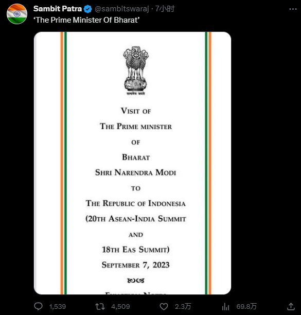
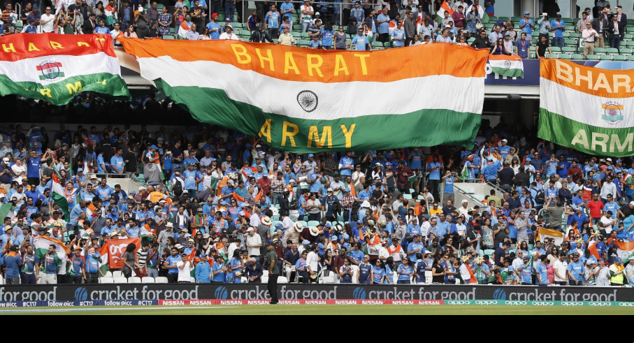

# 印度要将国名更改为“巴拉特”？印度国内吵翻天

（观察者网讯）据路透社、美联社报道，当地时间9月5日，印度总统德劳帕迪·穆尔穆在即将于新德里举行的20国集团（G20）峰会晚宴邀请函中将印度称为“Bharat”，而非常用的“India”。同日，印度执政党人民党发言人分享了一张邀请函图片，上面将印度总理莫迪写作“prime
minister of Bharat”。

同一天，印度总统和印度总理均使用了“巴拉特”（Bharat）而非“India”称呼印度，让外界纷纷猜测印度官方是否有意更改国名。同时，这也在印度国内引发争议，支持者认为此举旨在推动反殖民进程，反对者则质疑执政党借此政治操作。

《印度时报》等印媒援引消息称，莫迪政府可能会在定于9月18日至22日举行的议会特别会议上，提出把印度国名更改为“巴拉特”（Bharat）的决议。截至目前，莫迪政府和人民党方面尚未证实或否认这一消息。

_印度人民党发言人：印度总理莫迪“prime minister of Bharat”_

据介绍，“Bharat”是梵语词汇，字面意思是“承载/携带”，实际意为“寻找光明/知识的人”。“Bharat”词根可追溯到古印度文献往世书和史诗《摩诃婆罗多》，往世书将“Bharata”描述为“南方海洋和北方雪域”之间的土地。而“India”这个称谓要到英国殖民时期才确立起来，历史相对短得多。

在印度语言中，印度也被称为“Bharat”、“Bharata”和“印度斯坦”（Hindustan），这些名字在公众和官方场合可以互换使用。但印度高级官员在用英语交流时，通常使用“India”一词称呼印度。

多年来，莫迪政府及执政党印度人民党一直试图更改与英国殖民主义有联系的词汇。此前，有印度国会议员曾向最高法院提起诉讼，要求将国家名称改为“Bharat”。但迄今为止，法官们拒绝介入这场争议。

在印度总统和印度总理同日将国名写作“Bharat”后，相关争议再次在印度国内爆发。

以印度人民党为代表的支持者认为，英国殖民统治者创造了印度“India”这个名字，是“奴隶制的象征”，以掩盖“Bharat”，而即将在印度举行的G20峰会为印度摆脱殖民包袱提供了最佳机会。

_印度国内经常使用“Bharat”一词称呼印度，图自外媒_

不过，印度反对派对于更改国名持反对态度，并质疑莫迪政府此举意图。

“‘Bharat’一词我们一直在用，但‘India’这个名字全世界都知道……突然发生了什么吗？以至于政府不得不更改国名。”印度草根国大党（地方政党）领导人玛玛塔·班纳吉（Mamata
Banerjee）质疑道。

印度反对党国大党领导人沙希·塔鲁尔（Shashi
Tharoor）在推特发文称：“我希望政府不要愚蠢到完全抛弃‘India’，因为‘India’在过去几个世纪里积累了不可估量的品牌价值。”

还有反对者认为，莫迪政府此举是政治操作，针对的正是反对派两个月前成立的“印度国家发展包容性联盟”（Indian National Developmental
Inclusive Alliance，缩写为INDIA）。路透社称，该联盟将在明年的全国选举中挑战莫迪领导的人民党。

当代印度历史学家拉文德·考尔（Ravinder
Kaur）接受美国《时代》杂志采访时也称，两个月前，反对党联盟将自己命名为“INDIA”，这可能是莫迪政府决定将国名更改为“Bharat”的原因之一。

“部分原因是执政党试图通过更名来进行反击反对派联盟。但有趣的是，印度已经有了双重名字，这已写入宪法。”考尔提到，印度宪法开头写道，“印度（India），即‘Bharat’，应是一个国家联盟”。

**本文系观察者网独家稿件，未经授权，不得转载。**

