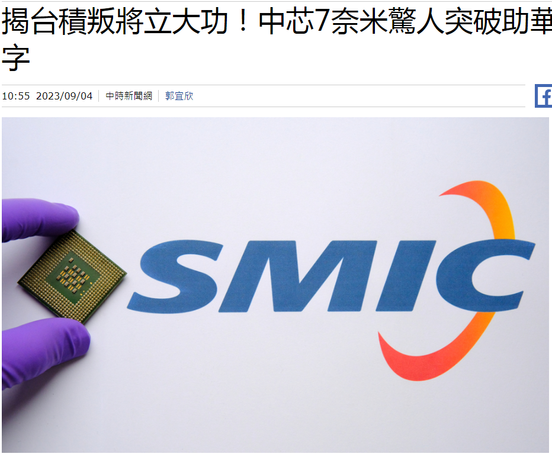
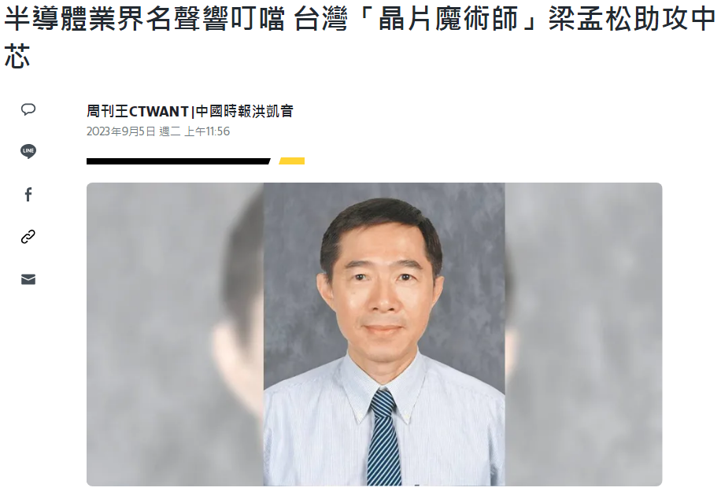
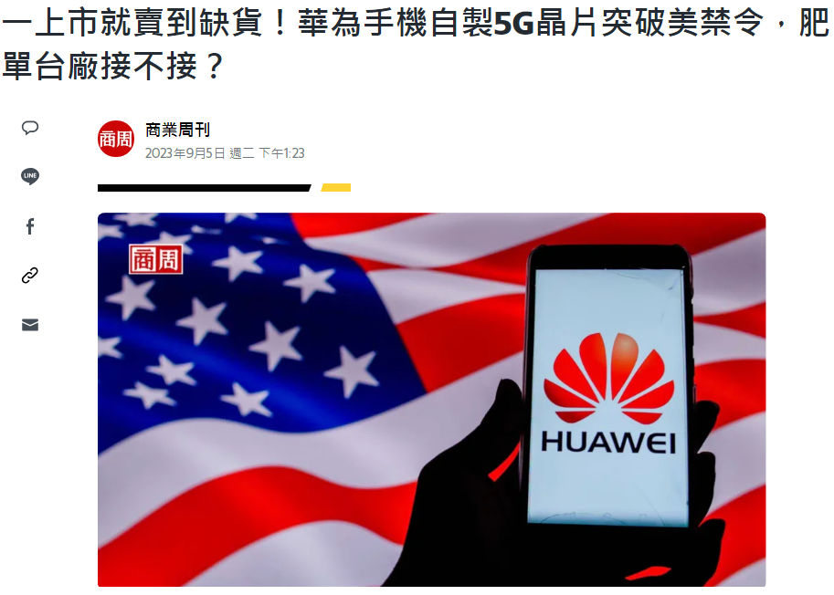
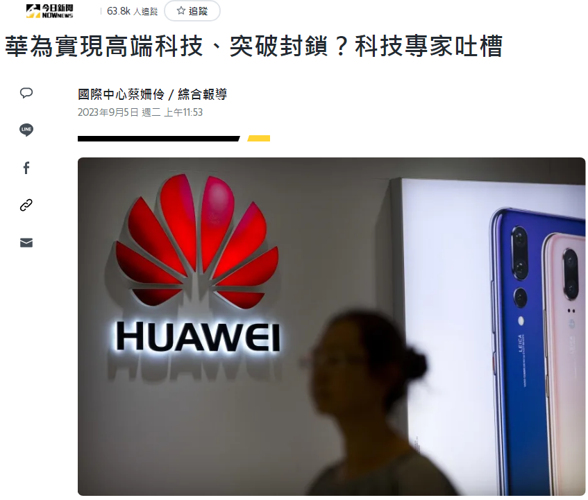

# 台媒：华为旗舰新机成功挑战芯片禁令，“台积电叛将”或助攻中芯

华为Mate 60 Pro推出后引发的震撼传递到岛内，各大媒体议论纷纷。

相当一部分台湾媒体认为，华为的此次突破极具象征意义。

“华为单点突围，恐掀蝴蝶效应”，台湾《中国时报》5日的评论说，华为新手机Mate60 Pro引起市场哗然，更可能吹皱美国对华政策一池春水。Mate60
Pro的实际商业价值或许有待时间检验，但其在地缘政治“单点突围”的象征意义，可能将使中美科技冷战进入第二回合，更重要的是，其在美国盟友间所造成的“蝴蝶效应”，恐令拜登政府更为头痛。

该评论认为，拜登上任后，一改特朗普乱枪打鸟的贸易战一对一打法，转而采取更精准的科技车轮战，不只祭出芯片等各项高科技产品出口禁令，更联合日本、荷兰等盟友，对中国大陆的科技“往死里打”，目的不光是要遏制大陆现有科技发展，更要让未来科技发展的可能性“胎死腹中”。华为无疑是美国科技制裁的最大苦主之一。先进芯片断供、安卓系统中止服务，一度让这个国际手机市场的当红炸子鸡一夜之间“销声匿迹”，如今华为挟着Mate60
Pro试图卷土重来，其可媲美当前主流5G手机的说法虽众说纷纭，但其折射出地缘政治象征意义，就令人玩味。

这篇评论说，“象征可能比真实更有杀伤力。”Mate60
Pro手机的出现，即便谈不上突破，至少也做到“突围”拜登政府的科技制裁包围网的地步。它无形中也给北京莫大的信心，认为只要不轻易屈服，就必然会是笑到最后的赢家。这类想法势必加剧美中角力的矛盾与时程。

“当拜登政府设下的科技制裁网不再牢不可破，美国就不会是占上风的那一边”，该评论最后这样说。

不少台湾媒体还怀疑台湾人在华为此次技术突破中是不是扮演了重要角色。

台湾“中时新闻网”报道称，具有卫星电话功能的华为新机Mate 60
Pro推出后引起震撼，搭载由中芯国际代工的麒麟9000S处理器，突显大陆晶圆代工无惧美国制裁，持续推进技术。对此，知名半导体分析师陆行之推估，中芯国际在梁孟松的带领下，7纳米制程技术与产能都有重大突破，不可轻忽。

陆行之认为，麒麟9000S处理器应该是透过中芯的N+2制造，N+1应该是假7纳米，实际上比较接近8-9纳米，N+2则是7纳米，不是市场传闻的5纳米，且中芯的7纳米不是用EUV生产的，所以要进行多次的多重曝光。

陆行之推估，中芯产能不足，如果需要出货4000万台处理器，应该也要数个月的时间。他说：“我们假设die size
169mm2、良率80%，中芯需要准备144k N+2产能才够，如果花6个月出货完，每个月就要24K产能，明显比我们之前预期的高很多。”

陆行之提到，如果这些假设基础，事后验证差异不大，代表梁孟松带领的中芯国际在7纳米技术与产能上都有重大突破，不可轻忽。事实上，梁孟松一直是中芯能够持续进步的重要功臣，从14纳米到7纳米都经由他手。

_台湾“周刊王CTWANT”5日更是详细介绍了梁孟松。_

报道称，备受瞩目的华为旗舰新机，成功挑战芯片禁令，因搭配的是中芯芯片，也让有“台湾芯片魔术师”封号的中芯执行长梁孟松再度受到外界关注。梁孟松在半导体业界是响叮当的人物，他登上媒体版面总是与半导体制程推进有关，曾助三星超车台积电，被业界人士视为“台积电叛将”，也曾带领中芯从28纳米推进入到14纳米制程，如今又助攻中芯冲到7纳米，让他享有“芯片魔术师”的封号。

台湾媒体的这一怀疑并未得到华为或中芯方面的证实。

台湾《商业周刊》5日则提到一个台湾企业关注的问题，台企能搭上华为的这班车吗？

报道称，在5G手机战场上，几乎消失在大众视野的华为，要突破美国的出口管制禁令回来了？而今年的手机市场，依旧寒气逼人。据研调机构Omdia统计，第1季全球智能型手机出货量年减近13％，全球手机品牌龙头三星，以及小米也都衰退约2成。但华为却是前10大品牌厂中，今年第1季唯一逆势呈现双位数年增率的业者，更悄悄的，将年初设定的出货目标上调至4000万支，增幅超过3成。

“这个被美国出口管制打入谷底的品牌，为什么敢这么乐观？”台湾《商业周刊》援引一位不愿具名的产业分析师的话称，“华为在中芯投片的传闻，可靠度满高的”，就目前掌握讯息，华为从旗舰款到中高阶手机都将导入自制5G芯片。“这代表在美国半导体禁令下，中国大陆秀出它的肌肉。”虽然不排除美国会进一步扩大禁令范围，但相信华为一定早已沙盘推演过。

报道称，最令供应链兴奋的是，华为是最敢导入新技术，又愿意付出一定价格的代表。对台湾手机零组件业者而言，华为是好客户，若它重新振作，是一块相对肥美的肉。但难题是：想吃，却又怕踩到美国红线。

当然， 认为华为未来仍然面临考验的分析也不少。

台湾“今日新闻”5日援引科技专家许美华的分析称，华为真正的挑战还很大，未来关卡还很多。

许美华称，大陆只能生产“极少量”的7纳米芯片。中芯去年就传出，可以用DUV重复曝光做出7纳米，而就是因为这个消息，导致美国联合荷兰、日本盟友，大规模禁止14-16纳米以下的DUV设备，禁售大陆的半导体厂商。

许美华认为，未来中芯少了14-16纳米新购设备的支持，要靠现有旧设备，支应华为一代代的新手机，一定会很辛苦，能否持续跟上世界脚步，每年推出新世代的手机，而且数量还要多到足以在世界手机市场占一席之地，才是真正的考验。

当然，“台独”媒体也来蹭热点。《自由时报》5日以“又抄台积电7纳米制程？加专家将拆解华为新手机”为题报道称，中芯7纳米芯片被抓包与台积电的产品神似，再度被质疑有抄袭台积电之嫌。但有网民在跟帖中对该报道评论说，这“真是一篇烂新闻，只是为了要黑华为，去黑中国大陆，就写了一大篇，而根本没有写到新闻标题的主角Mate
60 Pro里面的芯片的内涵，更是欺骗读者的是，连那支Mate 60 Pro手机，有没有拆开？都没有写出来。”

不管怎么说，这也算是被“华为震撼”震撼到了吧。

