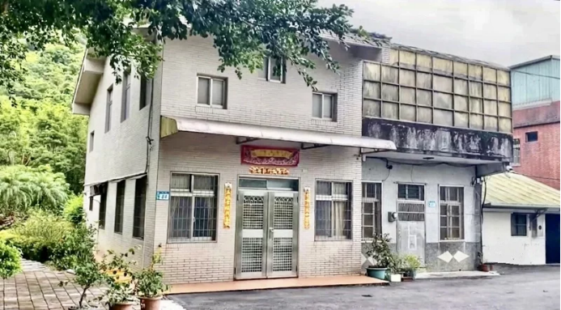

# 台媒：赖清德老家被证实“确实是违建”

【环球网报道】据台湾ETtoday新闻云6日报道，台湾地区领导人选举民进党参选人赖清德在新北市万里区的老家被质疑是违建。新北市政府地政局今日（6日）证实，确实是违建，且该土地确实属于矿业用地，地政局后续将请矿业局共同前往会勘。

 _赖清德 资料图 图自台湾ETtoday新闻云_

报道称，民众党参选人柯文哲的新竹老家因顶楼加盖铁皮被质疑违建，其后赖清德的新北市万里区老家也被网民爆出疑似违建。

新北市地政局表示，依媒体报道，赖清德位于新北市万里区老家疑似违建的问题，经查该土地确实属于矿业用地，因此须要由矿业局认定使用是否符合相关规定，地政局后续将请矿业局共同前往会勘。另外，地政局提到，该建筑物经查无建造、使用执照等资料，其违建情况今早新北市工务局已至现场勘查，将再清查资料比对后予以判定属何种类型违建。

对于赖清德老家涉违建一事，民进党6日在官网还曾发文“澄清”，声称网传赖清德老家为违建是错误信息，该房屋为赖清德亲戚所有、建物有建造执照、屋顶遮蔽物为防止阳光照射影响老人家生活的增设设施。

 _赖清德老家陷违建争议。 图自台湾《联合报》_

台湾中时新闻网等台媒报道称，国民党“立法院”党团总召曾铭宗6日上午被问到赖清德老家疑违建一事时称，赖清德要出来讲清楚、说明白，是不是违建；假设是违建，他从台南市长、“立委”、行政机构负责人，现在是台湾地区副领导人，也是民进党参选人，为什么放任违建状况持续这么久？

媒体询问，这算不算是民进党的回力镖（回旋镖）打到自己？曾铭宗称，是不是回力镖，各界有不同的评论，尊重各界的看法。

值得一提的是，柯文哲担任台北市长时，曾喊话要拆光违建，未料登记在柯文哲母亲何瑞英名下的新竹老家，近日被爆出违建争议。新竹市政府表示，将厘清是否违建，若是会依规列管或排拆。柯文哲6日称，若真的被判定违建，该拆就拆。

针对赖清德老家被证实是“违建”，有岛内网民在脸书及台媒评论区留言嘲讽：

_“我真的快被绿营侧翼笑死，到处放火，结果把主子的老家给烧了，恭喜赖清德加入违建兄弟的行列，民进党也变成违建党了。”_

_“侧翼又拆翼了”。_

_“回力镖又丢到自己喽。”_

_“民进党不是说那个是亲戚合法建造执照吗？”_

_还有人喊，“赖清德下台退选啦！”_

