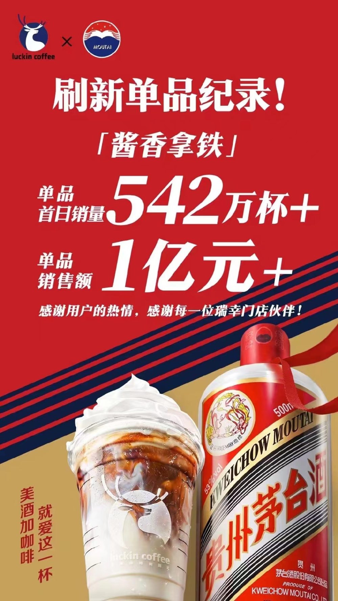

# 咖啡之后还要推辣椒酱？茅台正走入“逆高端化”陷阱

作者/徐昙

9月4日，茅台和瑞幸咖啡推出的联名款“酱香咖啡”造出了“火星撞地球”的效果。9月5日，瑞幸迫不及待地公布数据，仅一天时间，卖出了惊人的542万杯，销售额突破了1个亿。

当两个不匹配的品牌联名时，受益的一定是那个相对低端的品牌。而茅台从这次网络营销中，恐怕又一次稀释了自己的品牌。

_图说：酱香咖啡9月4日一天的销售数据。_

在中国，应该仅有茅台一家，通过矢志不渝的多元化，努力地从极致高端化向低端化或者说大众化发展。

酱香咖啡爆火之后，按茅台集团董事长丁雄军之前的策略，茅台将加大研发酒心巧克力、含酒饮品、棒支、软冰等产品，要建立起不同类型的产品矩阵。网传茅台辣椒酱也会上马，后发现茅台辣椒酱之前已面世，目前还仅在内部员工食堂使用。但是这不能不让人联想，这么多大众快消品类都能和高大上的茅台沾上光吗？

这几乎让人产生了一种错觉，这还是茅台吗，怎么更像网络品牌授权商南极人。

说句扎心的话，喝得起茅台的谁还往里加咖啡呢？反之，吃着辣椒酱的平民又怎么舍得往里加茅台？

这其实是一个品牌定位的选择——要高端化，还是要大众化，也是决策者战略驱动企业往哪个方向发展的选择。

**让人疑惑的逆高端化**

茅台独辟蹊径的品牌策略，和其他品牌的路径似乎都不一样。这几年，有一些最初疲弱的品牌，或者行业集体疲软的企业，都是不断探索高端化走出了困境。

典型的如东阿阿胶，最初只在农村销售，80块钱一斤。后来走高端化路线，甚至奢侈品化路线，据说引用《本草纲目》记载，滋补三大宝——人参、鹿茸和阿胶，给顾客心智里植入高端、稀缺的概念，目前市价约2800块/斤，东阿的目标则是未来要达到6000-10000元/斤。20年前东阿阿胶每年净利润只有几千万，2023年中报显示净利润是5.31亿。

家电业前几年因为产品同质化、产能过剩陷入了集体困境，但是有些品牌却挣脱出了泥潭。比如海尔、美的、TCL等。他们基本有几大策略，高端化，国际化，智能化，以战略的高度驱动了企业的良性发展。

尤其是海尔的高端化策略成效显著。海尔智家发展了七大高端品牌集群，包括海尔、卡萨帝、Leader、GEA、斐雪派克、AQUA、Candy。尤其是高端品牌卡萨帝，几乎被认为是海尔品牌觉醒的产物，2022年营收129亿元。

美的也推出了高端品牌COLMO，甚至到法国的“欧洲之巅”——阿尔卑斯山的勃朗峰发布该品牌，隐喻品牌的高度犹如阿尔卑斯山一样高大上。美的把高端化的重要性写进了年报：2022年企业经营重点之一，是把高端品牌
COLMO 的培育发展作为集团重要战略。

再譬如，“高性价比”（低端的另类表达）的小米，近些年开始的漫长的高端化努力。

因为只有在高端产品市场才能赢得口碑和效益的双丰收。

茅台最大的困局就是产能受限，只有茅台镇才能生产茅台酒，所以多元化探索就是寻找新的增长点。

茅台的多元化从1998年就开始了，最初茅台系只有20多个品种，能想象到了2023年，茅台的品类其实已经扩容到了200多个，涉及10多个行业。

但印象中能记住的也只有茅台葡萄酒，茅台啤酒，茅台保健酒，茅台冰淇淋，茅台咖啡等有限几个品种。

茅台推出青鸾干红葡萄酒时，定价3299元一盒（一盒一瓶），限量9999盒，比飞天茅台酒1499元的零售指导价还要高。

这中间能够看出茅台的野心，希望打造“葡萄酒中的茅台”、“啤酒中的茅台”、“冰淇淋中的茅台”……但除了贵，茅台在新兴领域并没有获得消费者认同，远没有成为头部品牌。

茅台虽然是白酒赛道的超级品牌，但每个不同的快消品领域都有不同的技术特点、运作模式、营销策略，茅台在白酒领域的优势，并不能做到赢者通吃。

相反，茅台在与瑞幸这种短暂尝试的联名款活动中，不但无助于品牌的成长，还会破坏品牌的定位和品牌认知，反而稀释了茅台的品牌价值。

**“既要-又要-还要”的共性难题**

到底有没有一家公司既能拿到高端市场的利润，也能拿到低端市场的红利？

历史上，似乎很少有品牌能成功地占领双重市场。茅台“既要-又要-还要”，就不得不琢磨出一套完善的品牌策略。

茅台被看作白酒中的奢侈品，同为奢侈品牌定位，可能只有阿玛尼成功地让富人和平民都穿上了这个品牌。创始人乔治·阿玛尼老爷子为了让不同阶层的人都能穿上阿玛尼也是费尽了脑筋。

阿玛尼系列里的Giorgio Prive高端定制是王冠上的明珠，一件晚礼服要10万美金甚至更高。

其次，阿玛尼高级成衣系列里Giorgio
Armani是顶端的品牌，价格高昂，一套成衣要2-3万元。非一般人能负担得起。2016年，“私募一哥”徐翔被捕时穿的“医护白大褂”就是Giorgio
Armani。

阿玛尼后来推出了Armani collezioni，售价比Giorgio
Armani低约20%，就是要满足那些负担不起阿玛尼高价的人。可是负担不起的还是大有人在啊！于是阿玛尼于是又推出了Emporio
Armani，基本价位是2500-15000元，针对25岁-35岁正处于事业上升期的白领。阿玛尼甚至允许合作伙伴推出阿玛尼的贴牌产品Armani
Jeans，价位相当于“七匹狼”，是阿玛尼系列中最低层次的休闲牛仔品牌，面向大众市场，满足18-30岁年轻人的需要。

这里有一个前提，就是各个层次的品牌要严格区隔，甚至在不同国家或地域销售，以使低端品牌不影响到高端主品牌。

但是更多的奢侈品牌，比如LV，burberry等这几年一直在砍掉副线产品，为的是不让副线的低端品牌形象影响主品牌。

目前看，全世界范围内还没有一家企业能够靠主品牌，通吃各个行业的先例。阿玛尼也仅仅是在服装领域做出了尝试。茅台要进入的却是诸多的快消品赛道。

如果茅台一定要走多元化的道路，或许可以像华润集团收购雪花啤酒那样，不是品牌多元化，而是投资多元化。反正茅台有花不完的钱，作为A股市场市值第一的公司，茅台2022年营收1275亿，净利润627亿，相当于每天净赚接近2亿。如果以投资并购的方式进行多元化，不使用茅台的主品牌，不破坏茅台极致品牌的定位，或可避免陷入多元化陷阱。

_《昙视点》是腾讯新闻出品，“媒体人+作家”徐昙主理的一档产经观察专栏——在众声喧哗中看到更专业和有趣的解读。_

