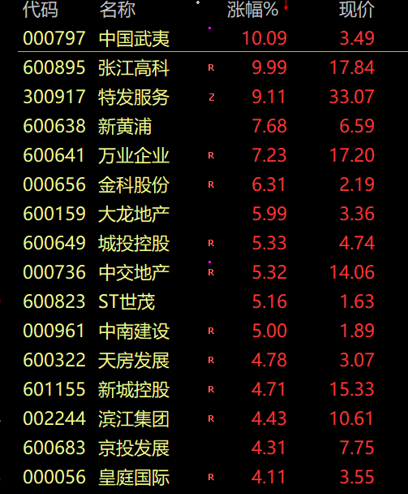

# 四大利好来袭！A股、港股地产板块暴涨，融创中国三天翻倍

中国基金报 泰勒

兄弟姐妹们啊，今天的市场太疯狂，半导体跟地产联手暴涨！

一起看看咋回事。

今日成交7713亿元。截止收盘沪指涨0.12%，深成指跌0.24%，创业板指跌0.47%。

共2813只个股上涨，2265只个股下。北向资金净买入不足1亿元。

**港股地产疯了**

港股内房股早盘拉升后，午后涨幅继续扩大。中国恒大一度涨超80%；融创中国一度涨超70%，且已连涨三个交易日，实现股价翻倍。此外，碧桂园涨20%，远洋集团涨16%。

而A股地产也在大涨，不过涨幅没有港股那么夸张。

为何如此暴涨？

第一、9月5号起，融创重新回到港股通，并成为这一批唯一一个地产公司。获得了南下资金的流动性支持。

第二、上周五港股休市，周末政策未及时反映，叠加较A股估值更低，本周港股对政策预期的反映。

第三、融创北京壹号院项目开盘，正好受益于政策放开，目前开盘去化达到六七成，反响较好。

受益于北京在9月1日晚落地“认房不认贷”，迎来贷款利率、首付比例变化等多重利好，9月3日，位于东四环朝阳公园板块的融创壹号院正式开盘。该项目定位现代科技美学大宅，总价3000万元起。开发商表示，开盘现场采取集中摇号，按顺序进行选房的方式进行；现场共认购169套，总认购金额约56.2亿元。

第四、外媒又有小作文，说是有计划推出更为积极的地产支持政策，比如取消一线城市非核心区域的____，以及放开____备案价格上下浮动范围（此处省略300字）

此前，粤开证券分析称，新房限价制约了房企销售回款能力，扭曲了楼市的价格信号和资源配置当前部分城市的新房限价政策，干扰了房企的正常销售回款，加剧其资金链紧张状况。在政府限价干预下，部分低能级城市的新房价格高于周边二手房价，主管部门担心房价指标下行，通过约谈等方式避免降价，导致库存去化艰难；部分高能级城市的新房价格又低于周边二手房价，压缩房企利润空间并诱发居民投机套利行为，有必要提高对房价的容忍度，发挥出市场调节能力。

**半导体大涨**

此外，半导体板块大涨，市场围绕光刻胶、华为产业链展开炒作。

消息面上，美国彭博社发表最新文章，关注华为新机一事。它们委托专业机构TechInsights对华为Mate 60
Pro手机进行了拆机检测，结果显示，该新机所使用的新型麒麟9000s芯片，来自中国芯片制造商。

其次，半导体昨晚也有小作文，说是要成立第三期的____，规模达到___亿。

好了，今天就分析到这了。

