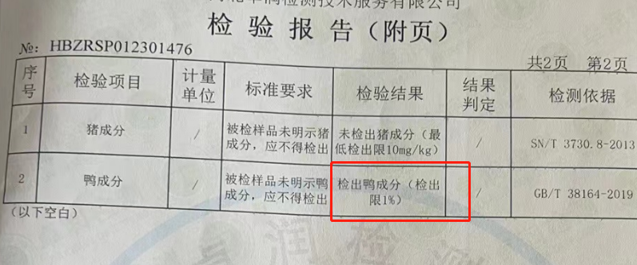
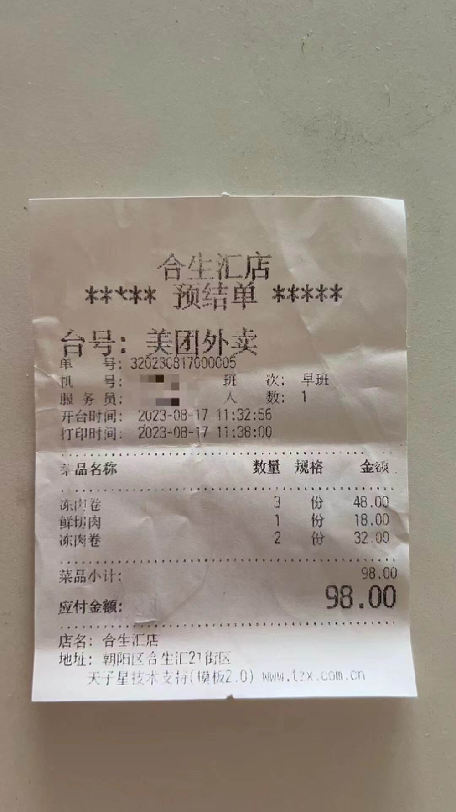
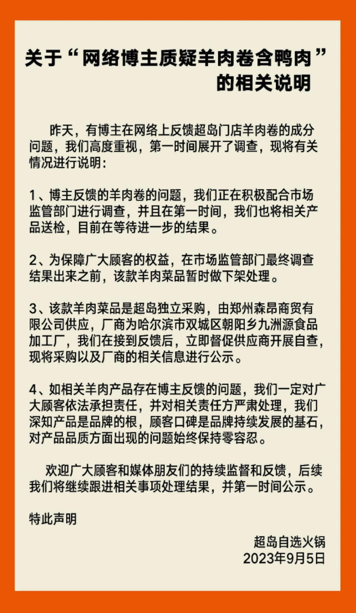
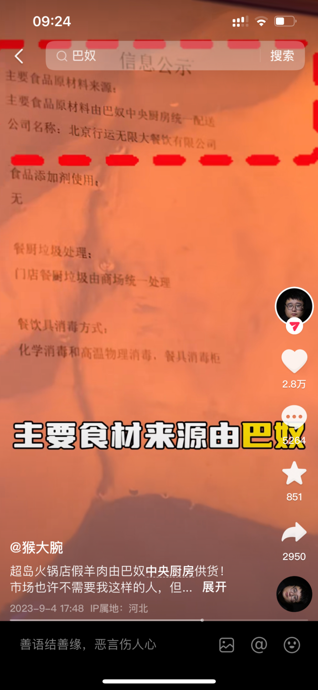
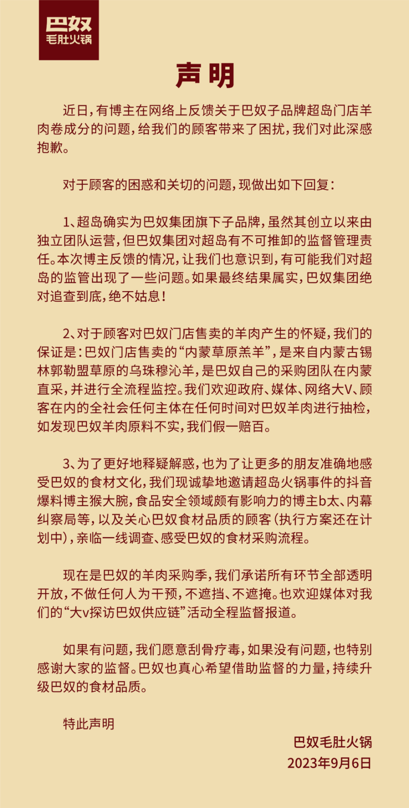

# 巴奴旗下品牌被指卖“假羊肉”，多方回应！

继张亮麻辣烫之后，又一品牌被指使用假羊肉。

近日，有网络博主曝光，“超岛自选火锅”北京合生汇店的羊肉卷被检测出鸭成分，且“假羊肉”售价合80元一斤。

据悉，超岛品牌由巴奴毛肚火锅创始人杜中兵之子杜夯创立。涉事门店内也明确公示，主要食品原材料由巴奴中央厨房统一配送。

目前，超岛、巴奴双方均对此事进行了回应。

**涉事门店回应：下架相关菜品**

4日，博主“猴大腕”在社交平台上发布系列视频，称“超岛自选火锅”北京合生汇店卖“假羊肉”。该博主共花费98元在该门店购买了6盒肉类食材，其中4盒高钙羊肉卷被检测机构检测出鸭成分。

_▲博主“猴大腕”的购买小票和检测报告。来源：受访者提供_

上述博主向中新经纬表示，其在购买羊肉卷时，曾直接询问店长“是不是真羊肉”，对方明确回答“那必须的”，并表示“我们和那谁是一家的”。“我向他确认是不是和巴奴是一家的，他肯定地回答‘我们和巴奴是一家的’。”

该博主称，涉事门店明确公示，超岛主要食品原材料由巴奴中央厨房——北京行运无限大餐饮有限公司统一配送。

5日，超岛在其官方微信公众号发布相关说明，称公司正积极配合市场监管部门进行调查，并第一时间将相关产品送检，目前等待进一步结果。同时，为保障顾客权益，超岛决定在市场监管部门最终调查结果出来之前，对涉事羊肉菜品做暂时下架处理。

 _▲来源：“超岛自选火锅”官方微信公众号_

超岛在说明中表示，该款羊肉菜品是超岛独立采购，由郑州森昂商贸有限公司供应，厂商为哈尔滨市双城区朝阳乡九洲源食品加工厂。

在说明中，超岛还公示了采购以及厂商的相关信息，并晒出郑州森昂商贸有限公司的承诺声明，称其供给超岛火锅的哈尔滨市双城区朝阳乡九洲源食品加工厂生产的九洲源精选羔羊肉火锅高钙原料为纯羊肉，不掺杂其他肉质。

6日上午，中新经纬拨打“超岛自选火锅”北京合生汇店在大众点评上的预留电话，分别提示“已停机”“无此业务号码”。随后，中新经纬又拨打了“超岛自选火锅”主体公司北京橙梦餐饮管理有限公司在国家企业信用信息公示系统中的预留电话，当被问及是否是“超岛自选火锅”时，对方便挂断了电话。

**巴奴回应：若结果属实，愿刮骨疗毒**

对于超岛的这一回应，上述博主并不能接受。

“现在又说是独立购买，而且把责任推到了其他供应商身上。为什么我当时购买的时候，我问‘是不是统一配送’，回答我说有中央厨房，我问羊肉是真是假，他们说和巴奴是一家的，而且店内的公示栏上只有巴奴中央厨房，没有其他的进货来源。”该博主称。

_▲来源：博主“猴大腕”社交平台截图_

那么超岛的主要食品原材料是否由巴奴中央厨房统一配送？巴奴的羊肉卷是否也存在类似问题？6日中午，巴奴回应称，超岛确实为巴奴集团旗下子品牌，创立以来由独立团队运营。

对于顾客对巴奴门店售卖的羊肉产生的怀疑，巴奴在声明中称，“我们的保证是：巴奴门店售卖的‘内蒙草原羔羊’，是来自内蒙古锡林郭勒盟草原的乌珠穆沁羊，是巴奴自己的采购团队在内蒙直采，并进行全流程监控。”

_▲来源：微信公众号“巴奴毛肚火锅”_

巴奴在声明中称，巴奴集团对超岛有不可推卸的监督管理责任，“本次博主反馈的情况，让我们也意识到，有可能我们对超岛的监管出现了一些问题。如果最终结果属实，巴奴集团绝对追查到底，绝不姑息。”至于超岛的主要食品原材料是否由巴奴中央厨房统一配送、又具体包括哪些食材，声明中并未提及。针对此问题，中新经纬向巴奴相关负责人求证，截至发稿前尚未收到回复。

据公开信息，超岛成立于2020年，创始人杜夯是巴奴毛肚火锅创始人杜中兵之子。凭借巴奴的背景加持，品牌已在京开出“超岛串串火锅”“超岛自选火锅”两个品类四家门店，关联“北京橙梦餐饮管理有限公司”“北京夯实餐饮管理有限公司”等多家企业。

其中，北京橙梦餐饮管理有限公司由北京夯实餐饮管理有限公司100%控股，而北京夯实餐饮管理有限公司又由巴奴毛肚火锅有限公司100%控股。

而巴奴则创立于2001年，专注毛肚火锅，提出“产品主义”理念。

官网信息显示，目前巴奴已拥有超百家直营店、3个中央厨房、1个底料加工厂。2020年，巴奴投资约1.5亿兴建的新央厨正式亮相，秉承“能冷鲜不冷冻，能天然不添加，能当天不隔夜”理念，打造餐饮业第三代供应链。

此前，巴奴曾因“天价土豆”事件引发舆论关注。今年2月18日，一顾客在西安赛格商场巴奴火锅店就餐时，点了一份“富硒土豆”，售价18元。待菜品端上桌后该顾客发现，整份菜只有5片土豆。随后，相关视频被公开发在了社交平台上，多番转发后引发全网热议。

2月23日，巴奴就此事发布致歉声明，表示由于管理的失误，导致顾客对土豆的分量产生了误解，网传视频中“18元一份的富硒土豆仅5片”实际上是小份的量，西安门店的售价为9元。

3月15日，巴奴又因硒含量不达标下架了富硒土豆，并对此前到店消费过富硒土豆这道菜品的顾客给予补偿。

来源：中新经纬

