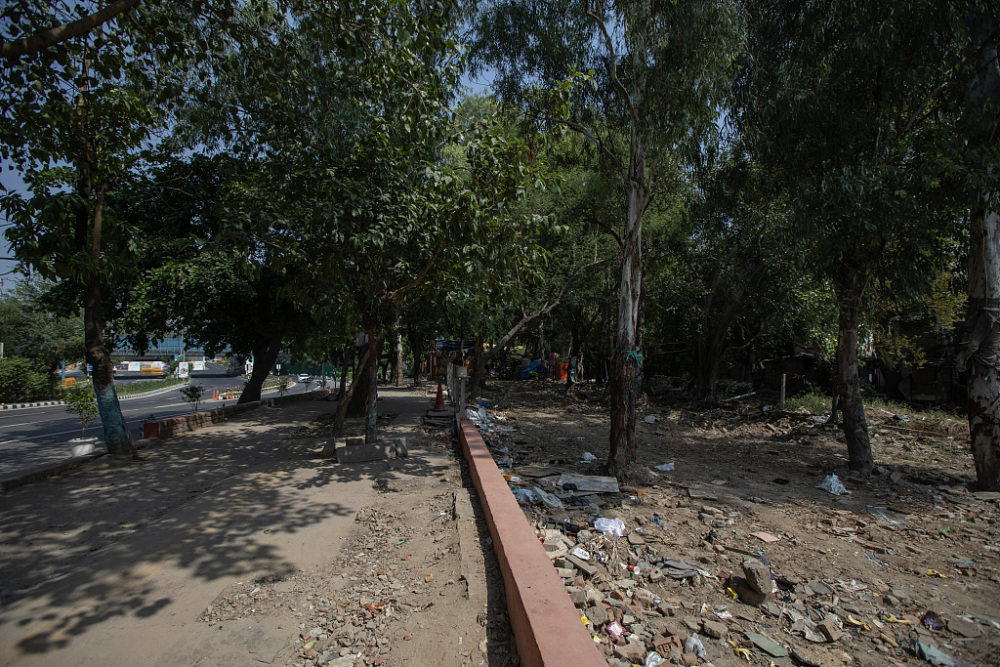

# 强拆棚户区、驱赶贫民，G20峰会前莫迪耗资1.2亿美元搞“美化工程”

【环球时报综合报道】据美联社4日报道，为了迎接即将召开的二十国集团（G20）峰会，莫迪政府耗资1.2亿美元给新德里做“美化工程”。但对于挤在棚户区的贫民来说，改造意味着流离失所，很多穷人“就像流浪狗和猴子一样被赶走”。

_当地时间2023年9月5日，印度新德里，在G20峰会前的清理行动后，贫民窟聚集区的全景。（视觉中国）_

报道称，今年1月以来，新德里数百间房屋和路边摊被拆除，导致数千人无家可归，其中很多人仅在拆除旧房前的很短时间收到了搬离通知。孟买和加尔各答等城市由于承办了一些与G20相关的预热活动，也进行了类似的强拆工作。

一家人权活动组织7月发布的报告显示，G20峰会的筹备工作致使印度近30万人流离失所，但政府未能给新的无家可归者提供替代的庇护场所。印度政府对此回应称，强拆针对的是“非法侵占者”，但该说法遭到被驱逐者的质疑。

这不是莫迪政府第一次承办重大活动时采取“眼不见心不烦”的策略。2020年，时任美国总统特朗普访问印度古吉拉特邦前，当地政府匆忙竖起一堵“隔离墙”，以防止特朗普看到棚户区内的景象。（向歆悦）

