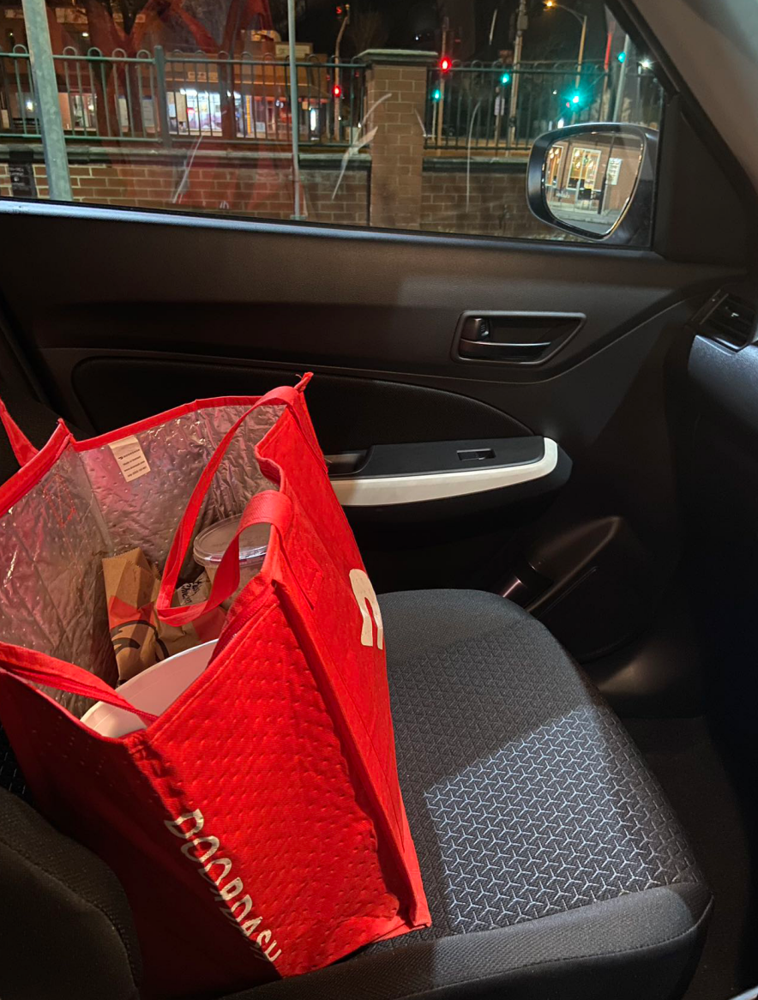

# 我，211硕士，在澳洲送外卖：一单能赚30元，不会因超时和差评被罚款

本文来源：时代财经 作者：王莹岭

近日，山东临沂大学教师邢斌因送外卖而走红，他在自述文章中分享了送外卖的见闻和思考，外卖算法、骑手权益保障、投诉机制等系统性问题再次引起人们的讨论。

其中，邢斌在文章中几次提到了国内外平台的区别，“在国外让外卖送到家是很贵的”“骑手和顾客双方都可以差评投诉”，这些机制的不同受到大家关注。

在国外送外卖究竟是什么体验？为此，时代财经采访了两位在澳大利亚送外卖的留学生。

从国内某211学校硕士毕业后，子润于今年7月到澳大利亚留学，利用课余时间送外卖赚外快。她发现，和国内相同的是，送外卖自由、灵活，不同的是，国外的外卖平台相对更加人性化，不会催单，也不会因超时而罚款。

据子润介绍，送一单外卖平均可以赚7-8澳元的配送费，折合人民币32-37元，一小时平均能赚25-30澳元，折合人民币116-139元，但几乎和当地最低的时薪持平。

留学生陈越也认为，在澳大利亚送外卖是一个自由、且报酬还不错的选择，若全职送餐一个星期，就能赚回一个月的房租水电钱。

不过，即使在国外，外卖员依旧“困在算法里”，平台压价、算法杀熟等现象依旧存在，还会受到语言不通、地点难找等因素的掣肘。

外卖平台像一个大型的“闯关游戏”，外卖员是身处其中的小玩家，被平台时而激励着、时而操纵着。

以下是她们的自述。

_夜晚，子润在送餐途中，受访者供图_

“因失误近两小时才送达，平台反而多给了配送费”

**子润，送外卖近1个月，约80单**

我今年7月来到澳洲留学，住在离墨尔本车程约两小时的一个小镇上，这里道路宽阔，人口稀疏，公共交通也不太方便，因此刚到这边，我就花约5万元人民币买了一辆车。

8月份，朋友告诉我，有车的话可以去尝试跑跑外卖。我平时的课比较少，两周才上一次课，但作业很多，因此在写作业之余我每天平均可以跑2-3个小时，刚开始断断续续地跑，最近这个星期每天都去。

我分别注册了三个平台，ubereats、menulog、doordash，这三个在澳洲是比较主流的外卖平台，其中ubereats属于最大的头部平台。目前我送了近一个月，三个平台加起来大约送了80单左右，以前两个平台为主。

在这里，点外卖的需求还是比较大的，人们比较经常点的就是炸鸡、汉堡、薯条、披萨这种快餐。但大多数都是本地人，我们留学生是舍不得点外卖的。这里是一个矿业小镇，本地人大多都比较富裕，还有一些人是行动不便的，比如老人或者过度肥胖的人，不太方便去餐厅和超市，对外卖就比较依赖。

报酬方面，平均每单能挣7-8澳元的配送费，折合人民币32-37元；一小时平均能挣25-30澳元，折合人民币约116-139元，几乎和当地的最低时薪23澳元/小时持平。

换算成人民币，看起来报酬还挺丰厚的，不过也不能完全按照汇率的角度来算，还要算上这边的生活成本。

这样算，跑两天大约能覆盖我一周的生活费（不算房租）。另外，这边的人工成本原本就普遍比较高，大家都比较愿意为劳动付费，前段时间有同学请我帮忙去安装了几个很简单的桌子椅子，居然给了我100澳元（约466元人民币）的人工费。

在这个小镇上，大多数人都是开车送外卖，因为这里不会限定送餐的范围，往往会接到十几公里外的单子，电动车不太能支撑这样的距离。我送到过最远的地方距离市中心大约15公里，非常偏北，是一个农场，两三公里内只有这一家人。

_因配送范围大，多数人选择开车送外卖，受访者供图_

在这里送外卖和国内的感觉还是有不同的。

对外卖员来说，最大的好处是不会因为差评和超时而罚钱，这会减少我们很大的压力。

在评价方面，目前我是百分百的好评，基本上是评价我，“比较友好”、“食物保存完好”。身边的朋友中则有人收到过差评，是因为餐厅没有把食物打包好，顾客误会外卖员动了食物，因此给出了差评，不过平台没有因此罚款。

据我了解，差评只是会影响到外卖员的“好评率”，不会因为一单的差评而扣钱，但或许会因为好评率的高低，影响到派单的质量。

此外，在时间方面，这边的外卖平台没有很严格的时间限制，在app界面上会有一个参考的时间区间，是给外卖员和顾客作为参考的，但如果超时不会有罚款，比如8公里对应的配送时间是25～40分钟，还不算在餐厅等待的时间。

在餐厅等待的时候，平台会监测到车辆停泊在餐厅附近，因此不会计入到外卖员的配送时间里，如果因为餐厅出餐慢而导致送餐迟到，不会判定为外卖员的责任。

这边的外卖员相对来说也更有“话语权”，比如接单之后到了餐厅一问才知道要等30分钟以上，如果不想等的话，可以直接联系客服取消这一单，不会收取任何费用和罚款。

不过也不是完全没有时间限制，在三个平台里，ubereats和menu
log的时间限定会宽松一点，只有doordash会计算准点率，如果超时太多，准点率会被拉低，可能也会影响到派单的质量。

_子润在等餐中，受访者供图_

5天前，我遇到了一次比较极端的情况。这是路程12公里的一单外卖，送餐过程中我不小心走到了高速上，还绕错了两次路，在种种失误之下，1小时45分钟后顾客才收到餐食。到顾客家门口的时候，我感到很抱歉，主动提出把35澳元的餐费赔给他，但他说不用了，非但没有生气，还给了我0.75澳元的小费。

后来，我还发现，因为我无意间绕了远路，又花了更多的配送时间，原本十几澳元的配送费，变成了45澳元，剩下的是平台后来补给我的。不过，这也并不意味着外卖员可以也故意为了增加配送费而绕远路，而只是紧急情况，并且我在途中也及时和平台报告情况，因此才没判定为恶意绕路。

在这里送外卖，还有一个好处是不用爬楼。因为这边的房子几乎都是独栋的平房，车子可以直接开到门口，大多数时候把餐放在门口就可以走了，只有极少的顾客会要求在门口面交。

_居民区大多是独门独栋，受访者供图_

缺点和困难也是有的。因为人口较少，单量会少很多，也不允许同时送好几单。一般是系统判定已经送达或者即将送达才会派下一单，有时候空单等待的时间也会比较长，一个小时能送三单就是极限了。

人们总说外卖骑手“困在算法系统里”，其实这边的外卖平台也会用算法尽可能地压低成本。举个例子，比如在ubereats上，用户付款了6澳元的配送费，平台会先放出5澳元给外卖员，如果发现没人接单，再慢慢加价到5.1、5.2澳元，每被外卖员拒绝一次，就小幅加价。因此，如果一开始就有人接单，就可能会以比较低的价格接到单子。对比明显的是，另外两个平台没有这种压价机制，同距离的配送费单价往往比ubereats要高出1-3澳元。

此外，常常陷入“人生地不熟”的窘境，或许是我在国外跑外卖最大的困难。有时候，找不到顾客的地址，我打电话向顾客问路，但从来都没有听懂过，只能自己多绕绕、多找找，有时候花费的时间就比较长。而且，晚上可能要送到比较偏远的地方去，这边的路灯几乎不亮，晚上开车很危险。

但作为短期内的过渡，送外卖是一个很好的选择。第一，可以比较自由地挣外快，时薪会比在餐厅打工高一点；第二，这是了解这座城市，练习和本地人打交道，练习英语口语和听力的最好方式。

目前，平台还有一些完成奖励，有点像玩游戏打怪升级，完成了多少任务就能有奖励。比如在menulog四个月内跑满25单会有50澳元，在ubereats
拉一个新人，被推荐人三个月内跑满40单会有500澳元奖励，推荐人和被推荐人两个人分。

不过，可能是因为这个奖励机制，最近在ubereats平台上入驻的外卖员渐渐多了起来，感觉能分到的单子越来越少了，等待时间变长了，陷入了“僧多粥少”的局面。另一方面，澳洲的冬天慢慢过去了，天气暖和了起来，点外卖的人也在慢慢变少，因此送外卖或许也不是一个长久之计。

等把奖励赚够，我应该会减少跑外卖的频次，尝试找找更匹配自己专业的工作。

“全职跑外卖一周，赚够一个月的房租水电”

**陈越，送外卖近一个半月，约200单**

我和对象今年6月到达澳大利亚的巴拉瑞特，我留学，他则陪读。两个月前，在社交媒体平台上看到很多人分享在澳洲送外卖的经历，刚好我们也买了车，就想尝试一下。

送外卖没有什么准入门槛，首先要有一辆车龄15年以内的车，其次要有国际驾照，如果是中国驾照也可以先开着，半年内考取国际驾照即可。

我们是在ubereats上轮流送外卖，因为只有一辆车。我大概每周送3天，一天送3小时左右，一周约10个小时。这10个小时赚的钱可以够付我们两个人一周的房租和半个星期的生活费。按照这个频率，目前兼职送餐一个月，我赚了2086澳元，折合人民币9734元。

全职则能赚更多，我对象曾全职跑过两个星期，如果按照一天8小时、一周跑6天算，一周能挣900澳元，足够我们一个月的房租水电了，相对来说也是比较宽裕的。

_巴拉瑞特市中心，外卖取餐一般在此附近，受访者供图_

印象最深的是，在时间上会宽松一些。在国内，虽然我没有送过外卖，但也能看出外卖员们永远都在抢时间，如果快超时了会非常慌，但在这边就不会，只要正常配送、保证安全，即使超时也没关系。

还有，大家的态度都比较好，70%的顾客会让我直接放在门口拍个照就可以走了。此外，到达之后会有5分钟倒计时，如果敲门、电话都一直联系不上顾客，可以直接把东西放在门口，甚至有外卖员会把外卖带走、自己吃掉，平台会退钱给客户，但不会追究外卖员的责任。

送餐一个半月，我送了快200单，其中收到了3个差评，主要因为我刚开始送的时候找不到地方导致超时太久，或者没有把食物包装保护好。不过我没有因为这个差评被扣过钱，只是影响了我的好评率。我目前的好评率是92%，暂时还没影响到接单。据说只要好评率保持在80%以上，就不会有太大影响，如果低于80%，就要想办法提升了。

在这座小城，点外卖的基本是本地人，送外卖的则大多数是印度人或孟加拉国人，中国人就以我们这一批新来的留学生为主，但也不超过10人，比较少。

据我了解，在澳洲，本地人点外卖的习惯几乎是在疫情之后慢慢培养起来的，形成习惯之后就很依赖外卖了，也比较愿意为这种人力劳动付费。有一次我们送过一个外卖，顾客就在同一条街的另一个餐馆吃饭，几步路远；还有一次，我接到一个超市代买的单子，顾客只买了一个苹果、一袋猫粮，货品才8澳元，但配送费就要15澳元。

对顾客来说，点一次外卖的成本也很高，需要付运送费、平台服务费，平台还会提示顾客是否给外卖员小费，相当于要付三种不同的费用。

 _陈越送餐途中，“顾客家对面就是湖”，受访者供图_

在这个系统里送外卖，我觉得我们就像游戏里一个个被操控的小角色，会有“新手村”，也会不断地有一些“奖励机制”，激励你不断打怪升级。

“新手保护期”是很明显的，最开始送的时候，我一晚上3个小时内完成12单是很容易的，基本派单会非常频繁，在上一单即将送达的时候就会派下一单。

但最近似乎就已经出了“新手村”，新手保护不复存在，相当于算法开始“杀熟”了。最近等待单子的时间渐渐变长，有时候送完一单要回到市中心最繁华的地方等待，才会有单子，有点像出租车空跑回程，不太划算。其中，最极端的一次，我等待了一个多小时。新手保护期的时候我有一个小时四五单都接过，但最近三单都很难，平均一个小时2.5单。

在ubereats平台上，“奖励机制”会分普通时段和奖励时段，晚上5:00~9:00晚餐期间属于奖励时段，每送满3单，会额外再奖励15-20澳元不等。

不过，“套路”也很明显。我发现，往往在奖励时段的单价都会压得更低，几乎都是10澳元以下的单子。没有奖励的时候，10澳元以上的单子常常被看见。相当于平台有精确的算法控制整体成本，不可能让你占到太多便宜。

而且，有时候平台也会故意卡时间，让我拿不满奖励。比如当晚我已经送满了11单，还差一单就可以拿最后的奖励，但已经临近9点了，系统却迟迟不派单，导致我错过了奖励时间，没有拿不到最后3单的奖励，也很不划算。

不过，即使有一些“坑”存在，在没有固定工作的情况下，我觉得这是一个起点比较低，想干就干，没有什么限制，也比较自由的工作。薪资和最低时薪持平，和在餐厅、咖啡店打工差不多，但是比在餐厅和人打交道要轻松一些。不过，送外卖的的危险系数会大一些，因为在路上的风险是要自己承担的。

目前，因为我们签证的问题，我找不到太正式的工作，因此，送外卖对我来说算是能够兼顾课业和赚钱的最好方式。

（文中采访对象均为化名）

