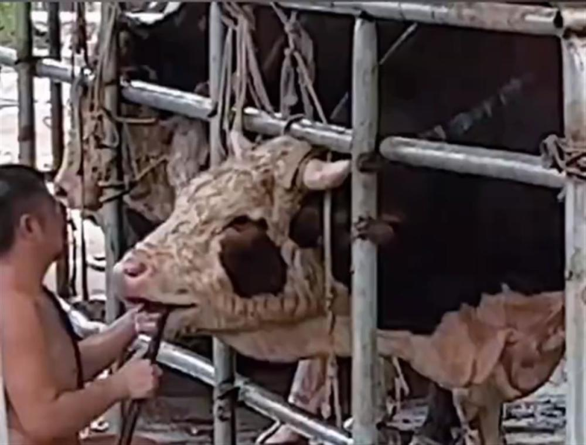
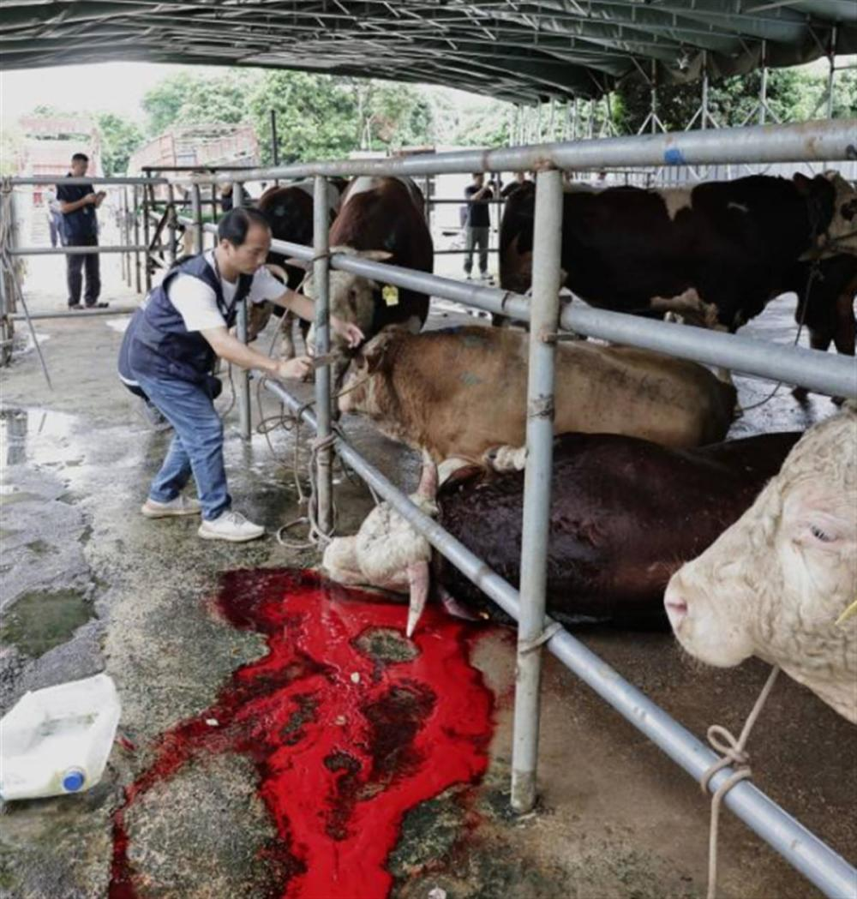

# 活牛2分钟被强行灌水近50升，广东东莞通报：供应商等5人被控制

近日，有市民报料称，在东莞市厚街镇七姐妹山上，存在一处注水牛的窝点，牛贩子为牟取暴利，每日拉牛到此处进行注水，以增加牛的重量。

南方+记者对该窝点进行了暗访调查，发现有工人给活牛插管注水。6日，东莞市通报称，警方已控制供应商李某等5人，并召回运往深圳的牛肉。

**一头牛2分钟注水约50升**

根据报料人提供的线索，南方+记者在东莞市厚街镇七姐妹山上，找到了这处注水牛的窝点。记者观察到，8月下旬，连续多日中午，都有两辆装满牛的红色卡车，将牛送到该窝点注水。窝点内仅有一个简易的棚子，棚顶是编织布，下方是铁架，用于将牛拴住。

 _给牛注水（图源：视频截图）_

牛被拉到此处后，有两三名工人负责给牛注水。记者在现场看到，工人将牛拴在铁架上后，将一根约两米长的黑色硬管直接插入牛嘴，再接上另一根软管往里注水，每头牛注水2分钟左右。工人们打着赤膊，只穿一条内裤，挨个给牛注水，动作粗暴、娴熟。

经估算，每头牛的注水量近50升，可给牛增重近百斤。工人给牛注水时，牛会前后踱步挣扎，面相难看，牛嘴不断有白沫吐出。有的牛不配合，吐出水管，工人就强行把水管塞入牛嘴，继续进行灌水作业。数个小时后，等到全部牛注完水，两辆卡车再将牛拉走。

同一批牛离开注水窝点时，体型已发生明显变化，浑身变得浮肿，肚子被撑得滚圆。

**注水后每头牛非法获利数千元**

为了弄清楚牛的来源和牛肉的流向，8月25日，南方+记者对两辆货车进行了跟拍。

_交易市场（图源：视频截图）_

当日上午8时，两辆货车出现在东莞市横沥牛行，牛贩子在此处购买了20多头牛。横沥牛行是全国四大知名牛行之一，也是华南地区规模最大的活牛交易市场，这里的牛来自全国各地。一名牛行员工称，这名牛贩子买的是西门塔尔牛，每头牛约800公斤。随后，牛贩子将买到的牛装车，驱车40余公里，驶向位于厚街镇的注水窝点。当日中午12时许，两辆货车先后到达，窝点内的工人开始像往常一样，给牛挨个注水。当日14时20分，十多头牛被注完水后重新装车，一辆货车驶出注水窝点。一个小时后，另一辆货车也载着十多头牛驶出。

_现场检查（图源：南方+）_

跟随两辆货车继续行驶，南方+记者发现，牛被注完水后，立即被送到东莞市食品有限公司南城食品分公司，这是一家正规的屠宰场。牛被拉进屠宰场前，有检疫人员在门口对牛进行取样。东莞市食品有限公司南城食品分公司的一名工作人员告诉南方+记者，该公司只提供屠宰服务，并不收购牛肉，牛贩子将牛拉到此处屠宰后，需要自寻销路，“一般来说，（牛）来这里屠宰后，都卖给了市场、超市，也有些卖给了机关单位的食堂。”

东莞一位活牛养殖从业者称，目前牛肉的市场价格约40元一斤，一头牛灌进约百斤重的水，屠宰后的肉的重量能增加约60斤，注水能使牛贩子在每头牛身上获得数千元的不法收入。

**警方已控制供应商等5人**

9月6日，东莞市就此通报称，市委、市政府高度重视、迅速行动，第一时间组织相关部门赶赴厚街镇河田社区七姐妹山涉事“活牛灌水窝点”、东莞市食品有限公司南城分公司现场调查处置，现场活牛尿液抽检均为阴性（主要检测“瘦肉精”），目前涉事活牛供应商李某等5名人员现已被公安机关控制，并暂停东莞市食品有限公司南城分公司活牛屠宰业务。

_警戒线（图源：南方+）_

经调查，李某等人提供活牛全部购自东莞市横沥牛行，在厚街镇河田社区七姐妹山一处农场内对活牛强行灌水后，送往东莞市食品有限公司南城分公司进行屠宰，肉品销往东莞、广州等地。9月5日下午，相关部门迅速对相关肉品进行全面追查截留，并送往东莞市农产品质量安全监督检测所进行检测，检测结果出具后将依法从严处理。同时，派出执法检查组对全市4家牛羊肉屠宰企业深入开展屠宰企业查证验物、“瘦肉精”检测以及肉品品质检验等情况详细检查，确保相关屠宰企业规范管理。自9月6日起，东莞市将进一步严格牛羊、生猪等进场关、屠宰关和出场关把控，通过实行横沥牛行与屠宰企业“点对点”调运管理、督促屠宰企业严格落实食品安全主体责任、落实运输车辆闭环管理、提升视频化信息化监管能力等措施，切实完善食品安全监管机制。

下一步，东莞市将加快调查进度，举一反三，进一步加强对牲畜、活禽、水产品等全链条溯源以及全过程监管，以全市屠宰企业、农贸市场、生鲜超市（便利店）为重点，迅速开展一次拉网式、地毯式食品安全隐患排查和专项整治行动，坚决守护好广大市民群众“舌尖上的安全”。

9月5日中午，东莞市当地镇政府、公安部门、农业部门、市场监管部门相继赶到现场进行勘察。执法部门赶到时，窝点内有工人正在对牛进行注水。

记者进入窝点内部看到，场地内有约20头牛。场地内地面湿漉漉的，气味难闻，四周摆放着多条水管。有几头牛不断口吐白沫，其中一头牛受伤出血。

5日13时许，当地公安部门拉起警戒线，对现场进行了封锁。

东莞市厚街镇农林水务局负责人告诉南方＋记者，执法部门后续会继续查实相关情况并采取进一步措施。

东莞市食品有限公司南城食品分公司负责人黄李表示，该公司和上述窝点的牛贩子已合作有两年，该窝点的牛肉主要销往东莞、深圳等地的市场。黄李称，已紧急召回该窝点卖到深圳的一批牛肉。

极目新闻综合南方+、人民日报官微

（来源：极目新闻）

