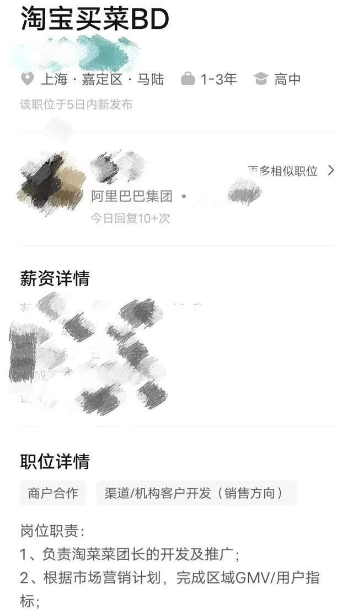
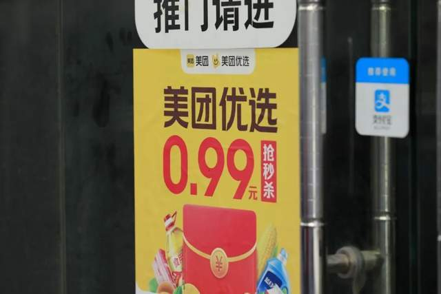

# 消息称淘宝买菜组建地推团队，业务市场逼近多多买菜

01 淘宝买菜筹备开城上海

生鲜电商领域，久违的热闹了起来。

**近日，第三方招聘平台信息显示，淘宝买菜似乎正在上海招聘地推（BD）**
，工作地点在上海嘉定区，主要负责淘菜菜团长的开发及推广，并根据市场营销计划完成GMV/用户指标。

_第三方招聘平台截图（图源：地歌网）_

今年5月，淘宝在App首页上线“淘宝买菜”入口，与“淘宝直播”“淘宝好价”并列。三者分别对应淘宝今年的“本地零售”“直播”“价格力”三大战略，共同占据淘宝首页最重要的流量入口。

据了解，淘宝买菜其实是由“淘鲜达”（小时达的即时零售业务）和“淘菜菜”（次日自提的社区团购业务）合并而来。

这次“开城”的正是社区团购模式的淘菜菜业务，需要招聘地推开发当地自提点“团长”。

今年以来，淘菜菜明显加快了扩张速度。先是2月10日，淘菜菜浙南中心仓开启运营，开始为温州、台州两地20多个区县的消费者提供服务；

此后的3月12日，淘菜菜开启杭州主城区服务。杭州主城区消费者可下单新鲜果蔬、肉禽蛋类、酒水休食等商品，享受明日达超市服务，次日中午在家门口自提点提货。据悉，开城当天，淘菜菜销售额超目标200%，所有包裹准时送达；

紧跟着的3月21日，淘菜菜又在安徽亳州再开新城。亳州淘菜菜融合了安徽合肥中心仓和江苏徐州中心仓两地的综合供给和履约能力，得以为皖北地区消费者提供商品和服务。

截至目前，淘菜菜已在全国18个省份（包含直辖市和自治区）提供服务，且还有继续扩张的趋势。

_淘菜菜自提点（图源：新浪科技）_

而且可以明显看到，淘菜菜今年的重心放在了人口更加密集的华东地区，或许是为了先跑通部分城市再进一步推广。

在这样的情况下，淘宝买菜开始布局上海市场也算是顺理成章。

不过需要注意的是，淘宝买菜在社区团购领域两个最大的对手——拼多多和美团，均早已在此深耕许久。

**尤其是拼多多，不仅总部位于上海，它旗下的多多买菜也长期占据着社区团购市场规模的第一，且已接近全国盈利。**

对于淘宝买菜而言，上海可能是一块最难啃的骨头，但同时也是一块必争之地。

02 淘宝美团拼多多齐聚，生鲜电商正面对垒

网经社电子商务研究中心联合数字零售台发布的《2023年上半年中国生鲜电商市场数据报告》显示，2023年生鲜电商交易规模预计可达6427.6亿元，同比增长14.74%。

虽然依旧保持高速增长，但也明显出现了放缓的趋势——过去三年，生鲜电商交易规模增速分别为42.54%、27.92%和20.25%。

**当行业整体增长趋缓的时候，各平台之间的竞争也更加趋于存量竞争，比如对于“地区”的争夺。**

据统计，目前北京地区的生鲜电商玩家主要有美团优选、美团买菜和京东生鲜等；浙江地区主要有淘宝买菜、天猫生鲜（天猫超市）等；上海地区则有多多买菜、美团优选、京东到家、盒马、叮咚买菜等。

_美团优选自提点（图源：电商头条）_

不难看出，各家生鲜电商平台首要布局的，都是自己的总部所在地。像是在北京的美团、京东，在杭州的阿里，在上海的拼多多等。

**但上海地区似乎成为了兵家必争之地，主流电商平台都不约而同地在此尝试争夺更多的市场份额。**

随着淘宝买菜也开始组建地推团队，上海似乎已经成为了生鲜电商的“紫禁之巅”。将在这里打响的，是一场用户心智和市场份额的争夺拉锯战，最终的战况甚至可能影响到更广范围内的战局。

**对此，主场作战的拼多多当然不会袖手旁观。**

今年5月到6月底的2023国际消费季暨第四届上海“五五购物节”期间，多多买菜大手一挥，在上海地区投放6000万张买菜专用消费券，覆盖全市16个区近1.3万个居民小区。

而且借助五五购物节的契机，多多买菜还试点了“买菜进社区”，合作志愿者送菜上门，进一步提升用户体验、培养消费心智。

长期深耕上海市场的拼多多，显然也具备更多的优势。

_多多买菜自提点（图源：电商头条）_

**不过需要注意的是，面对其他竞争对手，拼多多也有一个短板——配送。**

像是美团在上海，除了有次日自提的社区团购业务“美团优选”，也有最快30分钟送上门的“美团买菜”业务。对于一些即时需求更强的消费者而言，美团显然更具诱惑力。

淘宝方面，虽然“淘菜菜”才开始组建地推团队，但“淘鲜达”很早就已经在上海有所布局，时效方面最快也能达到小时达的程度。

至于拼多多的多多买菜，由于末端配送能力的缺乏，至今也只能提供次日自提的服务。

**随着淘宝和美团一边投入社区团购，一边加码即时零售，拼多多在生鲜电商领域仍面临着一定的压力。**

03 生鲜电商，换一种方式“内卷”

在过去的几年时间里，生鲜电商领域的玩家可谓是“你方唱罢我登场”，如雨后春笋一般冒了出来。

但行业先是经历了一轮“补贴之争”，拼命烧钱换市场，淘汰掉一批融资失败的小企业；后又开始了“模式之争”，O2O、社区团购、前置仓等一拼高下，最终随着每日优鲜的暴雷，前置仓暂时输掉了这场战役。

到了今年，还能留下的生鲜电商玩家基本都有着雄厚的资本，其他的则处在危险的边缘——比如开始谋求转型的每日优鲜，以及为了守住利润接连撤城的叮咚买菜。

**而对于剩下的阿里、京东、拼多多、美团等平台来说，过去的两场战役已经不再重要，接下来的竞争焦点已经返璞归真——回到了“供应链之争”。**

比如在前几天举办的2023中国国际水果展上， **盒马** 与智利的第一大车厘子种植出口公司Garces Fruit吉制、中国最大的榴莲分销商Niran
International Company、全球最大的水果蔬菜类合作社Sunkist、东航物流生鲜港等17家“水果巨头”达成战略合作。

_2023国际水果展现场（图源：盒马情报局）_

据盒马表示，合作的目的就是为了升级供应链，通过多种方式提升物流时效，保证水果等生鲜送到消费者手上的品质。

另一边的美团优选，在前几天宣布从“明日达”升级为“明日上午到”，相当于最快只需半日达。在这背后，正是美团不断优化采购范围和标准，才确保了供应链的稳定。

还有像是 **淘菜菜**
，今年6月“淘天集团物流部”发布变更公告称，淘菜菜招标采购信息平台微信公众号更名为“淘宝天猫物流采购信息平台”。天眼查信息显示，该公众号关联公司也正式更名“杭州淘天供应链有限公司”。

这一变化的背后，是淘宝买菜正持续优化供应链环节，其已经与阿里数字农业深度打通，平台上大量产地直采农货都是由阿里数农在前端采购，再运到淘菜菜的工厂进行预包装、预清洗等处理。

至于 **多多买菜** ，其之所以能够实现低价优势占据更多市场，原本就是因为其依托原有的农产品供应链优势进行“源头直采”，有效降低了中间环节的成本……

而当主要的生鲜电商平台们都开始回归供应链建设和优化时，我们也看到消费者们不再把低价当做唯一的标准——他们对于生鲜和生活品质的追求，也给予了生鲜电商进一步发展的可能。

作者 | 李松月

