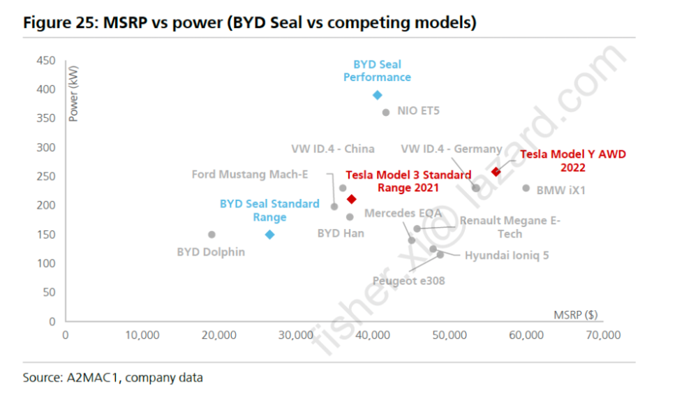
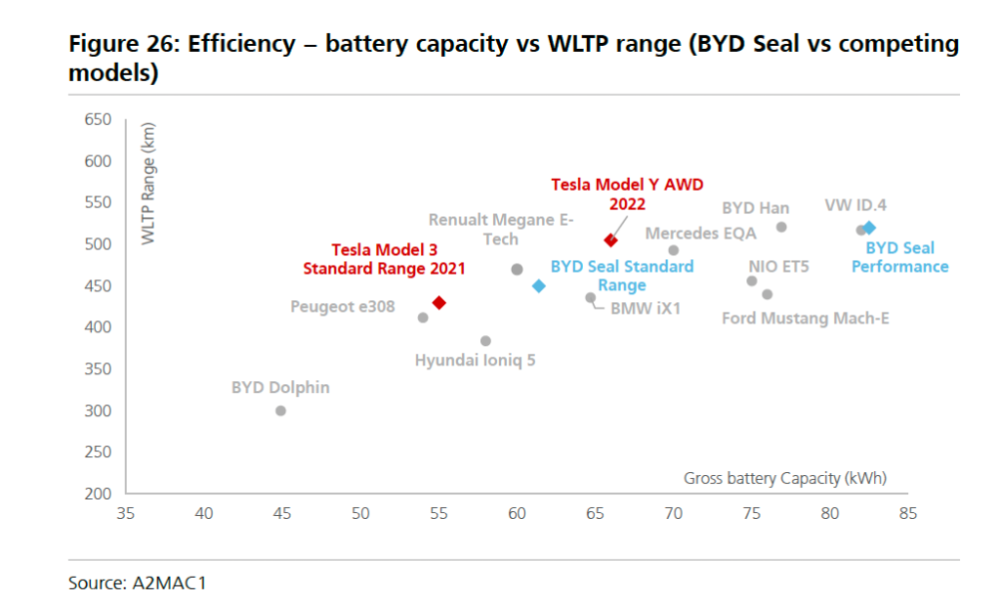
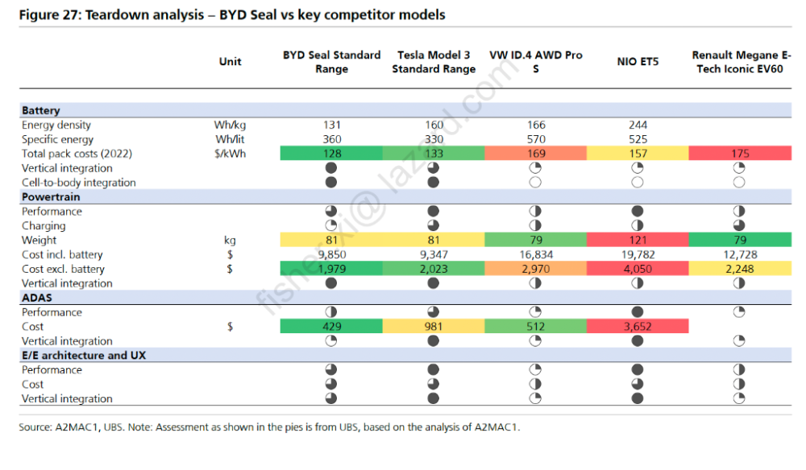
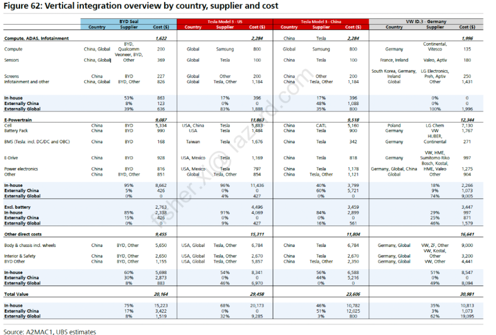
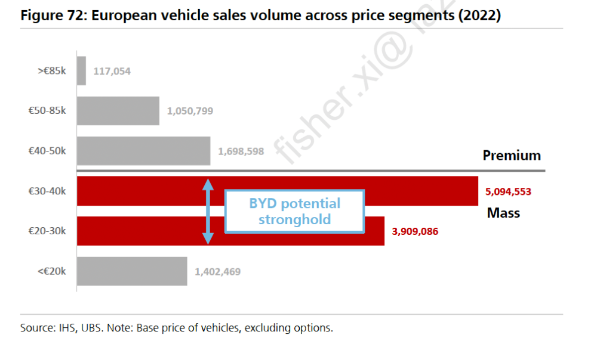
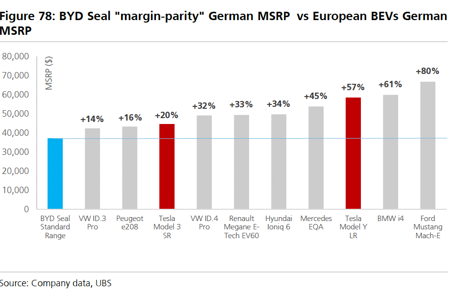
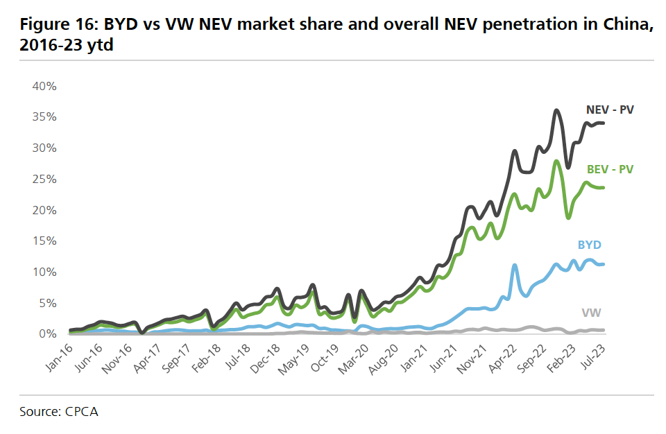

# 瑞银拆了比亚迪“海豹”，成本比特斯拉还低15%，感叹“颠覆的力量”

中国电车风暴席卷欧洲似乎已成共识，先“卷”为敬的中国车企们也正一步步“占领”欧洲市场。但当瑞银拆下比亚迪海豹，从零部件开始详解中国车企之时，还是不得不惊叹于其完整的供应链、
**超75%自研的零部件以及可以颠覆全球车企的“成本力量”** 。

9月5日，Patrick
Hummel在内的瑞银分析师发布研报表示，通过拆解比亚迪最新款海豹，他们深入了解了比亚迪的供应链、成本、结构、技术以及售后服务，并得出结论：

比亚迪比西方现有的车企在欧洲生产成本低25%左右，并具有颠覆全球原始设备制造商（OEM）的潜力。中国的OEM可以满足全球三分之二的汽车市场需求。比亚迪通过垂直整合和规模化使其具有成本优势，
**比亚迪海豹比特斯拉Model 3的生产成本低15%** ， **一辆比亚迪海豹比Model 3便宜约3400美元**
。海豹汽车的毛利率为16%，利润率为5%。比亚迪海豹汽车具有成本竞争力，不仅是中国生产的要素成本，还有技术的含量、科技的含量，在集成度、在垂直整合上的优势。当前中国电车行业正处于因本土价格战引发的垂直整合阶段，谁掌握了整合的优势，谁就将成为赢家，
**而赢家将积极推行全球扩张战略。这意味着电车“价格战”很有可能会辐射到欧洲，而比亚迪将成为行业领跑者。**
中国车企在欧洲市场的定价明显高于中国本土，唯一解释是，中国汽车制造商还未真正在价格上发力，到现在都是在“试水”阶段，随着时间的推移，中国的车企在欧洲的价格会变得更有竞争力。欧洲本土品牌降价10%-15%是维持市场份额的必要条件。预计到2030年，中国本土品牌全球市场份额将从如今的17%翻倍到33%。欧洲品牌的市场份额损失最大，市场份额可能从81%降至58%。
**燃油车板块受到的冲击更大，大众汽车、雷诺汽车、沃尔沃汽车和本田汽车受到的负面影响最大** 。

海豹汽车大约75%的零部件是比亚迪自产，留给全球传统供应商的空间是相对比较小的，大量依赖中国的本土供应链。除高通的芯片外，海外供应的零件不多。海豹汽车零部件的自制比率要比特斯拉在美国、中国生产或者大众在德国生产都更高。

比亚迪海豹的优势——为消费者带来最大的性价比

瑞银在报告中指出，短短几年， **中国便以惊人的速度取代日本成为全球最大的汽车出口国** 。中国电车对消费者极具吸引力，原因在于：(1）
**规模和成本的优势带来了极高的性价比** ；（2） **行业前沿的电池技术和动力技术及供应链** ；（3）
**一流的数字化用户体验（智能驾驶舱、辅助驾驶系统等智能化设备）** 。

瑞银称，比亚迪可以说是中国电动汽车实力的见证者，成为全球电车市场最新标杆。为了更好地了解中国领先电车制造商的竞争优势和供应链，瑞银拆解了比亚迪最新款海豹汽车，对比亚迪的动力系统进行了详细分析，包括磷酸铁锂(LFP)
电池电池、E/E电气电子系统架构和ADAS智能驾驶辅助系统，并将其与之前拆解的大众ID.3和特斯拉Model 3进行了比较。

瑞银直言，总体上看， **比亚迪最新款海豹汽车比特斯拉Model 3
更便宜、空间更大同时内饰也更为豪华，与大众ID.3和ID.4相比，比亚迪的数字化程度完全符合消费者的期望，且内饰更漂亮（屏幕更大、材料更优质）** ：

与比亚迪直接竞争的车型包括斯Model 3和Y以及大众ID.3和ID.4。

海豹汽车是比亚迪谱系下面跟特斯拉Model 3最接近的一台车。它们都是中型的轿车，都是后驱车，价格、大小、形态也最接近，能跟之前特斯拉Model
3的拆解进行很好的对比。

海豹比特斯拉model
3的车内空间更大，而价格却低得多。与特斯拉不同，比亚迪海豹的设计目标并不是随着时间的推移实现完全自动驾驶，但它凭借可靠的2级系统满足了经济型市场对ADAS的所有期望，并拥有更高品质的内饰。

与大众ID.3和ID.4不同，它的数字化程度完全消费者的期望，而且在我们看来，它的内饰也更漂亮（屏幕更大、材料更优质）。

正如详细的拆解分析所示，比亚迪通过高度的垂直整合发挥了其价格优势，带来了卓越的工程解决方案和成本领先优势。比亚迪海豹目前正在中国和部分亚洲市场销售，但已宣布计划在2023
年下半年将其引入欧洲，届时将与欧洲的现有汽车厂商展开直接竞争。

瑞银强调， **WLTP纯电续航里程是消费者是否愿意花钱购买经济型电动车的重要指标，在这一指标上，比亚迪的产品具有自身优势：**

比亚迪的建议零售价与续航里程之比在车企竞争中脱引而出。

在效率方面（WLTP续航里程与电池容量之比），比亚迪海豹在同级别车型中处于平均水平。特斯拉凭借一流的空气动力学设计和高效的动力系统保持领先。

从细节来看，海豹在包括电池、动力总成、辅助驾驶系统、以及E/E 架构等方面的表现并不突出，大多数关键绩效指标至少处于中等水平。
**但关键在于，从成本的角度来看，海豹在每项指标上的得分都很高** ， **且在电池芯和电子设备方面是同类产品中最便宜的：**

瑞银称，换句话说，海豹的定位非常准确 **，能够为普通大众消费者带来最大的性价比** 。

比亚迪的成本优势

瑞银指出，比亚迪表现出高度的垂直整合优势，海豹汽车中大约75%的零部件是比亚迪自产，留给全球传统供应商的空间是相对比较小的，大量依赖中国的本土供应链，海豹汽车零部件的自制比率要比特斯拉在美国生产、在中国生产或者大众在德国生产更高：

其中最突出的是电池、动力总成和电子部件，包括印刷电路板（PCB）。除高通的芯片外，海外供应的零件不多。

在中国，特斯拉在电池方面的垂直整合程度低于比亚迪，因为它依赖于中国以外的供应商，但在ADAS和软件方面特斯拉供应链的整合程度更高。

在利用中国的成本优势方面，比亚迪和特斯拉可以将其在中国的产能作为全球生产中心，而传统的原始设备制造商只是合资伙伴（通常只占50%或更少），因此利用中国的产能来服务全球市场是一种财务上的优选。

瑞银指出，就毛利润而言，海豹的毛利率达到16%，即3700美元/辆。一般情况而言，配备更大电池容量和全时四驱系统的高配版本利润率应该更高，因为价格差异大于增量成本。
**与中国制造的Model 3标准系列相比，估计比亚迪海豹的生产成本要低15%** ：

两款车的电池成本相近（比亚迪的电池成本略高），但比亚迪选择了整体成本更低（性能略低）的动力总成和ADAS，而特斯拉由于采用了一流的制造工艺和更高的工厂自动化程度，其装配人工成本应略低于比亚迪。

总体上说比亚迪海豹在直接成本上比Model 3便宜约3400美元。然而，随着Model 3的新款的推出，这个差距可能会缩小。

比亚迪将在欧洲掀起风暴？

按照海关总署公布的数据，2022年欧盟进口中国汽车的金额为133亿美元，同比增长100%。根据标普全球数据，到今年年底，欧洲进口的汽车中可能有1/5来自中国，而五年前这一比例还不到1%。

瑞银强调，毋庸置疑，在欧洲这样的市场， **只有电动汽车才能获得出口份额** ， 也仅有少数中国企业才能掌握全球扩张之道， **这也足以颠覆全球汽车市场**
：

过去几个月的情况也表明，中国本土汽车品牌在全球崛起的过程并非一条直线。我们认为
，中国本土电车的价格战不可避免地将导致行业洗牌，这迫使一些电动汽车制造商进入维持现金流的状态，别迫推迟全球扩张计划，而对一些整车厂来说，这种情况将是永久。

极有可能仅少数中国汽车制造商成功掌握扩张的主动权，而这足以颠覆全球汽车市场。

瑞银指出，当前中国电车行业正处于因本土价格战引发的垂直整合阶段，谁掌握了整合的优势，谁就将成为赢家，而赢家将积极推行全球扩张战略。这意味着电车价格很有可能会辐射到欧洲，
**而比亚迪将成为行业领跑者** ：

特斯拉已经开始向欧洲出口，比亚迪也将出口海豹到欧洲，与欧洲制造的传统OEM产品竞争。

像比亚迪这样的企业可以利用低成本的中国供应链，在目标市场当地组装汽车。

我们认为，中国OEM可以涉足全球三分之二的汽车市场，鉴于欧洲的市场规模和清晰的电车普及规划，欧洲是全球最有吸引力的地区。

根据我们的分析，扣除欧盟汽车进口关税，比亚迪在欧洲生产海豹的成本将比从中国出口高出约10%。就算是这样比亚迪海豹仍将比欧洲本土OEM制造的同等品质的电动车型便宜约25%（约1万美元）。

瑞银指出，欧洲现在是中国本土电车企业的最大机遇， **原因有以下几点** ：

● 电车市场快速增长，由于燃油车禁令（2030 年电车的比例将达到69%），到2035 年电车的比例将达到100%；

● 欧洲没有本土的颠覆性公司，只有传统OEM以不紧不慢的速度向电动车时代过渡；

● 与中国的细分市场高度重叠，即相同的汽车类别（小型和紧凑型跨界车和SUV是两地最受欢迎的细分市场）；

● 中国原始设备制造商的成本优势是欧洲原始设备制造商很难（甚至不可能）复制的。

瑞银称，根据调查显示，对于欧洲消费者（以及其他地区的消费者）来说，
**购车价格是最重要的决策因素，中国的经济型电车很可能会在欧洲市场从传统的燃油汽车转型中抢占大部分份额** ：

还需要注意的是，在对欧洲电车购买意向者中的调查中，瑞银发现，尽管与欧洲现有品牌相比仍然较低，但在中国本土品牌中比亚迪的市场份额也是最高的，经济型电动车品牌（比亚迪、上汽集团）比高端电动车品牌（如蔚来）表现出更积极的势头。

瑞银指出，在被问及考虑购买中国纯电动汽车的原因时， **有50%的消费者强调"物美价廉"是首要原因** 。鉴于此，
**瑞银判断欧洲的经济型汽车市场比高端和豪华型市场更有可能受到来自中国电车品牌的冲击** ：

目前，欧洲本土汽车制造商只有4万欧元起步的电动汽车产品，这也是电车在经济型市场渗透率相对较低的原因。中国电车制造商和特斯拉最有能力填补这一空白，从而推动电动汽车在欧洲经济型市场的普及。

瑞银称，大众、斯泰兰蒂斯的经济型车以及雷诺等经济型汽车受到的威胁最大，同时，比亚迪逐步占领欧洲市场也会对日本和韩国汽车制造商产生影响：

总体而言，欧洲原始设备制造商的同类车型比海豹价格高出1.5-25万美元。

然而，如下图所示，比亚迪和其他中国本土品牌迄今为止在欧洲的电车零售价明显高于中国。对此，我们唯一的解释是，中国的本土汽车制造商迄今为止都是"试水"阶段，而不是"步步紧逼"。我们认为，随着时间的推移，中国的OEM在欧洲的定价会变得更加激进。

欧洲市场“被迫”开启“价格战”？

瑞银在报告中分析称，假设比亚迪在欧洲销售时的利润与在中国本土的利润持平，可以发现比欧洲本土汽车至少便宜15%，这种情况是不可持续的，
**预计大众汽车需要大幅降价，来避免市场份额的流失** ：

据我们保守估计，在利润率不变的情况下，比亚迪海豹在欧洲的售价可以比中国售价高出9000
美元左右（包括：进口关税10%、每辆车的运费、额外的经销利润、德国增值税与中国增值税的差额）。

而这也意味着比亚迪与欧洲竞争对手车型的价格差距很大，我们可以发现这些车型至少要贵15%，而且需要强调的是，这些"裸车"的内饰要比比亚迪海豹少得多，尺寸也小得多（如大众ID.3
或标致e208）。

ID.4 等同类车型的价格要高出30% 以上。在我们看来，这种情况是不可持续的，我们预计大众将需要大幅降低定价，以避免市场份额的流失。

瑞银称，欧洲本土汽车制造商如果不降价，将被挤出市场。与同类产品相比，10%-15%的降价幅度是赢得客户的必要条件：

如果没有这样的激励机制，我们认为只有极少数拥有极高品牌忠诚度的消费者不会放弃本土品牌。但逐渐，消费者会认识到中国电动汽车在许多方面都优于现有产品，尤其是在信息娱乐和†ADAS
方面拥有高端标准配置。

对于大型轿车和SUV 来说，与传统竞争对手的价格差距甚至比小型/紧凑型市场还要大。

然而，这是高端和豪华品牌的大本营，由于老牌企业的品牌形象，价格已不再是卖点。 **但产品需要满足高端品牌客户的高期望值**
，就电池续航能力、连接性和ADAS而言，中国电车与它们不相上下，甚至更胜一筹。

此外，内饰通常也具有高端吸引力。但价格越高，中国品牌也就越难颠覆欧洲老牌企业。此外，在高端市场，高性能燃油车拥有稳定的消费群体，我们认为这些汽车不会很快被电动汽车取代。

瑞银指出，数据显示，新能源汽车目前占汽车市场的35%，比亚迪在电车领域拥有主导地位，市场份额约为30%。根据2023年Q1的乘用车市场表现来看，比亚迪迎来历史性时刻，首次超越大众，
**成为中国最畅销的乘用车品牌：**

尽管利用了全球电气化套件（MEB）平台，大众汽车在中国新能源汽车市场的份额仍然很小。在我们看来，大众汽车与中国本土品牌相比并没有竞争力，尤其是在软件和ADAS智能驾驶辅助系统方面。

