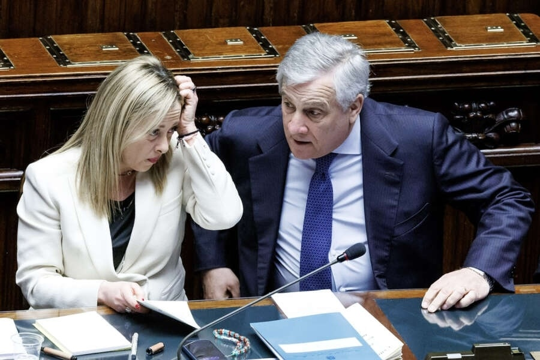
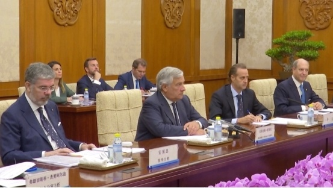
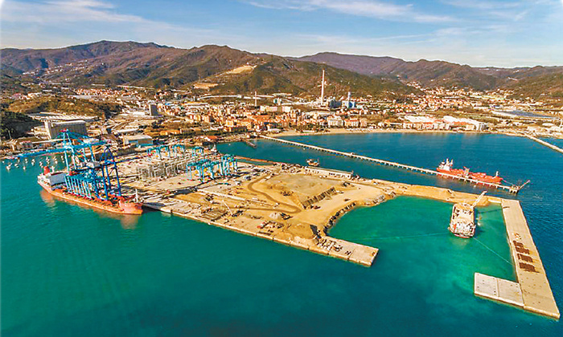

# 续约还是退出“一带一路”？意大利既想获得实惠，又不想承受西方压力

【文/观察者网
王慧、张菁娟】意大利是G7唯一一个加入“一带一路”的国家，然而近一段时间以来，外媒不断炒作意大利打算退出“一带一路”。9月3日至5日意大利副总理兼外长塔亚尼访华期间，中意共建“一带一路”倡议成为一个颇受外界关注的议题。

观察者网注意到，最近意大利方面的表态也比较矛盾：一方面想深化对华经贸合作，另一方面在是否续约“一带一路”合作上举棋不定。

9月4日，塔亚尼与中国商务部部长王文涛会见时表示，中国是意大利重要经贸伙伴，意政府对深化对华经贸合作持积极态度，希望进一步扩大双边贸易，促进平衡发展。欢迎中国企业赴意投资，愿与中方就优化外资环境加强政策沟通与协调。

塔亚尼不久前曾称，加入“一带一路”未给意大利带来预期成果，“我们必须进行评估，然后决定是否继续参与。”意大利总理梅洛尼今年7月与拜登会晤后称，有关“一带一路”的决定将在12月最后期限前做出。

_梅洛尼和塔亚尼 意媒图_

**意大利在纠结什么？**

中国与意大利之间签署的“一带一路”协议2024年3月到期。意大利参与“一带一路”协议包含一项特别条款：除非罗马方面提前3个月正式通知中国其打算退出，否则该协议将在2024年3月到期后自动续签。

“我认为，现在意大利政府打的算盘是，既想要和中国继续合作的实惠，又不想因为‘一带一路’承受来自西方的压力和质疑。”中国国际问题研究院欧洲研究所所长崔洪建告诉观察者网，意大利方面为了“证明”不续约的合理性，抛出所谓的依据和说法，包括经贸合作的获得感不足等都是在刻意找理由。

9月4日，中共中央政治局委员、外交部长王毅同塔亚尼共同出席中意政府委员会第十一次联席会议时特别提到了一组数据。他说，过去5年，中意贸易额从500亿美元增长至近800亿美元，意大利对华出口增长约30%。

中意共建“一带一路”合作硕果累累的同时，意大利也确实受到一些来自外界的压力。“一段时间以来，‘一带一路’合作已经被一些西方舆论和政客歪曲为中国的地缘战略。”崔洪建说。

“当然也有其内部因素的影响，比如说现在的梅洛尼政府相较于前两届政府在政策上更趋于保守，梅洛尼本人在对华关系的认识上也有一些偏差。”

崔洪建认为，中意“一带一路”合作本身就是中意关系的一部分，如果把这个部分做了改变，还指望整个关系完好如此，这个想法不太成熟。

_2023年9月4日，北京，意大利副总理兼外长塔亚尼（第一排左二），意大利驻华大使安博思（左一）等人陪同参与会议。 图源：视觉中国_

**“美国给意大利出了个难题”**

自意大利2019年加入“一带一路”倡议以来，美国一直在向意大利施加压力，《纽约时报》甚至形容意大利是西方世界的“特洛伊木马”，“让中国的经济扩张，可能还有军事和政治扩张，得以进入欧洲纵深”。

对此，崔洪建表示：“美国在官方和舆论层面一直在对意大利施加影响，因为美国想集合西方国家合力对付中国，而意大利又是G7的成员，如果意大利还和中国保持‘一带一路’合作的话，显然不符合美国现在搞的所谓‘身份政治’的准则。”

“在一些实际政策上，美国的动作就更加明显了，比如说之前G7提出的‘重建更美好世界’（B3W）伙伴关系和‘全球基础设施与投资伙伴关系’计划（PGII），这些都被认为是针对“一带一路”的项目。”

他认为，美国实际上给意大利出了个难题，是选择跟着G7一起搞他们所谓的高标准基建，还是和中国共建“一带一路”？

“这对意大利的压力很大，似乎意大利如果和中国在‘一带一路’框架下合作，就会失去G7搞的那些基建项目。”

面对西方针对“一带一路”提出的所谓“替代选项”，新加坡前驻联合国大使马凯硕在出席“一带一路”国际合作高峰论坛咨询委员会2021年度会议时评价称，模仿是最好的褒奖。

“在‘一带一路’提出来之前，西方国家从来没有想要通过彻底改善基础设施和一些基本的贸易条件来实现和推动世界经济复苏的意愿。”崔洪建说，如果美西方所谓的“替代方案”不仅仅是一种要和中国展开竞争的政治口号，而是真要付诸实施，切实造福世界民众，那中方完全可以正视这类竞争，这也可以看作是“一带一路”产生的正面效应。

**为什么意大利成为首个加入“一带一路”的G7国家？**

2019年，意大利正式成为G7中首个签署“一带一路”倡议谅解备忘录的国家。《华尔街日报》当时在一篇报道中写道，“不顾美国愤怒，意大利签署了中国的全球基础设施建设计划。”

_意大利瓦多集装箱码头鸟瞰图。自中意双方开展合作以来，瓦多码头控股公司的经营状况持续改善。图源：瓦多码头控股公司_

为什么意大利成了第一个？

“回顾当时的情况，意大利的加入是有一些特定背景的。”崔洪建分析道：

首先，从意大利内政来说，当时是孔特执政，孔特是个经济学家，最早的时候他无党派，是个纯粹的技术型官员，所以他更多的是从经济、从市场、从与中国合作的利益这些角度来看。换句话说，孔特政府不像现在梅洛尼政府这样，对中国有一些政治偏见。另外，当时意大利是五星运动和联盟党联合执政，这两个都不是传统意义上的主流政党，因此虽然西方也施加了比较大的压力，但是他们并不认同这种来自主流政治的压力。

其次，2019年，“一带一路”已经进入一个高质量发展阶段，当时所有的中东欧国家都和中方签署了共建“一带一路”合作文件，欧洲出现了和中国开展“一带一路”合作的积极态势。

另外还有意大利的一些现实需求，比如说在中意“一带一路”合作备忘录里面尤其强调，双方要深化港口、物流和海运领域的合作。意大利是南欧国家，当时中国和希腊之前的比雷埃夫斯港合作在南欧地区有非常积极的示范性，短期内帮比雷埃夫斯港大大地改善了营商环境，这对意大利的触动也很大。

“当时各方面的条件都是朝着推动中意开展‘一带一路’合作的方向走。”崔洪建说，从那时候到现在，有些情况已经发生了很大变化，包括意大利的内政，以及西方拿出了一些所谓针对“一带一路”的替代方案等等。

如今意大利是否续签“一带一路”合作一事仍存在变数。不过，崔洪建认为，不续签或者退出，影响最大的应该是意大利，不会对“一带一路”带来实质性的影响。

“现在‘一带一路’是一个多边的跨区域合作，尽管意大利是第一个加入的西方发达经济体、第一个G7国家，但是如果把中意的贸易投资放到中国和整个“一带一路”国家的合作来看，应该说量还是比较有限的。”

今年是“一带一路”十周年，如今“一带一路”合作也面临着一些新形势，包括地缘政治因素上升、美国在搞所谓的供应链产业链重组、大国博弈加剧、各国都在强调自己的经济主权和经济安全等等。

“在这一背景下，意大利的事情客观上可以帮助我们总结经验，更好地认识当前‘一带一路’合作的环境，以确立下一个五年‘一带一路’更加切实可行的合作路径，增强‘一带一路’合作的吸引力。”崔洪建说。

