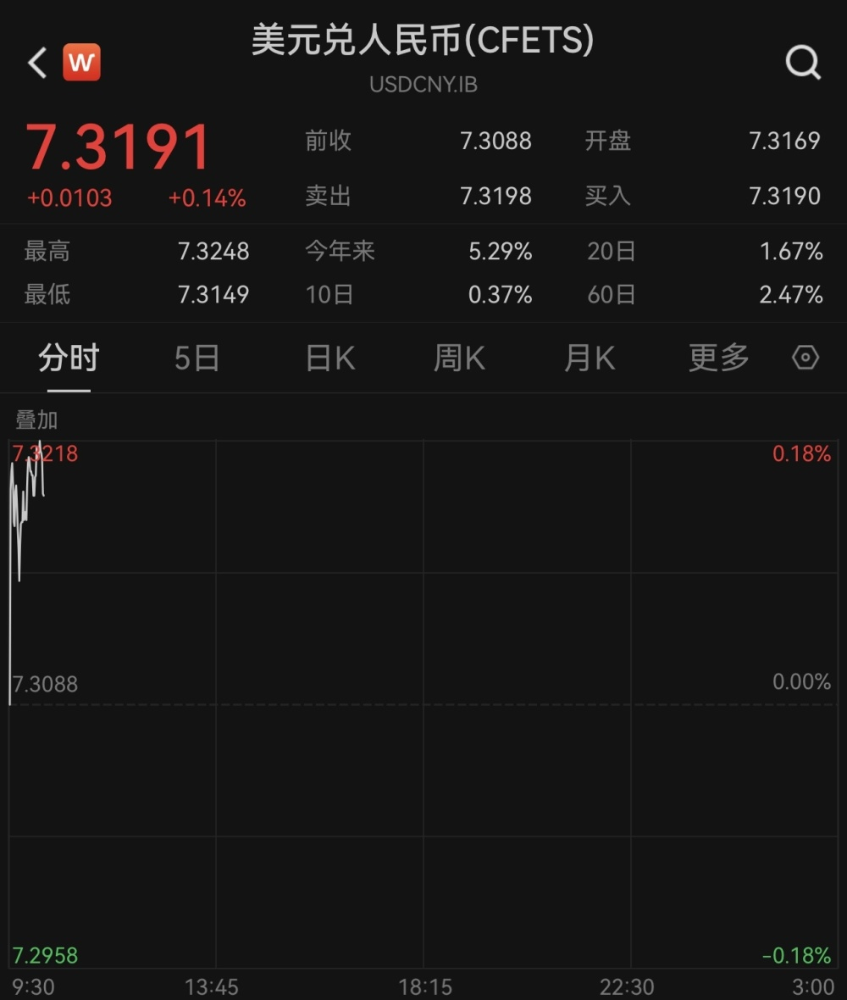
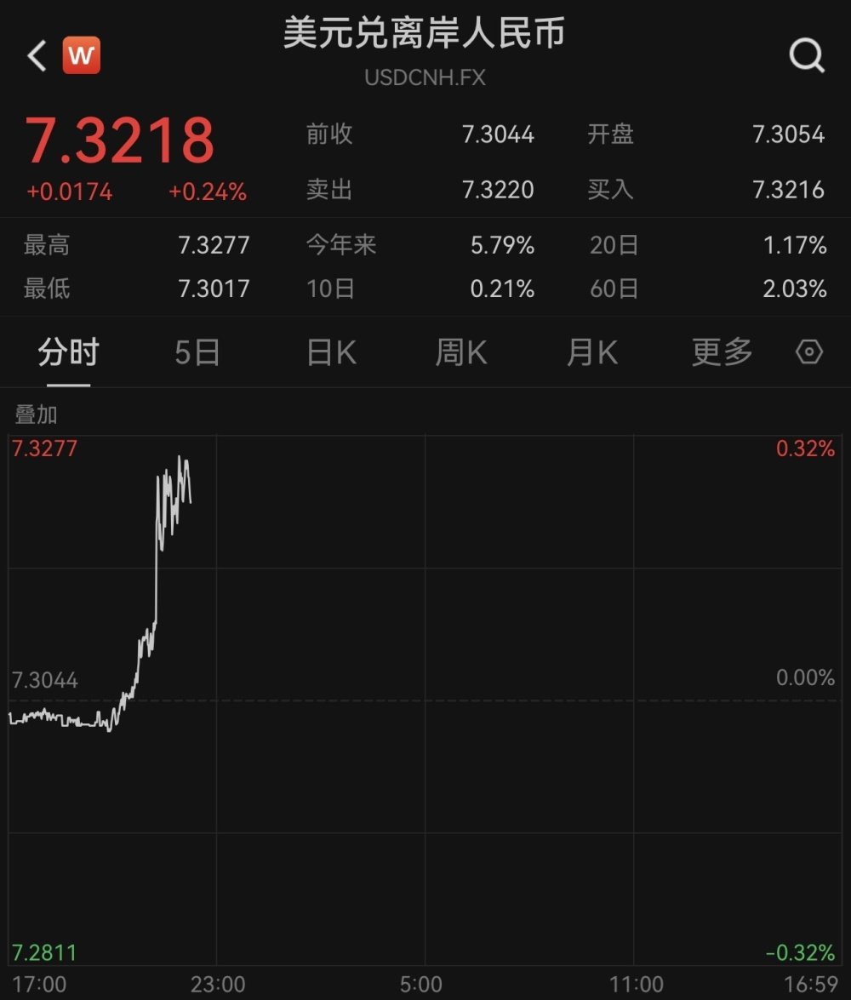

# 美元走强，在岸、离岸人民币对美元汇率双双跌破7.32

美元指数持续走强，带动人民币对美元汇率持续走低。

9月6日，人民币对美元即期汇率开盘跌破7.31关口，随后进一步跌破7.32，截至发稿盘中最低至7.3248，刷新去年11月初以来的盘中新低，随后，人民币对美元即期汇率又收复7.32关口。

更多反映国际投资者预期的离岸人民币对美元汇率同样跌破7.32关口，盘中最低至7.3277，较前一交易日下跌超过200点。

继前一交易日上涨0.67%后，反映美元对一篮子货币走势的美元指数9月6日继续走高，盘中一度触及104.88。

伴随美元指数连日走强，此前央行宣布下调金融机构外汇存款准备金率时带来的人民币对美元汇率升幅已经抹去。

9月1日，央行宣布于2023年9月15日起，下调金融机构外汇存款准备金率2个百分点，即外汇存款准备金率由现行的6%下调至4%。

中金公司指出，人民币汇率在9月或将继续面临较为复杂严峻的内外部环境，其中美元指数与美债收益率在9月明显回落的概率偏低，内部因素在9月将继续偏弱，但出现进一步恶化的可能性亦较低，因此认为人民币汇率或将在稳汇率政策的维持下继续处于磨底阶段，等待内外基本面条件出现积极变化后，回升行情或将开启。

