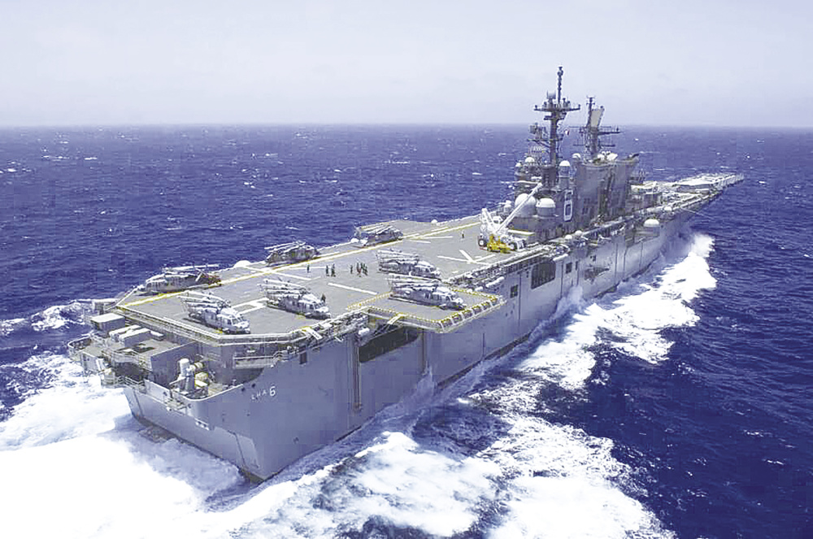

# 美国准航母编队罕见在黄海大规模演习！专家：以此“威慑中国”实在可笑

【环球时报特约记者 陈山 环球时报记者
郭媛丹】以参加在韩国举行的“仁川登陆73周年和美韩同盟建立70周年”纪念活动的名义，美国海军大张旗鼓地派出“美国”号两栖攻击舰编队前往朝鲜半岛海域。香港《南华早报》5日称，“美国海军预计将参加十年来在黄海海域举行的首次大规模演习”，可能进一步加剧美中之间紧张关系。对此，中国军事专家表示，美国想靠在黄海海域举行演习“威慑中国”，实在是可笑。

_“美国”号两栖攻击舰_

**“闪电航母”领衔**

《南华早报》援引韩国国防部官员和韩媒消息称，由“美国”号率领的美国海军两栖戒备群和加拿大海军“温哥华”号护卫舰，将参加在韩国举行的“仁川登陆73周年和美韩同盟建立70周年”纪念活动，并在纪念活动前后与韩国展开大规模联合两栖登陆演习。

据介绍，“美国”号两栖攻击舰属于美国海军新一代两栖攻击舰，也是专门为搭载F-35B短距/垂直起降隐形战机而建造的“闪电航母”，它取消了内部的坞舱以扩大机库，从而尽量多地携带F-35B战斗机。公开资料显示，“美国”号排水量超过4万吨，可以携带超过20架F-35B战斗机，战力超过了很多国家的轻型航母，具备参与空中与海上联合作战的能力。

近年来“美国”号两栖攻击舰频繁在西太平洋地区活动。就在8月23日，“美国”号领衔的美国海军编队，刚与日本“出云”号轻型航母和澳大利亚“堪培拉”号两栖攻击舰在南海举行大规模演习，日本共同社宣称该演习的目的就是“针对中国”。因此“美国”号刚结束南海演习，又马不停蹄地北上前往朝鲜半岛，其目的不言而喻。

《南华早报》称，美韩这次黄海演习的背景是美国总统拜登和韩国总统尹锡悦不久前承诺在朝鲜半岛“提高常规战略资产的可见性”。在朝鲜接连举行导弹试射，以及在中美紧张局势加剧之际，华盛顿最近增加了在黄海上空的空军活动。上周，美国在黄海进行了一次空军演习，出动了B-1B战略轰炸机，作为去年恢复的美韩年度联合演习的一部分。

报道援引韩国国家外交学院教授金贤旭的话声称，美国正在展示其遏制中国和朝鲜的意愿，其中包括通过与韩国和日本的三边合作来遏制中国。《南华早报》提到，上个月，美日韩在戴维营峰会上同意定期进行联合演习。

**十年来首次？**

《南华早报》称，美国海军在黄海进行的上一次重大行动是在2013年，当时美海军“华盛顿”号航母打击群在黄海与韩国进行了一场联合演习。自那之后，美国海军通常只以单舰或小规模舰艇编队的形式进入黄海，部分原因是为了避免中国方面的“强烈反应”。

报道还援引新加坡南洋理工大学拉惹勒南国际研究学院高级研究员科林·高的话表示，中国是黄海沿岸最大国家，外国军队在黄海海域进行军事演习“并不常见”。科林·高声称，美国海军在黄海进行大规模演习是“对中国的威慑信号”，或许意在提醒“美国能在中国所有近海投射力量”。韩国外国语大学中国研究所所长康荣埈表示，美国海军这一举动是应对朝鲜“核威胁”的“具体示范”，试图以此“展示美韩联盟的力量”。但他同时表示，中国反对美国这一军事动作也在“意料之中”。

黄海是一个半封闭的大陆架浅海，中国、朝鲜和韩国是黄海周边的主要沿岸国。《环球时报》记者注意到，对于美国航母进入黄海参加美韩军演，中国一直持反对态度。2010年美韩公布“华盛顿”号航母将参加美韩联合演习后，引发了中国非常激烈的抗议。中国外交部发言人多次表示，“坚决反对任何外国军用舰机在黄海以及其他中国近海从事影响中国安全利益的活动”。

《南华早报》提到的是“华盛顿”号航母2013年的那次演习，当年10月13日“华盛顿”号航母打击群和韩国海军的军舰在位于朝鲜半岛西部的海域进行了大规模演习。那次演习的海域位于黄海和东海海域。韩国军方官员当时表示，今后美国航母每年将访问韩国两到三次，每次都将举行相应联合海上演练。但在中国的反对之下，美韩对该演习的举行相当低调。

事实上，2016年10月，美国“里根”号航母也曾在黄海海域与韩国举行了一次大规模联合演习。美军官方新闻通稿称，这次联合军演课目包括了反潜和反水面舰艇、防空和反制水雷等多项操练。演习过程中，美韩两军假想了对朝鲜的核武器和导弹发射基地等重要设施发动攻击，确认了相互配合的作战步骤。但一直到演习接近结束时，美国海军才首次低调证实，“里根”号在演习期间确认进入了黄海，但并未公布该航母在黄海的具体位置。

**以此“威慑中国”的说法实在可笑**

朝鲜方面多次发声警告美韩军演。据朝中社今年6月15日报道，朝鲜国防省发言人当天通过该媒体表明立场，严正警告美国和韩国举行的“火力剿敌演习”，称朝鲜将坚决应对敌人任何形式的秀肌肉行动和挑衅。

中方已多次就美国在朝鲜半岛的军事动向做出回应。今年3月，中国外交部发言人曾就美韩举行联合军演一事回应称，我们对美韩军演动向表示严重关切，朝鲜半岛形势发展到今天症结是清楚的，有关方拒不回应朝方已采取的无核化措施，反而不断加强对朝施压威慑是主要原因。当前半岛形势高度复杂敏感，有关各方都应保持克制，多做有利于半岛和平稳定的事，而不是相反。

军事专家张军社5日对《环球时报》表示，“美国”号两栖攻击舰在黄海参加演习是近两年来美国在朝鲜半岛拱火系列动作的又一次升级。“自去年尹锡悦政府上台以来，美韩恢复了中断近五年的针对朝鲜的大规模实战演习。这次黄海演习是美在亚太地区为实现自己的地缘战略私利，制造地区紧张、挑动阵营对抗的最新举动，进一步表明美国是破坏地区和平稳定的麻烦制造者。”

张军社进一步说，但若因此得出结论认为，“美国”号两栖攻击舰在黄海举行的演习将对中国形成所谓的威慑，这种说法比较可笑。“进入黄海海域的敌对目标直接被覆盖在解放军空中、海上及岸防兵力多重火力打击射程之内，呈现出关门打狗的态势，任何海上目标都只能是解放军的活靶子，怎么能对中国形成威慑。不仅仅是在黄海，在台湾海峡也是一样，美国海上舰船的机动能力受限，他们希望通过这种炫耀武力的方式对中国形成威慑是一种自欺欺人的说法。”

