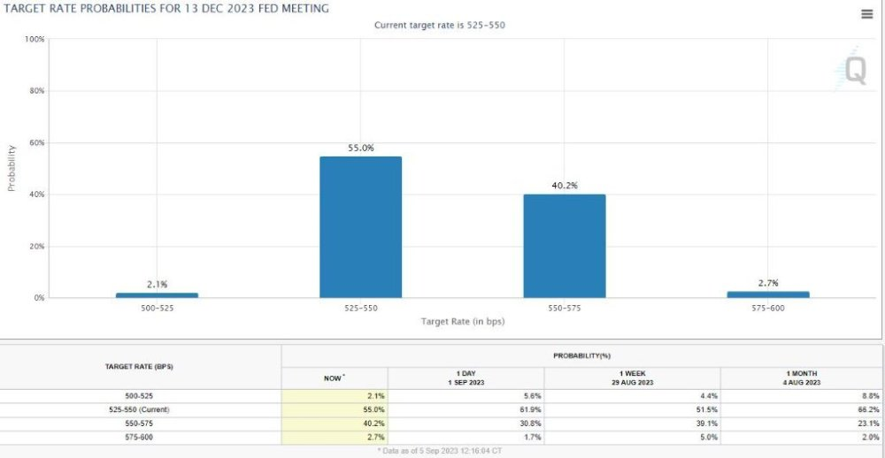
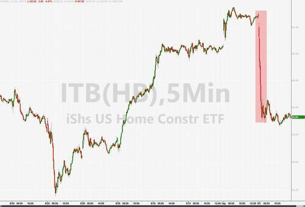
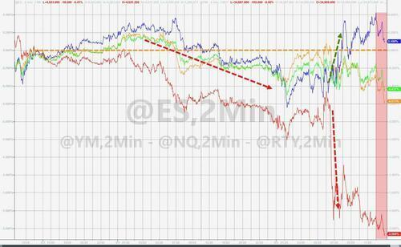
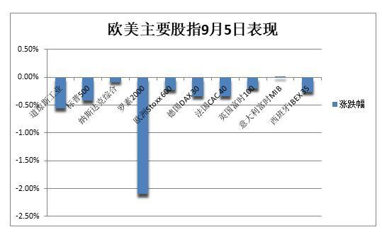
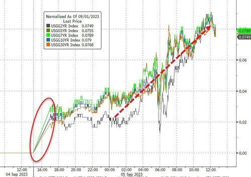
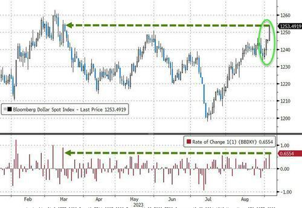
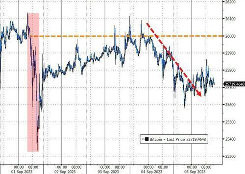
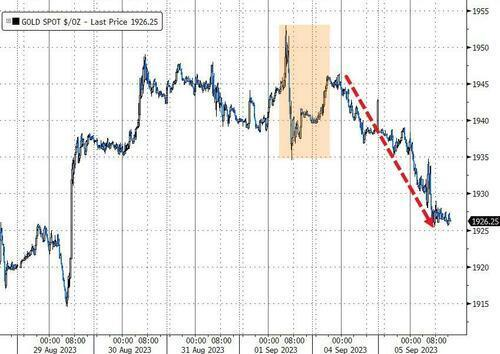

# 美股齐跌，小盘股、地区银行、中概指数跌2%，特斯拉涨4.69%

明年票委、克利夫兰联储主席梅斯特未言明9月会议上采取何种行动，但称美联储可能还需“略微进一步加息”。

在职期间的永久FOMC票委、通常被认定为鹰派的美联储理事沃勒称，上周利好数据“允许美联储得以谨慎推进，数据并不显示我们需要即刻采取任何行动”，似乎暗示9月不会加息，但他警告市场不要匆忙预测美联储已经结束加息行动。

市场认为美联储9月暂不加息的概率高达93%，即“板上钉钉”，11月1日宣布加息25个基点的可能性从一天前的33%升至42%，不过高盛最新研报预计美联储已经完成加息任务。

**经济数据方面**
，美国7月工厂订单环比下降2.1%，弱于预期的降幅2.5%，止步四个月连涨。其中耐用品订环比减少5.2%是主要原因，大部分由于运输设备订单降超14%。

继澳洲联储将政策利率维持在4.1%不变，为连续第三次暂停加息之后，欧洲央行首席经济学家莱恩、管委Visco都支持对政策路径“非常谨慎”，鹰派票委、德国央行行长称仍未实现通胀目标，当达到峰值利率之后，外界押注欧央行将迅速降息是错误的。

8月欧元区综合PMI进一步降至46.7至2020年11月来最低，连续三个月萎缩并低于初值47，其中占主导地位的服务业也陷入萎缩，这表明欧洲商业活动下降速度快于预期，增加衰退可能性。

PMI数据发布后，货币市场预欧洲央行9月加息25个基点的可能性从30%降至26%，年底前有60%的概率再加息一次。欧央行调查还显示，消费者对未来几年欧元区通胀的预期小幅上升。

道指跌近200点，特斯拉涨4.7%领跑标普，小盘股和地区银行指数跌超2%，瑞幸咖啡涨5%

9月5日周二，从美国劳工节长周末归来的美股集体低开低走，美债收益率上行令风险资产承压。道指最深跌200点，纳指午盘前几度尝试转涨，罗素小盘股跌超2%领跌主要股指。iShares美国住房营建商ETF
ITB跌4.6%至一周最低，抹去上周涨幅，因担心劳动力市场放缓和高利率。

 _美国住房营建商ETF跳水，抹去上周涨幅_

**不过，科技股更多的纳指100在午盘时收复0.5%的跌幅转涨**
，成分股爱彼迎涨超7%领跑，与涨3.6%的资管巨头黑石集团均将从9月18日起被纳入标普500指数。由于美股大盘指数受到大型指数基金的广泛追踪，分析认为这可能给两只个股在未来几周带来买入压力。

同时，标普能源板块追随油价而一度涨1.5%，油服巨头哈里伯顿、巴菲特青睐的西方石油，以及EOG
资源公司盘中等均涨3%，油服公司贝克休斯创去年6月来最高，菲利普斯石油徘徊2019年底来高位。航空股和邮轮运营商因油价上涨而承压下挫，盘中跌2%至4%不等。

截至收盘，道指、标普500指数和罗素小盘股均创一周新低，标普大盘失守4500点整数位关口，纳指小幅收跌，但与纳指100均徘徊8月初以来的五周高位：

标普500指数收跌18.94点，跌幅0.42%，报4496.83点。道指收跌195.74点，跌幅0.56%，报34641.97点。纳指收跌10.86点，跌幅0.08%，报14020.95点。纳指100张0.11%，罗素2000小盘股指数跌2.10%，“恐慌指数”VIX收涨1.30%至14。

 _道指、标普500指数和罗素小盘股均创一周新低，小盘股跌超2%_

标普11个板块多数收跌，原材料板块跌1.8%，工业跌1.7%，公用事业跌1.5%，金融、房地产、医疗保健板块跌超0.9%，可选消费跌近0.1%，电信服务涨近0.1%，信息技术/科技涨约0.4%，能源涨0.5%。

“大摩大空头”Michael
Wilson再发研报唱衰美股，称美国经济今年增长料将弱于预期，美股目前对经济增长重新加速的乐观情绪过高。美国银行、摩根大通的分析师都持类似看空观点，但高盛将美国衰退的可能性从20%下调至15%，该行另一组分析师则警告经济的好消息或对股市不利。

**明星科技股普涨**
，仅亚马逊跌0.6%。元宇宙”Meta涨超1%至三周高位，苹果抹去跌1%转涨0.3%，特斯拉涨4.7%，均徘徊一个月高位；奈飞涨2%至一个半月最高，微软涨1.5%至五周新高，谷歌A抹去0.8%的跌幅微涨，接近上周所创的去年4月来最高。

**芯片股齐涨。**
费城半导体指数跌0.8%后微涨，盘中一度升破3700点，接近上周五所创的一个月高位。英特尔涨0.3%，盘中曾创13个月最高，AMD转涨超1%至三周最高，英伟达跌超1%后小幅收涨，距离上周所创的收盘历史最高不远。

**AI概念股涨跌不一** 。C3.ai跌4%后转涨0.7%，Palantir
Technologies转涨0.2%，SoundHound.ai跌超2%至一周低位，BigBear.ai高开超5%后转跌0.6%，仍徘徊三周高位。

消息面上，高盛反驳人工智能泡沫观点，称板块基本面强劲且估值并不极端。ARM披露赴美上市定价区间，拟以每股47至51美元发行9550万股ADS，公司估值或520亿美元，将是今年最大科技类IPO。德国车企巨头宝马将使用亚马逊AWS云技术为新款电动汽车构建自动驾驶功能。巴克莱看好AI推动云业务，将甲骨文评级上调至增持，该公司股价涨2.5%至近三个月最高。

**热门中概追跌美股大盘。** ETF KWEB跌2.7
%，CQQQ跌2%，纳斯达克金龙中国指数（HXC）盘中跌3%后收跌2%，失守7200点脱离三周高位。

纳斯达克100成份股中，京东跌1.6%后转涨0.5%，百度和拼多多跌超2%。其他个股中，阿里巴巴跌0.4%，腾讯ADR跌1%，B站跌超2%，蔚来汽车跌1.7%，理想汽车跌约6%，小鹏汽车涨6%后收涨0.2%。瑞幸咖啡收涨5%，盘前曾涨超7%，其咖啡酱香拿铁单品首日销量突破542万杯、销售额突破1亿元，刷新公司单品纪录。

**银行股指失守两周半新高。**
行业基准费城证交所KBW银行指数（BKX）跌0.9%，5月4日曾创2020年10月以来最低。KBW纳斯达克地区银行指数（KRX）跌2.5%，5月11日创2020年11月来最低；SPDR标普地区银行ETF（KRE）跌2.3%，5月4日创2020年10月来最低。

此外，投资者担心出售前景，曼联ADR最深跌近22%创美国IPO以来最大跌幅，收跌超18%至三个月最低，周末有报道称，由于潜在收购方所给报价没能满足曼联所有人的要价，Glazer家族可能会将这家俱乐部私有化。

欧股普跌仅意大利股指涨，泛欧Stoxx
600指数收跌0.23%，连跌五日至一周低位，建筑、化工与奢侈品类股齐跌超1%，受主要经济体放缓的拖累，能源板块随油价涨超1%。德法两国股指收跌超0.3%，意大利银行指数跌约1%。

两年与10年期美债收益率齐涨10个基点至一周高位，欧债收益率创两周新高

油价上涨或加剧通胀担忧，也令欧美央行“在更长时间内维持更高利率”的观点深入人心，带动欧美国债收益率和美元指数持续上行。投资者还关注美国公司债供应情况。

对货币政策更敏感的两年期美债收益率最高涨10个基点至4.97%，收复上周二以来过半跌幅。作为“全球资产定价之锚”的10年期基准美债收益率也涨10个基点至4.27%，至8月25日以来盘中最高。

_两年与10年期美债收益率齐涨10个基点_

欧债收益率创近两周高位。欧元区基准的10年期德债收益率尾盘涨超3个基点，两年期收益率涨2个基点。10年期法债和西班牙国债收益率均升近4个基点，负债较深外围国家基准的10年期意债收益率升超5个基点。两年与10年期英债收益率则涨超6个基点。

沙特与俄罗斯延长供应限制政策，油价涨超1%至十个月新高，布油站上90美元

受OPEC+两位“老大哥”沙特和俄罗斯超预期延长石油供应限制措施到年底的消息提振，油价齐创10个月最高。WTI
10月原油期货收涨1.14美元，涨幅1.33%，报86.69美元/桶。布伦特11月期货收涨1.04美元，涨幅1.17%，报90.04美元/桶。

美油WTI最高涨2.48美元或涨2.9%，一度升破88美元，国际布伦特最高涨2.14美元或涨2.4%，自去年11月以来首次升破90和91美元两道关口，均创去年11月13日以来盘中最高。

_油价涨超1%至十个月新高，布油站上90美元_

俄罗斯将把30万桶/日的石油出口削减措施延长至12月底，沙特将把100万桶/日的自愿减产计划延长至12月底，但均将按月进行策略审查，不排除根据全球市场情况深化减产的可能性。

有分析称，两国将自愿供应限制措施延长三个月超过市场预期，投资者担心冬季需求高峰期间可能出现供应短缺，瑞银称四季度的市场缺口将超过150万桶/日，布油年底或涨至95美元。

此前，美国经济有望避免严重衰退的前景帮助提振了石油需求和价格，布油自6月底沙特首次宣布自愿减产以来累涨约26%，即月期货较六个月期货的溢价升破每桶4美元，也为10个月最高，现货溢价表明即时交割的供应紧张。

**与此同时**
，美国加油站汽油售价创逾十年来新高，加重了对通胀可能反弹的担忧。欧洲基准的TTF荷兰天然气期货，以及ICE英国天然气期货尾盘均涨超4%，但美国天然气跌6.6%。

美元近六个月最高，日元十个月最低，离岸人民币一度跌穿7.31元，比特币徘徊逾两月低位

衡量兑六种主要货币的一篮子美元指数DXY最深涨0.6%至104.91，连涨三日至3月中旬以来的近六个月最高，部分受益于担心全球其他经济体的避险需求，美元兑G10货币全线走强。

_美元近六个月最高，单日涨幅创3月份以来最大_

欧元兑美元跌0.8%并一度下逼1.07关口，至三个月最低。英镑兑美元最深跌超90点或跌0.7%，失守1.26，创两个半月低位。

日元兑美元跌0.9%重新失守147，澳元兑美元跌1.4%，均刷新去年11月来最低。离岸人民币一度跌穿7.31元，较上日收盘最深跌超360点，至两周低位。

此外，土耳其里拉兑美元短线拉升，银行股指一度涨3%，世界银行可能把向土耳其提供的融资规模增加一倍至350亿美元。

主流加密货币涨跌不一。市值最大的龙头比特币跌0.7%至2.57万美元，至6月中旬以来的两个半月最低。第二大的以太坊小幅转涨并升破1630美元，仍徘徊五个多月低位。

_比特币失守2.6万美元至两个半月最低_

现货黄金跌穿1930美元至一周低点，担心供应短缺，原糖期货盘中涨超4%至近两年最高

美债收益率和美元携手上涨压低金价。COMEX 12月黄金期货收跌0.06%，报1965.90美元/盎司。期银跌2.8%并进一步远离24美元整数位。

现货黄金最深跌13美元或跌0.7%，失守1930美元整数位，抹去上周二以来过半涨幅，现货白银最深跌超2%创一个月来最大跌幅。

有分析称，全球经济增长放缓最终将对金价有利，“但只有当市场对美国衰退风险更加怀疑时，这种情况才会发生”。金价跌穿50日均线关键技术位，将令其继续回调至1920美元。

_现货黄金跌穿1930美元至一周低点_

**伦敦工业基本金属涨跌不一。**
经济风向标“铜博士收涨0.4%，收复上周五以来过半跌幅。伦铝跌0.9%并失守2200美元，至近一周低位。伦锌盘中创一个月新高后尾盘小幅收跌。伦铅小幅收涨，接近上周所创的七个多月最高。伦镍微跌但站稳2.1万美元上方，伦锡小幅涨至近四周高位。

原糖期货盘中涨4.4%上逼27美分/磅，创2011年10月份以来新高，全球最大食糖贸易公司嘉吉（Alvean）担心下一个贸易年度糖市场面临540万吨供应缺口，将是连续第六年出现供应短缺。

此外，内盘期货夜市普遍收涨，燃油涨3.8%，低硫燃油涨超2.5%，LPG涨2%。热卷夜盘微跌，焦炭跌0.4%，乙二醇、PVC、甲醇至多跌0.5%。

