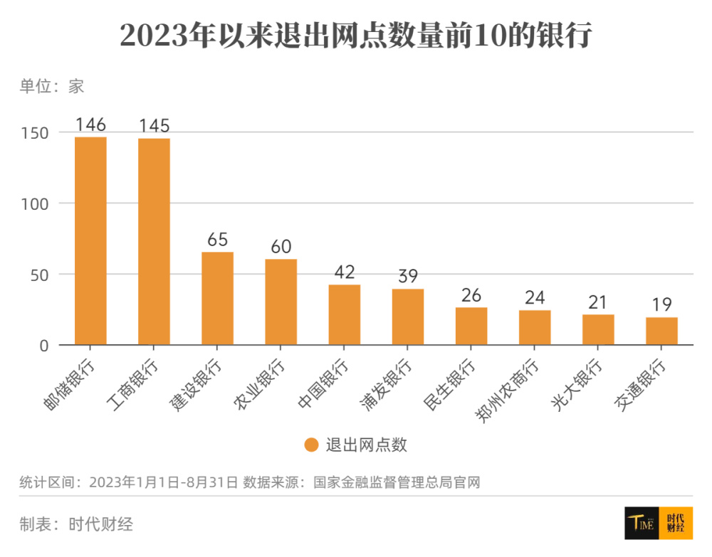
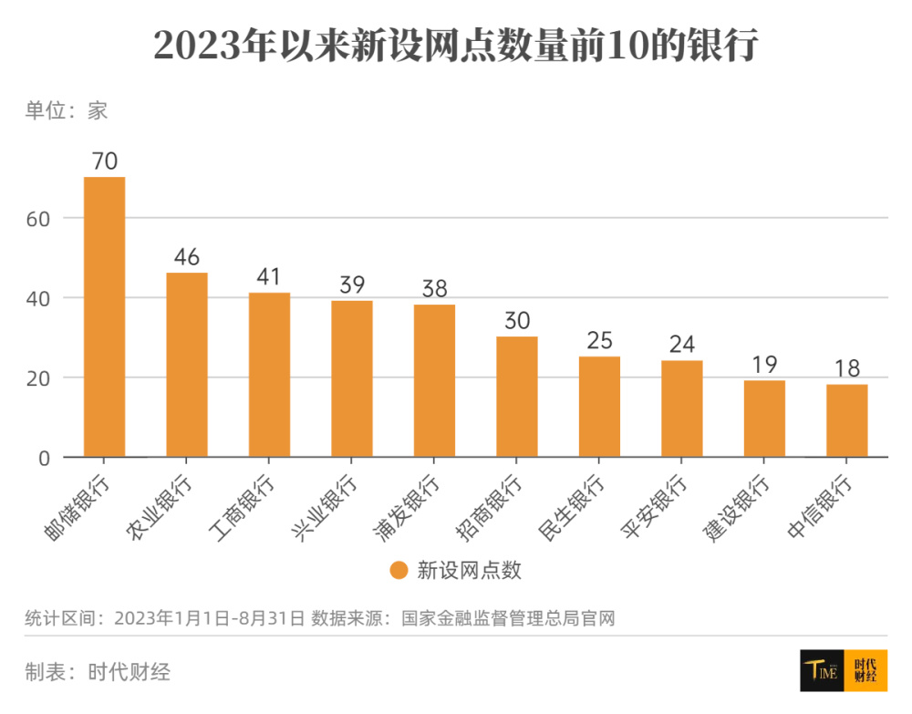
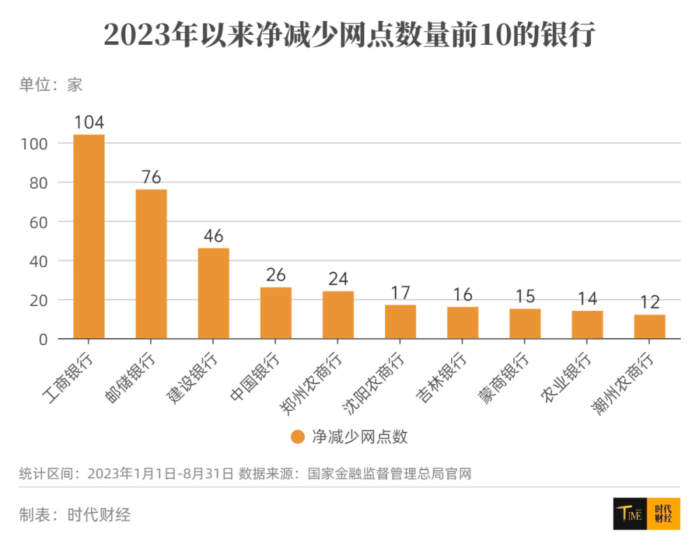
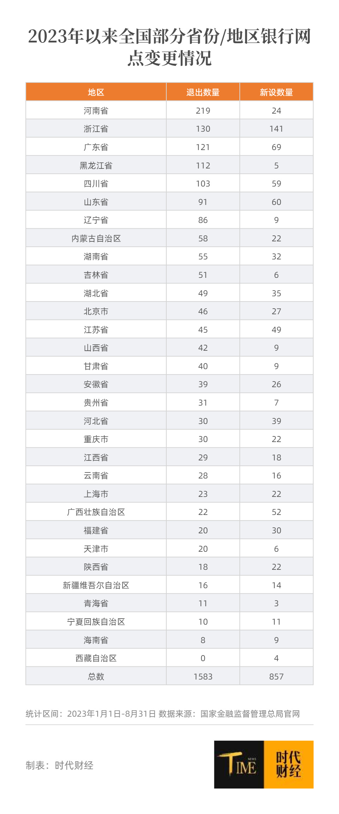

# 银行网点年内“消失”超700家：国有大行收缩，河南撤闭最多

本文来源：时代财经 作者：张昕迎 张汀雯

广州海珠区地铁换乘最频繁的站点之一客村，热闹非凡、人流如织。在经营了近30年后，客村附近的交通银行上渡路支行却在这片繁华地带悄然关闭了。

“听说是这里租金太贵了，整个支行都合并搬迁到了附近的另一个网点。”8月11日，在交行上渡路支行附近上班的一名工作人员告诉时代财经。

根据国家金融监督管理总局官网金融许可证信息查询系统显示，交通银行上渡路支行设立于1994年，退出日期为2023年4月28日。

8月11日，时代财经探访发现，该网点处于停业状态，门面招牌等均被摘下。不过自4月份至今，门面仍未租出。

近年来，伴随着金融机构全面推进数字化转型，不少商业银行正在撤并网点，进行相应的升级改造。

根据国家金融监督管理总局官网披露的数据，时代财经对2023年以来（截至8月31日）退出的银行网点（包括支行、分理处、服务点、储蓄所、营业所，不包括村镇银行与信用社）进行了相关统计。

从总数上看，2023年以来，全国商业银行退出网点数量约达到1583家，同期新设网点数量约为857家。若按此简单相减，则2023年以来全国“消失”的银行网点约726家。

_这里曾经是交通银行广州上渡路支行。时代财经/摄_

**国有大行撤点数量较多**

“这家支行关闭之前，平常来这里办业务的人也不少，不过老年人居多。”8月11日，时代财经探访交通银行广州上渡路支行时，停车场保安亭内的一位工作人员如是说。

时代财经在该网点附近走访发现，工商银行、建设银行、中国银行、农业银行等国有大行均有支行分布，平安银行、广发银行、广州银行等支行也一应俱全。“这附近的几家银行都开了很久，中国银行是最早的。”上述工作人员表示。

这片区域位于广州海珠区的闹市，车流、人流量都较大。除交行网点撤闭、工行网点正处于装修之外，上述其余几家大行的网点均处于正常营业状态。

事实上，在网点撤并过程中，国有大行“瘦身”最为明显。

据QuestMobile数据，截至2023年4月，我国金融行业APP月活用户突破9亿户大关，其中手机银行用户突破4.91亿户，国有大型商业银行优势明显，总体规模达到4.16亿户，工行、农行、建行活跃用户均突破1亿户大关。

这或许也意味着，数字化对于线下银行网点造成了一定的冲击。

时代财经根据国家金融监督管理总局官网披露的数据统计得出，2023年以来（截至8月31日），邮储银行与工商银行撤点最多，分别为146家和145家；其次则是建设银行、农业银行，分别为65家与60家。

不过同期，邮储银行新设70家网点，主要集中在广州、北京等地；农业银行、工商银行新设网点数量均超40家，在湖北、天津、沈阳等地区均有分布。此外，浦发银行退出39家、新设38家；民生银行退出26家，新设25家，退出与新设数较为均衡。

根据时代财经统计数据，2023年以来（截至8月31日），工商银行净减少网点数量达到104家，其次是邮储银行、建设银行、中国银行，分别净减少76、46、26家。

除了实体网点，ATM、自助银行等设备同样有所缩减。

时代财经走访发现，同样位于广州客村区域的交通银行新港支行的自助银行自今年6月起便暂停对外营业。该网点张贴在门口的公告显示，“为配合我行自助银行环境维护、提供更优金融服务，如您有业务需求，请移步至附近交通银行自助银行办理。”

以建设银行为例，根据财报数据显示，2020～2022年，该行在运行自助柜员机分别为79144、69030、56943台。

此前，时代财经根据央行历年数据梳理报道，银行ATM机在2018年～2021年呈现连续三年下降趋势，数量由2018年末的111万台降至2021年末的94万台左右，减少17万台，降幅达15%。

**河南省今年以来退出网点超200家**

全国范围内来看，各省/地区的银行机构均有收缩，但退出幅度各不相同。其中，退出数量最高的地区为河南省，高达219家；浙江省、广东省、黑龙江省与四川省均在100家以上。

同期，新设网点情况也有所差异。浙江省虽然退出数量达130家，但同时新设达到141家，净增加数量在统计的省份中居前。

具体看退出情况，河南省退出的219家银行网点中，有185家都来自地区农商行，如郑州农商行、许昌农商行、周口农商行、汝州农商行、三门峡农商行等，占比高达84.47%。

浙江省退出的网点中，邮储银行占比30家，中国农业银行占比18家，分别占浙江省退出网点总数的23.08%和13.85%。不过，这两家国有行在浙江退出的网点主要是各乡镇金融服务点。

邮储银行在四川退出的网点也较多，达到28家，占到四川省撤点总数的27.18%。

广东省与河南省的情况相似，撤点机构多为地区农商行，如潮州农商行、广州农商行、高州农商行、顺德农商行等，共计68家，占比达56.20%。

**撤点并非“倒闭”**

不过，撤点并非“倒闭”，多数情况下是与其他网点进行合并。

“（撤掉的）基本上都是搬走、合并，搬到别的地方去了”，8月11日，工商银行广州丽影华庭支行的一名工作人员告诉时代财经，“银行的现金业务、需要人脸识别的业务还是需要柜面来做，而且高龄一点的老人家多数都会选择到柜台。”

伴随着数字化经营的进一步深入，如何优化网点布局建设，已经成为了各大银行的重要命题。

建设银行在2023年半年报中提到，今年上半年，该行加大城区低效密集网点撤并、迁址力度，实施营业网点迁址93个；工商银行2023年半年报显示，截至今年6月末，该行机构总数为16411个，比上年末减少45个。

事实上，收缩的苗头在几年前就已经显露。

以几家国有大行为例，2020年～2022年，工商银行营业网点总数分别为15800个、15767个、15639个；邮储银行分别为39631、39603、39533个；建设银行营业机构分别为14741、14510、14356个，均呈下降趋势。

网点的优化也间接影响人员的融合。邮储银行在2023年半年报中表示，该行持续提高网点运营数字化水平，推广网点柜员、大堂经理岗位融合，已有超30%自营网点实施融合。

不过上述工商银行工作人员告诉时代财经，网点撤并对原有员工的影响不大，“银行员工在网点之间的流动性本来就较大，（撤并以后）会调动到别的网点去。”

对于网点优化升级方向，工商银行在2023年半年报中提到，在网点总量规模保持稳定基础上，聚焦国家战略区域，持续加强网点资源投入及服务供给，上半年完成251家网点优化调整，其中近六成投向国家重点区域，新增覆盖宁夏、云南等地空白县域，网点资源与地区社会经济资源匹配度稳步提高。

