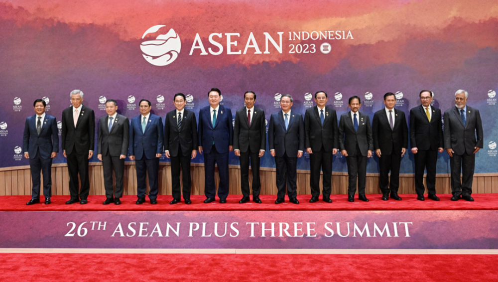
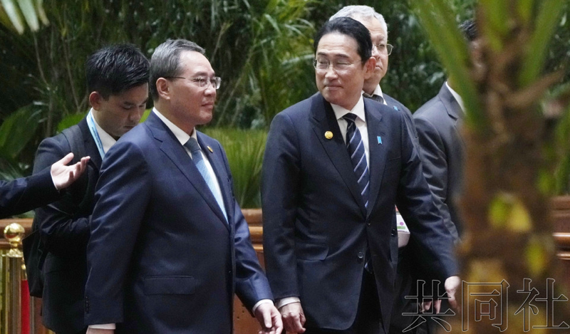

# 与日本首相岸田文雄首次碰面，李强当面敦促日本“负责任”

当地时间9月6日下午，第26次东盟与中日韩（10+3）领导人会议在印度尼西亚雅加达举行。这也是中国国务院总理李强3月上任以来，与日本首相岸田文雄首次碰面。

据共同社报道称，岸田在会前与李强站着进行了短暂交谈，就核污水排海表明日方立场，并强调构筑建设性且稳定的日中关系的重要性。报道指，这是两人首次碰面。中国强烈反对排海，双方不同立场再次凸显。

事实上，国务院总理李强在出席第26次东盟与中日韩（10+3）领导人会议时，就日本福岛核污染水排海问题再次阐明中方立场，表示核污染水处置关乎全球海洋生态环境和民众健康，日方应该忠实履行自己的国际义务，同邻国等利益攸关方充分协商，以负责任方式处置核污染水。

而据日媒报道，岸田文雄此次出席10+3领导人会议并计划与各国领导人举行双边会晤，就核污水排海一事，想亲自说明“符合国际安全标准”并寻求理解，防止这些国家和中国一样，对日本水产品实施禁令。

_图源：新华社_

岸田在会上就核污染水排放发言称，将基于科学依据，保持高透明度，向国际社会细致说明。他提及国际原子能机构（IAEA）发表了认为“核污水排海对人类和环境的影响程度可忽略不计”的综合报告，强调“从科学角度来看，未发生任何问题”。

日本共同社在报道中，特意点出李强总理在会上将日本所谓的“处理水”称作“核污染水”，而在6日举行的外交部例行记者会上，日本经济新闻记者也在提问中表示，中国将“处理水”称作“核污染水”，妄称“这一主张未能得到国际社会认可”。

对此，发言人毛宁对“核污染水”的称呼给出了清晰解释。她表示，是日方发明了“处理水”这个名词，反复宣传氚的浓度没有异常，营造核污染水中只含有氚，氚的浓度达标，所以核污染水安全的假象，这种偷换概念的做法蒙蔽不了国际社会。毛宁指出，“事实上，福岛核污染水的成分复杂，即使是经过净化，仍然含有碳14、钴60、锶90、碘129、铯137等几十种放射性核素。不管怎么称呼，都不会让核污染水中的核放射性核素消失，这个日方需要正视。”

中国现代国际关系研究院东北亚研究所副研究员徐永智对深圳卫视直新闻表示，岸田此次在雅加达的说明并不会有很好的效果，只要日本不与利益相关方真诚沟通，不诚恳的接受国际社会的监督，目前所做的一切都是无效沟通。“必须指出两个事实，第一，按照日方的数据，ALPS系统非常不可靠，到目前为止，福岛的罐子里所储存的核污染水有66%，除了氚之外的核素仍然是超标的。第二，日方在排放之前，它们的监测实际上没有得到第三方的认证，他们试图用IAEA去背书，但IAEA只是确认日方有这样的技术能力，而不是确认罐子里的水在排放之前真的没有其他核素超标。”

中日关系或将持续低位运行

不仅是在排放核污染水问题与中国有分歧，日本近日还对中国新版地图提出所谓的抗议声明。据日本共同社报道，日本官员松野博一就中国新版地图发表声明称，指责其中把钓鱼岛列为中国的领土，并且表示已经通过外交渠道向中方提出抗议。

对此，中国外交部发言人毛宁6日表示，钓鱼岛及其附属岛屿是中国固有领土，中国的地图将钓鱼岛标为中国领土是理所当然的。中方不接受日方所谓的抗议。

徐永智认为，日本频频抗议中国，背后藏着丑化中国，在国际上塑造中国霸道形象的险恶用心。尽管雅加达创造了中日对话的条件，但眼下诸多问题短期内无法得到解决，政治安全和经济领域内也有诸多分歧。

徐永智指出，日本长期以来对中国搞“麦克风外交”，2022年末还出台了新的国家安全战略，把中国定位为“前所未有的最大战略挑战”。日本和台湾当局之间的往来也非常热络，前一阵自民党副党首麻生太郎窜台，在台湾发言表示支持“日美台”开展安全合作的荒谬言论，直接挑战中日关系底线。经济上日本选择追随美国，搞实质性高技术的对华封锁，包括限制中国对日的一些投资。这些助推世界阵营化的做法，也会影响中日和东亚地区合作的氛围。

值得注意的是，李强在第26次东盟与中日韩领导人会议就指出，国家之间出现分歧与争端，有时是因为认知有偏差，有时是因为利益有摩擦，有时是因为外部有干扰，关键是要正视问题、消除误解、管控分歧。正视问题，才能解决问题，鸵鸟政策只能使问题愈加严重；消除误解，最有效的办法是加强沟通交流，以真诚沟通增进理解和信任；管控分歧，当前很重要的就是要反对选边站队、集团对抗和“新冷战”，妥善处理国家间的分歧和争端。

外界分析认为，李强此话有不点名批评日本的意味。徐永智也表示，“东盟峰会并不是一个解决双边问题的论坛，所以中日关系很难通过峰会得到和缓，预计未来的中日关系很可能还是保持低位运行的状态。”

作者丨丁舒航，深圳卫视直新闻驻京记者

编辑丨刘立平，深圳卫视直新闻主编

**更多报道：**

[外交部：李强总理在雅加达应约与岸田文雄简短交谈](https://new.qq.com/rain/a/20230907A06BLV00)

