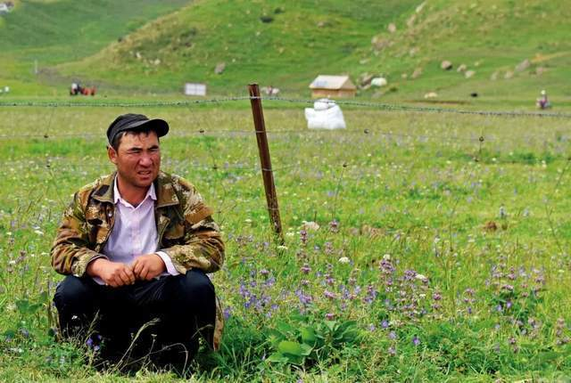
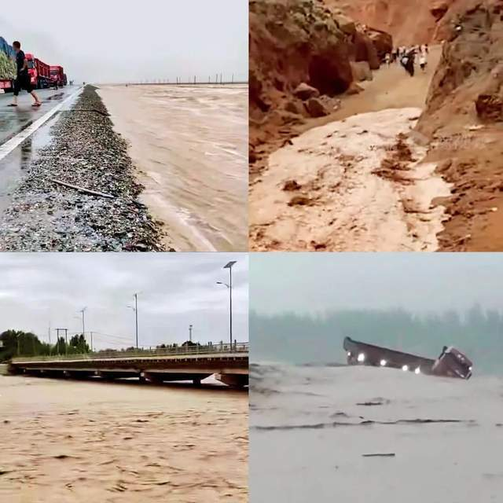
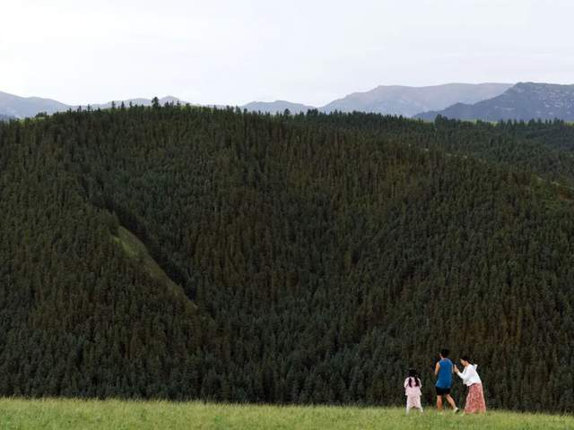
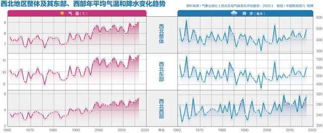
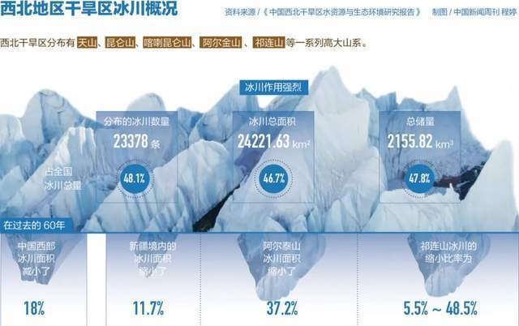
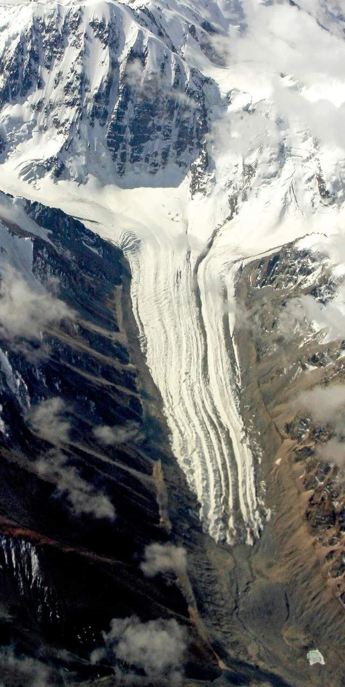
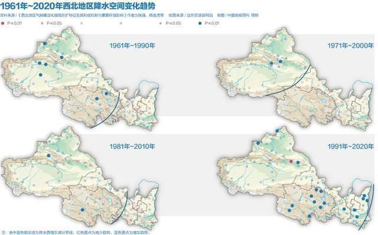
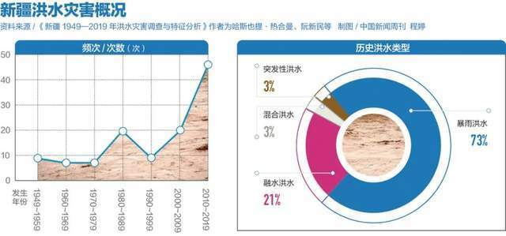
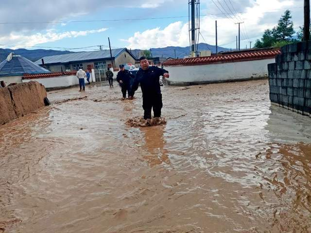
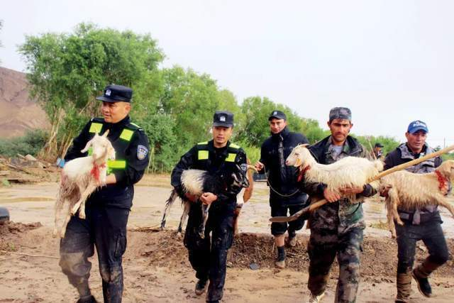

# 加速的西北暖湿化：荒漠会变成江南吗？

315国道，南疆最孤独的大漠公路，从新疆的喀什起，沿昆仑山脉，横穿塔克拉玛干沙漠，跨越罗布泊，途经叶城、和田和若羌，到达西宁。今年7月13日，该国道若羌至且末段却被洪水侵袭。

7月10日至13日，新疆天山山区、和田地区和巴州等地下了一场大暴雨，暴雨中心就在巴州若羌县瓦石峡镇。最近几年，每到夏季，受极端暴雨影响，315国道沿线乡镇时常遭遇山洪，洪水漫过大桥、冲毁路面，导致交通中断，沿岸的大片枣树也被淤泥淹没。

中国西北地区，是对全球气候变化最敏感的区域之一。西北深处欧亚大陆腹地，行政区域上包括新疆、青海、宁夏、甘肃和陕西五省（自治区）；地形复杂，横跨青藏高原北部、塔克拉玛干沙漠、柴达木盆地、河西走廊和渭河平原。中国西北也是全球同纬度最干旱的地区之一，生态环境脆弱。

_甘肃张掖市，接近傍晚时分，放牧人在祁连山的低山地带赶羊。摄影/本刊记者 霍思伊_

全球变暖背景下，西北地区的气温正以全球平均升温水平两倍的速率上升，降水量也以9.32毫米/10年的速率呈增加趋势。今年7月，中国气象局最新发布的《中国气候变化蓝皮书（2023）》显示，2005年以来青海湖水位连续18年回升，天山乌鲁木齐河源1号冰川等均呈现加速消融趋势，青藏公路沿线多年冻土退化趋势明显。近两年，关于西北地区“沙漠变绿洲”的消息也屡屡登上热搜。

2002年，中国科学院院士、中国冰川学奠基人施雅风最先注意到西北“暖湿化”的信号。已有多项证据表明，过去40多年，西北地区确实在向着暖湿化转变，且暖湿化的范围在向东部扩展。近十年来，西北地区变暖变湿的程度在明显加速。这给该地区气候变化应对、水资源管理和防灾减灾提出新的挑战。

**草原更绿、生物更多样**

8月的塔格拉克平台子牧场，吹过的风都是绿的。当地人认为，这是整个南疆地区最好的一块牧场，在行政区划上属于新疆阿克苏地区温宿县柯柯牙镇塔格拉克村（以下简称塔村）。塔格拉克，在维吾尔语中意为“四面环山的地方”，但这里横亘的山不是一般的山，是“天山的屋脊”托木尔峰。它是天山山脉的最高峰，海拔7443.8米，新疆的“母亲河”塔里木河最主要的河源——阿克苏河就发源于此。

当海拔下降到2500米，在托木尔峰南坡向塔里木盆地过渡的绿色褶皱里，自然条件优越的平台子牧场就镶嵌于此。如果要考察西北地区近几十年的暖湿化现象，这里是一个最好的起点。

塔村牧民亚尔买买提今年34岁，他个子不高，双颊晒得黑红。这里的天空高阔而舒朗，阳光不用穿过厚厚的云层，就能直射着雪山、草原与羊群。2013年以来，亚尔买买提明显感觉到，太阳变得更毒了，高温持续时间在拉长，羊比人更快感受到气候变化。这片草原上活跃着的高山细毛羊和绒山羊以运动量大著称，但每当遇到高温天气，它们就食欲骤减，只想一动不动地趴在石头下面“防晒”。

_新疆阿克苏地区温宿县，34岁的塔格拉克村牧民亚尔买买提坐在平台子牧场的草地上。这一带的草地里长有许多紫色的糙苏花。摄影/本刊记者 霍思伊_

天气变暖的同时，对西北干旱区的牧场而言，降水是一个更关键的主导因素。“因为雨水多了，草就长得好，羊就吃得好。”新疆塔格拉克生态农业有限公司经理图尔荪·图木尔对《中国新闻周刊》解释说。相较高温，亚尔买买提对当地降水增加的感受更深，他说，近十年来，夏季雨水总体在变多，牧草更加繁茂和优质，最明显的变化体现在草的高度上。“十年前，草差不多只有20厘米高，现在的草长得比以前要高40厘米，有的已经高过膝盖了。”亚尔买买提说。

温宿县草原工作站提供的一组数据印证了他的观察：2014年，温宿县的综合植被盖度约为35.4％，到2022提升到39.2％。这是反映草原植被覆盖率和一定范围内牧草生长浓密程度的最直观的指标。草原变得更绿了，这是西北暖湿化最显而易见的信号。“十年前那片山坡还是黄的。”站在平台子禁牧区的围栏前，图尔荪指着不远处的山坡说道。

时值盛夏，刚下过雨的草叶上还浸着水汽，在阳光的折射下闪着彩色的光。在墨绿的云杉群下，是一片苍郁的绿色和漫山的紫色小花，这种花叫糙苏，常生长于新疆的草坡上，根须粗厚，一簇簇的伞状紫色花朵聚拢在一起，边缘处有细密的绒毛，点缀在牧草间。在图尔荪看来，这是暖湿化给当地草原带来的另一个重要变化：生物多样性的增加。2022年9月，托木尔峰国家级自然保护区内还发现了一个新物种：曹氏紫鄂藓。苔藓类植物对湿度非常敏感，暖湿化更易激发藓类的生长。一个月后，在阿克苏地区的库车市大龙池，还发现了一只正在觅食的赤狐。不过，图尔荪也指出，当地草原生态的向好是在人类干预与气候变化的双重作用下，禁牧政策扮演了重要角色。

据新疆气象局提供的数据，2001~2022年与1961~2000年相比，新疆区域平均气温上升了1.0℃，平均降水量增加了25.0毫米，增幅达16.1％。近十年，全疆夏季降水量增幅最大，南疆增幅接近15％，暖湿化趋势明显。

_左上：315国道若羌至且末段遭洪水侵袭。右上：新疆库车天山大峡谷突发山洪，游客紧急逃生。
左下：流经和田河的洪水。右下：新疆叶城县大雨后，卡车在柯克亚乡被卷入洪水。（视频截图）_

**西北暖湿化的成因是什么？**

中国工程院院士、国家气候变化专家委员会顾问丁一汇对《中国新闻周刊》解释，一方面，大西洋暖洋流自20世纪80年代开始增强，通过海气相互作用，使西风环流将更多暖湿气流带到中国西北；另一方面，受全球变暖影响，北极变暖，北极的冷空气不断南下，形成了东风，来自北极和太平洋的多种水汽源从东向西一路带到西北地区。

因此，西北暖湿化是全球气候变化引起的区域性结果。中国气象局原副局长宇如聪很早就关注到西北暖湿化问题。他对《中国新闻周刊》说，研究发现，华北的很多降水过程可以追踪到祁连山区，全球变暖让整个西风带的震荡加剧，使水汽的传播从西向东具有更强的连通性。“为什么我们都要关心西北暖湿化现象，因为西北地区的大气系统异常也可能影响到东部。”

**暖湿化不能让西北变江南**

谈论西北暖湿化时，常为人所忽视的一个问题：气温、降水在数字上的增加究竟意味着什么？

仅在阿克苏地区内部，暖湿化的表现就有明显的区域分化。阿克苏地形很复杂，北部是天山山脉南麓，分布有大量水源涵养林；中部则是山前的倾斜平原和冲积平原区，南部是塔河流域及其沿岸绿洲，也是阻挡沙漠北移的一道生态屏障；再往南，就是中国最大的沙漠塔克拉玛干沙漠。

这种多元的地形共同组合成西北干旱区最典型的生态系统：以山地-绿洲-
荒漠复合为基本特点。阿克苏地区林业发展保障中心高级工程师张志军对《中国新闻周刊》说，在山区与平原交界的前山地带，是近十年来植被盖度增加最明显的区域。从山上下来一点，在新疆新和县西南部、柯坪县阿恰镇以南区域，分布有大量温性荒漠草原，但草场退化严重，“虽然也受到气候暖湿化的影响，植被的改善并不明显”。

阿克苏地区林业与草原局提供的2022年监测结果显示，在阿克苏地区，温性荒漠类草原植被盖度最低，仅为17.09％。阿克苏地区草原工作站谢元元对《中国新闻周刊》解释说，在阿克苏的5100余万亩草原中，荒漠草原就占了60％左右，植被以旱生或者超旱生为主，群落结构单一，植被年生长量受降雨影响波动大，对气候变化非常敏感。“暖湿化并没有从根本上改变当地生态系统的这种脆弱性。”

_甘肃张掖市肃南裕固族自治县，康乐草原上的九排松是著名的旅游景点，从草原看过去，能看到对面的山坡上有九排松次第排列。摄影/本刊记者 霍思伊_

实际上，阿克苏北部所处的天山南麓，是最早被视为存在暖湿化转型信号的区域。21世纪初，施雅风在2003年3月发表的论文《中国西北气候由暖干向暖湿转型的特征和趋势探讨》中划出一片“显著转型区”，包括新疆北部、天山及其两侧地带、祁连山及其北侧中西段地区等地。

在另一片对暖湿化响应同样敏感的区域：祁连山脉北侧，甘肃省祁连山水源涵养林研究院研究员敬文茂已经在这片山区做了近五十年的生态环境监测。沿着河西走廊从西向东，敬文茂统计了祁连山北麓及其附近地区1965年~2018年的气象数据，具体行政区包括嘉峪关、酒泉、张掖等地，流域覆盖发源于祁连山的三大内陆河水系：疏勒河、黑河和石羊河。

结果发现，可以在张掖-
高台划一条分界线，以东是“快速暖湿”区，包括山丹、民勤、张掖等地；以西是“缓慢暖湿”区，以玉门镇和酒泉为中心，在河西走廊最北端、东接阿拉善沙漠的马鬃山呈“暖干”趋势。也就是说，祁连山北麓及其附近地区的暖湿趋势，由南向北，由东向西递减。

总体而言，暖湿化对祁连山区植被的影响是积极的。通过连续数十年的监测，敬文茂敏锐观察到，上世纪80年代，气候暖湿化转型前，祁连山的建群种青海云杉每年大概生长10厘米左右，但现在，这种寿命很长的树种每年能长高12~13厘米。除了植被盖度，植物净初级生产力是另一个评估植被生态质量和生长状况的关键参数，可以反映植物在自然条件下的生长潜力。祁连山青海云杉的净初级生产力原本多年一直维持在一个较为恒定的值，但暖湿化转型后，它的净初级生产力在逐年上升。

2018年，中国科学院西北生态环境资源研究院发布的《祁连山生态变化评估报告》指出，近57年来，祁连山区的气温和降水分别以0.35 ℃/10年和14.
7毫米/10年的趋势上升。敬文茂坦率地说，随着降水量增加，植被生态状况改善，其生长所需的耗水量也在增加，最终会和当地降雨量增加趋势达到一个新的平衡。一旦平衡形成，对整个地区的植被生长和生物多样性都有非常好的正向替代作用。“但目前而言，每十年增加14.7毫米的降水还不足以让祁连山地区的植被形成新的平衡。”敬文茂说。

从整个西北干旱区来看，根据2022年12月中国科学院发布的《中国西北干旱区水资源与生态环境研究报告》，西北干旱区降水稀少，多年平均降水量约为156.36
毫米。全球变暖下，该区域升温明显，年均气温以每10年0.32℃的速率上升，是全国平均水平的2.5倍，并在1998年出现了“跃动式”升温。截至2021年，年平均气温较1960
~ 1997 年升温前升高了1.13℃。

中国科学院新疆生态与地理研究所荒漠与绿洲生态国家重点实验室主任陈亚宁对《中国新闻周刊》指出，西北干旱区降水基数低，其中，南疆塔里木盆地的多年平均降水仅为60.7毫米，是我国最干旱的一隅。暖湿化不能从根本上改变西北干旱区荒漠景观的基本格局，让西北变江南。未来西北干旱区的荒漠生态系统变化仍存在着不确定性，生态安全保障体系的建设仍然非常重要。

**干旱加剧了？**

从温宿北部山区再往南，就是紧挨着塔克拉玛干沙漠的荒漠区，这里的年降水基数比山区低得多。“在这些年降水量还不到100毫米的干旱区，潜在蒸发量却能达到1800~2000毫米，降水量与蒸发量差距巨大。”阿克苏地区气象局副局长罗继对《中国新闻周刊》说。

“温度升高、蒸发能力增强后，会导致土壤水分丧失，使得夏季土壤干旱加剧，一些浅根系、耐旱性差的荒漠植物会因干旱胁迫死亡。这个现象表现最突出的就是和田等南疆南部平原区，局部区域的植被盖度这几年甚至出现下降。”陈亚宁说。

2021年，中国气象局乌鲁木齐沙漠气象研究所研究员、副所长姚俊强等人开展的一项研究表明，综合分析1961年~2015年数据，20世纪80年代中后期以来新疆气温升高，降水量增加，呈“暖湿化”特征，但1997年后，干旱变化趋势、干旱频率、干旱发生月份等均有明显增加，新疆部分地区发生了“湿干转折”。

姚俊强分析说，这里所谓的“干”是综合意义上的局部“变干”状态，考虑了蒸发、土壤湿度、干旱指数等多种要素，和西北当下总体的“暖湿化”趋势并不矛盾。

为何在1997年发生转折？中国科学院新疆生地所的一项研究表明，主要是新疆蒸发量在上世纪90年代中期发生逆转，从此前显著下降变为显著上升趋势，这与同期风速变化有关。他还发现，西北地区无论增加多少降水，可能大多会被蒸发掉。“就像一个无底洞，越是干旱的区域，潜在蒸发量越大，南疆的潜在蒸发量更大，因此，南疆干旱加剧的情况要大于北疆。”姚俊强说。

干旱加剧最直接的结果就是天然植被退化。归一化植被指数（NDVI）是反映植物空间分布密度的指数。前述研究还发现，新疆的植被NDVI在1982~1997年增速明显，植被趋于“变绿”，但在1997年后，NDVI开始下降，植被长势迟滞，有较明显的退化趋势，土壤水分下降，生态负效应凸显。

姚俊强说，天然植被退化不仅是因为受到“湿干转折”的影响，还与极端天气气候事件频发有关。暖湿化影响下，新疆降水的时空分布更加不均。一方面，两个降水事件间的天数在加大，也就是持续干旱日数在拉长；另一方面，极端暴雨频次、强度都在增加，极端降水量占到总降水量的50％左右。极端降水加剧了灾害风险，据水利部门统计，新疆水土流失面积已占全国水土流失面积近
1/3，且有加剧之势。

在温宿的草原上，60岁的图尔荪对这种变化有切身感受。“我小时候，草原每天下两次雨，每场下一两个小时，雨都不大。但现在3~4天或一周才下一场雨，甚至夏天经常不下雨，要下就是大雨，洪水、冰雹也比以前多了，有些草场被洪水淹掉了，需要10年以上才能恢复。”他说。

姚俊强说，新疆有两类区域植被退化最严重，一是以自然植被为主的区域，受季节性降水波动影响明显，比如伊犁河谷、塔城和阿勒泰等新疆西北部地区；二是荒漠和绿洲间的过渡带，近几年一直在加速萎缩。

“不仅是萎缩，这几年很多过渡带已经彻底消失，在塔克拉玛干沙漠南缘经常可以看到。”中国治沙及沙学会副会长、中国科学院新疆生态与地理研究所研究员雷加强对《中国新闻周刊》说。

雷加强分析说，近几十年来，西北地区有“两扩大一缩小”的趋势，即绿洲和沙漠不断扩大，但两者间的过渡带一直在缩小。作为沙漠与绿洲间的缓冲区，过渡带有两个基本功能：阻沙固沙和维护区域生态系统的完整性。从长期看，如果过渡带真的消亡了，会对地区的植物群落、生物多样性带来很大威胁。如果过渡带的植被退化太严重，也更易成为沙源地。他发现，近两年，受极端天气过程增加影响，塔克拉玛干沙漠的沙尘天气频率在增加，季节不确定性也在增强。

西北地区出现的任何气候信号都不是只关乎西北。作为北方生态安全屏障的最前沿，对塔克拉玛干沙漠边缘的一些极端干旱区，姚俊强最担心的是，因为当地人对干旱习以为常，很容易忽视干旱加剧发出的危险讯息：沙漠边缘原本脆弱的生态更岌岌可危，“脆弱”在扩大并不断侵蚀着新疆其他地区，进而通过沙尘暴等形式影响到东部。

不过，姚俊强也强调，目前种种迹象只能说明新疆的干湿变化趋势正在发生一些转变，
“湿干转折”信号能否成为新的态势，现有的监测周期还较短。“从1997年算起，至少要有30年以上的数据，才能作初步判断。”姚俊强说。

**冰川消融之下的水危机**

从更长期看，西北暖湿化带来的另一重危机是冰川的消退。

西北地区的河川径流构成中，冰川融水是非常重要的一部分。陈亚宁解释说，西北干旱区以内陆河为主，几乎所有河流都发源于山区，水资源主要由高山区冰川积雪融水、中山森林带降水和低山带基岩裂隙水等构成，受气候变化影响强烈。其中，冰川融水占西北干旱区地表径流量的30％左右。

“西北植被覆盖面积的扩大被认为是暖湿化的一个重要标志，但实际上，这主要是近年来山区来水量大幅增加所致。”陈亚宁分析说，具体而言，全球变暖加速水循环，导致山区降水增加是一个方面，但另一个重要因素是气温升高加速了山区冰川积雪消融，大量冰雪融水补给了河川径流。

施雅风早先注意到西北“暖湿化”的强劲信号，正是将目光转向了中国最大的内陆淡水湖——位于天山中段的博斯腾湖。他发现，博斯腾湖水位原本自20世纪50年代有记录以来一直在下降，面积萎缩了13％，但1987年水位突然开始持续上升，至2002年上升了4.5米,
超过50年代最高水位 1米,
湖面也扩大到1000平方公里以上。施雅风在2002年发表的文章中分析，补给该湖的开都河焉耆站径流量快速增长，由1987年的28.15×108立方米，连年增加至2000年的41.4×108立方米，成为博斯腾湖水位上升的直接原因。

陈亚宁也观察到，自20世纪90年代中后期以来，西北干旱区的山区来水量增加了约110亿立方米。其中，塔里木河流域的四源流：阿克苏河、和田河、叶尔羌河、开都-
孔雀河过去20年间水资源量增加了40.7亿立方米。也就是说，冰川融水增加和山区降水增多，带来的积极影响是使西北干旱区水资源可利用量增加，干旱区水资源承载力得到提升和增强，有利于下游和沿岸的农业灌溉和生态建设。“新疆主要是灌溉农业，农业生产方式是‘非灌不植’，没有灌溉就没有种植，因此，近20年山区来水量的大幅增加非常关键。”陈亚宁说。

但这只是短期效应，如果将时间线拉长到几十年后，专家分析，随着全球气温持续上升，冰川会加速消融，一些小冰川可能率先消失。当到达一个拐点后，作为西北地区最重要的固态水库，冰川对地区水资源的调蓄功能下降，冰川融水对径流的贡献从增加转为减少，西北广大的内流河流域将只能靠山区的天然降水补给为主。“最终，气候变化引起的山区冰川变化和水循环过程改变，将加剧西北干旱区水资源供给的不确定性，水文波动性增强。因此，冰川消退将直接影响到西北地区未来的水资源安全，必须得到重视。”陈亚宁分析。

_2022年5月，新疆伊犁的天山冰川。图/视觉中国_

在西北，冰川的萎缩肉眼可见。距离乌鲁木齐市仅130公里的天山乌鲁木齐河源“1号冰川”，是中亚干旱区的代表性冰川之一。自上世纪50年代以来，“1号冰川”一直处于退缩状态，最近二十年又出现了强烈的加速趋势，约退缩了100米。每年7月，姚俊强都会亲自爬上“1号冰川”实地考察。

今年，他对看到的场景感到格外痛心：消融的冰川直接“汇聚”成了一条宽阔的河，水像瀑布一样，哗哗往下流，拍打着冰川末端裸露的岩石滩。“今年气温比去年更高，在同样的地方，去年水流还没有这么大。”姚俊强说。

陈亚宁指出，过去60年，中国西部冰川面积减小了18％，新疆境内的冰川面积缩小了
11.7％，其中，阿尔泰山冰川退缩最显著，面积缩小37.2％，因为该区域以1平方公里以下的小冰川居多，对气候变化的响应更敏感，消失更快速。此外，祁连山冰川的缩小比率为5.5％~48.5％。

陈亚宁团队的模拟预估结果显示，到2045年前，西北干旱区的天山、昆仑山地区一些以大型冰川补给为主的河流径流量均会保持高位震荡，且波动性增强，大多数流域冰川融水对径流的贡献将在2045~2070年达到峰值。而一些小冰川补给为主的河流，冰川消融拐点可能在本世纪中叶到来。

在黑河流域上游的排露沟流域，敬文茂今年已明显感受到危机。2023年是大旱之年，截至今年8月底雨季结束之前，流域的降水只有248毫米，远低于往年同期降水量，而流域最大年降水能达到550毫米。“往年即使干旱也不会是极端干旱，流域内径流的减小幅度是相对小的，但今年径流的减小幅度非常大，2022年和2023年干旱发生后，冰川积雪和冻土融水补给径流量能力下降明显。”他说。

《中国西北干旱区水资源与生态环境研究报告》指出，西北干旱区是我国水资源最贫乏的地区，水资源总量约995.57亿立方米，仅占全国的3.46％，资源型缺水严重。而且，水资源形成区与消耗利用区相互分离，形成于山区，消耗在平原、绿洲及荒漠区，时空分布极为不均，在年内分配上，春旱、夏洪。水资源短缺是制约西北干旱区经济社会发展的最关键因素。

水资源短缺的西北干旱区，要如何应对冰川萎缩及气候变化引发的水危机？

陈亚宁建议，蓄水方面，新疆水利工程建设相对滞后，共有671座水库，但工程的调蓄能力仅是20.6％，“水资源管控能力相对低下，是提高新疆水资源利用效率面临的主要短板”。因此，要进一步加强山区重大控制性枢纽工程和水网工程建设；新疆目前的节水面积不足灌区面积的40％，要大力推广农业高效节水技术，优化产业用水结构；调水方面，基于“空间均衡”治水理念，加快流域间和区域外调水研究；同时，积极实施山区人工增水，加大空中云水资源的开发，增强山区流域的蓄水养源能力。他还建议，要提高洪水的资源化利用，化弊为利，尤其在极端气候水文事件频发的背景下，可以采取“引洪灌溉”等措施，有计划地对一些重点胡杨林保护区实施生态补水。

雷加强更担忧的一点，是水危机对应的绿洲危机。他解释说，近几年，山区河川径流的增加让流域内的绿洲不断扩张，“但50年之后怎么办？水没有那么多的时候，这些年过度扩张的绿洲用水怎么保障？”

在雷加强看来，关键要把水的账算好，无论发展农业还是生态修复，都要做好未来水资源承载力的分析。现在正建设的一些沙漠锁边林工程，就因为水的保障没有跟上而不太稳定，还是要坚持科学地“以水定绿”，不能建一大片防护林，最后因为缺水而完全退化了，带来负面的生态效应。“以前我们谈论锁边工程，要锁沙漠的边，现在也要锁绿洲的边。”雷加强说。

绿洲的扩张，是暖湿化下西北发展的一个缩影。

“有的地方草场变好了，就想加速发展畜牧业，但这是需要谨慎的，在利用暖湿化有利一面的同时，各地要具体分析，该区域增加的水资源到底来自哪儿，来自降水更多，还是冰川融水造成的，根据这些具体情况，再去制定一些短期、长期的措施，尤其是长期怎么应对未来水资源的减少，绝对不能只顾眼前，过度耗竭水资源。”宇如聪说。

 _2023年4月，新疆巴州，尉犁县段的塔里木河及两岸的胡杨林。图/视觉中国_

**频发的极端天气**

西北从“暖干”向“暖湿”的转折点是1987年。

2002年9月，当83岁高龄的施雅风组织大批专家共同讨论西北暖湿化的转型证据时，还只有不到20年的数据。结果发现，变暖的趋势是显而易见，降水的变化却有区域差异，变湿的倾向在范围上并没有扩展到西北全境，呈现出“西湿东干”特点：西北西部为“暖湿化”，东部为“暖干化”，降水呈逐年减少趋势。西北的东、西部一般以黄河为界划分。

在施雅风的构想中，具有全球意义的西北暖湿化转型，应在地域面积上“向西，与亚洲中西部联系；向东，扩展到西北东部”。20年后，甘肃的张强团队证实了他的构想。张强是甘肃省气象局总工程师、中国气象局干旱气候变化与减灾重点开放实验室主任。他的团队发现，21世纪以来，西北暖湿化呈东扩特征，西北东部在1997年以前降水量呈现减少趋势，1997年后转变为增加趋势，每10年增加了57毫米，截至2018年的近20年累计已增加约100毫米降水。

如果仔细观察西北降水西增东减的分界线在不同时期的动态变化，能更清晰看到这种趋势：以30年为周期，1971~2000年，分界线还在甘肃西部和新疆的边缘；1981~2010年，界线已经东伸到河西走廊中东部；而在1991~2020年，甘肃全境、内蒙古西部和陕西北部部分地区都在界线以西。也就是说，“暖湿化”趋势已东扩至西北全境。尤其值得注意的是，无论西部还是东部，近20年来降水都呈现加速增加特征，西北变湿趋势在显著增强。

张强分析称，西北西部降水更多受西风环流输送的水汽控制,
东部更多受东亚夏季风环流输送的水汽控制。1998年前，西风环流与东亚夏季风环流表现为此升彼降的“跷跷板关系”，但21世纪以来，西风环流与东亚夏季风环流表现为一致的增强趋势。

受暖湿化东扩影响，原本是“未转型区”的陇东地区，近些年已变为“显著转型区”。地处陇东的庆阳正位于半干旱向半湿润的过渡区，区域内干湿分布呈现出两极化的特征。但庆阳市气象局西峰农试站站长、高级工程师周忠文发现，这几年干旱的发生频次明显减少了，内部的干湿两极化差异也在缩小。不过，他还对《中国新闻周刊》说，虽然庆阳的年降水量总量在逐年增加，但年际之间的变化波动非常大，造成当地水旱矛盾更加突出，水资源的可利用率下降。

“2016年，庆阳一年内共出现了76次短时强降水，暴雨5次；2018年，短时强降水增长到211次，暴雨16次；2019年小时强降雨刷新历史纪录，达到了90.8毫米，2021年5~8月却发生了严重的伏旱，环县出现了有气象记录以来的同期最少降雨量。”周忠文说。根据兰州区域气候中心等机构编写的《西北区域气候变化评估报告：2020决策者摘要》，1961~2017年，西北地区极端降水和暴雨总体呈增加趋势，分别以每10年增加0.9站次和1.8站次的幅度变化，20世纪90年代以来增加尤为显著。

树木年轮是气候变化的最忠实记录者。在乌鲁木齐沙漠气象研究所的树木年轮气候研究室里，静静安放着5万余根树芯标本。显微镜下，一棵树经历的几百年都能在一根树芯上得到直观的体现。乌鲁木齐沙漠气象研究所树木年轮气候研究室主任喻树龙对《中国新闻周刊》说，气候越暖，树木的生长季越长，当年的树轮就会变宽；气候越湿润，树木生长得越快，年轮也会更宽。“90年代以来，树轮的宽窄波动性明显增大，近十年尤甚，反应出气候变化的极端性在增强。”

2022年8月，“南疆塔克拉玛干沙漠里出现湖泊”冲上热搜，再度引发全社会关于西北暖湿化的讨论高潮，一些网友认为这是“沙漠变绿洲”的征兆。实际上，这恰恰反映出硬币的另一面：这是暖湿化导致极端天气增加的一个典型样本。塔里木河来水量在夏季暴涨，造成干支流25条河流发生超警戒流量以上洪水，这些洪水从河道两侧溢出，下泄到沙漠低地后形成类似小水塘的积水。新疆生态与地理研究所研究员高鑫对《中国新闻周刊》解释说，这些短期洪水在沙漠上形成的积水不会渗透进沙漠，只是在低洼处形成看上去像是湖泊的景象，但很快就会消失。

专家分析，这些洪水的来源有两个：一是当年新疆夏季出现破纪录高温，塔里木盆地南北两侧的昆仑山、天山形成了远超往年的冰雪融水，二是流域上游七八月发生了多起暴雨，二者共同汇入径流，最终形成暴雨和融雪叠加的混合型洪水。

近年来，这种混合型洪水愈发常见。阿克苏水文勘测局局长热西提·米吉提对《中国新闻周刊》说，“去年7月塔里木河阿拉尔站的最高洪峰达到了1830立方米/秒，是有史以来最大洪峰，为什么会这样？就是因为塔河的三个源流河——阿克苏河、叶尔羌河以及三河的洪峰同时汇合到一块，所以峰高、持续时间又长。其实，往年和田河水量是很少的。”

_上图：2021年7月2日，新疆阿勒泰地区，民警查看洪水情况。图/视觉中国
下图：2021年7月3日，新疆喀什地区塔什库尔干塔吉克自治县，塔什库尔干乡托格伦夏村暴雨后暴发山洪，民警帮助牧民转移羊群。图/视觉中国_

一位不愿具名的新疆气象工作者对《中国新闻周刊》指出，如果流域内有大型水利工程设施，这种混合型洪水的风险就相对可控，但新疆有1000多条山洪沟，其中真正设防的很少。“所以有些区域的洪水是防不住的，只能提高当地居民的风险防范意识，及时撤离。”

极端降水事件与升温密不可分。陈亚宁解释说，温度升高后，使得变暖的大气层在饱和前可容纳更多水汽，从而增强了发生极端暴雨洪水的风险。在他看来，新疆极端暴雨洪水主要发生在中低山带，天山北坡经济带贡献了新疆65％的GDP，人口城市密集，一旦出现暴雨洪水和极端水文事件，致灾性可能很强，要未雨绸缪，积极应对。另一方面，随着全球变暖，西北干旱区夏季高温热浪事件的频率、强度都在增加，热浪次数每10年约增加0.23次，热浪最长持续天数每10年增加0.39天。

如何更好应对西北频发的极端天气？专家建议，应进一步加强气象监测站的建设，尤其在气象灾害的高风险区要尽可能实现监测覆盖，填补漏洞。“新疆近年来极端气象灾害的密集发生区，主要在山区和一些古道，很多旅游区也没有监测，一旦发生极端暴雨洪水，可能带来人员、经济损失，因此必须把（监测）网织密，有了监测才能提前预警。”前述新疆气象工作者说。张强还建议，对极端气象灾害的预防与防范不只与气象部门相关，需要多部门、全社会联动起来，形成合力。

发于2023.9.11总第1108期《中国新闻周刊》杂志

杂志标题：西北暖湿化：荒漠不能变江南

记者：霍思伊

编辑：杜玮

