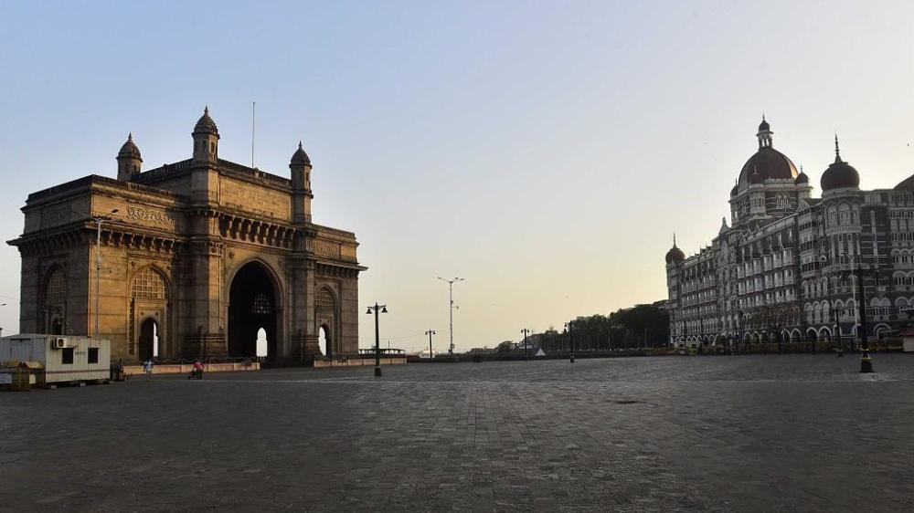

# 印度如果改名“婆罗多”，印度洋也许就能被“解套”了

_印度孟买一景。视觉中国 资料图_

中国有句老话：“大丈夫行不更名，坐不改姓”。然而，南亚“一哥”，南亚次大陆上最强大的国家印度，近日似乎铁了心要改名字——把“印度”（Inida）改成“婆罗多”（Bharat，亦有译作“巴拉特”者）。在印度总统向即将参加G20峰会的各国领导人发出的晚宴邀请函中，印度总统穆尔穆的称呼是“婆罗多总统”。而印度政府可能会在9月18日至22日举行的议会特别会议上，正式提出一项把印度的英文名称India更改为Bharat的提议并在会议上进行审议。

这是为什么？印度此举又说明了什么呢？

据印媒称，“Bharat”是梵语词汇，字面意思是“承载/携带”，引申为“寻找光明/知识的人”。而在历史上印度被称为“婆罗多”，意思正是“寻找光明/知识者”。

印度人不喜欢“印度”，据说是因为这个词不是他们本来的自称，而是英国殖民者对当地人的他称和蔑称。这种解释大体也说得通，但要理解个中缘由，恐怕还要考虑到当前印度的政治现实、国际博弈态势与“人类历史的进程”。

首先，改名声浪高涨，本身就是印度国家民族主义和印度教民族主义全面崛起的标志。

众所周知，改名无论是对一个国家，还是对一座城市（比如韩国首都首尔，曾叫汉城）而言，都是一件费时费力费资源的大事。地图重新制作，所有城市地标要更换，书本教材要重写；连外国政府、外国企业、外国游客也会跟着支付相当成本。所以，对任何国家而言，都是“非必要不改名”。

而如今印度却摩拳擦掌地要改名，这就很能够说明一些民意上的问题——印度人的民族主义发展到了一个新的高度。这个“高度”已经高到，即便要支付巨额的财政成本，动用政府资源，包括印度总理莫迪在内的印度政客们都不得不去努力迎合这种社会层面的集体思潮，否则就会被选民抛弃。如果联系印度近年来GDP赶法超英，以及最近月球和太阳探测器相继上天等事实，这其中的因果逻辑就不难理解了。此其一。

其二，我们知道，印度人长期以来有一种流行的说法，“印度洋是印度人的洋”（Indian Ocean is Indians’
ocean），或者说，印度想把印度洋变成自己的“内湖”、独霸的势力范围。但事实上，这种说法和图谋既没有历史依据，也没有国际法支撑，印度也拿不出足够的实力把偌大一个印度洋变成自己私家的小池塘。

熟悉印度历史的人都知道，在古代上千年的时间里，“印度”“身毒”“印度斯坦”等名字，都只是一个地理名词（geographic
terms），指南亚次大陆的这片区域，以及生活在这片土地上的人及其所创造的文明（civilization）。

作为一个文明，印度文明是真实存在且历史悠久而光辉灿烂的。但作为一个“国家”（state），印度则非常年轻。而要从“民族国家”（nation-
state）的角度去审视印度，那年头就更短了。“印度”作为一个现代政治学意义上的主权独立之国家（India as a sovereign state and
an independent
nation），是当年大英帝国殖民的遗产。印度政客、选民当然都不会承认这一点，但他们在接收，有时甚至明抢大英帝国战略遗产的时候，却丝毫没有什么“民族自豪感”。

包括“印度洋”也是如此。如果不是英国人恰巧占领了印度这片土地，然后将其殖民、统治、改造、捏合成一个统一的政治实体（虽然各地仍有大量土邦王爷，但作为统一象征的英女王、总督具有最高权威），印度不会存在。而英国人所声称、并一直流传至今的“印度洋”的称呼，也被印度人强行拿来，去炮制他们与该片海域的某种特殊的牵连，或者去论证他们对这片海域某种先天的、法理上问心无愧、当仁不让的“所有权”。然而，以上这些不过是主观臆想和民族主义妄念，全无国际法的法理依据，只是一种民族主义的情绪宣泄而已。

但现在，事情正在起变化。印度有决定自己国名的自由和权力，但他们不能在21世纪再随随便便去更改海洋的名字。一旦印度把自己的国名更改了，接下来是不可以再把“印度洋”改为“婆罗多洋”（Bharat
Ocean）的。“印度人”“印度国”和“印度洋”都共用一个名词India，不过是英国殖民者摆下的乌龙而已。这种所谓“特殊联系”，本就苍白无力，只是机缘巧合而已，如今印度若是改名，则反而是给印度洋“解套”了。

（王鹏，华中科技大学 国家治理研究院 研究员）

