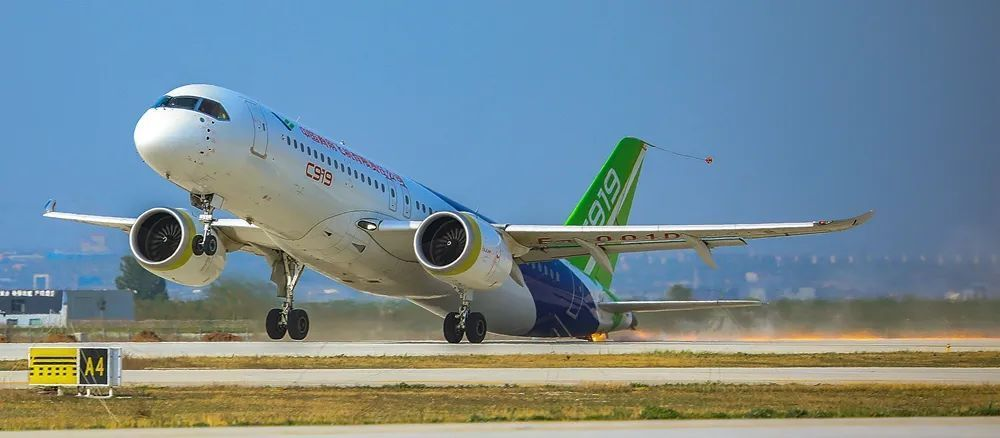
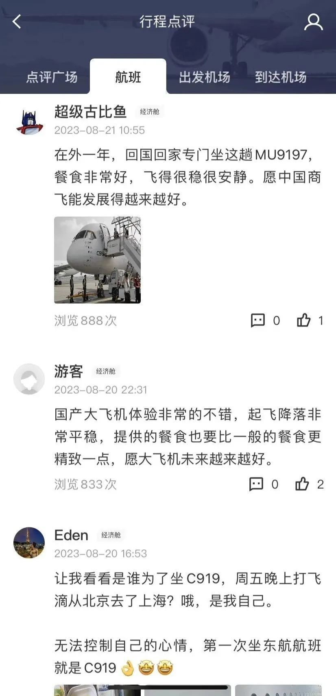
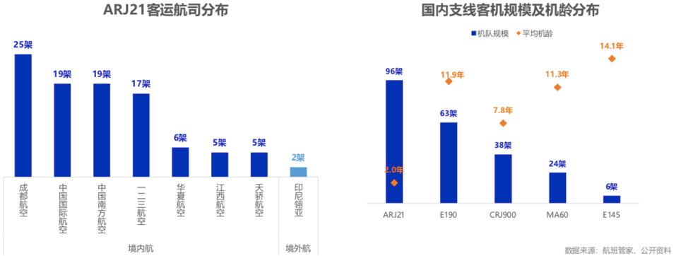

# 国产大飞机商业运营100天，获旅客高度评价：吃得好、飞得稳、很准时

在上海虹桥=成都天府航线，C919每天执飞2-4个航班，运送数万人，旅客普遍高度评价飞行体验

文 | 《财经》记者 王静仪

编辑 | 施智梁

从5月28日首飞，到9月4日，国产大飞机C919迎来了运营整整100天的日子。

从初夏到初秋的100天里，航班管家提供给《财经》的数据显示，C919执飞客运航班220班次，累计商业飞行550.3小时（空中时长，不含滑行时长）。

上海虹桥=成都天府航线，是国产大飞机的核心阵地。除了5月28日首航当天执飞上海虹桥=北京首都航线，剩下的时间都穿梭在上海到成都之间，每天2-4个航班。

目前一共有两架C919客机加入了东方航空的机队。第一架客机在5月28日开启运营，运营前两个月，累计服务旅客超1.5万人次；8月4日，第二架客机也开始运送旅客，按照客舱164个座位计算，两架飞机一共220个航班，最多可运送3.6万旅客。

旅客普遍高度评价C919的飞行体验，《财经》在航旅纵横App的航班点评处留意到，“餐食好”“服务好”“飞行平稳”“座椅舒适”是国产大飞机收到最多的评价。

国产大飞机的准点率很高，航班管家数据显示，过去100天的平均出港准点率为95.9%，进港准点率为99.1%。据航旅纵横航班动态显示，由C919执飞的MU9198航班近两个月实际执飞60次，准点起飞59次，取消0次。

《财经》从东方航空了解到，C919充满“中国风”的安全演示视频、主题餐食、带有“中国印”的机供品、C919专属电子登机牌等特色服务，受到旅客的喜爱和好评。

中国民航合计研发并投产了三款商业载客飞机，分别是MA60、ARJ21与C919，这三款飞机代表着航空工业在不同历史阶段的重要节点，从涡轮螺旋桨飞机到支线喷气
客机，再到大型喷气客机，勾勒出中国航空工业发展的几十年轨迹。

**两架飞机，运营百日**

5月28日，东航第一次完成C919首个商业航班“上海虹桥——北京首都”的往返飞行，此后首架C919在沪蓉快线上服务旅客。截至7月31日，首架C919共执行商业航班125班次，累计商业运营360.32小时，累计服务旅客超1.5万人次。

8月4日，东航接收第二架C919国产大型客机并首次开始“双机商业运营”，C919的商业运营稳步向规模化迈进。

飞机上的餐食经过专属设计，配有C919首航特色芒果布丁，是旅客打卡拍照必备，受到普遍好评。

 _（机上餐食 图片来源：东方航空）_

为什么大飞机率先在上海=成都航线上运营？东航总经理李养民回应称，这是航线航程、资源保障、客流量等多方面综合考虑的结果。首先，飞行3小时左右的沪蓉航线行距比较合适，东西飞对环境适应性会比较好，其次，东航在沪蓉航线资源保障能力也很好，而且这条航线的客流量也不错。

航班管家数据显示，作为“全球首架”的B919A一共执飞183个航班，第二架入列的B919C一共飞了37个航班，5月28日到9月4日合计执行220个航班。每架国产大飞机平均每天飞一对往返，也就是两个航班。

在国际航空业有一句名言，“好飞机是飞出来的”。按计划，2023年，东航将一共引进5架C919国产大飞机，投入到上海、北京、西安、昆明以及广州、成都、深圳、南京、武汉、杭州、厦门、青岛等地的优质精品航线上。

“C919刚刚开始商业运营，从制造商中国商飞的角度来说，需要提升产能，做好交付，从运营商尤其是东航的角度来说，要做好示范效应，必须飞好，让其他的航空公司也更有意愿来飞。”中国航空评估咨询公司主席、上海纽约大学助理教授于达对《财经》表示。

《财经》从东航方面了解到，东航已专门成立了C919飞行部、C919客舱部，设立了C919签派放行席位、专职工程管理岗位、国产飞机维修管理中心等专业部门，储备了相关专业人员，积累了全系统的安全运行和服务保障经验。

规模化商业运营已起步，下一步考验国产大飞机的是，供应链建设和产能爬升的能力。

作为发动机制造商，赛峰飞机发动机公司在9月4日宣布，投资3000万美元，在贵阳打造低碳新工厂，并配备了诸多先进新设备，用于生产CFM56和LEAP发动机的低压涡轮叶片、导向叶片和密封件（失蜡铸造法）。

中国商飞表示，C919已经有1200多架的订单，产能将持续爬坡，未来5年年产能会达到150架。

**从国产小飞机到国产大飞机**

除了C919，目前还有两款国产飞机正在商业运营，分别是ARJ21和新舟60。

截至2023年7月末，国内在运营ARJ21的客运航司共7家，共计96架。成都航仍是规模最大的航司，规模达25架，三大航ARJ21数量逐渐增长，国航、
南航各19架，一二三(东航)17架，华夏航6架，江西、天骄航各5架。

作为一款支线飞机，ARJ21的特点是座位少、里程短。座位约有90座，采用全经济舱布局，座位数大约是C919的六成。

航班管家提供给《财经》的数据显示，从机队规模上来看，中国产的ARJ21已超过巴航工业的E190(不含E195
)，占支线机队总量的43.4%，成为国内支线飞机主力军，同时机队机龄也更加年轻化，平均仅两年。

目前，ARJ21执飞航班量不断攀升，在2023年7月创下新高，月度执飞航班量达7498架次，同比增幅高达110%，占民航客运航班总量的1.64%，占全国支线机型航班总量的41.2%，市场份额稳步提升。

ARJ21飞机已经远销海外，印度尼西亚翎亚航空是首个客户。2023年4月，翎亚航空开始使用ARJ21飞机进行商业运营，从首都雅加达飞往巴厘岛。印尼有1.7万多个岛屿，拥有近3亿人口，航空是联系各岛屿和方便旅客出行的重要交通工具，尤其适合支线飞机运营。

尽管ARJ21已实现规模化运营，但相对行业整体，尚属商业运营早期。航班管家统计发现，ARJ21机队7月利用率达3.7小时/天，对比CRJ900与E190这两种更为成熟的国外支线机型，利用率较低，与主流窄体客机A320对比，利用率不足其一半，仍有很大的提升空间。

新舟60则是更早的国产飞机探路者，是中国第一款严格按照与国际接轨的中国民航规章CCAR25部进行设计、生产和试飞验证的飞机，2008年开始商业运营，并成功出海亚非拉国家。

“C919目前仍要继续提升可靠性，做好运营支持和经验积累。一架飞机的生命周期是25年，就未来的商业前景而言，要形成体系化、规模化的运营，包括后续机型怎么更新、有没有公务机、客改货等更多的解决方案，去支撑长时间的运营。”于达对《财经》表示。

运营百天只是起点，国产大飞机的航线版图仍要拓展，长期稳定运营也需要制造商和运营商的更多努力。

（本刊实习生邓雨洁对本文亦有贡献）

责编 | 张雨菲

