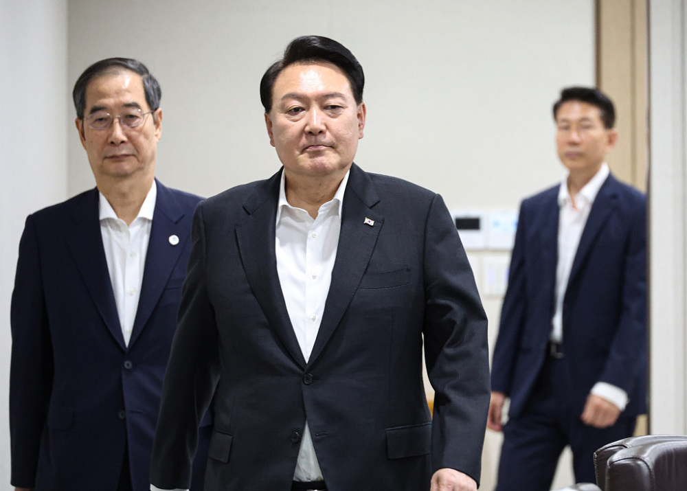

# 朝野激辩！尹锡悦政府四巨头接受拷问，被问“喝了核污染水吗？”

【环球时报驻韩国特约记者 刘媛 环球时报特约记者
韩雯】6日，韩国国会对政府质询的问政会进入第二天，主要聚焦三大方面——外交、统一、安全领域。国务总理韩德洙、外交部长官朴振、统一部长官金暎浩、国防部长官李钟燮等人士当天接受问政。《韩国日报》6日称，朝野双方仍陷入寸步不让的态势。最大在野党共同民主党对注重韩美日三边合作的尹锡悦政府外交政策基调的实际利益提出质疑，韩德洙攻击反对党称，“真的好好学习吧”。朝野双方还因终战宣言、“萨德”“三不一限”等文在寅政府时期的安保悬案产生冲突。

 _韩国总统尹锡悦与韩国总理韩德洙（左） 资料图_

**“真的好好学习吧”**

共同民主党议员金炅侠6日指责，尹锡悦政权不顾经济和民生，执着于政治报复、打击在野党以及冷战理念、拉帮结派式的外交，“通过作为代表性外交成果的‘加强韩美日三角合作’，我们国家获得了什么利益？”他主张，政府的外交路线在遏制朝鲜核扩张和阻止朝鲜“挑衅”方面没有取得效果。

对此，韩德洙反驳称，通过韩美日合作确保了遏制力，更安全了。“陷入如果朝鲜按照自己的意愿行事，就不会攻击大韩民国的假象，这将使国民陷入威胁之中。”金炅侠继续质疑“是不是打消了朝鲜的攻击意志，是不是错觉？”韩德洙表示对方出现错觉，并对在野党议员大声疾呼“真的好好学习吧”。

尹锡悦与“联合国军”司令部高层8月座谈后，成为热门话题的终战宣言也在当天引发朝野激烈辩论。金炅侠向韩德洙提问，“半岛终战宣言是否会解散‘联合国军’司令部？”韩德洙回答说，“如果终战宣言成功，下一阶段不是会按照不需要‘联合国军’司令部、不需要韩美同盟等顺序进行吗？”《韩国日报》认为，韩德洙这番言论正面批评了文在寅政府推进的终战宣言。

**“喝了核污染水吗”**

执政党国民力量党以质疑“萨德”“三不一限”进行反击。国民力量党议员成一钟称，“因为‘三不一限’而放弃大韩民国主权的人，没有资格说排放经过国际层面科学验证的处理水（福岛核电站核污染水）是侵犯主权。”

韩国纽西斯通讯社6日称，朝野就日本福岛核污染水排放问题再次展开激烈攻防战。国民力量党议员成一钟爆料，韩国原子能研究院2020年10月15日发表题为“福岛污染处理水排放不会对韩国海洋产生影响”的论文，但文在寅政府对研究小组施加压力，要求他们撤回论文。对此，共同民主党高声抗议，称“假信息”“不要发表推测性发言”“喝了核污染水吗？”

此外，在野党方面还主张，在尚未证明核污染水安全性的情况下，韩国海军正遭受排放的直接打击。“你们知道受到福岛核污染水排放直接打击的是谁吗？海军。”共同民主党议员金炳周自问自答道。

**支持率：30.5%对29.9%**

韩国《亚细亚经济》6日称，共同民主党议员主张，尹锡悦政府如果想突破危机，唯有进行人事改革，“包括总理在内的内阁应该请辞”。前一天的问政会上，在野党还发出了针对尹锡悦的“弹劾”言论，引发执政党强烈抗议。

韩国“etoday”新闻网6日称，共同民主党指责尹锡悦政府外交失败、经济失败、内需停滞、投资萎缩等。执政党则用文在寅政府在经济问题上的失策来反击。韩国KBS电视台6日称，朝野还围绕陆军士官学校内洪范图将军半身像的迁移问题、尹锡悦政府的统一政策等展开舌战。

韩联社6日称，一项民意调查结果显示，假设明天就举行国会议员选举，执政党国民力量党和最大在野党共同民主党将在误差范围内展开拉锯战。市场调研企业MetriX于本月2日至3日面向全国18周岁以上1000人进行民调。结果显示，支持国民力量党所属候选人的受访者为30.5%，选择共同民主党候选人的受访者占29.9%。

