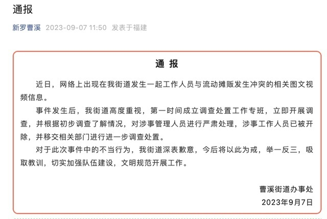

# 福建一城管与商贩起冲突，多次掌掴商贩头部，街道办：涉事人员已开除

据时间视频报道，近日，在福建龙岩，网曝曹溪街道城管队员多次掌掴商贩头部。7日，曹溪街道办事处发布通报，已对涉事管理人员严肃处理。涉事工作人员已开除，移交相关部门进一步调查处置。

视频显示，当时城管在劝离街边流动商贩，双方发生冲突。

**通报如下：**

近日，网络上出现在我街道发生一起工作人员与流动摊贩发生冲突的相关图文视频信息。

事件发生后，我街道高度重视，第一时间成立调查处置工作专班，立即开展调查，并根据初步调查了解情况，对涉事管理人员进行严肃处理，涉事工作人员已被开除，并移交相关部门进行进一步调查处置。

对于此次事件中的不当行为，我街道深表歉意，今后将以此为戒，举一反三，吸取教训，切实加强队伍建设，文明规范开展工作。

**【来源：九派新闻综合时间新闻、新罗曹溪】**

