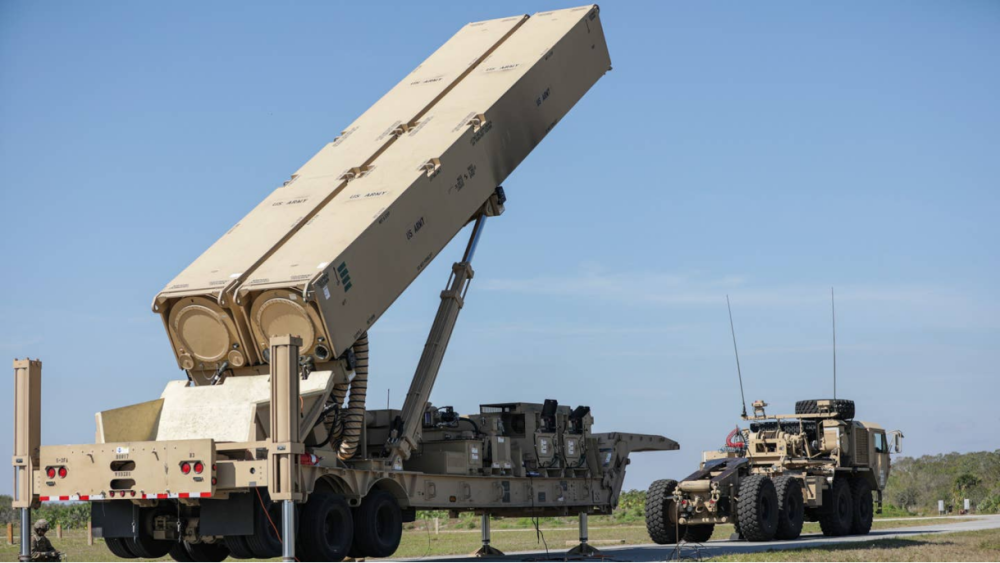
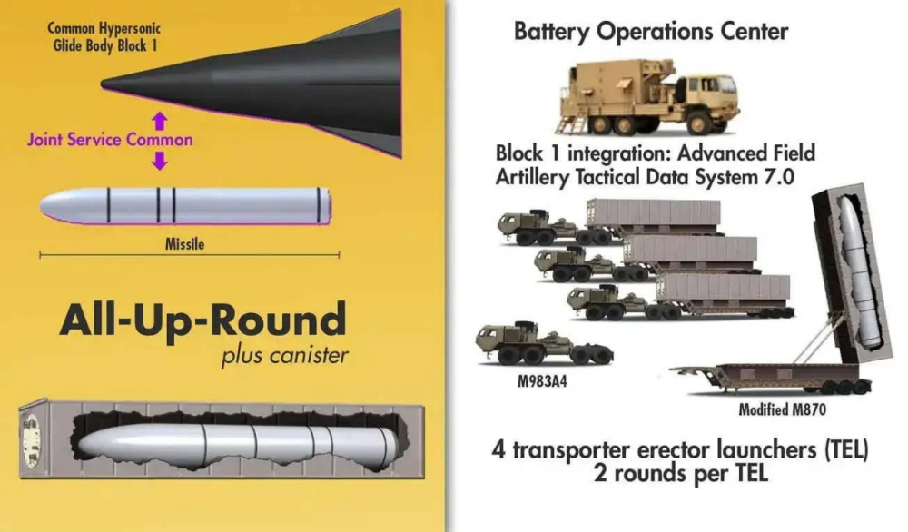
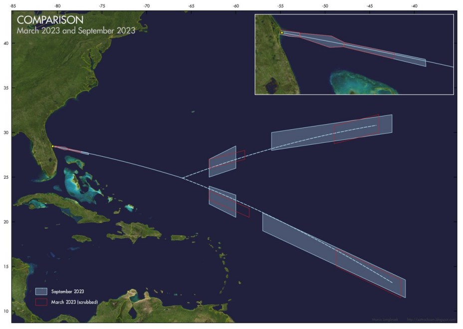
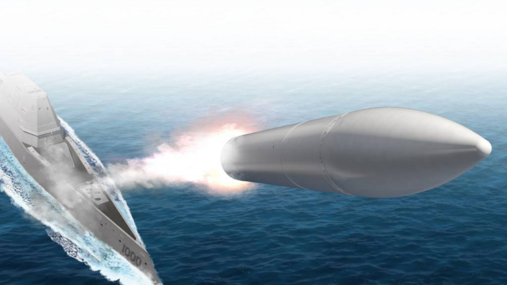
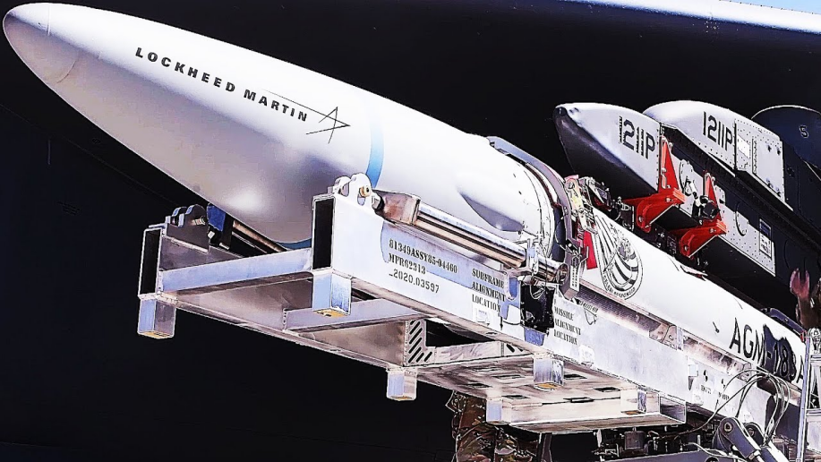

# 美“暗鹰”高超音速导弹试射取消，美媒炒作其打击“中国目标”能力

【环球网报道 见习记者
黄泽佳】据美国“动力”网站当地时间6日报道，美国国防部长办公室（OSD）证实，原定于6日在卡拉维纳尔角太空军基地进行的“暗鹰”高超音速导弹试射因故取消。但美国国防部长办公室发言人表示，高超音速导弹的交付仍是美国防部的“首要任务”。“动力”网站还炒作称，“暗鹰”高超音速导弹是美国陆军远程打击能力的核心部分，这款导弹“着眼于将中国在太平洋地区的一系列目标置于危险之中”。

_“暗鹰”高超音速导弹发射车 资料图 图源：美国“动力”网站_

“动力”网站引述美国国防部长办公室发言人发表的声明称，“9月6日，（美国）国防部计划在佛罗里达州卡纳维拉尔角太空军基地进行（“暗鹰”导弹）试射，为我们的高超音速技术发展提供信息。根据飞行前检查（的结果），测试并未进行。”但声明还表示，“国防部能够成功收集有关（‘暗鹰’导弹的）地面软硬件性能参数，这将为进攻性高超音速武器的持续推进部署提供信息。交付高超音速武器仍然是国防部的首要任务。”

_“暗鹰”高超音速导弹全系统概念图 图源：美国“动力”网站_

报道称，“暗鹰”导弹曾计划于今年3月进行试射，同样因故取消，美国国防部当时也曾做出类似表态。

报道还提到，美国海军中将、美海军战略系统项目主任约翰尼·沃尔夫在一场国会听证会上透露，“暗鹰”导弹试射取消的原因是“飞行前检查时发现导弹上的电池未能激活”。沃尔夫还称，正在调查故障原因，并将在查明并纠正故障原因后继续推进试射，以支持美国陆军的部署计划。

“动力”网站还表示，美国军方可能还将进行另一场“暗鹰”高超音速导弹试射，尽管美国陆军拒绝证实这一消息，但相关的航行警告显示，另一场测试将在本周进行。

 _美军方今年为试射高超音速导弹划定的航行警告区 图源：外媒_

报道还提到，“暗鹰”高超音速导弹由美国陆军和美国海军合作开发，除了陆基发射型号外，美国海军还计划在“弗吉尼亚”BlockV批次核潜艇以及“朱姆沃尔特”级驱逐舰上配备这款导弹。美国海军版的“暗鹰”导弹又被称为“中程常规快速打击”（IRCPS）导弹。

_美军“朱姆沃尔特”级驱逐舰发射高超音速导弹想象图 图源：美国“防务新闻”网站_

在介绍的同时，“动力”网站提到中国并炒作称，“暗鹰”高超音速导弹是美国陆军远程打击能力的核心部分，这款导弹将被部署在太平洋地区，“着眼于将中国在太平洋地区的一系列目标置于危险之中”。不过报道提到，现在尚不确定这款导弹在太平洋地区的具体部署地点。“动力”网站还特意提及，许多国家不同意美国在其领土部署“暗鹰”导弹。报道还称，美国陆军已为“暗鹰”高超音速导弹建立了单独的指挥控制体系，以便在需要时将其部署到欧洲。

_AGM-183A高超音速导弹 资料图 图源：外媒_

报道还称，美国空军目前正致力于研发吸气式高超音速巡航导弹，并且已经放弃了空射型“暗鹰”及AGM-183A等助推-滑翔式高超音速导弹的发展。

美媒及有关政客曾多次炒作渲染称，美方对中国高超音速导弹技术感到“担忧”。中国外交部发言人汪文斌2021年就曾驳斥有关说法称，美国是世界上最早研发高超音速武器的国家，目前仍在不断发展甚至扩散高超音速导弹技术，并投入上万亿美元升级其“三位一体”核力量。美方反复就中方正常的航天器试验表达所谓的担忧，并借此渲染“中国威胁论”。那么美方能否向国际社会说明，美国发展高超音速武器意欲何为？又是出于什么理由担心别人呢？国际社会是否有充分理由对美方举动表达担忧呢？“我们敦促美方充分尊重各国发展正当国防力量的权利，停止借渲染所谓的‘中国威胁论’而大肆扩充军力的把戏。”汪文斌说。

