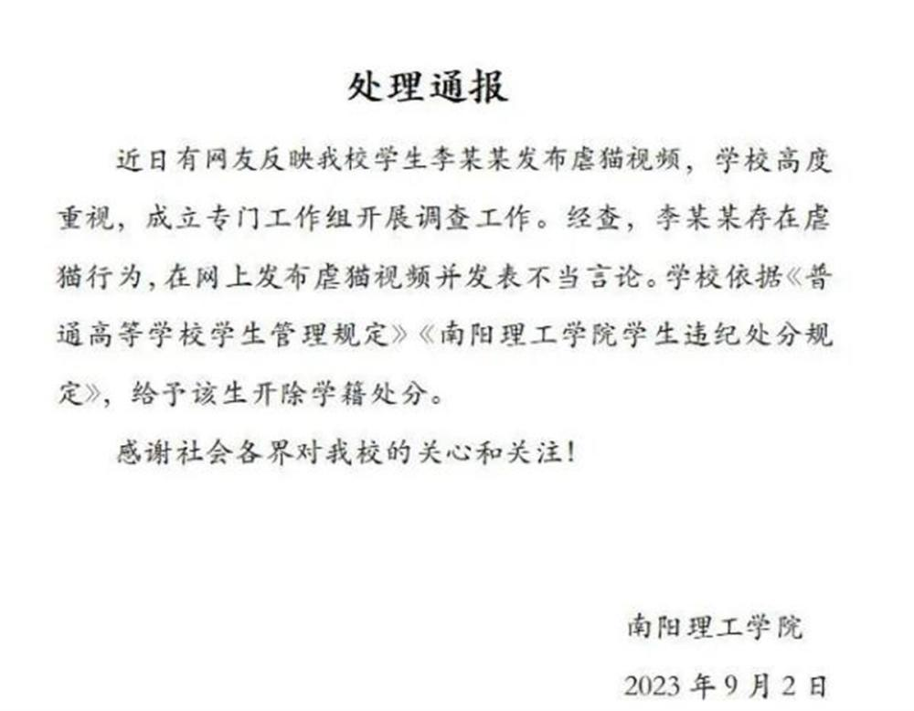

# 虐猫大学生被校方开除后，又被警方拘留7天

南阳理工学院2020级学生李某某发布虐猫视频，9月2日，李某被开除学籍。最新进展是，李某已被警方处以行拘7日的处罚。

据南阳广播电视台报道，8月27日，有网友反映，南阳理工学院2020级学生李某某发布虐猫视频。该网友发布的信息显示，该学生还以文字形式详细描述了虐猫经过。记者从公安机关了解到，李某某已被南阳市公安局城乡一体化示范区分局处以行政拘留7日的治安处罚。

 _通报（图片来源：南阳理工学院）_

8月28日，南阳理工学院曾就此事发布通报表示，学校成立专门工作组调查处置，初步核查，虐猫视频确系该校2020级学生李某某所发。

 _虐猫视频（图片来源：社交媒体）_

9月2日，南阳理工学院再次发布情况通报，通报称，近日，有网友反映我校学生李某某发布虐猫视频，学校高度重视，成立专门工作组开展调查工作。经查，李某某存在虐猫行为，在网上发布虐猫视频并发表不当言论。学校依据《普通高等学校学生管理规定》《南阳理工学院学生违纪处分规定》，给予该生开除学籍处分。

极目新闻综合南阳广播电视台、南阳理工学院

（来源：极目新闻）

