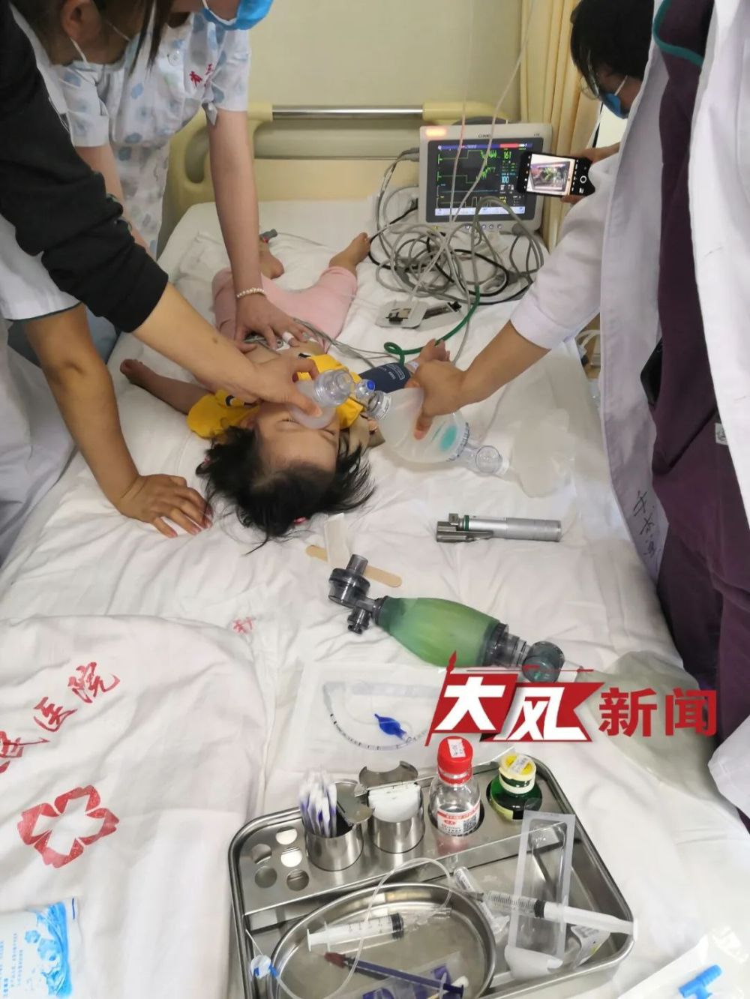

# 1岁女婴输液封管时突尖叫、心跳骤停，昏迷两个月成脑萎缩！家长质疑

1岁半女婴去医院看扁桃体炎，最后成了脑萎缩。家人说，输液封管时孩子突尖叫，心跳骤停，经过抢救转院治疗，昏迷两个月后才苏醒，现在落下个智力残疾。兰州医学会组织的专家鉴定会结果是一级乙等医疗事故，医方承担次要责任。家人无法接受：“好好的孩子看成这样，医院仅承担次要责任？”

**疑点1**

**异物窒息能让孩子瞬间没了心跳吗？**

患儿家属委托陕西许小平律师事务所律师刘霄峰代理此事。刘霄峰作为陕西省律师协会医疗卫生法律专业委员会主任，在看完该起事件的病案后，从中发现了疑点。

**刘霄峰指出，医方没有如实地记录病历。“根据甘肃省第三人民医院提供的患儿病历，孩子入院体格检查时诊断为急性化脓性扁桃体炎，查体显示：双肺呼吸音清，未闻及干湿性啰音。孩子在封管过程中，突然出现啼哭，喉中有痰，然后出现全身青紫，意识丧失，自主呼吸消失，经抢救后患儿呼吸心跳恢复，但神志仍不清，反应差，急诊转入兰大一院PICU继续治疗。”刘霄峰说，孩子发生突发状况，该院归结为“异物吸入性窒息”，如此说法实在牵强。**
“入院时孩子并没咳嗽，身体检查时，他们自己的病历上也写着双肺呼吸音清，未闻及干湿性啰音，怎么就突然喉中有痰了呢；病历上又说，封管过程中，患儿出现啼哭，无论是医院认为孩子在封管时发出的声音是啼哭，还是家属所说的大叫，都能说明孩子的嗓子是可以清楚发出声音的。但医方病历在随后的《出院小结》抢救记录中，多处出现‘患儿突然啼哭，喉中有痰，立即予以清理呼吸道，可吸出白色粘稠痰，双肺呼吸音粗，可闻及大量痰鸣音等’此类说法，这痰从何来？最重要的是，异物导致孩子窒息，她不可能立即就出现全身青紫、意识丧失、自主呼吸消失的症状，难道因异物窒息了就能让孩子瞬间没了心跳吗？”

**对于刘霄峰的疑问，西安一家医院不愿具名的急诊科主任也说，如果是异物导致的窒息，患儿不可能马上出现全身青紫、意识丧失、自主呼吸消失等心跳骤停的症状。**

而在医方将孩子转入兰大一附院后，入院记录里清楚描述“输液结束留置针盐水封管后，突发剧烈哭闹，继而出现呼吸暂停伴意识不清，颜面及口唇发绀，心跳骤停，无呛咳误吸。”刘霄峰说，记录下这些专业的陈述，可不是孩子爷爷奶奶能办到的，而是甘肃省第三人民医院儿科主任陪同转运后，向兰大一附院PICU医务人员所做的陈述。

**疑点2**

**医嘱里的“作废氯化钾”是否已用于封管？**

孩子妈妈董女士曾在部队当过卫生员。她怀疑护士在封管时用错了药。“我们正常在封管时，会用氯化钠，也就是俗称的生理盐水冲管。”但孩子在封管时，能突然大叫，一定是让她极度不适或是剧烈疼痛了才作出的反应。“家人在事发次日前往医院封存病历时，听到护士说问题出在氯化钾上，当时不明所以。”董女士说，后来，她自己在孩子的病案中看到了氯化钾的临时医嘱，这是一条医生在孩子出事前开出的最后一组药里体现的，但在隔了许多条抢救的医嘱后面，又对氯化钾标注了作废的字样。

记者看到孩子病案中的临时医嘱，确如董女士所言：
**2002年6月22日14时08分，医师开的一组药中有一支2.5ml的氯化钾注射液，要求是静滴。这条医嘱之后的药物记录便是抢救孩子的药物了，也就是说，抢救孩子之前，这个氧化钾是给孩子用药的最后一组。尽管该条医嘱后来又标注作废了，但董女士认为，护士极有可能将氯化钾当作氯化钠作为封管，静推到了孩子体内。**
董女士说，只有氯化钾静推，才能让人的心跳骤停。她翻看了孩子入院时的所有检查单，也未发现孩子有缺钾的情况，医生为何会开氯化钾，为何又作废，至今都是谜。

**意外 >>**

**输液结束封管时突发状况**

**孩子发出尖叫声**

提及孩子接受治疗的过程，董女士深呼吸后，仍止不住全身颤抖，她努力平复心情后说：“我恨死这家医院了！事情过去一年多了，我婆婆仍在自责，她觉得对不起我，但我们都知道，这跟她没关系。”董女士告诉华商报大风新闻记者，2022年6月份，1岁6个月的女儿笑笑跟随爷爷奶奶回兰州老家玩，6月21日晚，孩子发烧，体温烧至38.5℃。次日，爷爷奶奶带孩子去了甘肃省第三人民医院，经医生检查，孩子嗓子有些红，又查了血象，医生告知需住院治疗。

孩子奶奶魏女士说，当时她还问医生，能不能只吃药不打针？医生说吃药可能压不住，并称打针好得快些。

魏女士听从了医生的建议，办完住院手续，大约在当天下午一两点便输上了液体，“扎针的时候，护士几次都没扎上，后来从孩子脚上扎的针头，在输液的过程中，我还和孩子聊天，说等打完针了，爷爷就带我们去吃好吃的，孩子开心地说‘好’”。期间，魏女士给孙女讲故事，看动画片，一切都很正常。

意外发生在下午6点多液体输完时。“我喊护士，液体输完了。护士来给了我一支体温计，让我给孩子测体温，我把体温计夹在孩子腋下，为防体温计滑落，我一手压着她的胳膊，另一只手扶着孩子的身子，并逗她开心，但孩子突然大叫一声，我问正在孩子脚上处理针头的护士：‘你干嘛呢？’护士说：‘阿姨，我封针呢，马上好。’谁知孩子又尖叫了一声，便双眼紧闭，嘴唇发紫，我大喊医生，医生没来时，我手忙脚乱掐孩子人中，当时感到孩子已经没了呼吸……”这段回忆简直就是魏女士的噩梦，她艰难地说，“之后，来的医生和护士抢救孩子，病房里没有任何抢救设备，等他们从别处搬设备，就等了很长时间……”

**急救 >>**

**先后三家医院抢救治疗**

**两月后孩子才苏醒**

**因抢救效果不佳，当晚8点多，在甘肃省第三人民医院的联系下，孩子被转到兰州大学第一医院，在这里抢救加治疗一个多月，虽有好转，但仍处于植物人状态。**

“我们都在西安上班，不能长时间待在兰州。但当时由于疫情原因无法将孩子转院到西安。”董女士为此上网发文求助，在有关部门的协调下，2022年7月31日，董女士带着孩子登上回西安的火车，随即住进西安市儿童医院，又治疗了一个月，孩子终于苏醒。“醒来的时候我们都可激动，后来发现孩子的认知能力、行动能力都很差，竟然变成了残障儿。”

**西安市儿童医院的病历显示，笑笑在不到一年的时间里，共住院10次，诊断大致为：缺氧缺血性脑病恢复期、脑萎缩、运动障碍、认知障碍。**

董女士伤心地说，经过一年救治，还是改变不了孩子不会说话、不会动的惨状，不得不面对终生残障。“我婆婆始终活在愧疚中，因为孩子免疫力低下，三天两头生病，她就把全部精力都用来陪孩子住院、看病，我们也劝她，她说让她多陪陪孩子，心里能好过点儿……”

**疑问 >>**

**孩子缘何突然尖叫**

**心跳因何骤停？**

董女士向华商报大风新闻记者提供了孩子分别入住三家医院的病历。甘肃省第三人民医院的病历显示，孩子于2022年6月22日12时20分入院，入院诊断为“急性化脓性扁桃体炎”，入院后给予阿莫西林克拉维酸钾抗感染、炎琥宁清热解毒、布地奈德混悬液+氯化钠雾化吸入及物理降温，口服布洛芬混悬液退热、补液等对症治疗。体温逐渐降至正常，患儿精神、反应可，面色正常，活动自如。于18时20分静脉点滴结束，予以0.9%氯化钠注射液5ml留置针封管，封管过程中患儿突然出现啼哭，喉中有痰，随即出现全身青紫，意识丧失，自主呼吸消失，触诊股动脉搏动消失，听诊心率0次/分，四肢肌张力松软，考虑异物窒息……

该院给予一系列抢救措施后，患者神志仍不清。为进一步诊治，该院急诊120转入兰大一院PICU。

在该院的出院诊断上，写着“急性化脓性扁桃体炎”，以及“异物吸入性窒息”。

兰大一院的病历显示，笑笑是事发当晚8时04分入院的，入院的诊断有6项：脓毒性休克；脓毒血症；心肺复苏术后、电除颤术后；癫痫持续状态；重症肺炎；急性呼吸衰竭。

事发第二天，孩子家人就前往甘肃省第三人民医院封存病历。
**孩子父亲隋先生说，“病历上和我母亲表述是一致的，孩子在封管过程中突然啼哭，随即就没有意识，心跳骤停，我们就想知道，孩子突然大喊一声，那肯定是身体极度不适的反应，封管时护士操作了什么才会如此？”之后隋先生和家人去甘肃省第三人民医院讨说法，但对方始终认为，这是孩子病情发展导致的结果，称有诉求就去找医调委。**

**鉴定 >>**

**属一级乙等医疗事故**

**医方承担次要责任**

董女士为给女儿讨个说法，遂请律师，提出要做医疗事故技术鉴定。

今年6月19日，兰州医学会收到兰州市城关区卫生健康局的委托书，7月27日，该医学会对医患双方进行了调查。8月3日，由5名专家组成的鉴定组召开鉴定会。让董女士没想到的是，这次鉴定会，医患双方并没碰面，鉴定小组要求他们分开陈述。

董女士的代理律师表示，参加过许多次鉴定会，不让医患双方面对面，这还是头一次见，患方不在场，医方回答问题是否有人教授，关键的问题专家组是否有意回避，患方都不知情，这样的局面无法体现公正性。但即便对此提出了异议，还是没能被兰州医学会采纳。

**最终，专家鉴定组根据医患双方陈述、答辩，查阅病历材料，以及现场质询，给出的分析有三点：一、诊疗行为违反了急危重患者抢救制度。二、患者产生的损害后果与抢救存在因果关系。三、因医务人员的诊疗不规范导致患儿缺血缺氧性脑病后遗症。最后给出的鉴定结论为：“本病例属于一级乙等医疗事故，医方承担次要责任”。**

董女士无法接受这个结果：“好好的孩子看成这样，告诉我医院仅承担次要责任？”目前，董女士已向甘肃省医学会提出鉴定申请。

就董女士和律师对鉴定会现场为何让医患双方“背对背”的疑问，9月6日下午，华商报大风新闻记者致电兰州医学会，工作人员表示，他们开鉴定会一直如此，如家属对此持有疑异，可向他们的上级部门——甘肃省医学会反映。

**院方 >>**

**患儿突然病情变化系其个体体质等所致**

对于家属的种种质疑，9月6日下午，华商报大风新闻记者致电甘肃省第三人民医院医患办公室，向一直跟进此事的医患办主任了解情况，该主任三缄其口，只称需院方同意方能介绍情况。

随后，记者联系该院办公室，工作人员表示，在请示院领导后，给予答复。
**截至记者发稿时，该院还未答复。但该院在医疗事故技术鉴定现场、向专家组陈述时表示，医院对患儿采取的诊疗行为符合诊疗规范，患儿突然出现病情变化后，医院给予了积极有效的抢救措施，患儿最终的结果是因为其个体体质及所患疾病的严重性、复杂性和不可预见性所致。**

中国法学会会员张允光建议，如果想知道造成孩子医疗损害的原因，建议家属做司法鉴定，确定医疗行为与损害后果是否存在因果关系。

来源：华商报大风新闻

