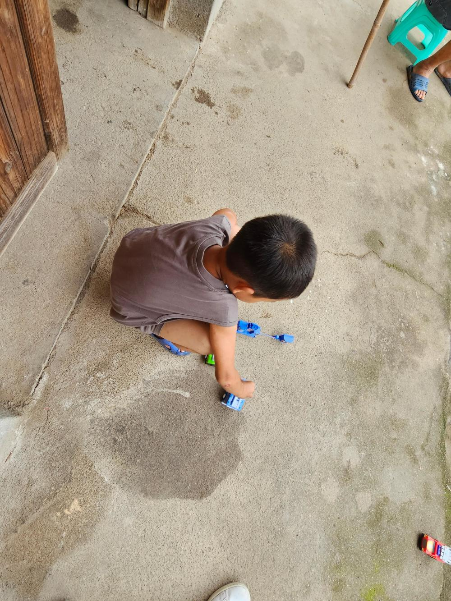
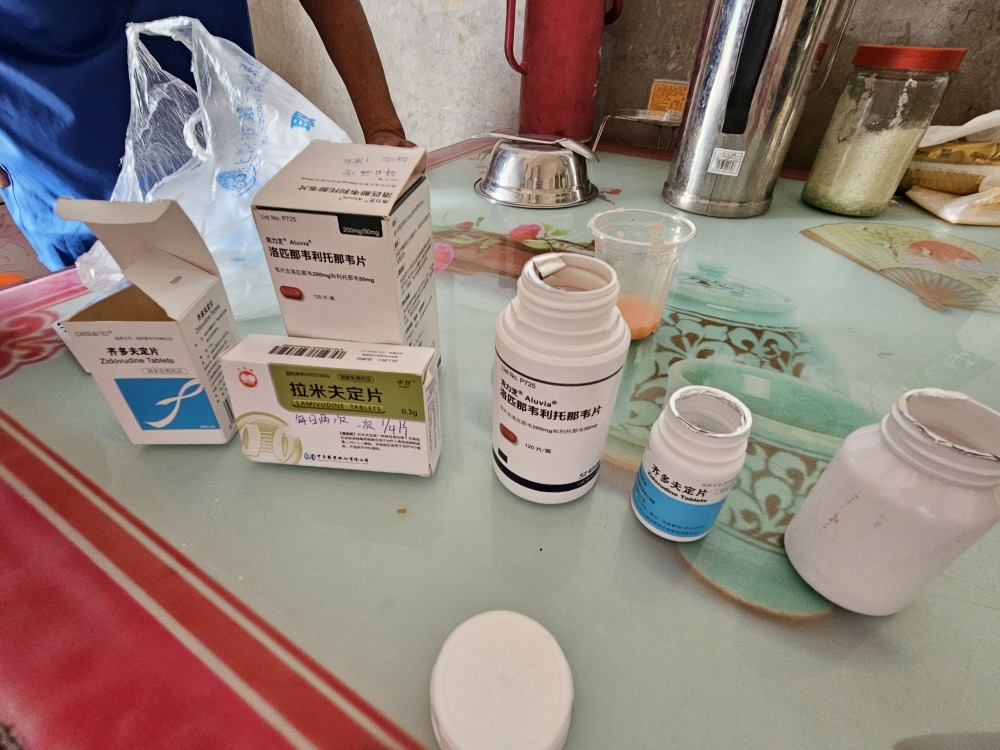

# 7岁艾滋病毒携带者小瑞：父亲病亡母亲失踪，“做梦都想进校园”

谈到“识字”，原本一直害羞地笑着，却不回答记者问题的小瑞，马上瞪大眼睛，透着兴奋：“这个字我认识。”

想到校园里去上学吗？“想。”小瑞点着头，满脸期望，眼神里却有着“这可能吗”的疑问。

七岁半的小瑞，是江西省上饶市某村的“事实孤儿”，也是一名艾滋病毒携带者。去年9月，他正式入读镇中心小学。但和其他孩子不同，他只能在家上网课。

其他学生的家长，不愿小瑞到学校读书。

村里没有孩子肯跟小瑞玩。多数家长虽知道艾滋病毒的传染途径，但担心孩子们喜欢打闹，常有磕碰出血，不愿让孩子有一丝风险。

相比同龄孩子，小瑞的身体、智识发育较迟缓。公益机构的志愿者更担心，随着年龄增长，不正常的家庭，教育、社交环境缺失，会严重影响小瑞的成长。

澎湃新闻获悉，对小瑞的情况，当地很重视，多个部门正研究“最优方案”。

**“懂事得让人心疼”**

9月5日下午4点，宁静的村庄里，小瑞正在院里玩耍，他不停地给小汽车玩具上发条然后放开，再捡回来，乐此不疲。

_小瑞独自在院子里玩小汽车。_

七岁半的小瑞皮肤黝黑，体重只有三四十斤，黑亮的大眼睛，透着一股机灵劲儿。

小瑞属于事实孤儿，也是一名艾滋病毒携带者，病毒来源属于母婴传播。父亲在小瑞一两岁时，发病死亡。不久，母亲离家出走，下落不明，家里人推测可能也已病发。比小瑞大一岁的哥哥，不是艾滋病毒携带者，被亲属收养。剩下小瑞和奶奶相依为命。今年端午节，
85岁的奶奶也“走了”。

小瑞家五六十平方米的平房，是区住建局2018年援建的，挨着大伯家的楼房。后来，小瑞的母亲被警方认定为失踪，小瑞和哥哥开始享受孤儿政策，每人每月领取1300多元，当地为照顾小瑞的大伯有提供每月300元的伙食补贴。2022年10月，主要帮扶“事实孤儿”的上饶市善德公益发展中心，在走访中发现了小瑞，此后就一直关爱他。2022年11月，该中心联合其他公益组织，通过企业捐款，改造了小瑞和奶奶的卧室：刷墙，送床垫、课桌等。

_小瑞的卧室。_

善德公益拥有多名社会工作师、心理咨询师和家庭教育师等。

志愿者钟艳瑛记得，刚接触小瑞时，他总是躲进卧室，问啥都不说话。小瑞的奶奶还在时年纪太大，腿脚不利索，拉撒都在卧室里，卧室里气味很重。家里放的冬瓜，已经长毛，也不舍得扔掉。她给小瑞带去饭店做的菜，小瑞吃一两口，就说“不好吃”，他更习惯吃小面包等零食。

当地相关部门有时会慰问小瑞，志愿者也常去，带些牛奶、零食、玩具等。

因为只有一个卧室，奶奶去世后，此前和奶奶一起睡的小瑞，总是做噩梦。二伯陪着他睡了一个星期，晚上给他讲故事，才让他渐渐习惯。大伯让小瑞跟自己睡，小瑞却不愿意。“他说自己有病，不让我跟他睡。”大伯说。

奶奶去世后，每次吃饭，小瑞总是拿着碗筷，到大伯家盛完饭菜，就端回自己屋吃。没有菜了，过去扒拉一点，就又跑回去了。

“这孩子懂事得让人心疼。”志愿者钟艳瑛感叹。

**没有同龄朋友**

在村里，没有孩子和小瑞玩耍，看到他会躲开，家长会交代孩子不要和小瑞玩。后来，看到别的孩子，小瑞会自觉避开。

村民王阿姨说，大家知道艾滋病毒的感染途径，“也知道说说话啥的并不会被感染”，不过，孩子们喜欢打闹、容易磕碰出血，没有家长敢冒这个风险。

从志愿者介入到现在，小瑞长高了许多，性格也变化了很多。

善德公益负责人梁荣坤回忆，第一次探望后分别时，他清楚记得小瑞眼里闪着泪花，还跟出院子。中心不少志愿者，都是专业的社会工作师，会和小瑞打成一片。每次分别，小瑞脸就会耷拉下来。

9月6日，志愿者来到小瑞家里，教小瑞玩送给他的小汽车玩具，挠他痒痒，让他咯咯笑个不停。志愿者给他组装好画板，教他一起画小汽车，等他画完一部分，就一起给他鼓掌。奔跑、逗嘴、嬉笑……小瑞这时才像一个小孩子。

小瑞每天要吃两次药，早晚各一次，每次吃三种药。药是从市里的医院免费领取的。不过，到9月6日，小瑞已经三四天没有吃药了。

每次让小瑞吃药，大伯和二伯不得不“恐吓”、“揍他”，甚至摁着他硬灌。“揍也是轻轻的，他不怕。灌进去，他就吐出来了。”小瑞二伯说。

小瑞的衣服肩头粘着吐出来的药。“药丸比较大，孩子嗓子眼窄。而且药沾上水糖衣就化了，很苦，所以他不愿意吃。”志愿者钟艳瑛说。

 _每天让小瑞吃药，成了一个难题。_

小瑞喜欢大伯，因为大伯不怎么管他。他不喜欢二伯，因为二伯为了让他吃药，有时会“揍”他。二伯对小瑞说：“你今晚不吃药，要挨揍的哟。”小瑞对二伯“也不客气”，他瞪着眼对看他画画的二伯说：“你看啥看。”

9月6日，听到志愿者说“小瑞我们要走了，下次再来找你玩啊”，原本还开心说笑的小瑞，立马沉默不语，眉毛皱成了“八”字状。

**“做梦都想进校园”**

小瑞没有读幼儿园。去年9月，看到同龄孩子都入学了，小瑞就背着书包，早上饭也不吃，跑到家附近的学校等着开门，但那是一所初中，门卫不让他进。小瑞就在外面等到放学，再回来。这种情况持续了十多天，大伯也拦不住。

“他做梦都想上学。”小瑞的大伯说。

两个月前，去医院检查时，小瑞跟医生说，自己血液里有病。“他让医生给他治好，这样就可以去上学了。”小瑞大伯对澎湃新闻说。

2022年9月，小瑞所在乡镇的中心小学在摸排时，发现了本该入学的小瑞。随后，学校给小瑞办理了入学。不过，小瑞只能接受线上教学。学校针对小瑞的活动、感知、认识、语言表达能力等，制定了相应教学计划。

学校给小瑞送去上网课用的手机，每周会推送三节语文课、两节数学课等，是名师录播课。学校还专门建立微信群进行线上教学。小瑞认的字，就是通过网课学的。

9月6日，中心小学相关负责人说，小瑞非常聪明。他坦承，小瑞有到学校接受教育的权利，不过，其他学生的家长不会同意，“家长们都担心，孩子们正是喜欢打闹的年纪，学校也担不起这个责任。”

谈到“识字”，原本一直害羞地笑着，却不开口回答记者问题的小瑞，马上瞪大眼睛，透着兴奋，“这个字我认识。”

想到学校上学吗？“想。”小瑞点着头，满脸期望，眼神里却有着“这可能吗？”的疑惑。

听到吃药才有学校接收，小瑞也答应“会好好吃药”。

 _志愿者陪小瑞画画。_

志愿者、中级社会工作师肖为清说，从门牙的缝隙看，小瑞的发育明显比同龄孩子迟缓。小瑞从四岁才开始讲话。从画画看，同龄孩子画直线没有问题，小瑞就比较吃力。小瑞缺乏正常的家庭、社交、教育环境。而小瑞的大伯和二伯，在照顾和教育小瑞方面，缺乏技巧和能力。肖为清分析，随着年纪增长，尤其是10岁以后，小瑞面临的不利影响会更加明显。小瑞的问题，需要尽快解决。

9月7日，小瑞所在村负责人对澎湃新闻说，镇里已对接国内专门接收艾滋病毒携带者的学校，但因涉及费用问题，还在沟通。

澎湃新闻从小瑞所在区民政局获悉，小瑞的情况已经汇报到市里，市里很重视，区里多个部门正在行动，研究解决此事。目前，小瑞的监护人是其大伯，也愿意将小瑞送到市儿童福利中心，儿童福利中心是有教师的。因为情况特殊，能否到学校就读，教育部门还在研究和协调。“最终会选择一个最优的、保障力度最大的一个方案。”

