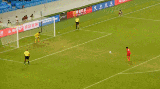

# U15东亚杯：国少点球战4-2日本夺冠 章琮玺神勇2扑点 韩国获季军

在北京时间9月8日晚结束的2023年东亚足联U15男子足球锦标赛决赛中，中国国少队在常规时间内0-0战平日本国少队。随后的点球大战，凭借门神章琮玺2次扑点，国少4-2胜出夺得冠军。而在稍早结束的季军争夺战中，韩国国少4-0完胜中国台北队，韩国获得季军，中国台北队最终名列第4。

**【关键焦点】**

第43分钟，国少门将章琮玺近距离封出日本队颇具威胁的劲射，力保国少球门不失。

第68分钟，国少错失绝佳良机。李翔边路超车突破日本球员防守后传中，替补登场的王一禁区内甩头攻门划门而过。

第82分钟，国少险些绝杀！替补登场的杨硕精彩凌空射门，被日本门将神勇封出。

**【精彩回放】**

开场仅3分钟，日本队便制造威胁，禁区内无人盯防下头球顶高错失良机。

第8分钟，国少球员打出精彩配合，连续一脚出球后，姚俊宇未能在禁区弧顶位置形成射门。

第27分钟，日本队禁区弧顶位置打出一脚颇具威胁的兜射，被章琮玺神勇挡出。

第36分钟，日本队摆脱防守后突入禁区小角度抽射，皮球稍稍高出，国少逃过一劫。

易边再战，第54分钟，国少10号核心布尼亚明在边路带球连续突破摆脱日本球员防守，随后送出传中，姚俊宇禁区内未能停好球形成射门。

第80分钟，王一突入禁区后尝试传中，可惜被日本后卫封堵。

补时9分钟后，双方常规时间战成0-0平。比赛进入残酷的点球大战，李翔首轮失点，但门神章琮玺神勇此后2次扑点助队逆转，最终中国国少4-2取胜。

**【出场阵容】**

中国国少首发（4-5-1）

门将：1-章琮玺

后卫：2-韩易恒、4-尚天羽、5-张洪福、12-王庚睿（81'3-都俊豪）

中场：6-刘柄麟、7-姚俊宇、8-刘佳乐、10-布尼亚明-阿不都沙拉木（65'18-王一）、11-胡喜文（55'17-李翔）

前锋：16-杨黔东（81'19-杨硕）

替补未出场：20-刘震毅、9-王伟轩、13-朴慜峻、14-邵明震、15-卞宇郎

