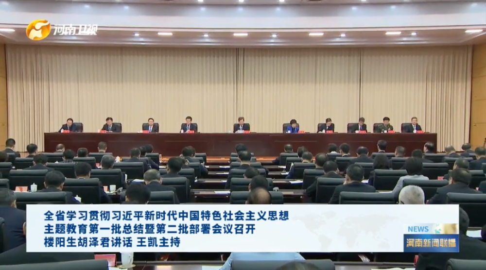
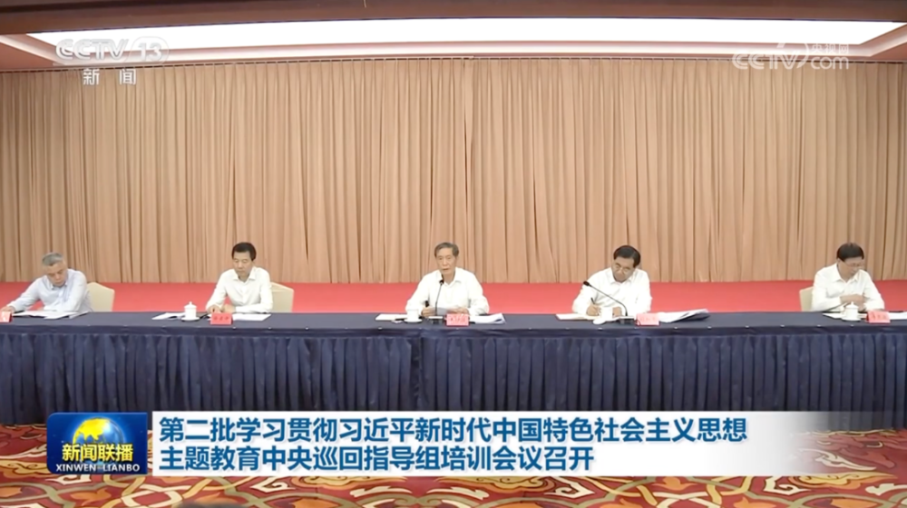
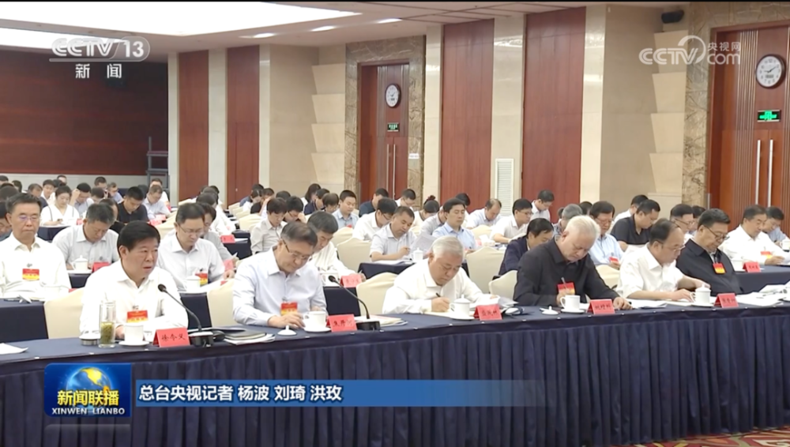
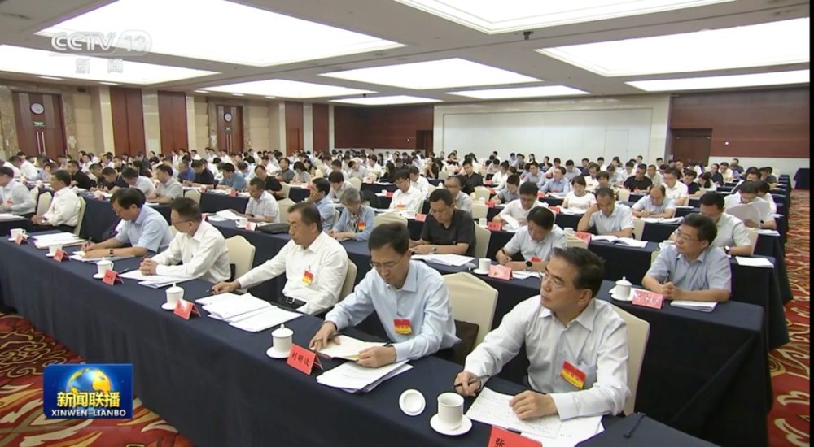
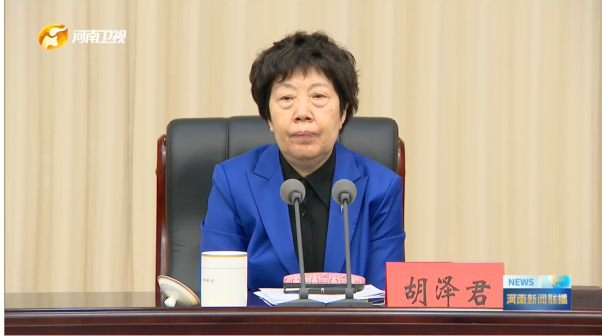

# “女将”再挂帅！中央巡回指导组已赴地方，首位公开亮相的组长是她

**撰文 | 董鑫 余晖**

第二批学习贯彻习近平新时代中国特色社会主义思想主题教育已开始部署，中央巡回指导组组长陆续亮相。

据《河南日报》报道，9月7日，河南全省学习贯彻习近平新时代中国特色社会主义思想主题教育第一批总结暨第二批部署会议召开。河南省委书记楼阳生、中央第九巡回指导组组长胡泽君讲话，河南省省长王凯主持。

在公开报道中，胡泽君是首个亮相的中央巡回指导组组长。

**行前召开培训会议**

3月30日，中共中央政治局召开会议，决定从今年4月开始，在全党自上而下分两批开展学习贯彻习近平新时代中国特色社会主义思想主题教育。

根据中央安排，主题教育自上而下分两批进行：

第一批从2023年4月开始，2023年8月基本结束；

第二批从2023年9月开始，2024年1月基本结束。

目前，第二批主题教育已经开启。

9月5日，学习贯彻习近平新时代中国特色社会主义思想主题教育第一批总结暨第二批部署会议召开。

中共中央政治局常委、中央学习贯彻习近平新时代中国特色社会主义思想主题教育领导小组组长蔡奇在会上强调，要全面贯彻落实党中央部署，精心组织开展第二批主题教育。

针对第二批主题教育，中央组建了“巡回指导组”，第二批主题教育中央巡回指导组组长、副组长也均在9月5日会议现场。

9月6日，第二批学习贯彻习近平新时代中国特色社会主义思想主题教育中央巡回指导组培训会议召开。

现场画面显示，多位第一批主题教育中的中央指导组组长均在现场。例如：

中央第一指导组组长车俊、第三指导组组长韩长赋、第四指导组组长盛茂林、第五指导组组长李锦斌、第九指导组组长胡泽君、第十一指导组组长徐令义、第十五指导组组长王国生、第十七指导组组长陈求发、第二十二指导组组长许又声、第三十四指导组组长姚增科、第四十四指导组组长焦开河、第五十指导组组长陆东福等。

**首位中央巡回指导组组长亮相**

培训会议之后，首位公开亮相的中央巡回指导组组长是胡泽君。

9月7日，河南召开了全省学习贯彻习近平新时代中国特色社会主义思想主题教育第一批总结暨第二批部署会议。胡泽君以“中央第九巡回指导组组长”的身份出现在现场。

在第一批主题教育中，胡泽君是中央第九指导组组长，带队指导河南和山东，她也是负责指导31省份主题教育工作的中央第一到第十五指导组组长中唯一的女性。

胡泽君出生于1955年3月，今年68岁，重庆人，她曾在司法部、广东省、最高检、审计署工作，担任过最高人民检察院党组副书记、副检察长（正部长级），审计署党组书记、审计长，今年3月，她赴全国政协工作。

在9月7日的会议上，胡泽君肯定了河南第一批主题教育的成绩。

她指出，河南省委解决了一批事关经济发展的突出问题、事关群众利益的急难愁盼问题、事关社会大局和谐稳定的紧迫问题，第一批主题教育取得明显成效。

同时，胡泽君对第二批主题教育提出了要求。

“更加注重分类指导，认真解决实际问题，切实抓好统筹衔接，坚决防止形式主义、官僚主义，把搞好主题教育与全面完成今年各项工作任务紧密结合起来，用河南经济社会高质量发展的实际成果检验主题教育成效。”

政知君注意到，同日，河南还召开了全省第二批学习贯彻习近平新时代中国特色社会主义思想主题教育省委巡回督导组培训会，部署安排第二批主题教育巡回督导工作，中央第九巡回指导组到会指导。

**多地召开总结会议**

除了河南省，还有多个省份、部委等近期都召开了主题教育相关总结会议。

一方面是对第一批主题教育工作进行总结。

9月6日，最高人民法院召开主题教育总结大会。

会上表示，自4月12日最高法主题教育动员部署会以来，全院调研组共查找问题242个，转化运用调研成果184项，院领导牵头负责整改整治问题28个、各单位牵头负责整改问题124个，还建立了审判质量管理指标体系并组织试点，司法作风不正、“三个规定”填报不实、案件长期未结等群众反映强烈的突出问题整改取得积极进展。

9月7日，最高人民检察院召开主题教育总结大会。

会上表示，主题教育开展以来进行了10次全院学习和专题辅导、8次党组集中研讨交流。围绕23项重点调研内容,党组成员领题调研，形成一批有分量的调研成果。并明确120项检察为民实事、36项检察改革任务、24个院级整改整治问题、90项建章立制任务，狠抓落实、务求实效。

另一方面，不同省份都结合省内重点工作对第二批主题教育工作进行了部署。

海南省表示，要把主题教育激发出来的干事热情转化为自由贸易港建设的新进展和人民群众看得见摸得着的新红利。

浙江省强调，要聚焦中心大局，深化实施“感恩奋进、实干争先”行动，引导党员干部积极投身办好杭州亚运会亚残运会、大力实施三个“一号工程”、共同富裕示范区建设等火热实践。

湖南省提出，要紧紧围绕“三高四新”美好蓝图，围绕落实湖南省委十二届四次全会确定的目标任务，以改革创新精神解决发展中的痛点难点堵点问题，切实把主题教育成果转化为推动高质量发展的强大动力。

**资料｜新华社、央视新闻、河南日报等**

**【版权声明】本文著作权归政知新媒体独家所有，未经授权，不得转载。**

