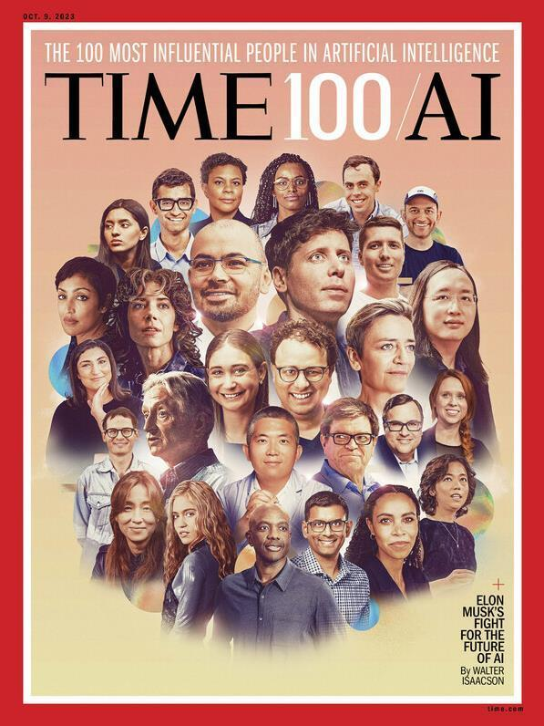
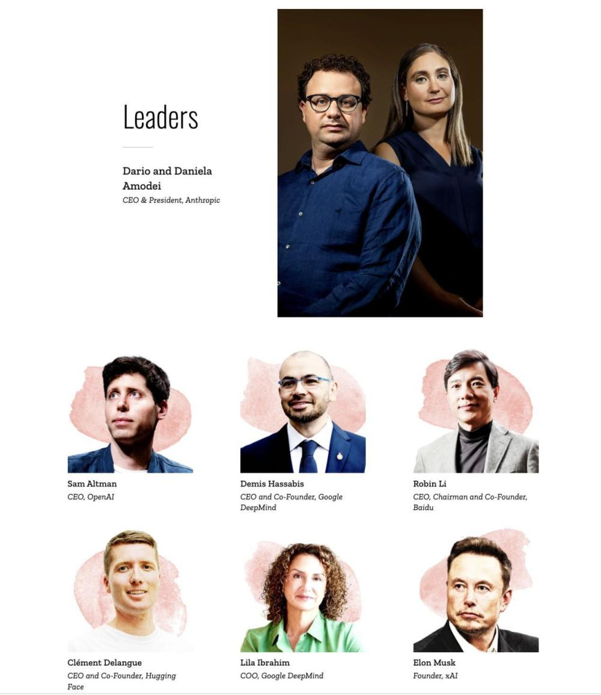
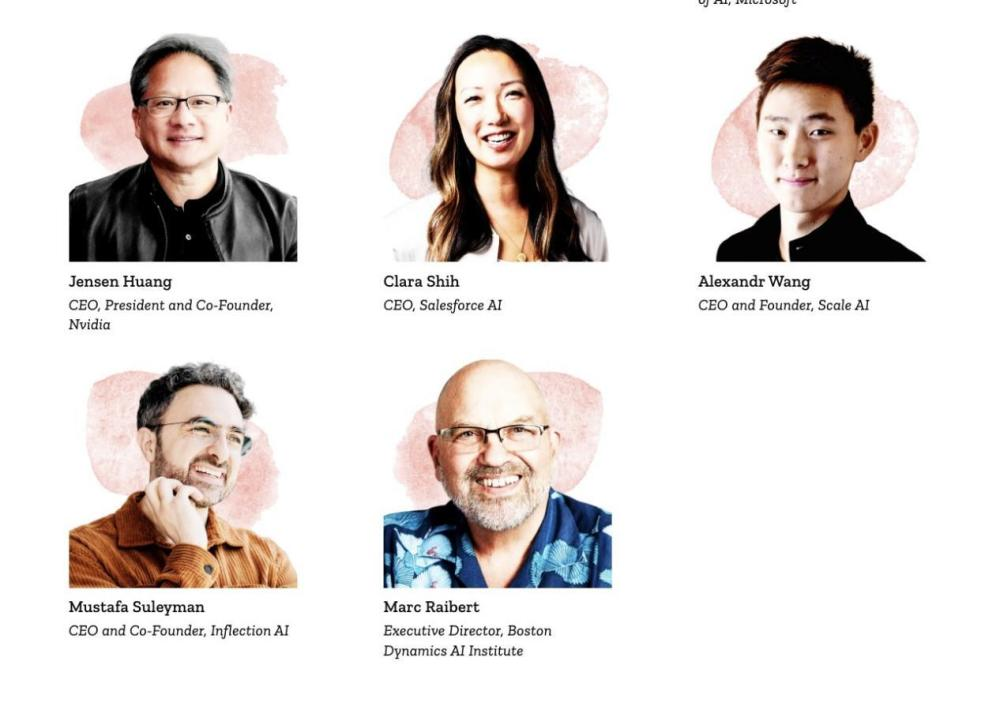
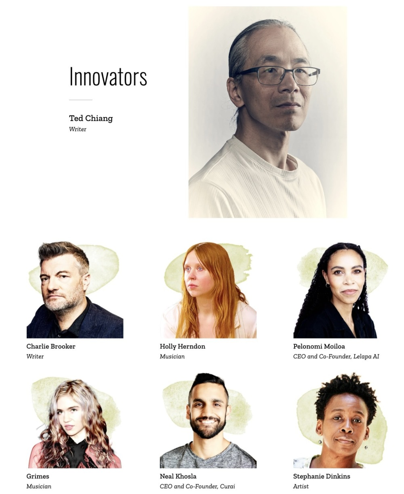
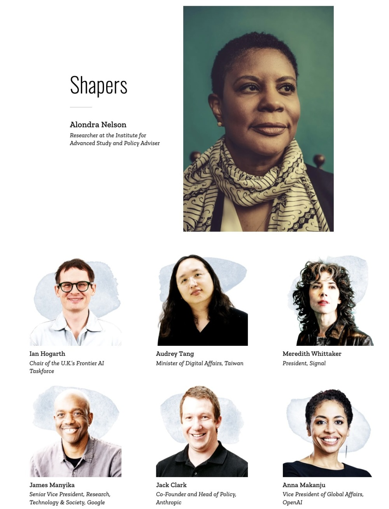
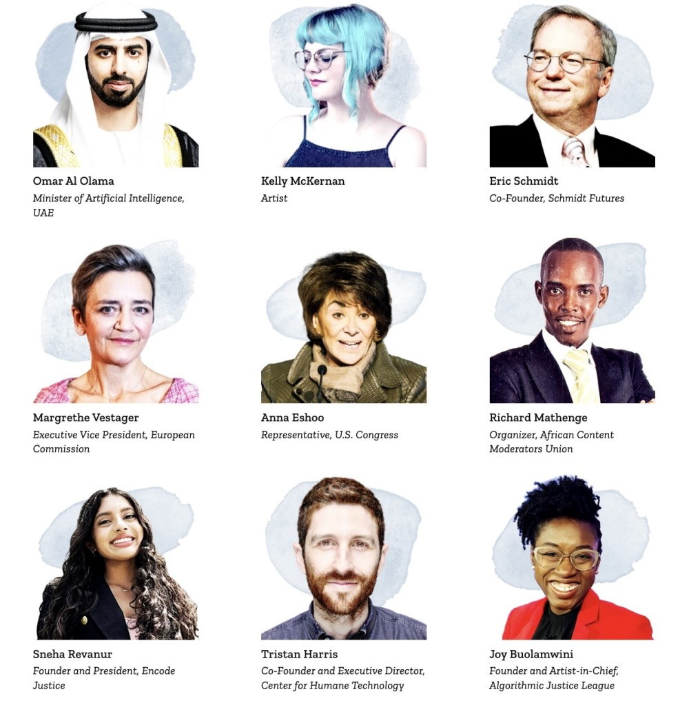
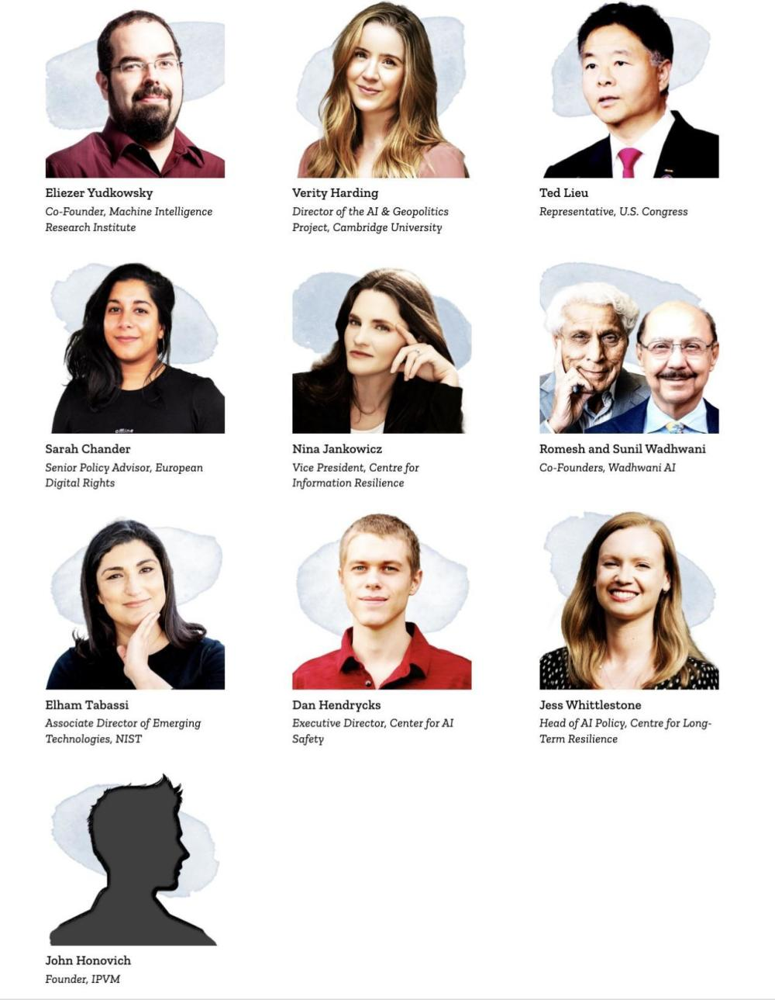
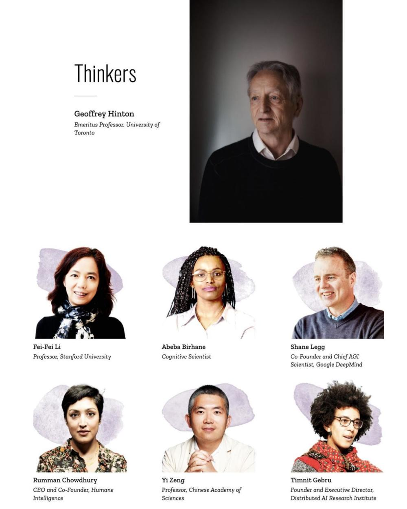
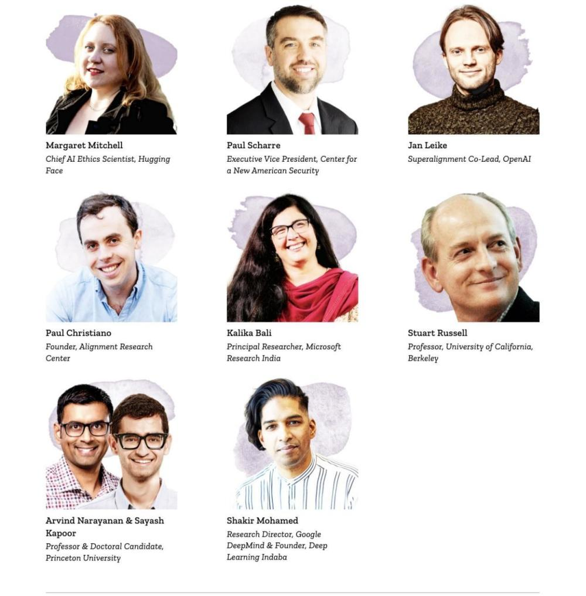

# 《时代》评出100位AI领域最具影响力人物，李彦宏、李开复、曾毅在列

编辑：腾讯科技 /郝博阳 郭晓静

翻译：金鹿

在过去的一个世纪里，《时代》杂志的封面反映了塑造社会的力量；今年也是如此。生成式人工智能（Generative
AI）无疑是今年最受关注的重塑社会的力量。“我现在看到的创新水平比我一生中见过的要强几个数量级，”前谷歌首席执行官埃里克·施密特在接受采访的时候说，“我经历了PC产业、互联网革命、Unix革命
、Linux、Facebook 和 Google。现在的创新增长速度比我经历的所有这些增长的总和还要快。”

《时代》杂志的资深编辑和记者花了几个月的时间收集了各方建议，将数百项提名汇总到一起，最终形成了这份名单。他们采访了这份名单上几乎所有的人，以了解他们对当今人工智能未来发展道路的看法。

“我们希望重点关注处于人工智能热潮最前沿的行业领导者、在努力解决人工智能给人类社会带来的新的道德伦理问题的人，以及世界各地试图利用人工智能应对社会挑战的创新者，
”领导这项工作的执行编辑奈娜·巴耶卡尔 (Naina Bajekal) 说道。

这 100
个人组成的群体可被视为推动人工智能发展的最重要力量。他们之间的关系，可能是竞争对手、监管者、科学家和艺术家——既竞争又合作的一个群体，他们的洞察力、欲望、甚至是某些性格上的缺陷，都将塑造影响力日益增长的AI技术方向。

**领导者（Leaders）**

1.达里奥·阿莫迪（Dario Amodei）与丹妮拉·阿莫迪（Daniela Amodei），Anthropic首席执行官/总裁

现年40岁的达里奥和36岁的丹妮拉分别是世界领先人工智能安全研究实验室Anthropic的首席执行官和总裁。他们认为，与其他构建尖端人工智能系统的公司相比，他们采取了更安全、更负责任的人工智能对齐方法。在行业术语中，对齐意味着确保人工智能系统与人类价值观“一致”。

Anthropic成立于2021年，开展了开创性的“机械可解释性”研究，旨在让开发人员进行类似于大脑扫描的事情，看看人工智能系统内部到底发生了什么，而不是仅仅依赖于它的文本输出，因为这并不能真实地反映其内部运作。Anthropic还开发了宪法人工智能（Constitutional
AI），这是一种调整人工智能系统的新方法。该公司已将这些方法嵌入到其最新的聊天机器人Claude 2中。Claude
2是OpenAI最强大的聊天机器人GPT-4的劲敌。

2.萨姆·奥特曼（Sam Altman），OpenAI首席执行官

奥特曼相信，人类有足够的智慧和适应能力来应对日益强大的人工智能，只要这种技术的发布是安全的、渐进的。他在接受采访时称：“社会有很强的适应能力，因为人们比许多所谓专家认为的要聪明和精明得多，我们可以做到！”这一理念可以解释OpenAI为何决定在2022年11月发布其震撼世界的聊天机器人ChatGPT，以及为何几个月后推出了GPT-4，这是迄今为止向公众提供的最强大的大语言模型。

3.李彦宏，百度联合创始人兼董事长

作为中国最重要的未来学家，李彦宏在很长时间内都在搭人工智能的顺风车。自2000年创立百度以来，他的使命就是更好地理解和预测人类行为，并在人工智能研究上投入了数百亿美元。百度已经有了虚拟助手小度，有可以在大城市运营的自动驾驶出租车车队，最近还公开发布了大语言模型文心一言。

人工智能从数据中学习，百度每月6.77亿用户的数量可能帮助其超过任何国内竞争对手。李彦宏认为，这种可能性是“人机交互的范式转变”，并预测将诞生“数以百万计的新人工智能原生应用”。目前最迫切的问题是，百度是否能够获得硬件来实现李彦宏的雄心壮志，该公司已经在开发自己的昆仑微处理器。

4.埃隆·马斯克（Elon Musk），xAI创始人

众所周知，这位世界首富非常担心人工智能，害怕其可能毁灭人类。但与此同时，他也在积极帮助开发这种技术。马斯克曾向人工智能初创公司DeepMind投资了数百万美元，与奥特曼共同创立了人工智能公司OpenAI，希望以更负责任的方法来创造通用人工智能(AGI)。

然而，马斯克担心人工智能技术发展得太快了，他呼吁暂停人工智能的开发和培训，并建立自己的新公司xAI，旨在“了解宇宙的真实本质”。此外，他还在推动特斯拉研发自动驾驶汽车、带领Neuralink研究可植入人脑的微芯片、打造类人机器人擎天柱等。

马斯克拥有的巨额财富足以确保他成为人工智能领域最有影响力的人物之一，而他对这项技术能带来的回报以及蕴藏的风险相互矛盾的看法，同样引人关注。

5.李开复，创新工场首席执行官兼董事长

40多年来，李开复始终是计算机工程领域的先锋，他在1988年的博士论文中创造了世界上第一个大词汇量语音识别模型，后来先后担任过苹果、微软以及谷歌高管。他坚信AGI可以比人类更好地完成大多数认知任务，随着ChatGPT这样的大语言模型的快速发展，李开复认为“从某些方面来看，我们已经实现了这一目标”。

正是这种惊人的进步促使李开复在7月份创办了新的语言创业公司——零一万物人工智能公司。他写道，大语言模型技术“是中国不能错过的历史性机遇”。

6.黄仁勋，英伟达联合创始人兼首席执行官

黄仁勋总是痴迷于惊人的视觉效果。在他8岁的时候，曾把打火机油喷到游泳池里，然后跳进去欣赏水面下的火焰之舞。1993年，黄仁勋创立了英伟达，并将这种激情带入了整个行业。英伟达最初是为越来越奇幻和沉浸式视频游戏制造显卡。然而人工智能革命却推动英伟达的股价在过去1年里飙升了191%，市值超过一万亿美元。随着ChatGPT等大语言模型的爆炸式增长，对英伟达芯片的需求激增。黄仁勋宣称：“我们已经到达了一个新计算时代的转折点！”

**创新者（Innovators）**

1.姜峯楠（Ted Chiang），知名作家

姜峯楠可能是世界上最著名的科幻小说作家。他精心构思的短篇小说探索了我们的内心世界和社会如何应对科学结构中意想不到的裂痕。接受一种激素注射，能极大地改善你的认知功能，你会有什么感觉？如果学习一门外星语言会改变你感知时间的方式呢？如果人类要创造人造生命，我们对它应该承担哪些义务？

姜峯楠已成为对人工智能及其背后的公司最尖锐的批评者之一。他认为，如果不进行结构性经济改革，人工智能的崛起可能会加剧财富不平等，削弱工人的力量，并巩固科技寡头的统治。他还担心大语言模型“胡言乱语”，而人类无力阻止。

2.克里斯托瓦尔·巴伦苏埃拉(Cristóbal Valenzuela) ，Runway联合创始人兼首席执行官

对于好莱坞的演员来说，罢工的部分原因是担心人工智能将越来越多地用于制作电影场景，巴伦苏埃拉则被他们视为头号公敌。巴伦苏埃拉是人工智能视频制作公司Runway的联合创始人兼首席执行官，她认为：“我们正在走向这样的世界：你所消费的所有媒体和娱乐内容都将由人工智能生成。”
不过，巴伦苏埃拉承认，如果技术像他想象的那样发展，创意产业的许多工作岗位将不复存在。

3.诺姆·沙齐尔（Noam Shazeer），Character.AI联合创始人兼首席执行官

沙齐尔是Character.
AI的联合创始人兼首席执行官，该公司网站允许用户与人工智能版本的名人交谈，包括英国女王伊丽莎白二世、马斯克以及弗罗多·巴金斯等。沙齐尔在2017年的研究论文中提出了转换器，这是一种网络架构，也是chatgpt等当前生成式人工智能工具热潮的基础。换句话说，是支撑当前人工智能革命的基础。Character.
AI也有不少批评者，他们担心这项新技术会对不知情的公众产生影响，因为相当多的Character. AI用户是青少年。

**产业塑造者（Shapers）**

1.阿隆德拉·纳尔逊(Alondra Nelson)，高等研究院研究员和政策顾问

去年，当拜登领导的白宫应对生成式人工智能的快速变化时，作为白宫科技政策办公室(OSTP)主任，尼尔森帮助发布了《人工智能权利法案蓝图》。这份文件不具有法律约束力或可执行性，但它奠定了一个框架，她希望人工智能的开发者和政策制定者都能遵守，以确保人工智能是一股促进公共利益的力量。

但尼尔森警告说，对机器抢走我们工作的最坏担忧往往被夸大了。她以放射学为例，人工智能先驱杰弗里·辛顿(Geoffrey
Hinton)在2016年预测，放射学将在五年内被人工智能超越。然而，现在全世界都缺少放射科人才。

纳尔逊于今年2月离开白宫，但仍担任几个有影响力的职位。作为美国进步中心的研究员，她为州议员和国会议员提供人工智能政策方面的建议。作为高级研究所人工智能工作组的成员，她在行业、政策制定者和民间社会之间进行联络。

2.奥马尔·奥拉马（Omar Al Olama），阿联酋人工智能部长

2017年，奥拉马在阿联酋就职，成为世界上第一位人工智能部长。他认为：“我们需要从整体角度看待人工智能及其在整个政府中的应用，并确保不同机构之间至少有某种协调。”到目前为止，围绕人工智能及其监管的全球对话始终是碎片化的。奥拉马说，在避免集体思维方面，采用不同的方法是“健康的”，但各国必须愿意在一个包容的多边论坛上共同努力。他警告说：“制造孤岛，尤其是像人工智能这样深奥的技术领域，是在自找麻烦。”

**思想家（Thinkers）**

1.杰弗里·辛顿(Geoffrey Hinton)，多伦多大学名誉教授

辛顿在神经网络的发展和普及方面发挥了重要作用。今年2月，作为过去50年来最具影响力的人工智能研究人员之一，辛顿经历了一个“顿悟时刻”。

现年76岁的辛顿在2013年加入谷歌之前，始终致力于构建模拟人类大脑的人工智能系统，主要是在学术界工作。他坚信，大脑比他和其他人正在制造的机器更好，通过使它们更像大脑，它们会得到改进。但在今年2月，他意识到：“我们现在拥有的数字智能可能已经比大脑更好了，只是规模没有那么大。”

辛顿在5月份辞去了副总裁兼工程研究员的职位，并解释自己离开是为了能够自由地谈论人工智能的危险。他说：“这些东西会变得比我们更聪明，并接管一切。如果你想知道那是什么感觉，可以去问一只鸡。”

2.李飞飞，斯坦福大学教授

李飞飞曾指出，人工智能不会是技术第一次改变世界，每次改变都是朝着更好的方向发展。但她也认为技术是双刃剑，“科技赋予我们力量，但随之而来的是危险，人工智能技术也是如此”。李飞飞比大多数人更了解她所描述的承诺和危险。她的研究为今天运行的图像识别人工智能系统奠定了基础，并扩大了人工智能在医疗保健领域的应用。李飞飞是美国国家人工智能研究资源(NAIRR)工作组的成员，呼吁政府为广泛的研究人员提供安全开发人工智能所需的资源。

3.曾毅，中国科学院教授

大二时在中国科学院上的人工智能导论课上，教授放映了史蒂文·斯皮尔伯格(Steven Spielberg)
2001年的电影《人工智能》。在一个场景中，两位研究人员讨论模拟人类大脑构建能够理解爱的机器人。曾毅受到了启发，并誓言“这就是我一生想要做的事情”。如今，他试图建立“大脑启发的智能”，即一种被设计成尽可能与人类大脑相似的人工智能系统，同时能够理解道德规范。

2016年左右，曾毅开始更加关注人工智能系统带来的风险，他开始花更多的时间与政策制定者合作，制定有利于人工智能发展的规则。2019年，曾毅带领团队撰写了《北京人工智能准则》。此外，他还推动加强国际合作。

4.伊利亚·萨茨凯弗（Ilya Sutskever），OpenAI联合创始人兼首席科学家

在2015年作为创始成员加入OpenAI之前，萨茨凯弗已经因在计算机视觉和机器翻译领域的突破性进展而闻名。从谷歌挖来他是OpenAI最早的成功之举，如果没有他，该公司接下来的一长串创新可能会大不相同。萨茨凯弗参与撰写了许多论文，包括帮助构建ChatGPT和图像生成器DALL-
E的论文。今年7月，OpenAI宣布，萨茨凯弗将成为Superalignment团队的联合负责人，该团队旨在解决如何确保超级智能人工智能为人类利益服务的技术挑战。

5.杨立昆（Yann LeCun），Meta首席人工智能科学家

这位法国计算机科学家在20世纪80年代曾假设，人工神经网络可以被设计成模仿人类的大脑，此后几十年，他的想法被广泛嘲笑为不切实际。但由于该领域的技术突破，杨立昆的想法将为当前的生成型人工智能革命奠定基础。

如今，身为Meta首席人工智能科学家，杨立昆仍在发表大胆而有争议的宣言。
例如，他认为围绕人工智能存在的恐惧是“荒谬的”，类似于“末日崇拜”，甚至与深度学习的其他先驱辛顿和约书亚·本吉奥(Yoshua
Bengio)发生了冲突。他还认为，目前对大语言模型的狂热是一种被误导的时尚，很快就会走入死胡同。

