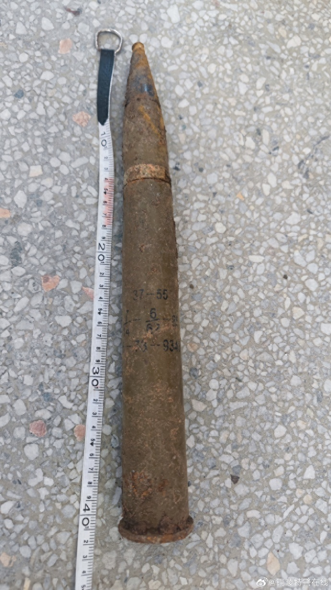

# 两小学生徒手挖出炮弹送校长室，民警疏散师生后将炮弹转移

9月8日，据铜陵公安在线消息，9月7日，在安徽铜陵，铜陵特警排爆大队接到报警，称某校学生发现一枚疑似炮弹。

经调查，民警发现，当日中午，两名学生玩耍时在一处树林内发现该枚炮弹，随后两人协力将炮弹从土中挖出，并抱到了四楼校长室，老师发现后立即报警。

民警询问该学生如何挖出炮弹，对方表示用手挖的，自己并不知道是什么东西，随即民警展开教育：“这个东西很危险，看到了跟老师讲，不能用手抱过去。”

排爆民警随即疏散教学楼内师生，身着排爆服将炮弹从四楼转移至安全地点。

另据铜陵特警在线消息，9月7日12时许，铜陵市某小学两名学生在校园树林内发现一枚疑似炮弹，两人将其从土中挖出并抱回，老师发现后立即报警。

经排爆民警研判，该炮弹为战时遗留高射炮弹，弹体完整且字迹清晰，引信完好，存在较大的危险性。排爆队员按照涉爆现场规范处置流程，疏散楼内师生，成功将炮弹转移至安全地点。

处置完毕后，排爆队员对学校师生开展涉爆物品宣防教育，并来到发现炮弹的地点，仔细排查是否存在遗留炮弹，进一步排除安全隐患。

铜陵特警在线提供图片显示，该炮弹长约40cm。

**【来源：九派新闻综合铜陵公安在线、铜陵特警在线】**

