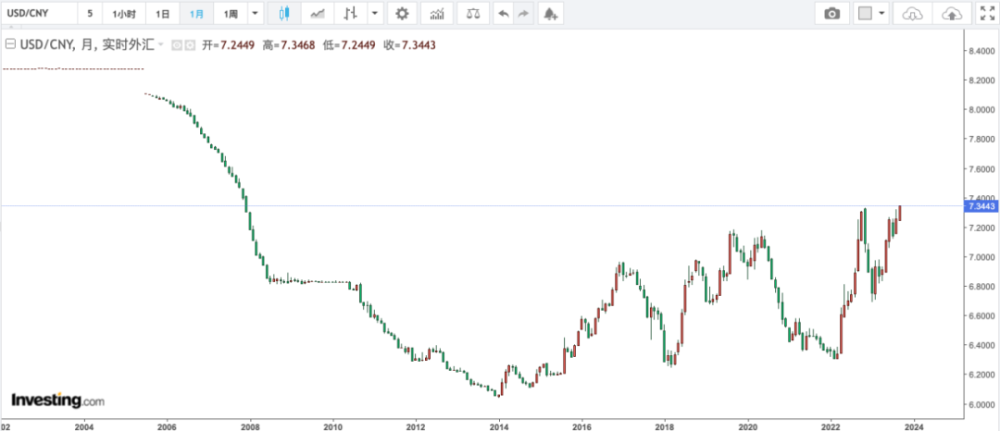

# 人民币汇率创16年新低，后续有望在国内经济复苏中企稳反弹

**记者 王玉**

周五早盘，在岸人民币对美元跌破去年11月创下的15年低点7.3280，最低探至7.3478，创2007年12月以来新低。

分析师表示，导致人民币汇率承压的主要原因是近期美元强势反弹、中美利差持续倒挂，加上市场对国内经济复苏还存在疑虑。不过，分析师认为，人民币汇率继续下跌幅度有限。

12:20左右，在岸人民币对美元报7.3442，较上日16:30收盘价7.3279跌163个基点。美元指数在104.90上下波动，较上日收盘价跌约0.1%，但比7月中旬的低点涨超5%。

一位不愿具名的机构人士对界面新闻表示，一方面是市场对中国经济复苏可能还存在一定疑虑，比如非制造业商务活动指数持续降温，另一方面
，近期人民币利率下行，而美债收益率强劲反弹，加上A股波动，均对短期外汇市场构成扰动。

北京大学国民经济研究中心也在本周发布的一份研报中也指出，从内部环境来看，近期高温天气和极端气候频发，国内有效需求仍不足，消费和投资增长或放缓，出口下行压力仍在，促使人民币依然承压。从外部环境来看，中美利差保持倒挂，北向资金流出对人民币汇率形成一定压制。

目前，美国1年、3年、10年期国债收益率分别在5.43%、4.64%、4.23%左右，中国1年、3年、10年期国债收益率分别在2.07%、2.32%、2.68%左右。

“整体看，我国外汇市场供需基本平稳，外贸韧性并呈现改善迹象，美元走势受制于经济前景与加息尾声，人民币短期走势有偏离基本面之嫌，近期在岸即期与中间价偏离明显。”上述机构人士称。

周五，人民币对美元中间价报7.2150，较上日在岸人民币对美元收盘价高1129个基点，显示了央行维稳人民币的态度。

该人士还表示，国内消费、外贸等最困难的时期可能已经过去，经济复苏动能有望逐步改善，在坚实的基本面支撑下，年末人民币汇率有望展开一波反弹。

海关总署周四公布的数据显示，以美元计，8月，中国出口金额同比下降8.8%，降幅较上月收窄5.7个百分点，进口同比下降7.3%，降幅比上月收窄5.1个百分点。进、出口增速均好于市场预期。

此外，分析师提到，央行二季度货币政策执行报告表示，要对市场顺周期、单边行为进行纠偏，坚决防范汇率超调风险。此后至今，央行已相继发行离岸央票、下调外汇存款准备金率，释放出较强的稳汇率信号。由于央行汇率管理工具仍十分丰富，在政策底已较为明确的情况下，未来人民币汇率继续贬值的空间有限。

北京大学国民经济研究中心表示， 随着利好政策不断释放，市场预期逐渐稳定，央行适时启用稳汇率工具，预计9月美元对人民币汇率在7.20-7.35区间波动。

