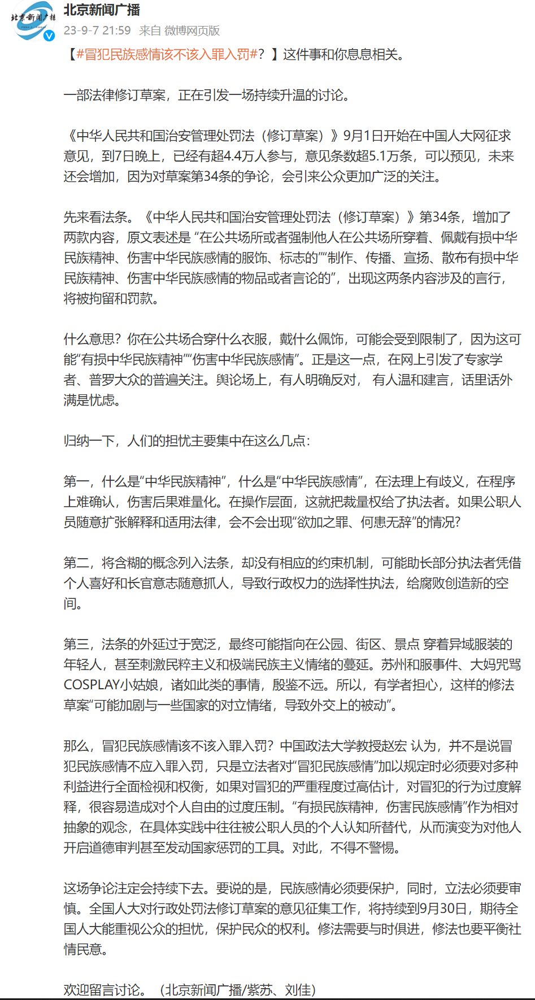

# 冒犯民族感情该不该入罪入罚？这件事和你息息相关

一部法律修订草案，正在引发一场持续升温的讨论。

《中华人民共和国治安管理处罚法（修订草案）》9月1日开始在中国人大网征求意见，到7日晚上，已经有超4.4万人参与，意见条数超5.1万条，可以预见，未来还会增加，因为对草案第34条的争论，会引来公众更加广泛的关注。

先来看法条。《中华人民共和国治安管理处罚法（修订草案）》第34条，增加了两款内容，原文表述是
“在公共场所或者强制他人在公共场所穿着、佩戴有损中华民族精神、伤害中华民族感情的服饰、标志的”“制作、传播、宣扬、散布有损中华民族精神、伤害中华民族感情的物品或者言论的”，出现这两条内容涉及的言行，将被拘留和罚款。

什么意思？你在公共场合穿什么衣服，戴什么佩饰，可能会受到限制了，因为这可能“有损中华民族精神”“伤害中华民族感情”。正是这一点，在网上引发了专家学者、普罗大众的普遍关注。舆论场上，有人明确反对，
有人温和建言，话里话外满是忧虑。

归纳一下，人们的担忧主要集中在这么几点：

第一，什么是“中华民族精神”，什么是“中华民族感情”，在法理上有歧义，在程序上难确认，伤害后果难量化。在操作层面，这就把裁量权给了执法者。如果公职人员随意扩张解释和适用法律，会不会出现“欲加之罪、何患无辞”的情况?

第二，将含糊的概念列入法条，却没有相应的约束机制，可能助长部分执法者凭借个人喜好和长官意志随意抓人，导致行政权力的选择性执法，给腐败创造新的空间。

第三，法条的外延过于宽泛，最终可能指向在公园、街区、景点
穿着异域服装的年轻人，甚至刺激民粹主义和极端民族主义情绪的蔓延。苏州和服事件、大妈咒骂COSPLAY小姑娘，诸如此类的事情，殷鉴不远。所以，有学者担心，这样的修法草案“可能加剧与一些国家的对立情绪，导致外交上的被动”。

那么，冒犯民族感情该不该入罪入罚？中国政法大学教授赵宏
认为，并不是说冒犯民族感情不应入罪入罚，只是立法者对“冒犯民族感情”加以规定时必须要对多种利益进行全面检视和权衡，如果对冒犯的严重程度过高估计，对冒犯的行为过度解释，很容易造成对个人自由的过度压制。“有损民族精神，伤害民族感情”作为相对抽象的观念，在具体实践中往往被公职人员的个人认知所替代，从而演变为对他人开启道德审判甚至发动国家惩罚的工具。对此，不得不警惕。

这场争论注定会持续下去。要说的是，民族感情必须要保护，同时，立法必须要审慎。全国人大对行政处罚法修订草案的意见征集工作，将持续到9月30日，期待全国人大能重视公众的担忧，保护民众的权利。修法需要与时俱进，修法也要平衡社情民意。

欢迎留言讨论。（北京新闻广播/紫苏、刘佳）

