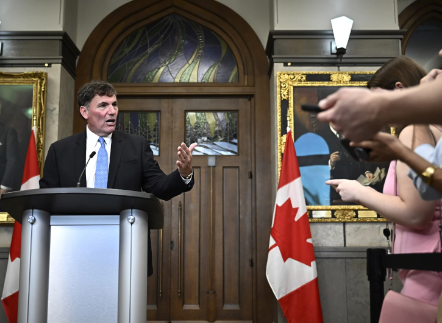
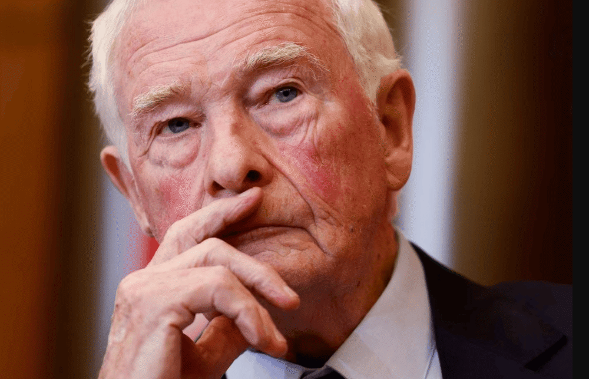

# 加拿大发起“外国干预选举”公开调查，涉及中俄印等国

【文/观察者网 刘程辉】加拿大政客热炒的所谓“外国干预选举”戏码又加更了，而这次被针对的不止中国。

当地时间9月7日，加拿大公共安全、民主机制和内政部长勒布朗（Dominic LeBlanc）宣布任命魁北克上诉法院法官霍格（Marie-Josée
Hogue）领导对“外国干涉”加拿大2019年和2021年选举的公开调查，涉及中国、俄罗斯、伊朗和印度等。讽刺的是，加拿大此番操作并非新鲜事，曾一度宣称“不会公开调查”，加政府任命的上一位调查官员也仅仅干了3个月便决定辞职。

 _9月7日，加拿大公共安全部长勒布朗宣布任命霍格为新任调查官员/美联社_

据美联社（AP）和英国广播公司（BBC）报道，勒布朗在7日上午宣布了这项任命，他表示，霍格将领导一项“广泛的调查”，有权查阅所有相关内阁文件，以及她认为与调查目的相关的所有其他信息。勒布朗说，霍格的任命还得到了所有反对党的支持。

霍格不仅将调查所谓“来自中国的潜在干预”，还将调查来自俄罗斯、伊朗、印度和其他非国家行为体的“潜在干预”。

当被问及为什么范围扩大到不仅仅针对中国时，勒布朗声称，中国“不是唯一试图破坏加拿大的外国行为体”。

“外国对加拿大民主制度的干涉是不可接受的，”勒布朗煞有介事地表示，“中国并不是唯一一个试图破坏加拿大或其他西方民主国家民主制度的外国行为体。这一挑战并非加拿大独有。”

勒布朗说，调查将针对“与2019年和2021年联邦选举有关的中国、俄罗斯、伊朗和印度的指控”，并于明年底前提交调查报告。他称，调查还将审查为政府高级决策者提供“外国干预”评估报告的流程。

这项任命结束了加拿大政府长达数月寻找新的调查官员的过程。

今年3月，特鲁多政府特意任命大卫·约翰斯顿为“外国干预选举”的特别调查员。约翰斯顿当时宣称，不会对外国干涉加拿大选举的指控进行“公开调查”，相反，他建议就此事举行听证会。

值得注意的是，与“公开调查”相比，听证会的强制性要弱不少，两者不具有同等的法律权力。例如，
**所谓“公开调查”具有全套司法权力，能够调阅文件和强迫证人出庭作证，拒绝作证的人还会面临藐视法庭的罪名。**
而在听证会上，证人则是以被“邀请”的形式出面，不能被强迫，也不会因拒绝作证面临任何指控。

正因如此，有人抨击特鲁多对待“外国干预”调查的态度不认真，因为批评者认为特鲁多所在的自由党从“外国干预”中获益。还有反对党质疑特鲁多任人唯亲，因为约翰斯顿是特鲁多及其家族的朋友和“滑雪伙伴”。

在各色的聒噪声中，约翰斯顿仅仅上任了3个月，调查就进行不下去了。据加拿大《环球新闻》6月9日报道，约翰斯顿已决定辞职。

_大卫·约翰斯顿/资料图_

《环球邮报》从约翰斯顿的辞职信中得知，约翰斯顿告诉特鲁多，他的工作目标是“帮助重建对民主制度的信任”，但现在却产生相反的效果，遭到了来自反对派的广泛反对。

勒布朗6月表示，特鲁多对约翰斯顿的服务表示感谢，同时已经开始寻找约翰斯顿的替代者。

近一段时间，加拿大媒体和多名政客不断炒作所谓“中国干预选举”话题。

除任命特别调查员外，5月8日，加方还公然宣布中国驻多伦多总领馆一名领事官员为“不受欢迎的人”。据中国外交部网站消息，5月9日，中方决定采取对等反制措施，将加拿大驻上海总领馆领事甄逸慧列为“不受欢迎的人”，已要求其5月13日前离华。中方保留作出进一步反应的权利。

中国驻加拿大大使丛培武5月19日接受彭博社采访时，奉劝加方不要作出进一步挑衅行为，并表示加拿大应该回归更加独立的外交政策，而不是跟随美国的脚步。

5月24日，中国外交部发言人毛宁在例行记者会表示，我们已多次强调，中方一贯奉行不干涉别国内政的外交政策，也坚决反对任何国家干涉其他国家的内政。我们没有兴趣，也不会干预加拿大的内政和大选。我们奉劝加方摒弃意识形态偏见和冷战思维，不要总拿中国说事。

**本文系观察者网独家稿件，未经授权，不得转载。**

