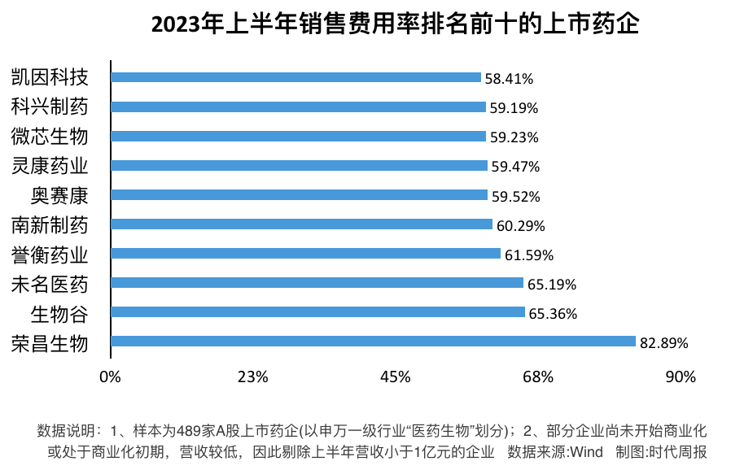

# 医药反腐风暴背后：A股上市药企猛砸钱推广，半年花超1700亿销售费

本文来源：时代周报 作者：特约作者陈佳鑫

医药反腐风暴下，上市药企销售费用持续成为关注重点。

而今年医药反腐大背景下药企的首份半年报也备受瞩目，489家药企的2023年半年报已悉数披露，据统计，上半年上市药企整体仍在加大营销投入力度。

Wind数据显示，2023年上半年，489家A股上市药企（以申万一级行业“医药生物”划分）合计销售费用达1731.36亿元，同比增长7.63%，超过同期合计营收增速的4.14%。

从细分行业来看，化学制药行业销售费用最高，合计达547.05亿元；中药行业次之，合计销售费用达454.21亿元。

六成药企销售费用超利润总额

Wind数据显示，上半年共有9家上市药企销售费用超30亿元，超10亿元的有43家，药企平均销售费用达3.54亿元。

药企的销售费用总额一般与其营收规模正相关。上海医药（601607.SH）上半年销售费用达77.73亿元，在上市药企中居首，该公司销售费用主要用于市场推广、广告成本及销售人员薪酬。同时，上海医药也是上半年药企中唯一营收破千亿的企业。

复星医药（600196.SH）及恒瑞医药（600276.SH）分居二、三名，上半年销售费用分别为50.71亿元、36.78亿元，均以市场推广、学术推广及销售人员薪酬为主。

除销售费用总额外，销售费用率（销售费用/营业收入）这一指标具备较高的参考价值。上海医药上半年销售费用虽然最高，但其销售费用率仅为5.83%，在489家药企中排名381。

若剔除81家医药商业及医疗服务企业，上半年上市药企总销售费用达1350.59亿元，总营收为6662.24亿元，平均销售费用率为20.27%，相当于平均每产生100元营收，需投入20元销售费用。

由于部分药企尚未开始商业化或处于商业化初期，营收较低而销售费用较高，导致销售费用率明显畸高，如亚虹医药-U（688176.SH）上半年营收仅为7.78万，销售费用率高达10297%，“新冠疫苗第一股”康希诺（688185.SH）上半年营收骤降至0.26亿，销售费用率达479.32%，智翔金泰-U（688443.SH）、盟科药业-U（688373.SH）的销售费用率也超过100%。因此本文将上半年营收小于1亿的药企剔除，共剔除企业37家。

剔除后，A股药企中上半年销售费用率最高的为来自科创板的荣昌生物（688331.SH），上半年该公司营收4.22亿元，销售费用为3.5亿元，销售费用率达82.9%。

此外，生物谷（833266.BJ）、未名医药（002581.SZ）、誉衡药业（002437.SZ）、南新制药（688189.SH）四家药企上半年销售费用率同样超过60%。2023年上半年，上市药企中销售费用率超过50%的合计21家，占比近4.5%；超30%合计128家，占比27.7%。

值得注意的是，上半年约6成药企的销售费用超过自身利润总额。

Wind数据显示，489家上市药企中，共有295家销售费用超过其利润总额，占比达60.3%。若剔除掉利润总额亏损的药企，仍有218家销售费用超过其利润总额，占比52.9%。

其中上海医药上半年利润总额45.34亿元，销售费用77.73亿元，比利润总额高出32亿元；太极集团上半年利润总额6.92亿元，但销售费用高达32.11亿元，销售费用是利润总额的4倍以上。

从另一维度来看，尽管近年来我国鼓励创新药研发，不少药企也纷纷表示在进行创新化转型，但从研发投入与销售费用的对比来看，重销售轻研发的现象仍较为普遍。

Wind数据显示，上半年489家上市药企中，366家销售费用高于研发费用，约四分之三药企销售费用高于研发费用。其中西藏药业（600211.SH）上半年销售费用达10.21亿元，而研发费用仅为782.84万元；东北制药（000597.SZ）上半年销售费用达11.09亿元，研发费用仅为2498.43万元。

21家药企会议相关费用均超1亿元

以“会议”之名行“利益输送”之实，是医药反腐关注的重点之一。

今年5月，国家卫健委联合14部委印发的《2023年纠正医药购销领域和医疗服务中不正之风工作要点的通知》中就明确提出，整治行业组织存在的不正之风问题，尤其是以“捐赠”、学术活动、举办或参加会议等名义变相摊派，为非法输送利益提供平台，违规接受捐赠资助等问题。

据时代周报统计，492家药企中，共有149家列出会议相关费用。由于名目较为繁杂，如学术推广费、会议费、会务费、学术研讨费等，故统计时统一口径为“会议相关费用”。此外，在财报中部分企业将学术推广、会议费用与市场推广等费用合并列示，故进行合并统计。

时代周报记者统计发现，149家药企的会议相关费用合计约143.27亿元，其中，21家会议相关费用均超1亿元，其中最高超30亿元。

半年报显示，步长制药（603858.SH）上半年“市场、学术推广及咨询费”达32.11亿元。步长制药在半年报中称，公司营销模式的核心竞争优势在于脑心同治论指导下的专业化学术推广。“公司通过脑心同治学院、脑心同治学术交流会开展在校教育和临床医生继续教育，通过学术推广会介绍公司产品特点及相关领域的最新发展趋势，凝聚认可公司产品的医师团队，以循证医学方法证实产品疗效，将产品的学术优势转化为市场优势。”

恒瑞医药上半年“学术推广、创新药专业化平台建设等市场费用”达20.19亿元，该公司在半年报中表示将全面落实学术合规推广。

而部分药企的销售费用中，会议相关费用已然成为大头。149家列出会议相关费用的药企中，19家学术会议相关费用占销售费用比重超50%。其中步长制药、一品红（300727.SZ）、南新制药（688189.SH）、未名医药、大理药业（603963.SH）等企业占比较高。

2023年8月15日，卫健委医疗应急司发布的《全国医药领域腐败问题集中整治工作有关问答》中表示，医药行业的学术会议是学术交流、经验分享、促进医药技术进步和创新发展的重要平台，按照国家有关规定，规范开展的学术会议和正常医学活动是要大力支持、积极鼓励的。需要整治的是那些无中生有、编造虚假学术会议的名头，进行违法违规利益输送，或者违规将学术会议赞助费私分的不法行为。

事实上，包含学术推广在内的会议推广，有其存在的必要性，而规范此项支出也成为监管及药企后续工作的重点。从上述数据分析中也可以看出，虽然各药企的细分领域和业务模式不同，其成本结构也不尽相同，但部分药企的销售费用占比仍然显著偏高，总体来看销售费用细分财务数据的披露仍然不够充分、不够规范。

