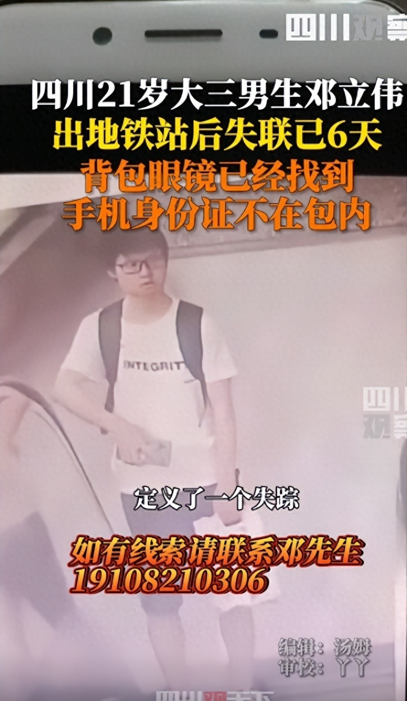

# 大三男生地铁出站后失联6天，背包眼镜已找到，但手机身份证不在包内

9月8日，据四川观察报道，四川21岁大三男生在地铁出站后失联，此事引发关注。

据家人介绍，邓立伟在2023年9月3号下午，于成都地铁5号线南湖立交站B口出来，之后就再没有联系，手机关机。其原在德阳四川工程职业技术学院上学，身上的背包和眼镜已在双流锦江路(南湖国际社区)发现，本人手机、身份证不在包里。

邓先生表示：“失踪那天是老师打电话给我们，才知道他没有去学校，8月2号他跟同学去了成都，就一直在成都那边。最后一次出现是从酒店出来，是9月3号退房。”

**【来源：四川观察】**

**声明：此文版权归原作者所有，若有来源错误或者侵犯您的合法权益，您可通过邮箱与我们取得联系，我们将及时进行处理。邮箱地址：jpbl@jp.jiupainews.com**

