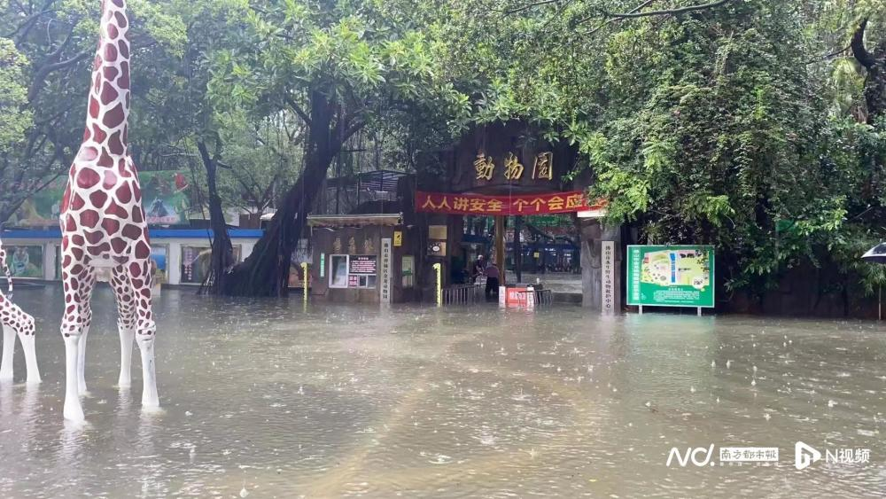
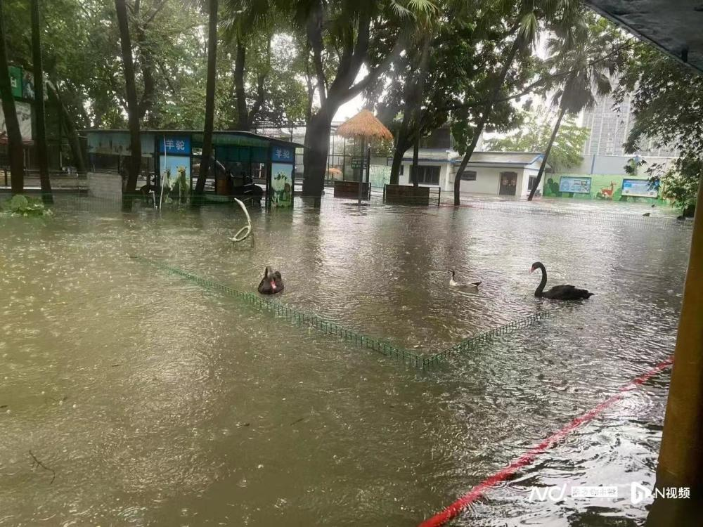
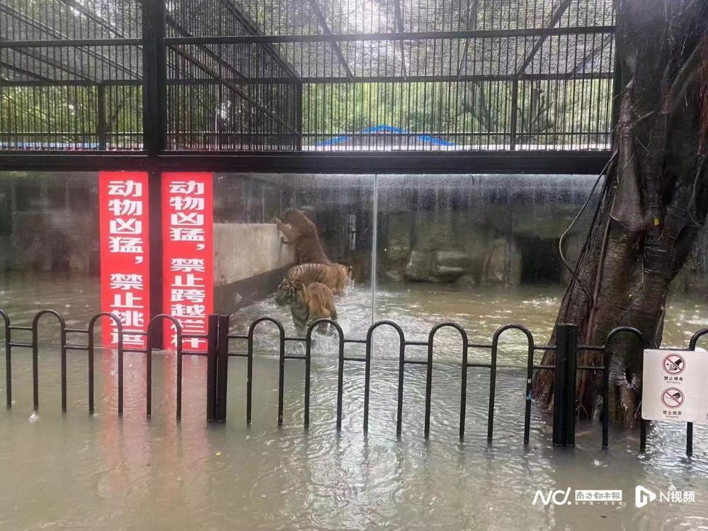
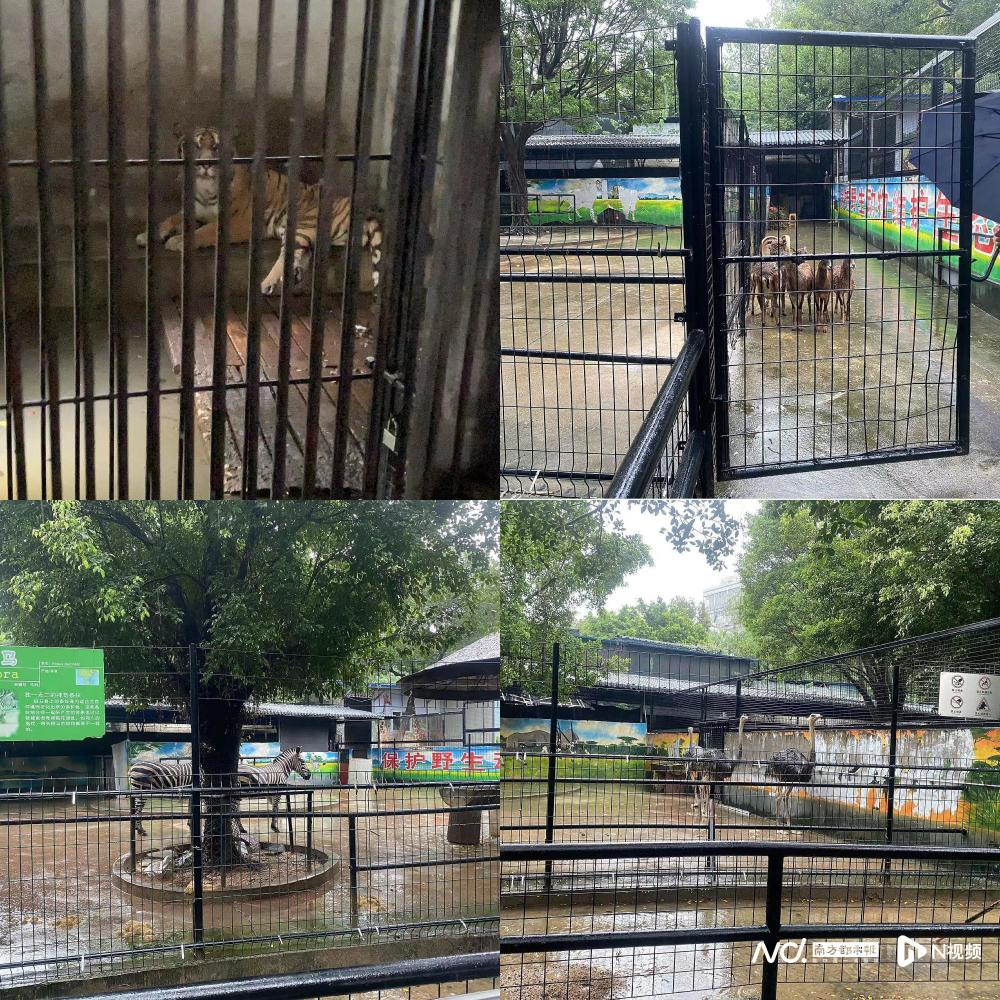
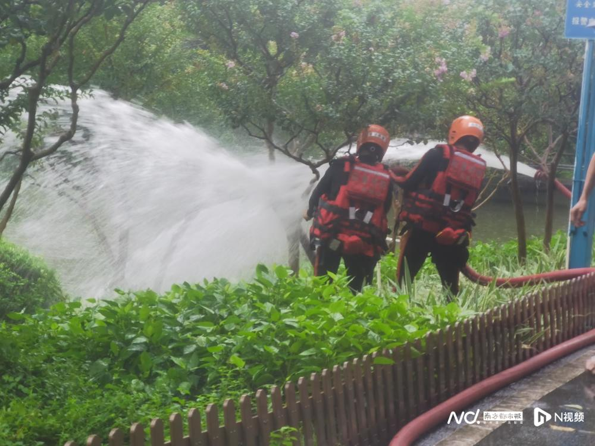
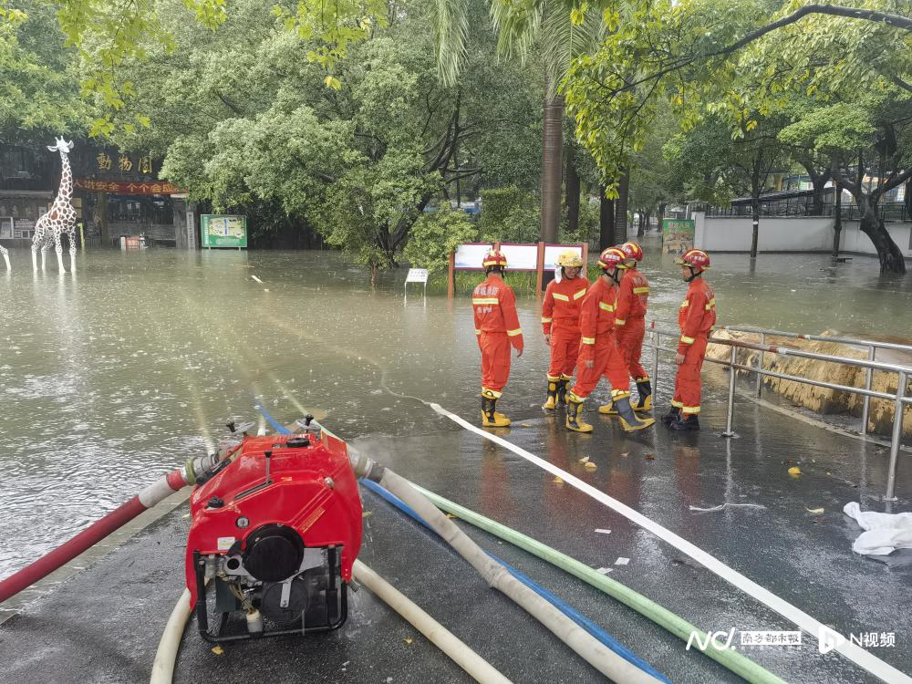

# 有动物趁大雨出逃？佛山中山公园动物园：没有动物跑出来，还未转移

9月8日，佛山持续大雨，社交平台上有网友晒出中山公园内的动物园现状，配文“暴雨，佛山动物园动物出逃记”。从图片来看，动物笼舍内有较深积水，南都记者注意到，该动物园大门口还同时悬挂了“佛山市水生野生动物救护中心”的标识。

_网传图片。_

目前动物们情况怎么样？南都记者联系到相关负责人了解情况，其表示现在并没有收到有动物跑出动物园的情况报告，图片中的动物还是在笼内园内，虽然水位升高了，但并没有动物跑出来。

值得注意的是，经辨认，图片中的“长颈鹿”实际上为动物园大门处的雕塑。

目前暴雨还在继续，是否对动物进行了转移保护工作？相关负责人表示动物园的动物笼舍内都有高台，动物暂时不会受到影响，动物没有被水淹到，目前也没有进行转移。

_9月8日中午时分动物现状。_

南都记者了解到，消防、应急救援及动物园自身都还在全力排水中。

公开资料显示，中山公园动物园是佛山市中心城区唯一的动物园，共有30多种，共约400头动物。

采写：南都记者 孙振凌

