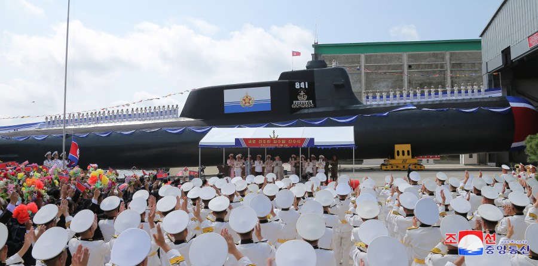
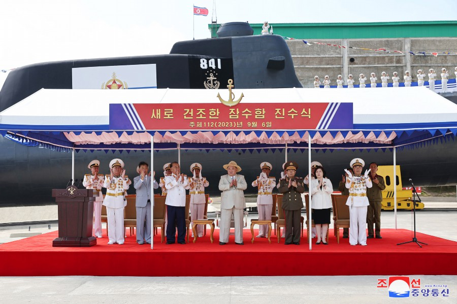
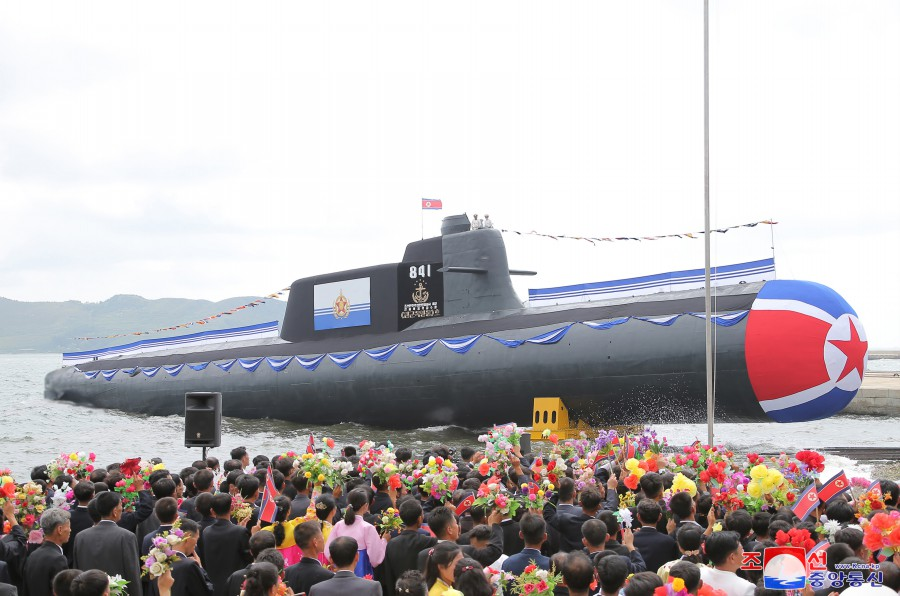
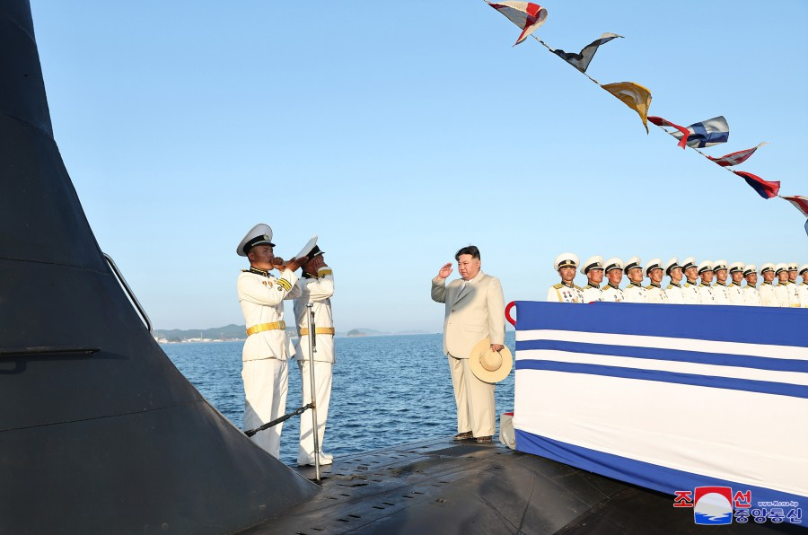

# 朝中社：朝鲜第一艘战术核攻击潜艇下水，金正恩出席典礼

【环球网报道】据朝中社8日报道，朝鲜6日举行新造潜艇下水典礼，庆祝第一艘战术核攻击潜艇第841号下水，该潜艇被命名为“金君玉英雄”号。朝鲜劳动党总书记、国务委员长金正恩出席典礼。

_朝中社报道配图_

报道称，根据朝鲜劳动党中央军事委员会命令，第一艘战术核攻击潜艇第841号被移交给朝鲜人民军海军东海舰队所属有关水下舰艇战队。“要以第一艘水下核攻击舰的庄严诞生宣告朝鲜海军武装力量强化的新篇章序幕，并为维护地区和世界的和平与安全，从质量和数量上进一步飞跃地扩大和加强国家核遏制力，”朝中社说。

_朝中社报道配图_

报道称，金正恩在7日参观了正在为试航进行出港准备的战术核潜艇“金君玉英雄”舰，并发表讲话。他表示，海军的核武装化是再也不能拖延、更不能推迟的迫切的时代课题，是革命武装力量建设的核心要求；要加快推进把搭载战术核的水下水上舰艇移交海军的工作，以让朝鲜海军圆满完成自己的战略任务。

金正恩还表示，潜艇指挥官和水兵将不愧为冠以共和国海军武装力量的第一代英雄指挥官金君玉名字的潜艇的一员，坚定继承前一代伟大的水兵精神。“无论在政治思想上、精神道德上的准备方面，还是在革命战争准备方面都做出海军的样板、全军的榜样，继续带头创造英雄海军的新的神话。”金正恩说。

