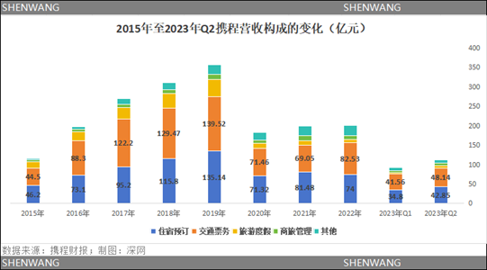

# 欧美出境游市场仅恢复疫情前三成：航班少、签证难、地缘政治？

_来源：视觉中国_

作者 | 张睿

编辑 | 康晓

随着旅游市场加快复苏步伐，携程迎来了一份可观的财报。

携程二季度财报显示，公司营收112亿元，同比增长180%，超过疫情前的2019年同期29%。净利润为6.48亿元，相比2022年同期为4300万元。

携程主营业务包括交通票务、酒店预订、旅游度假、商旅服务等在线旅行服务。

1）住宿预订营收为43亿元，同比上升216%，环比上升23%；

2）交通票务营业收入为48亿元，同比上升173%，环比上升16%；

3）旅游度假业务营业收入为7亿2200万元，同比上升492%，环比上升87%；

4）商旅管理业务营业收入为5亿8400万元，同比上升178%，环比上升31%。

对此，携程集团董事局主席梁建章表示，中国消费者的需求开始从商品消费转向服务消费，因而旅游需求始终保持韧性。携程也将持续提升产品供应、并且以AI等创新方式增强用户体验，为抓住未来机遇做好充分准备。

不过，携程的股价表现远没有业绩表现好。9月5日港股收盘，携程港股股价报304港元/股，跌幅7.82%。9月6日，携程股价盘中企稳，当天携程港股报302.2港元/股，跌幅0.59%。

有分析认为，虽然市场对旅游复苏看好，但从短期看，由于市场在此前一个季度或多或少计价了这部分预期，因此在股价上的表现并不强势。尤其从港股走势来看，甚至有“买预期，卖事实”的情况。

旅游复苏，入境游、出境游双双开始回暖，都是利好消息，但由于国际化业务整体恢复缓慢，携程面临重新定义寻找第二增长曲线的难题；而在外部，携程不仅要面对同程旅行、飞猪、美团等老对手，也要应对抖音等新玩家的入局。

**海外业务，难成第二增长曲线**

携程一直对国际化业务寄予厚望，其国际化扩张始于七年前。从2016年开始，携程通过收购Skyscanner（欧洲机票搜索比价引擎）、MakeMyTrip（印度OTA公司）、Trip.com（美国社交旅游网站）等公司布局国际市场。

**梁建章曾在第四季度业绩会上定下了个小目标：五年之内，将携程国际业务收入在整体收入占比提高到40%至50%。**

2020年疫情之前，携程的国际业务进展还算顺利。2018年和2019年，携程来自国际业务收入占比分别为10%和12.5%。国盛证券曾预测，携程国际业务收入将从2019年的116亿元增长至2025年的266亿元。

**不过，受疫情及地缘政治等多重因素影响，2020年和2021年，携程国际化业务的营收占比下滑至7.1%和8%。**

2022年，携程并未公开国际化业务的收入和占比。2023年第二季度，携程仅公布国际平台营收增速。

携程方面透露，二季度携程国际OTA平台的机票预订同比增长超120%，近两倍于2019年水平，国际平台的酒店预订量也创下新高，超两倍于2019年水平。

有OTA行业人士对《深网》分析，“虽然目前文旅部已经公布了三批恢复出境团队旅游国家名单，完整名单增至138国家和地区，但由于出境航班运力等还未完全恢复，国内出境游业务并没有年初预期的那么好。”

携程也在2023年第二季度财报中透露，出境酒店和机票预订量恢复到2019年疫情前同期水平的60%以上，尽管国际航空业客运量仅恢复到37%。

**“从携程的数字来看，因为航班和签证的问题，欧美出境游可能只恢复到2019年同期的三成，亚太在上半年曾经复苏到2019年的六七成，但现在受舆论的影响或者是说用户对于出行安全的担忧，目前处于分化状态。”对于出境游还未完全恢复的原因，梁建章近日在2023
环球旅讯峰会上表示。**

而对于如何提高入境游的热度和订单，梁建章认为，现在入境游必须解决航班和签证的问题。航班会随着国际出行的复苏而增加，但是签证便利化方面还涉及多部委的协调。中国入境游的发展还需要企业和政府共同改善。

“无论是从旅游资源的丰富度还是性价比来看，中国肯定是亚洲第一的休闲旅游目的地。”

眼下，入境游和出境游的复苏与增长充满变数，携程还能否将国际化业务作为第二增长曲线？

而在国内业务方面，虽然携程稳居行业第一，但在这样一个开放且竞争激烈的市场，其既要面对同程旅行、飞猪、美团等老对手，也要迎接抖音这样的新玩家。

**抖音“偷家”**

交通票务和酒店预订是携程两大核心业务，两者占比约在80%左右。

从2016年开始，因并购去哪儿，携程的交通票务业务赶超酒店预订业务，成为携程第一大营收源。

**需要指出的是，虽然携程交通票务收入占比大于住宿预定，但由于机票、火车票等价格主要被航空公司及中国铁路掌控，OTA平台的利润主要来自住宿预定业务，而非交通票务业务。**

有知情人士对《深网》透露，携程和美团，分别在高端酒旅板块和中低端酒旅板块形成相对固定的市占率。

**携程通过投资、战略合作等方式加强与上游供应商的关系，与华住、君澜等酒店集团有稳定合作，在高端酒旅板块筑牢护城河；而美团则凭借高频流量（外卖）优势和本地生活属性占据了大量中低端酒店资源。**

**为了与携程竞争，飞猪、美团等平台不得不发起优惠打折等活动，也给不少用户留下携程酒店价格偏贵的感知。**

不过，现在OTA们都要面临一个新的竞争对手——抖音。

事实上，自2018年开始，抖音就通过短视频种草引流方式，与美团、携程、同程等第三方合作，通过嵌在抖音中的预订小程序实现闭环交易。

2020年下半年，抖音开通了“门票预订”、“酒店预订”等功能，当用户下单时便会跳转至去哪旅行、携程旅行、美团等抖音小程序。

随着更多酒店旅游商家扶持政策推出，并上线直接订购房间的抖音“日历房”功能，抖音实现酒店预定和选房型在APP内完成交易闭环，在酒旅赛道野心不断彰显。

据《晚点LatePost》报道，近期抖音生活服务进行了一系列组织调整，其中一条便是将酒旅业务升级抖音生活服务一级部门，与到店业务平行。

**有知情人士对《深网》透露，“去年年底，抖音后台已经接入了‘订单来了’等多个订单SaaS系统，2023年全量放开。”**

“选房一直是在抖音平台卖酒旅的难题，抖音打通实时订单系统意味着，用户在购买酒店团购产品时能及时查看房态状态和在线预约核销，抖音入局酒旅业务中最大问题得到解决。”点金手创始人丰年对《深网》分析。

根据《抖音生活服务2022酒旅专题报告》数据显示，过去一年，入驻抖音生活服务的酒旅商家增长192%，抖音生活服务平台上，酒旅达人订单增长达862%，酒旅业务增长了346%。

需要指出的是，携程2年前也看到直播和短视频对酒旅业务的影响，并于2021年启动了919直播，打造“919旅行囤货划算节”。据相关负责人介绍，今年“919”召集到了三年以来最多的境外旅业商家品牌，产品覆超百个国家和地区。

“携程在APP内做直播和抖音做酒店直播有本质区别。携程直播有部分增量，但更多是存量的二次变现，抖音是发现需求，无中生有，是增量。”丰年分析称。

今年7月，东方甄选通过“东方甄选看世界”抖音账号切入文旅赛道。

据《深网》获悉，东方甄选“甘肃行”以宣传当地旅游、售卖旅游线路为主，不参与线路设计及后期的核销。

“东方甄选的此次直播主要是帮我们直播带货旅游产品，用户下单后，后期的沟通、接待、住宿、游览等都由当地的地接团队负责和接待。”有参与此次活动的当地旅行社人员对《深网》透露。

但也有分析认为，抖音直播偏品宣，整体转化率较低，短时间难以形成规模化效应。而携程直播交易属性强，对商户价值更直接，且依托供应链优化，直播中能带出套房+餐饮服务这样的高客单价产品。

据《深网》了解，抖音酒旅达人明星直播酒旅订单核销率19%左右，携程旅行产品预售产品的核销率远在30%以上。

此外，抖音在供应链上还面临被“卡脖子”的难题，携程和美团作为国内知名的在线旅游服务平台，已经积累了大量的酒店和景点资源，抖音很难撬动。

由于酒店系统已经被携程和美团“垄断”，抖音想在酒旅赛道分一杯羹，可以从民宿入手。

“受今年旅游大热的影响，新民宿都喷涌而出。不少民宿办了从业许可证之后还未接入订单系统。如果抖音此时能自研一套订单SaaS系统，未来必将在民宿赛道形成犄角之势。”丰年说。

有入驻途家的民宿从业者对《深网》透露，“目前途家的佣金率是20%，抖音酒店业务的佣金率约在4.5%，随着抖音订房实时订单系统不断完善，不排除以后会重点运营抖音。”

不过，目前民宿产品在全国范围内缺乏统一的合规标准，对于供应链尚处于起步阶段的抖音来说，产品的服务品质和旅游项目违规的处罚机制等都需要进一步建立和加强，这些都是抖音布局酒旅业务绕不开的难题。

