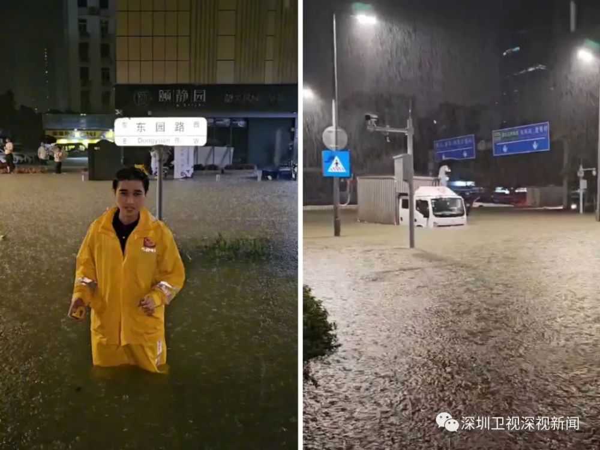
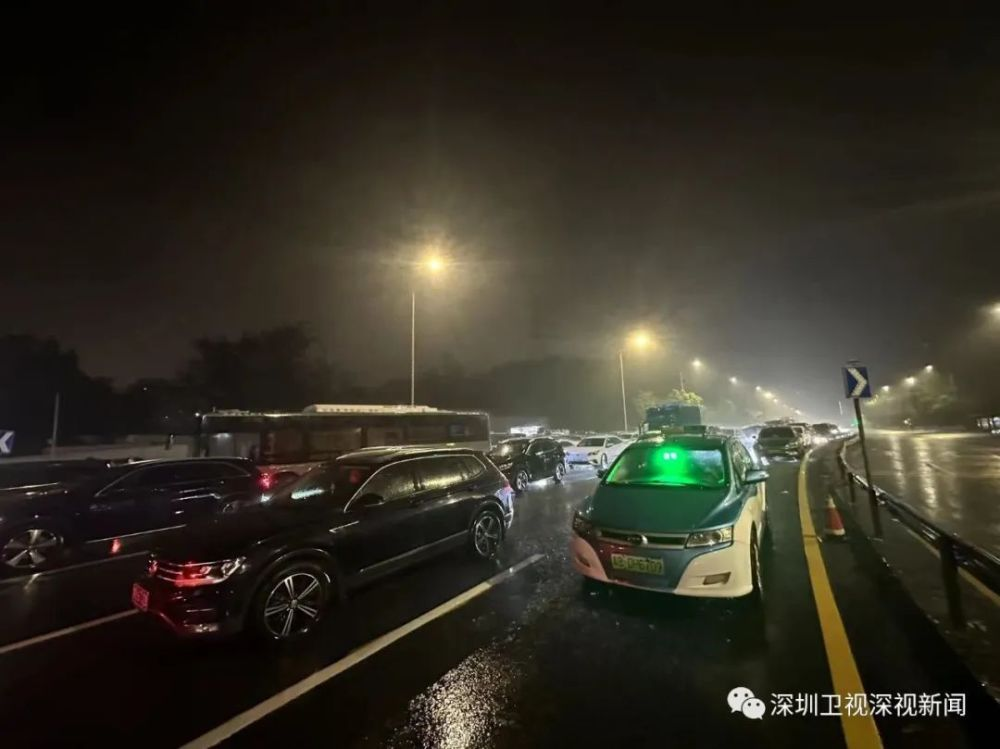
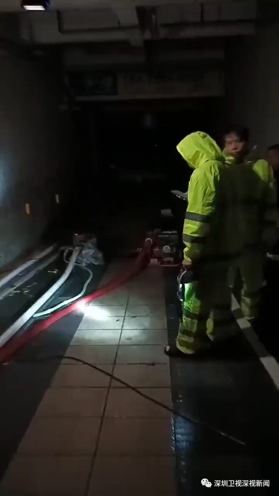
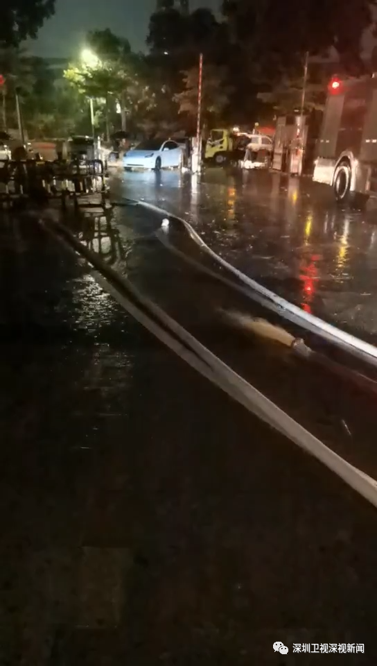
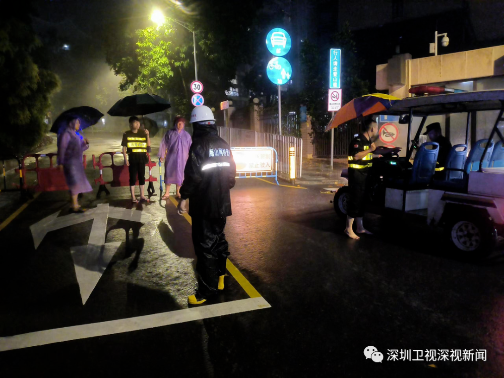
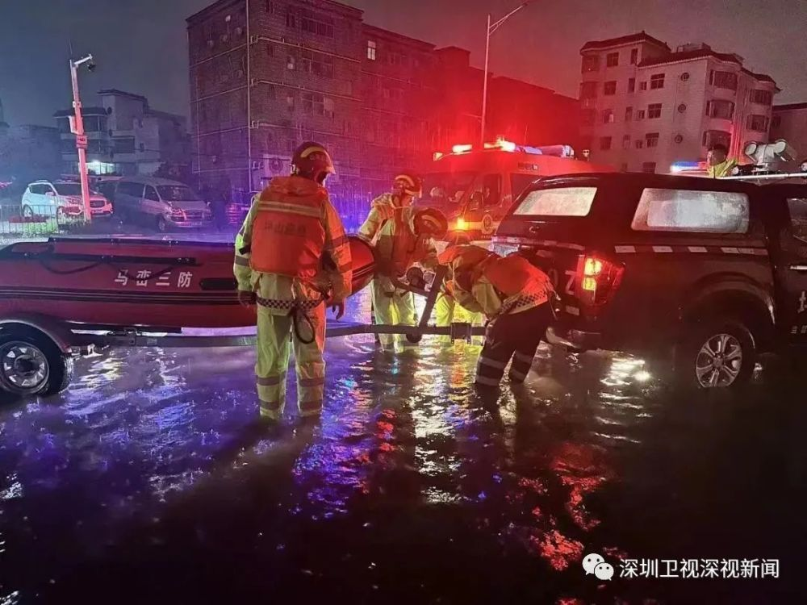
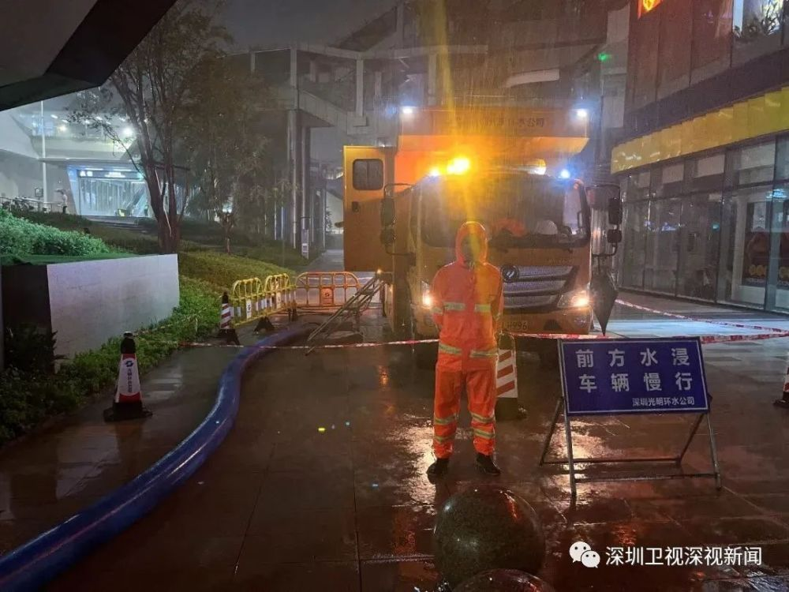

# 深圳泄洪后情况如何？实地探访积水路段、有雨水倒灌的停车场

9月8日凌晨，“深圳泄洪”相关话题一度登顶微博热搜。

凌晨零点十五分，深圳水库泄洪，引发各界关注。泄洪路径如何？需要多长时间？

针对大家关心的问题，深圳卫视&壹深圳客户端记者采访了深圳市应急管理局防灾减灾处处长王常效。

他表示， **深圳水库的水泄洪以后，就沿着深圳河就排到深圳湾里去了，也就排到大海了。泄洪时间，主要是根据降雨的时间来确定，大概可能要持续10个小时以上。**

深圳市气象台9月8日3时55分通报，预计未来一小时全市强降雨相对维持缓和，五时前后，新降雨将从南山、宝安上岸。

深圳市三防办通报，深圳3时15分开始调整排洪流量为120立方米/秒，此前为70-80立方米/秒。

宣布泄洪以来，深圳各地最新情况如何？人员安置情况怎样？深圳广电集团派出多路记者直击一线。

**部分路段积水、堵塞**

**相关部门紧急疏导**

凌晨2点10分，在福田南园街道东园路，深圳卫视&壹深圳客户端记者观察到，路面积水仍有60公分左右，路中间的铁栅栏已被水完全淹没，相关人员正紧急开展救援工作。

在罗湖区罗沙路东向近仙湖立交路段，深圳卫视&壹深圳客户端记者注意到，由于前方路段积水严重，不少车辆在此堵塞，部分车主将车停在路边等待雨势变小。有关部门正在现场值守，疏导交通。

**龙岗区中心城路面基本恢复**

**合力解决停车场积水**

凌晨2点左右，龙岗区中心城积水已缓慢消退，路面基本恢复。

深圳卫视&壹深圳客户端记者来到此前网友反映出现积水的停车场探访。

在龙岗区奥林华府二期停车场入口，业主与小区物业正在通过抽水泵排出停车场的积水。

据现场物业人员介绍，9月7日晚7点左右，路面开始积水，最高时小区旁的黄阁路水深没过膝盖，导致雨水倒灌进入小区停车场。在停车场入口可以看到，有一辆小汽车仍泡在水中，水位接近引擎盖。

9月8日凌晨1：30，小区业主运来了150包防洪沙袋，用于停车场入口的防洪，以防雨水再次倒流至停车场。目前，小区业主与物业工作人员仍在积极开展停车场积水抽排工作。

**连夜行动**

**全力保障市民群众安全**

盐田、坪山、光明等多区多部门调动各类资源，连夜对辖区内危旧房、地质灾害隐患点、地下空间、易涝积水点、在建工地等重点部位进行全面排查整改。

同时，做好危险区域的警戒工作，及时通知和疏散危险区域内的市民。

_（盐田区）_

 _（坪山区）_

_（光明区）_

记者 / 李响 韩潇 沈卫卫 孙树君 郭风新 张少强 李天南

视频 / 黄奋

编辑 / 王海苹 兰薇

